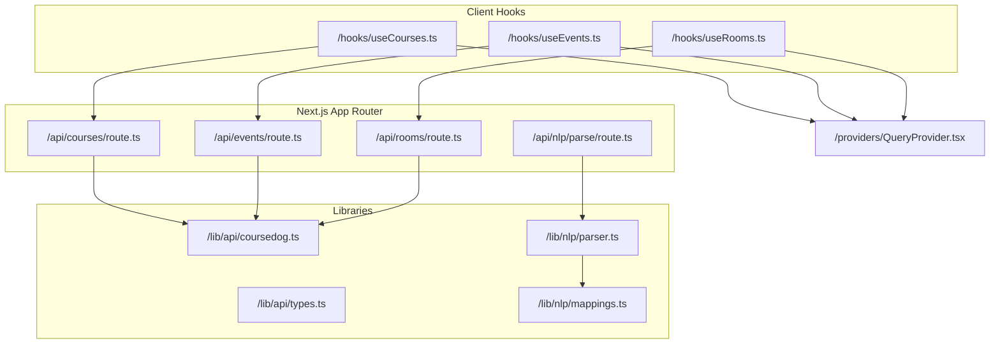
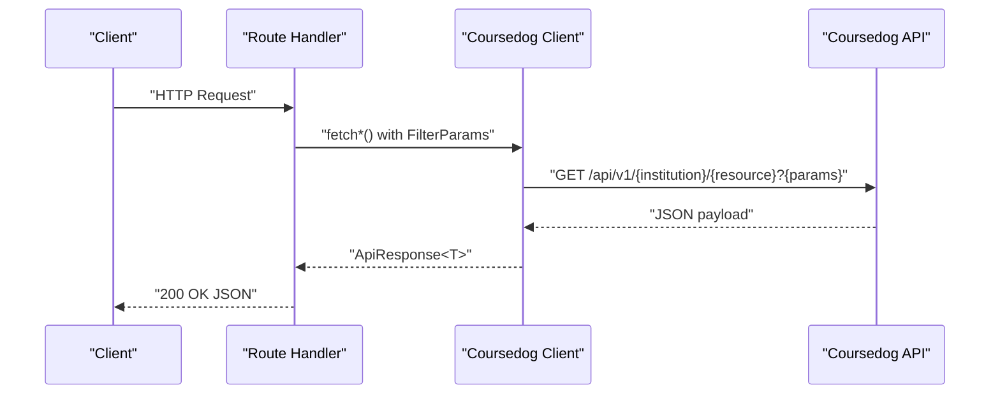
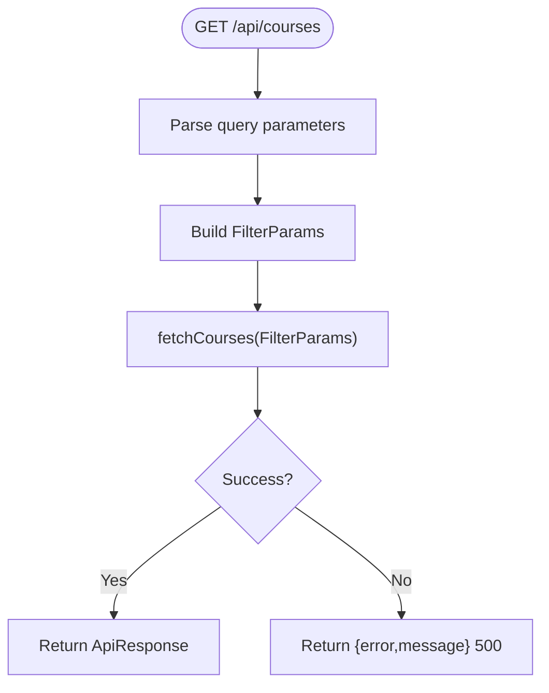
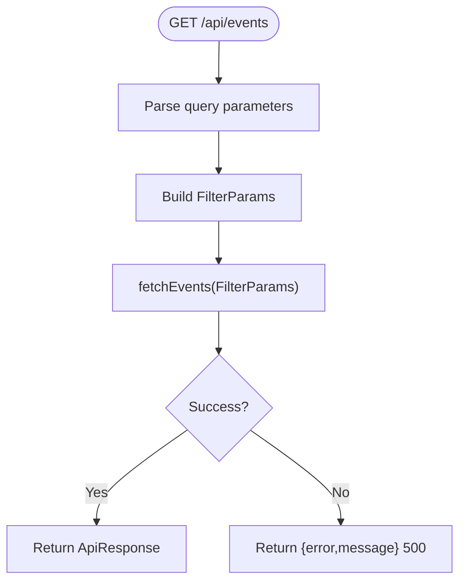
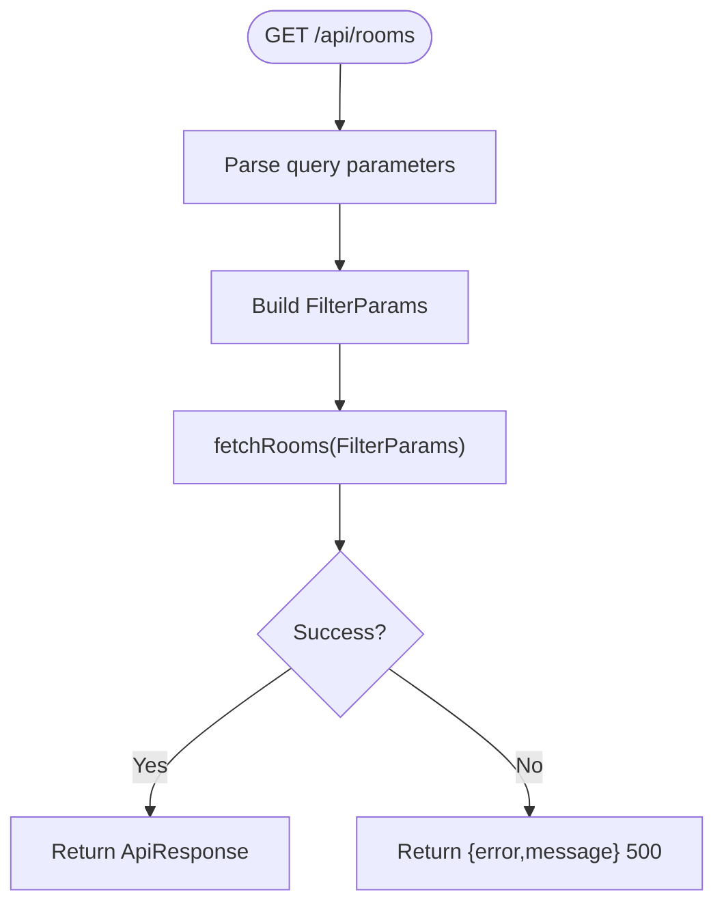
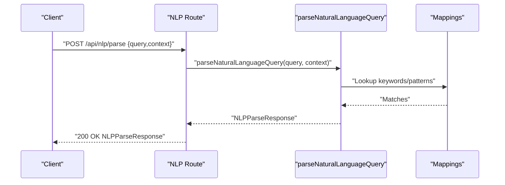
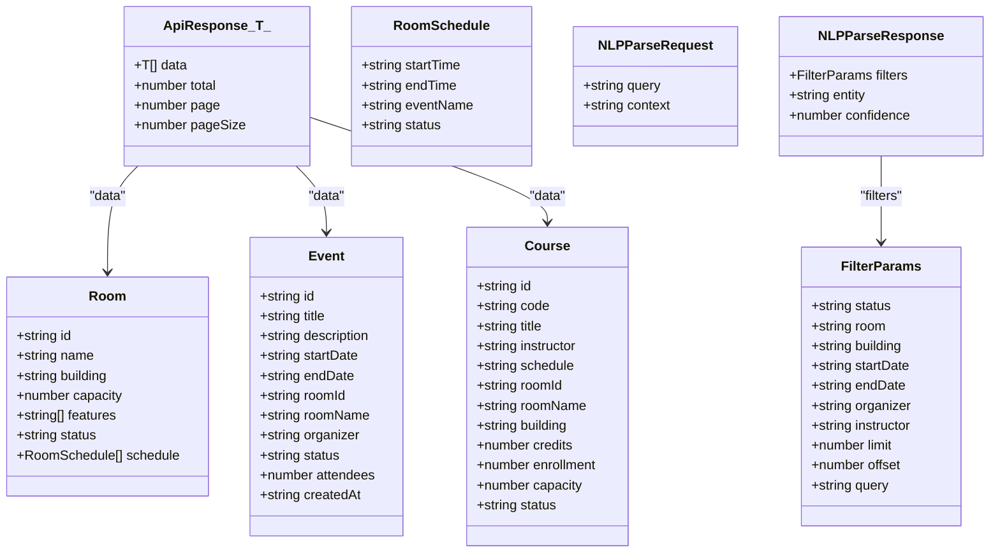
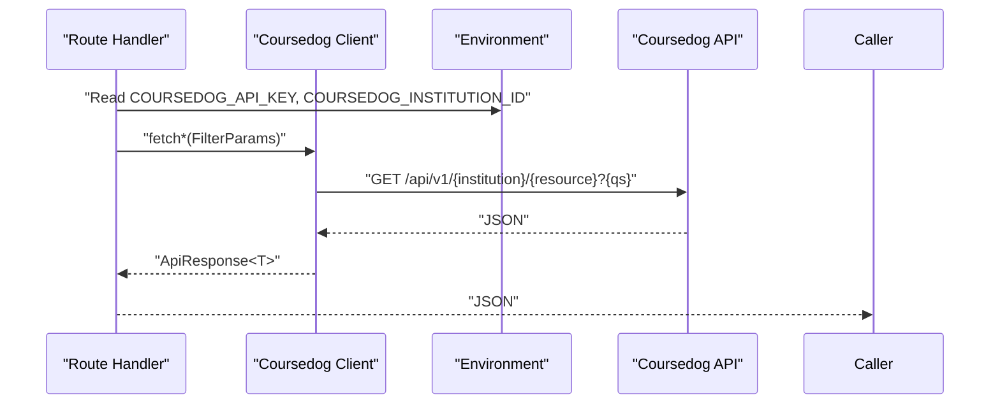
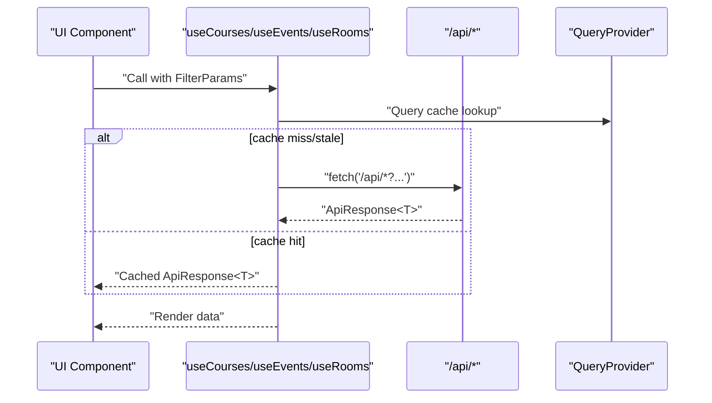
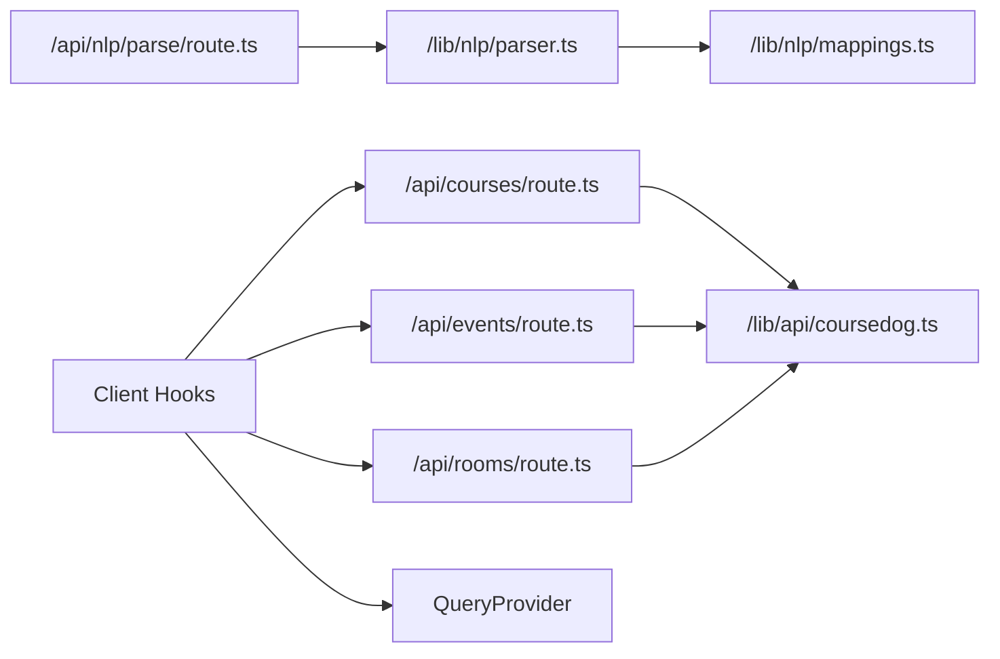

# API Integration

<cite>
**Referenced Files in This Document**
- [src/app/api/courses/route.ts](file://src/app/api/courses/route.ts)
- [src/app/api/events/route.ts](file://src/app/api/events/route.ts)
- [src/app/api/rooms/route.ts](file://src/app/api/rooms/route.ts)
- [src/app/api/nlp/parse/route.ts](file://src/app/api/nlp/parse/route.ts)
- [src/lib/api/coursedog.ts](file://src/lib/api/coursedog.ts)
- [src/lib/api/types.ts](file://src/lib/api/types.ts)
- [src/lib/nlp/parser.ts](file://src/lib/nlp/parser.ts)
- [src/lib/nlp/mappings.ts](file://src/lib/nlp/mappings.ts)
- [src/hooks/useCourses.ts](file://src/hooks/useCourses.ts)
- [src/hooks/useEvents.ts](file://src/hooks/useEvents.ts)
- [src/hooks/useRooms.ts](file://src/hooks/useRooms.ts)
- [src/providers/QueryProvider.tsx](file://src/providers/QueryProvider.tsx)
- [package.json](file://package.json)
</cite>

## Table of Contents
1. [Introduction](#introduction)
2. [Project Structure](#project-structure)
3. [Core Components](#core-components)
4. [Architecture Overview](#architecture-overview)
5. [Detailed Component Analysis](#detailed-component-analysis)
6. [Dependency Analysis](#dependency-analysis)
7. [Performance Considerations](#performance-considerations)
8. [Troubleshooting Guide](#troubleshooting-guide)
9. [Conclusion](#conclusion)
10. [Appendices](#appendices)

## Introduction
This document describes Course Puppy’s server-side API, focusing on REST endpoints for rooms, events, and courses, and the NLP parse endpoint for natural language query processing. It explains request/response schemas, filtering, pagination, error handling, integration with the external Coursedog API, and client-side usage via React Query. Authentication, rate limiting, API versioning, and security considerations are also covered.

## Project Structure
The API is implemented using Next.js App Router under src/app/api. Each endpoint is a route handler exporting GET or POST methods. Data fetching from Coursedog is encapsulated in a dedicated client module. Type definitions unify request/response shapes across the API surface. Client-side hooks wrap data fetching with caching and retries.

**Diagram sources**
- [src/app/api/courses/route.ts:1-48](file://src/app/api/courses/route.ts#L1-L48)
- [src/app/api/events/route.ts:1-54](file://src/app/api/events/route.ts#L1-L54)
- [src/app/api/rooms/route.ts:1-51](file://src/app/api/rooms/route.ts#L1-L51)
- [src/app/api/nlp/parse/route.ts:1-30](file://src/app/api/nlp/parse/route.ts#L1-L30)
- [src/lib/api/coursedog.ts:1-73](file://src/lib/api/coursedog.ts#L1-L73)
- [src/lib/api/types.ts:1-99](file://src/lib/api/types.ts#L1-L99)
- [src/lib/nlp/parser.ts:1-202](file://src/lib/nlp/parser.ts#L1-L202)
- [src/lib/nlp/mappings.ts:1-45](file://src/lib/nlp/mappings.ts#L1-L45)
- [src/hooks/useCourses.ts:1-31](file://src/hooks/useCourses.ts#L1-L31)
- [src/hooks/useEvents.ts:1-31](file://src/hooks/useEvents.ts#L1-L31)
- [src/hooks/useRooms.ts:1-31](file://src/hooks/useRooms.ts#L1-L31)
- [src/providers/QueryProvider.tsx:1-34](file://src/providers/QueryProvider.tsx#L1-L34)

**Section sources**
- [src/app/api/courses/route.ts:1-48](file://src/app/api/courses/route.ts#L1-L48)
- [src/app/api/events/route.ts:1-54](file://src/app/api/events/route.ts#L1-L54)
- [src/app/api/rooms/route.ts:1-51](file://src/app/api/rooms/route.ts#L1-L51)
- [src/app/api/nlp/parse/route.ts:1-30](file://src/app/api/nlp/parse/route.ts#L1-L30)
- [src/lib/api/coursedog.ts:1-73](file://src/lib/api/coursedog.ts#L1-L73)
- [src/lib/api/types.ts:1-99](file://src/lib/api/types.ts#L1-L99)
- [src/lib/nlp/parser.ts:1-202](file://src/lib/nlp/parser.ts#L1-L202)
- [src/lib/nlp/mappings.ts:1-45](file://src/lib/nlp/mappings.ts#L1-L45)
- [src/hooks/useCourses.ts:1-31](file://src/hooks/useCourses.ts#L1-L31)
- [src/hooks/useEvents.ts:1-31](file://src/hooks/useEvents.ts#L1-L31)
- [src/hooks/useRooms.ts:1-31](file://src/hooks/useRooms.ts#L1-L31)
- [src/providers/QueryProvider.tsx:1-34](file://src/providers/QueryProvider.tsx#L1-L34)

## Core Components
- REST endpoints:
  - GET /api/courses
  - GET /api/events
  - GET /api/rooms
  - POST /api/nlp/parse
- Data model and filters:
  - ApiResponse<T> wrapper with pagination metadata
  - FilterParams for status, room, building, dates, limits, offsets, and free-text query
  - Entity types for rooms, events, courses, and unknown
- External integration:
  - Coursedog API client with bearer token authentication and v1 API path
- NLP parser:
  - Tokenization, keyword matching, and confidence scoring
- Client integration:
  - React Query hooks for caching, retries, and refetch intervals

**Section sources**
- [src/lib/api/types.ts:49-98](file://src/lib/api/types.ts#L49-L98)
- [src/lib/api/coursedog.ts:5-59](file://src/lib/api/coursedog.ts#L5-L59)
- [src/lib/nlp/parser.ts:125-153](file://src/lib/nlp/parser.ts#L125-L153)
- [src/providers/QueryProvider.tsx:6-26](file://src/providers/QueryProvider.tsx#L6-L26)

## Architecture Overview
The API follows a thin serverless pattern: route handlers validate inputs, construct filters, call the Coursedog client, and return JSON. The NLP endpoint parses natural language into structured filters. Client-side hooks consume these endpoints with caching and retry logic.

**Diagram sources**
- [src/app/api/courses/route.ts:5-36](file://src/app/api/courses/route.ts#L5-L36)
- [src/lib/api/coursedog.ts:36-59](file://src/lib/api/coursedog.ts#L36-L59)

## Detailed Component Analysis

### REST Endpoints

#### GET /api/courses
- Purpose: Retrieve paginated course records with optional filters.
- Query parameters:
  - status: pending | approved | rejected | active | cancelled | available | occupied | maintenance
  - room: string
  - building: string
  - instructor: string
  - limit: integer
  - offset: integer
  - query: string (free-text search)
- Response: ApiResponse<Course[]>
- Error handling:
  - Returns 500 with ApiError on internal failures.

**Diagram sources**
- [src/app/api/courses/route.ts:5-46](file://src/app/api/courses/route.ts#L5-L46)
- [src/lib/api/coursedog.ts:70-72](file://src/lib/api/coursedog.ts#L70-L72)

**Section sources**
- [src/app/api/courses/route.ts:1-48](file://src/app/api/courses/route.ts#L1-L48)
- [src/lib/api/types.ts:49-61](file://src/lib/api/types.ts#L49-L61)
- [src/lib/api/types.ts:87-92](file://src/lib/api/types.ts#L87-L92)
- [src/lib/api/coursedog.ts:62-72](file://src/lib/api/coursedog.ts#L62-L72)

#### GET /api/events
- Purpose: Retrieve paginated event records with optional filters.
- Query parameters:
  - status, room, building, startDate, endDate, organizer, limit, offset, query
- Response: ApiResponse<Event[]>
- Error handling: Same as courses.

**Diagram sources**
- [src/app/api/events/route.ts:5-52](file://src/app/api/events/route.ts#L5-L52)
- [src/lib/api/coursedog.ts:66-68](file://src/lib/api/coursedog.ts#L66-L68)

**Section sources**
- [src/app/api/events/route.ts:1-54](file://src/app/api/events/route.ts#L1-L54)
- [src/lib/api/types.ts:49-61](file://src/lib/api/types.ts#L49-L61)
- [src/lib/api/types.ts:87-92](file://src/lib/api/types.ts#L87-L92)
- [src/lib/api/coursedog.ts:66-68](file://src/lib/api/coursedog.ts#L66-L68)

#### GET /api/rooms
- Purpose: Retrieve paginated room records with optional filters.
- Query parameters:
  - status, room, building, startDate, endDate, limit, offset, query
- Response: ApiResponse<Room[]>
- Error handling: Same as courses.

**Diagram sources**
- [src/app/api/rooms/route.ts:5-49](file://src/app/api/rooms/route.ts#L5-L49)
- [src/lib/api/coursedog.ts:62-64](file://src/lib/api/coursedog.ts#L62-L64)

**Section sources**
- [src/app/api/rooms/route.ts:1-51](file://src/app/api/rooms/route.ts#L1-L51)
- [src/lib/api/types.ts:49-61](file://src/lib/api/types.ts#L49-L61)
- [src/lib/api/types.ts:87-92](file://src/lib/api/types.ts#L87-L92)
- [src/lib/api/coursedog.ts:62-64](file://src/lib/api/coursedog.ts#L62-L64)

#### POST /api/nlp/parse
- Purpose: Convert a natural language query into structured filters and entity type.
- Request body:
  - query: string (required)
  - context: 'rooms' | 'events' | 'courses' | 'unknown'
- Response:
  - filters: FilterParams derived from the query
  - entity: Detected or contextualized entity type
  - confidence: Numeric confidence score
- Error handling:
  - Returns 400 if query is missing or invalid.
  - Returns 500 with ApiError on internal failures.

**Diagram sources**
- [src/app/api/nlp/parse/route.ts:5-28](file://src/app/api/nlp/parse/route.ts#L5-L28)
- [src/lib/nlp/parser.ts:155-201](file://src/lib/nlp/parser.ts#L155-L201)
- [src/lib/nlp/mappings.ts:3-44](file://src/lib/nlp/mappings.ts#L3-L44)

**Section sources**
- [src/app/api/nlp/parse/route.ts:1-30](file://src/app/api/nlp/parse/route.ts#L1-L30)
- [src/lib/api/types.ts:75-84](file://src/lib/api/types.ts#L75-L84)
- [src/lib/nlp/parser.ts:155-201](file://src/lib/nlp/parser.ts#L155-L201)
- [src/lib/nlp/mappings.ts:3-44](file://src/lib/nlp/mappings.ts#L3-L44)

### Data Models and Schemas

**Diagram sources**
- [src/lib/api/types.ts:3-98](file://src/lib/api/types.ts#L3-L98)

**Section sources**
- [src/lib/api/types.ts:3-98](file://src/lib/api/types.ts#L3-L98)

### External API Integration and Data Transformation
- Coursedog client:
  - Base URL and versioned path: /api/v1/{institution}/{resource}
  - Authentication: Authorization Bearer token from environment
  - Query string construction from FilterParams
  - Response parsing into ApiResponse<T>
- Data transformation:
  - Route handlers translate query parameters into FilterParams
  - Client functions forward filters to Coursedog
  - Responses are returned as-is wrapped by ApiResponse<T>

**Diagram sources**
- [src/lib/api/coursedog.ts:7-21](file://src/lib/api/coursedog.ts#L7-L21)
- [src/lib/api/coursedog.ts:23-59](file://src/lib/api/coursedog.ts#L23-L59)

**Section sources**
- [src/lib/api/coursedog.ts:1-73](file://src/lib/api/coursedog.ts#L1-L73)
- [src/lib/api/types.ts:87-92](file://src/lib/api/types.ts#L87-L92)

### Client Implementation Examples
- React Query hooks:
  - useCourses, useEvents, useRooms construct query strings from FilterParams and fetch from the respective /api endpoints
  - Query provider sets refetch interval, stale time, and retry behavior
- Typical usage patterns:
  - Build FilterParams from UI inputs and pass to the hook
  - Render loading and error states based on query state
  - Use the ApiResponse<T> shape to render lists and pagination metadata

**Diagram sources**
- [src/hooks/useCourses.ts:6-23](file://src/hooks/useCourses.ts#L6-L23)
- [src/hooks/useEvents.ts:6-23](file://src/hooks/useEvents.ts#L6-L23)
- [src/hooks/useRooms.ts:6-23](file://src/hooks/useRooms.ts#L6-L23)
- [src/providers/QueryProvider.tsx:16-26](file://src/providers/QueryProvider.tsx#L16-L26)

**Section sources**
- [src/hooks/useCourses.ts:1-31](file://src/hooks/useCourses.ts#L1-L31)
- [src/hooks/useEvents.ts:1-31](file://src/hooks/useEvents.ts#L1-L31)
- [src/hooks/useRooms.ts:1-31](file://src/hooks/useRooms.ts#L1-L31)
- [src/providers/QueryProvider.tsx:1-34](file://src/providers/QueryProvider.tsx#L1-L34)

## Dependency Analysis
- Route handlers depend on the Coursedog client and shared types.
- NLP route depends on the parser and mappings.
- Client hooks depend on route handlers and QueryProvider.
- No circular dependencies observed among the analyzed modules.

**Diagram sources**
- [src/app/api/courses/route.ts:1-3](file://src/app/api/courses/route.ts#L1-L3)
- [src/app/api/events/route.ts:1-3](file://src/app/api/events/route.ts#L1-L3)
- [src/app/api/rooms/route.ts:1-3](file://src/app/api/rooms/route.ts#L1-L3)
- [src/app/api/nlp/parse/route.ts:1-3](file://src/app/api/nlp/parse/route.ts#L1-L3)
- [src/lib/api/coursedog.ts:1-3](file://src/lib/api/coursedog.ts#L1-L3)
- [src/lib/nlp/parser.ts:1-10](file://src/lib/nlp/parser.ts#L1-L10)
- [src/lib/nlp/mappings.ts:1-45](file://src/lib/nlp/mappings.ts#L1-L45)
- [src/hooks/useCourses.ts:1-4](file://src/hooks/useCourses.ts#L1-L4)
- [src/hooks/useEvents.ts:1-4](file://src/hooks/useEvents.ts#L1-L4)
- [src/hooks/useRooms.ts:1-4](file://src/hooks/useRooms.ts#L1-L4)
- [src/providers/QueryProvider.tsx:1-3](file://src/providers/QueryProvider.tsx#L1-L3)

**Section sources**
- [src/app/api/courses/route.ts:1-3](file://src/app/api/courses/route.ts#L1-L3)
- [src/app/api/events/route.ts:1-3](file://src/app/api/events/route.ts#L1-L3)
- [src/app/api/rooms/route.ts:1-3](file://src/app/api/rooms/route.ts#L1-L3)
- [src/app/api/nlp/parse/route.ts:1-3](file://src/app/api/nlp/parse/route.ts#L1-L3)
- [src/lib/api/coursedog.ts:1-3](file://src/lib/api/coursedog.ts#L1-L3)
- [src/lib/nlp/parser.ts:1-10](file://src/lib/nlp/parser.ts#L1-L10)
- [src/lib/nlp/mappings.ts:1-45](file://src/lib/nlp/mappings.ts#L1-L45)
- [src/hooks/useCourses.ts:1-4](file://src/hooks/useCourses.ts#L1-L4)
- [src/hooks/useEvents.ts:1-4](file://src/hooks/useEvents.ts#L1-L4)
- [src/hooks/useRooms.ts:1-4](file://src/hooks/useRooms.ts#L1-L4)
- [src/providers/QueryProvider.tsx:1-3](file://src/providers/QueryProvider.tsx#L1-L3)

## Performance Considerations
- Pagination:
  - Use limit and offset to constrain response sizes.
- Caching:
  - React Query caches responses keyed by queryKey; adjust staleTime and refetchInterval per needs.
- Retries:
  - Default retry with exponential backoff reduces transient failure impact.
- Network efficiency:
  - Prefer precise filters to minimize payload size.
- Rate limiting:
  - Configure at the platform level; apply client-side throttling if necessary.

[No sources needed since this section provides general guidance]

## Troubleshooting Guide
- Common errors:
  - 400 Bad Request from NLP parse when query is missing or invalid.
  - 500 Internal Server Error from resource endpoints when Coursedog returns an error or environment variables are missing.
- Environment configuration:
  - Ensure COURSEDOG_API_KEY and COURSEDOG_INSTITUTION_ID are set.
- Validation:
  - Route handlers validate presence of required fields for NLP and construct FilterParams safely.
- Logging:
  - Errors are logged before returning standardized error responses.

**Section sources**
- [src/app/api/nlp/parse/route.ts:9-14](file://src/app/api/nlp/parse/route.ts#L9-L14)
- [src/app/api/nlp/parse/route.ts:24-27](file://src/app/api/nlp/parse/route.ts#L24-L27)
- [src/app/api/courses/route.ts:42-45](file://src/app/api/courses/route.ts#L42-L45)
- [src/app/api/events/route.ts:48-51](file://src/app/api/events/route.ts#L48-L51)
- [src/app/api/rooms/route.ts:45-48](file://src/app/api/rooms/route.ts#L45-L48)
- [src/lib/api/coursedog.ts:7-21](file://src/lib/api/coursedog.ts#L7-L21)

## Conclusion
Course Puppy’s API exposes straightforward REST endpoints for rooms, events, and courses, plus an NLP parse endpoint for intelligent query processing. It integrates with Coursedog securely via bearer authentication and returns unified response envelopes. Client-side hooks provide robust caching and retry behavior, enabling responsive UIs with minimal boilerplate.

[No sources needed since this section summarizes without analyzing specific files]

## Appendices

### Authentication and Security
- Authentication: Authorization Bearer token via environment variable.
- Headers: Content-Type: application/json; Authorization: Bearer {token}.
- Security considerations:
  - Keep tokens secret; avoid logging sensitive headers.
  - Validate and sanitize inputs on the server.
  - Use HTTPS in production.

**Section sources**
- [src/lib/api/coursedog.ts:45-50](file://src/lib/api/coursedog.ts#L45-L50)

### API Versioning and Routing
- Versioning: /api/v1/{institution}/{resource}
- Routing: Next.js App Router under src/app/api with route.ts files.
- Next.js integration: Route handlers export NextRequest/NextResponse; client hooks use relative paths.

**Section sources**
- [src/lib/api/coursedog.ts:43-43](file://src/lib/api/coursedog.ts#L43-L43)
- [src/app/api/courses/route.ts:1-3](file://src/app/api/courses/route.ts#L1-L3)
- [src/app/api/events/route.ts:1-3](file://src/app/api/events/route.ts#L1-L3)
- [src/app/api/rooms/route.ts:1-3](file://src/app/api/rooms/route.ts#L1-L3)
- [src/app/api/nlp/parse/route.ts:1-3](file://src/app/api/nlp/parse/route.ts#L1-L3)

### Rate Limiting
- Not implemented in the current codebase.
- Recommendation: Enforce at platform level; consider client-side backoff and deduplication.

[No sources needed since this section provides general guidance]

### Client Usage Patterns
- Build FilterParams from UI filters and pass to useCourses/useEvents/useRooms.
- Handle ApiResponse<T> to render data, total, page, and pageSize.
- Use QueryProvider defaults or customize for your UX.

**Section sources**
- [src/hooks/useCourses.ts:25-30](file://src/hooks/useCourses.ts#L25-L30)
- [src/hooks/useEvents.ts:25-30](file://src/hooks/useEvents.ts#L25-L30)
- [src/hooks/useRooms.ts:25-30](file://src/hooks/useRooms.ts#L25-L30)
- [src/lib/api/types.ts:87-92](file://src/lib/api/types.ts#L87-L92)
- [src/providers/QueryProvider.tsx:16-26](file://src/providers/QueryProvider.tsx#L16-L26)