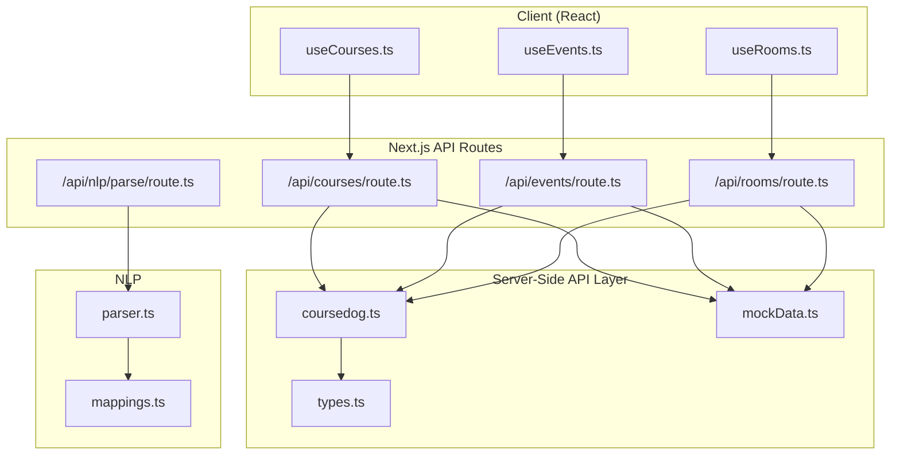
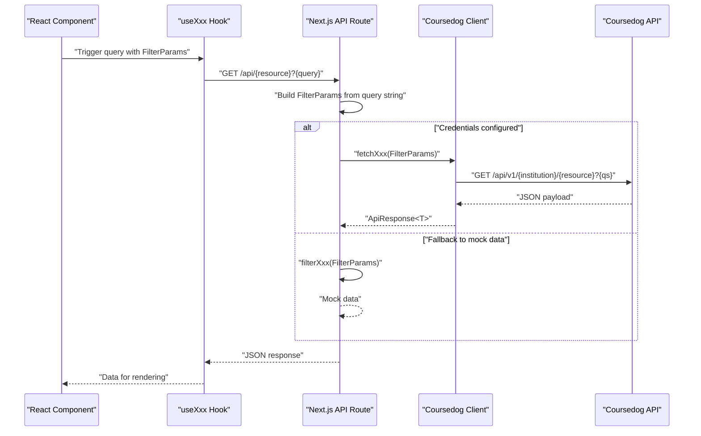
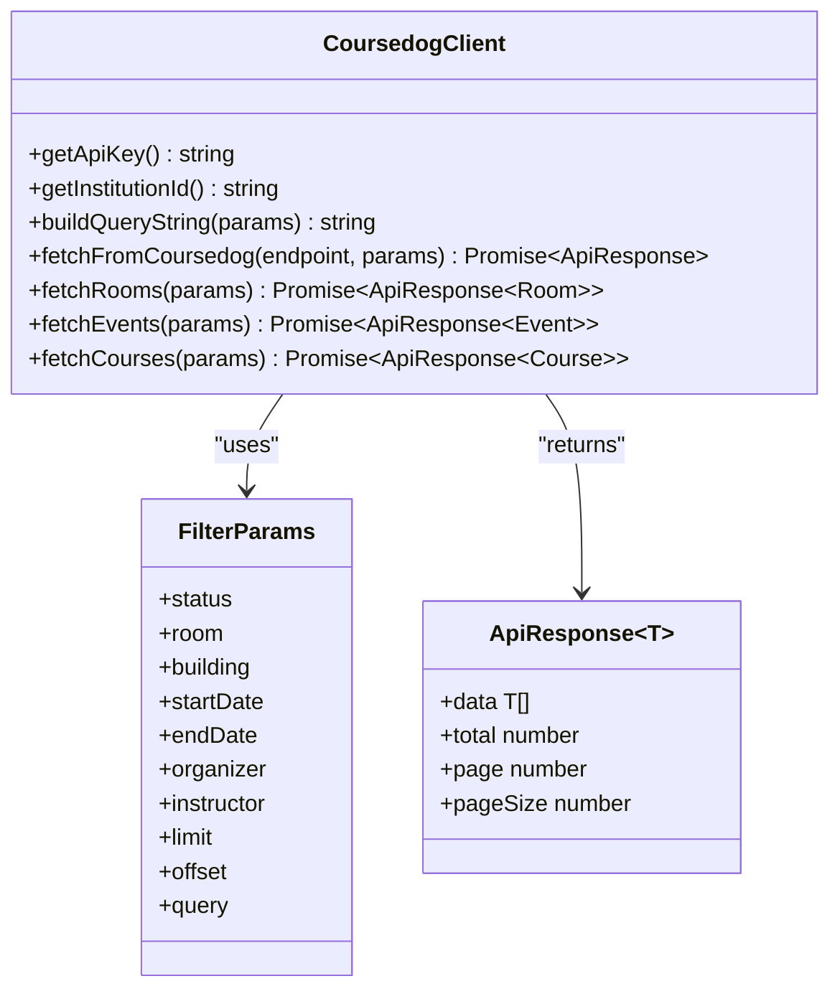
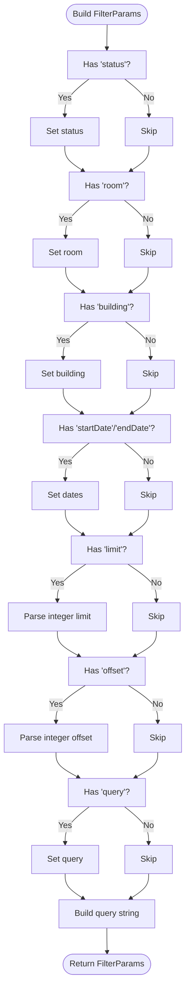
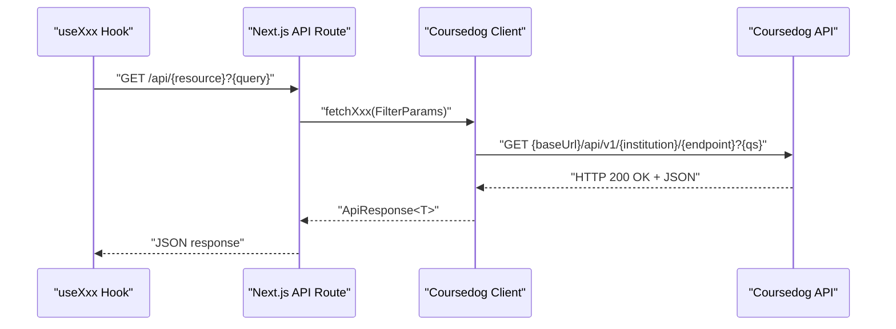
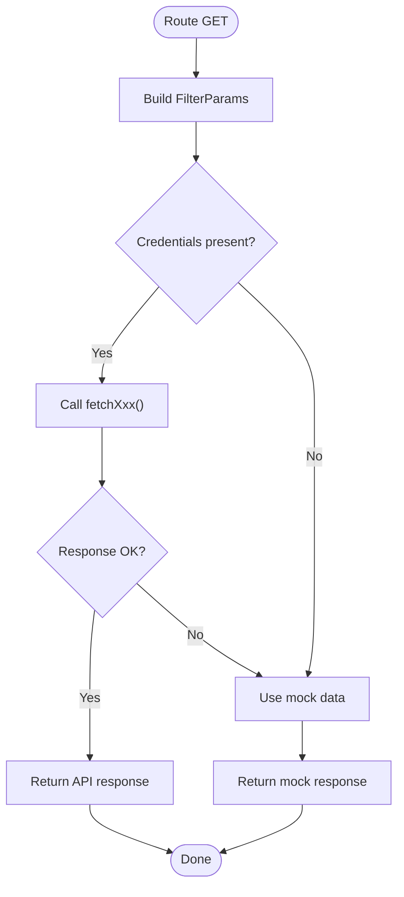
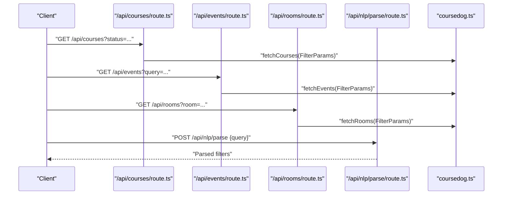
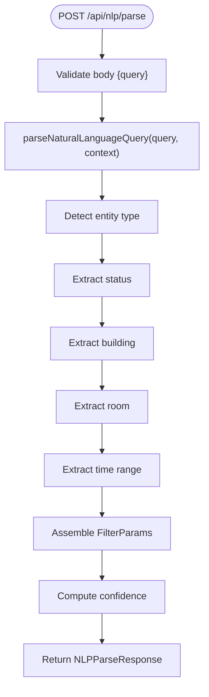
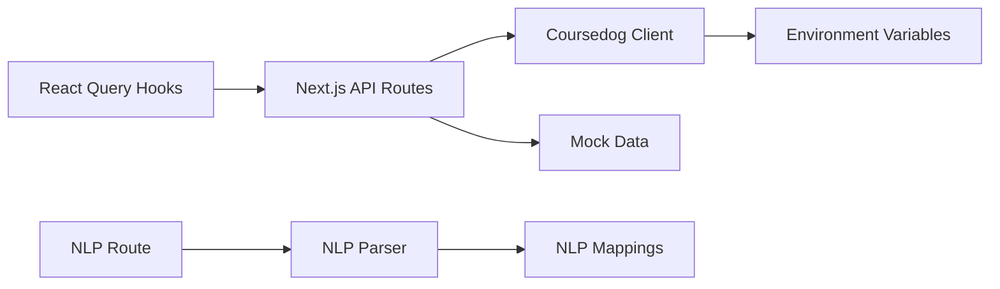

# Coursedog API Client

<cite>
**Referenced Files in This Document**
- [src/lib/api/coursedog.ts](file://src/lib/api/coursedog.ts)
- [src/lib/api/types.ts](file://src/lib/api/types.ts)
- [src/lib/api/mockData.ts](file://src/lib/api/mockData.ts)
- [src/lib/nlp/parser.ts](file://src/lib/nlp/parser.ts)
- [src/lib/nlp/mappings.ts](file://src/lib/nlp/mappings.ts)
- [src/app/api/courses/route.ts](file://src/app/api/courses/route.ts)
- [src/app/api/events/route.ts](file://src/app/api/events/route.ts)
- [src/app/api/rooms/route.ts](file://src/app/api/rooms/route.ts)
- [src/app/api/nlp/parse/route.ts](file://src/app/api/nlp/parse/route.ts)
- [src/hooks/useCourses.ts](file://src/hooks/useCourses.ts)
- [src/hooks/useEvents.ts](file://src/hooks/useEvents.ts)
- [src/hooks/useRooms.ts](file://src/hooks/useRooms.ts)
- [package.json](file://package.json)
</cite>

## Table of Contents
1. [Introduction](#introduction)
2. [Project Structure](#project-structure)
3. [Core Components](#core-components)
4. [Architecture Overview](#architecture-overview)
5. [Detailed Component Analysis](#detailed-component-analysis)
6. [Dependency Analysis](#dependency-analysis)
7. [Performance Considerations](#performance-considerations)
8. [Troubleshooting Guide](#troubleshooting-guide)
9. [Conclusion](#conclusion)
10. [Appendices](#appendices)

## Introduction
This document describes the Coursedog API client implementation powering the application’s data integration. It covers the API client architecture, authentication, request and response handling, the FilterParams interface, data transformation logic, error handling, fallback strategies, and integration patterns with Next.js API routes. It also documents the NLP query parsing pipeline and how data flows from external sources to the application. Guidance on rate limiting, caching, and performance optimization is included, along with troubleshooting steps for common integration issues.

## Project Structure
The API client is organized around a small set of cohesive modules:
- API client and types live under src/lib/api
- Next.js API routes under src/app/api expose server-side endpoints
- React Query hooks under src/hooks encapsulate client-side data fetching
- Natural Language Processing (NLP) lives under src/lib/nlp

**Diagram sources**
- [src/hooks/useCourses.ts:1-31](file://src/hooks/useCourses.ts#L1-31)
- [src/hooks/useEvents.ts:1-31](file://src/hooks/useEvents.ts#L1-31)
- [src/hooks/useRooms.ts:1-31](file://src/hooks/useRooms.ts#L1-31)
- [src/app/api/courses/route.ts:1-48](file://src/app/api/courses/route.ts#L1-48)
- [src/app/api/events/route.ts:1-81](file://src/app/api/events/route.ts#L1-81)
- [src/app/api/rooms/route.ts:1-79](file://src/app/api/rooms/route.ts#L1-79)
- [src/app/api/nlp/parse/route.ts:1-30](file://src/app/api/nlp/parse/route.ts#L1-30)
- [src/lib/api/coursedog.ts:1-73](file://src/lib/api/coursedog.ts#L1-73)
- [src/lib/api/types.ts:1-99](file://src/lib/api/types.ts#L1-99)
- [src/lib/api/mockData.ts:1-318](file://src/lib/api/mockData.ts#L1-318)
- [src/lib/nlp/parser.ts:1-202](file://src/lib/nlp/parser.ts#L1-202)
- [src/lib/nlp/mappings.ts:1-45](file://src/lib/nlp/mappings.ts#L1-45)

**Section sources**
- [src/lib/api/coursedog.ts:1-73](file://src/lib/api/coursedog.ts#L1-73)
- [src/lib/api/types.ts:1-99](file://src/lib/api/types.ts#L1-99)
- [src/lib/api/mockData.ts:1-318](file://src/lib/api/mockData.ts#L1-318)
- [src/lib/nlp/parser.ts:1-202](file://src/lib/nlp/parser.ts#L1-202)
- [src/lib/nlp/mappings.ts:1-45](file://src/lib/nlp/mappings.ts#L1-45)
- [src/app/api/courses/route.ts:1-48](file://src/app/api/courses/route.ts#L1-48)
- [src/app/api/events/route.ts:1-81](file://src/app/api/events/route.ts#L1-81)
- [src/app/api/rooms/route.ts:1-79](file://src/app/api/rooms/route.ts#L1-79)
- [src/app/api/nlp/parse/route.ts:1-30](file://src/app/api/nlp/parse/route.ts#L1-30)
- [src/hooks/useCourses.ts:1-31](file://src/hooks/useCourses.ts#L1-31)
- [src/hooks/useEvents.ts:1-31](file://src/hooks/useEvents.ts#L1-31)
- [src/hooks/useRooms.ts:1-31](file://src/hooks/useRooms.ts#L1-31)
- [package.json:11-17](file://package.json#L11-L17)

## Core Components
- Coursedog API client: centralizes authentication, URL construction, and HTTP requests with robust error handling.
- FilterParams interface: defines typed filtering parameters for courses, events, and rooms.
- Next.js API routes: translate query parameters into FilterParams, orchestrate API calls, and provide fallbacks.
- React Query hooks: encapsulate client-side data fetching and caching.
- NLP parser: transforms natural language queries into structured FilterParams and entity hints.
- Mock data utilities: enable local development and testing without external credentials.

Key responsibilities:
- Authentication: bearer token via environment variables.
- Request shaping: base URL composition and query string building.
- Response handling: JSON parsing and standardized ApiResponse wrapper.
- Error handling: explicit HTTP error reporting and graceful fallbacks.
- Filtering: consistent FilterParams across resources.

**Section sources**
- [src/lib/api/coursedog.ts:1-73](file://src/lib/api/coursedog.ts#L1-73)
- [src/lib/api/types.ts:49-61](file://src/lib/api/types.ts#L49-61)
- [src/app/api/courses/route.ts:1-48](file://src/app/api/courses/route.ts#L1-48)
- [src/app/api/events/route.ts:1-81](file://src/app/api/events/route.ts#L1-81)
- [src/app/api/rooms/route.ts:1-79](file://src/app/api/rooms/route.ts#L1-79)
- [src/hooks/useCourses.ts:1-31](file://src/hooks/useCourses.ts#L1-31)
- [src/lib/nlp/parser.ts:155-201](file://src/lib/nlp/parser.ts#L155-L201)

## Architecture Overview
The system follows a layered architecture:
- Client layer: React components use TanStack React Query hooks to fetch data.
- Edge layer: Next.js API routes validate and transform query parameters, call the API client, and return standardized responses.
- Data layer: The Coursedog API client authenticates and requests data; on missing credentials, mock data is returned and errors are handled gracefully.

**Diagram sources**
- [src/hooks/useCourses.ts:6-23](file://src/hooks/useCourses.ts#L6-L23)
- [src/app/api/courses/route.ts:5-34](file://src/app/api/courses/route.ts#L5-L34)
- [src/lib/api/coursedog.ts:36-59](file://src/lib/api/coursedog.ts#L36-L59)
- [src/lib/api/mockData.ts:269-317](file://src/lib/api/mockData.ts#L269-317)

**Section sources**
- [src/app/api/courses/route.ts:1-48](file://src/app/api/courses/route.ts#L1-48)
- [src/app/api/events/route.ts:1-81](file://src/app/api/events/route.ts#L1-81)
- [src/app/api/rooms/route.ts:1-79](file://src/app/api/rooms/route.ts#L1-79)
- [src/lib/api/coursedog.ts:1-73](file://src/lib/api/coursedog.ts#L1-73)
- [src/lib/api/mockData.ts:1-318](file://src/lib/api/mockData.ts#L1-318)

## Detailed Component Analysis

### Coursedog API Client
Responsibilities:
- Load credentials from environment variables and validate presence.
- Construct URLs with institution ID and endpoint path.
- Build query strings from FilterParams, excluding empty values.
- Perform authenticated GET requests with Authorization header.
- Normalize error responses and return typed ApiResponse<T>.

Key implementation patterns:
- Centralized authentication and URL building reduce duplication.
- Typed FilterParams ensure consistent parameter handling across resources.
- Standardized error messages improve observability.

**Diagram sources**
- [src/lib/api/coursedog.ts:7-72](file://src/lib/api/coursedog.ts#L7-72)
- [src/lib/api/types.ts:49-92](file://src/lib/api/types.ts#L49-92)

**Section sources**
- [src/lib/api/coursedog.ts:1-73](file://src/lib/api/coursedog.ts#L1-73)
- [src/lib/api/types.ts:49-92](file://src/lib/api/types.ts#L49-92)

### FilterParams Interface and Data Transformation
FilterParams defines a shared contract for filtering across courses, events, and rooms. The Next.js API routes convert URL query parameters into FilterParams, while the client-side hooks mirror this behavior before delegating to server routes.

Data transformation highlights:
- Query string to typed parameters with safe casting and defaults.
- Optional fields are omitted from query strings to avoid invalid requests.
- Pagination parameters (limit, offset) are parsed as integers.

**Diagram sources**
- [src/app/api/courses/route.ts:10-29](file://src/app/api/courses/route.ts#L10-L29)
- [src/app/api/events/route.ts:18-46](file://src/app/api/events/route.ts#L18-L46)
- [src/app/api/rooms/route.ts:18-43](file://src/app/api/rooms/route.ts#L18-L43)
- [src/hooks/useCourses.ts:7-13](file://src/hooks/useCourses.ts#L7-L13)
- [src/lib/api/coursedog.ts:23-34](file://src/lib/api/coursedog.ts#L23-L34)

**Section sources**
- [src/lib/api/types.ts:49-61](file://src/lib/api/types.ts#L49-61)
- [src/app/api/courses/route.ts:10-29](file://src/app/api/courses/route.ts#L10-L29)
- [src/app/api/events/route.ts:18-46](file://src/app/api/events/route.ts#L18-L46)
- [src/app/api/rooms/route.ts:18-43](file://src/app/api/rooms/route.ts#L18-L43)
- [src/hooks/useCourses.ts:7-13](file://src/hooks/useCourses.ts#L7-L13)
- [src/hooks/useEvents.ts:7-13](file://src/hooks/useEvents.ts#L7-L13)
- [src/hooks/useRooms.ts:7-13](file://src/hooks/useRooms.ts#L7-L13)
- [src/lib/api/coursedog.ts:23-34](file://src/lib/api/coursedog.ts#L23-L34)

### Request and Response Handling Patterns
- Authentication: bearer token loaded from environment variables and attached to the Authorization header.
- Request shaping: base URL plus institution ID and endpoint path; query string built from FilterParams.
- Response handling: JSON parsing with standardized ApiResponse<T> envelope; non-OK responses raise errors with contextual messages.
- Client-side: React Query handles caching, retries, and optimistic updates.

**Diagram sources**
- [src/hooks/useCourses.ts:15-22](file://src/hooks/useCourses.ts#L15-L22)
- [src/lib/api/coursedog.ts:36-59](file://src/lib/api/coursedog.ts#L36-L59)
- [src/app/api/courses/route.ts:34-36](file://src/app/api/courses/route.ts#L34-L36)

**Section sources**
- [src/lib/api/coursedog.ts:36-59](file://src/lib/api/coursedog.ts#L36-59)
- [src/hooks/useCourses.ts:6-23](file://src/hooks/useCourses.ts#L6-L23)

### Error Handling Strategies and Fallback Mechanisms
- API client: throws descriptive errors on non-OK responses, including HTTP status and textual body.
- Next.js routes: catch errors, log them, and optionally fall back to mock data when credentials are missing.
- Mock data: provides realistic datasets for development and testing, enabling UI iteration without network connectivity.

**Diagram sources**
- [src/app/api/events/route.ts:6-57](file://src/app/api/events/route.ts#L6-L57)
- [src/app/api/rooms/route.ts:6-54](file://src/app/api/rooms/route.ts#L6-L54)
- [src/lib/api/mockData.ts:269-317](file://src/lib/api/mockData.ts#L269-317)

**Section sources**
- [src/lib/api/coursedog.ts:53-56](file://src/lib/api/coursedog.ts#L53-56)
- [src/app/api/events/route.ts:62-78](file://src/app/api/events/route.ts#L62-L78)
- [src/app/api/rooms/route.ts:59-76](file://src/app/api/rooms/route.ts#L59-L76)
- [src/lib/api/mockData.ts:269-317](file://src/lib/api/mockData.ts#L269-317)

### Integration with Next.js API Routes
- Courses, Events, and Rooms routes parse query parameters into FilterParams and delegate to the API client.
- Events and Rooms routes additionally check for credentials and return mock data when unavailable.
- NLP parse route validates input and delegates to the parser module.

**Diagram sources**
- [src/app/api/courses/route.ts:5-34](file://src/app/api/courses/route.ts#L5-L34)
- [src/app/api/events/route.ts:13-59](file://src/app/api/events/route.ts#L13-L59)
- [src/app/api/rooms/route.ts:13-56](file://src/app/api/rooms/route.ts#L13-L56)
- [src/app/api/nlp/parse/route.ts:5-18](file://src/app/api/nlp/parse/route.ts#L5-L18)
- [src/lib/api/coursedog.ts:62-72](file://src/lib/api/coursedog.ts#L62-L72)

**Section sources**
- [src/app/api/courses/route.ts:1-48](file://src/app/api/courses/route.ts#L1-48)
- [src/app/api/events/route.ts:1-81](file://src/app/api/events/route.ts#L1-81)
- [src/app/api/rooms/route.ts:1-79](file://src/app/api/rooms/route.ts#L1-79)
- [src/app/api/nlp/parse/route.ts:1-30](file://src/app/api/nlp/parse/route.ts#L1-30)
- [src/lib/api/coursedog.ts:62-72](file://src/lib/api/coursedog.ts#L62-L72)

### NLP Query Parsing Pipeline
The NLP route accepts a natural language query and optional context, then parses it into structured filters and an entity type. The parser:
- Tokenizes the query.
- Detects entity type (rooms, events, courses).
- Extracts status, building, room, and time range keywords.
- Falls back to a general query field if nothing else is detected.
- Computes a confidence score based on extracted features.

**Diagram sources**
- [src/app/api/nlp/parse/route.ts:5-18](file://src/app/api/nlp/parse/route.ts#L5-L18)
- [src/lib/nlp/parser.ts:155-201](file://src/lib/nlp/parser.ts#L155-L201)
- [src/lib/nlp/mappings.ts:3-44](file://src/lib/nlp/mappings.ts#L3-L44)

**Section sources**
- [src/app/api/nlp/parse/route.ts:1-30](file://src/app/api/nlp/parse/route.ts#L1-30)
- [src/lib/nlp/parser.ts:12-201](file://src/lib/nlp/parser.ts#L12-L201)
- [src/lib/nlp/mappings.ts:1-45](file://src/lib/nlp/mappings.ts#L1-45)

## Dependency Analysis
External dependencies relevant to the API client:
- @tanstack/react-query: client-side caching and data fetching.
- next: serverless runtime for API routes.
- Environment variables for authentication.

**Diagram sources**
- [src/hooks/useCourses.ts:3-29](file://src/hooks/useCourses.ts#L3-L29)
- [src/app/api/courses/route.ts:1-2](file://src/app/api/courses/route.ts#L1-L2)
- [src/lib/api/coursedog.ts:3-43](file://src/lib/api/coursedog.ts#L3-L43)
- [src/lib/api/mockData.ts:1-3](file://src/lib/api/mockData.ts#L1-L3)
- [src/app/api/nlp/parse/route.ts:1-2](file://src/app/api/nlp/parse/route.ts#L1-L2)
- [src/lib/nlp/parser.ts:1-9](file://src/lib/nlp/parser.ts#L1-L9)
- [src/lib/nlp/mappings.ts:1-45](file://src/lib/nlp/mappings.ts#L1-L45)
- [package.json:11-17](file://package.json#L11-L17)

**Section sources**
- [package.json:11-17](file://package.json#L11-L17)
- [src/lib/api/coursedog.ts:7-21](file://src/lib/api/coursedog.ts#L7-L21)
- [src/app/api/events/route.ts:7-11](file://src/app/api/events/route.ts#L7-L11)
- [src/app/api/rooms/route.ts:7-11](file://src/app/api/rooms/route.ts#L7-L11)

## Performance Considerations
- Client-side caching: React Query caches responses by queryKey; leverage pagination and stable keys to minimize redundant requests.
- Query string minimization: exclude empty or undefined values to keep requests concise.
- Pagination: use limit and offset to control payload sizes.
- Rate limiting: implement client-side throttling or backoff when interacting with external APIs; consider server-side rate limiting at the API gateway.
- Caching strategies: cache responses at the edge (e.g., CDN) or in-memory on the server for repeated reads.
- Timeout configurations: set fetch timeouts to prevent long-hanging requests; surface cancellations to users.
- Compression: enable gzip/deflate on API responses when supported by upstream services.
- Monitoring: instrument API latency, error rates, and retry counts to detect regressions early.

[No sources needed since this section provides general guidance]

## Troubleshooting Guide
Common issues and resolutions:
- Missing credentials:
  - Symptom: API client throws an error indicating missing API key or institution ID.
  - Resolution: Set COURSEDOG_API_KEY and COURSEDOG_INSTITUTION_ID in environment variables.
- Non-OK HTTP responses:
  - Symptom: Descriptive error thrown by the client with status and body text.
  - Resolution: Inspect upstream error details and adjust FilterParams accordingly.
- Unexpected empty results:
  - Symptom: API returns empty data despite valid parameters.
  - Resolution: Verify FilterParams values and consider broadening filters.
- Mock data fallback:
  - Symptom: Routes return mock data instead of real API responses.
  - Resolution: Confirm credentials are configured; otherwise, continue using mock data for development.
- NLP parsing failures:
  - Symptom: NLP route returns an error or low-confidence result.
  - Resolution: Provide clearer query phrasing or specify context; ensure mappings cover expected keywords.

**Section sources**
- [src/lib/api/coursedog.ts:7-21](file://src/lib/api/coursedog.ts#L7-21)
- [src/lib/api/coursedog.ts:53-56](file://src/lib/api/coursedog.ts#L53-56)
- [src/app/api/events/route.ts:48-57](file://src/app/api/events/route.ts#L48-L57)
- [src/app/api/rooms/route.ts:45-54](file://src/app/api/rooms/route.ts#L45-L54)
- [src/app/api/nlp/parse/route.ts:9-14](file://src/app/api/nlp/parse/route.ts#L9-L14)

## Conclusion
The Coursedog API client integrates cleanly with Next.js API routes and React Query, providing a robust, typed, and extensible foundation for consuming course, event, and room data. The FilterParams interface ensures consistent filtering across resources, while the NLP pipeline enables intuitive user interactions. The design supports graceful fallbacks, clear error reporting, and scalable performance through caching and pagination.

[No sources needed since this section summarizes without analyzing specific files]

## Appendices

### API Method Usage Examples
- Courses:
  - Endpoint: GET /api/courses
  - Parameters: status, room, building, instructor, limit, offset, query
  - Example request: /api/courses?status=active&limit=20
- Events:
  - Endpoint: GET /api/events
  - Parameters: status, room, building, startDate, endDate, organizer, limit, offset, query
  - Example request: /api/events?query=department+meeting&limit=10
- Rooms:
  - Endpoint: GET /api/rooms
  - Parameters: status, room, building, startDate, endDate, limit, offset, query
  - Example request: /api/rooms?building=Science+Building&status=available
- NLP Parse:
  - Endpoint: POST /api/nlp/parse
  - Body: { query: string, context?: "rooms"|"events"|"courses"|"unknown" }
  - Example request: { "query": "find available rooms in science building", "context": "rooms" }

**Section sources**
- [src/app/api/courses/route.ts:10-32](file://src/app/api/courses/route.ts#L10-L32)
- [src/app/api/events/route.ts:18-46](file://src/app/api/events/route.ts#L18-L46)
- [src/app/api/rooms/route.ts:18-43](file://src/app/api/rooms/route.ts#L18-L43)
- [src/app/api/nlp/parse/route.ts:7-14](file://src/app/api/nlp/parse/route.ts#L7-L14)

### Parameter Validation and Response Processing
- Validation:
  - Query string parameters are parsed safely; integers are coerced with defaults.
  - Presence checks ensure only defined values are included in query strings.
- Response processing:
  - API responses conform to ApiResponse<T> with data, total, page, and pageSize.
  - Client-side hooks validate response.ok and surface user-friendly errors.

**Section sources**
- [src/app/api/courses/route.ts:24-28](file://src/app/api/courses/route.ts#L24-L28)
- [src/hooks/useCourses.ts:17-20](file://src/hooks/useCourses.ts#L17-L20)
- [src/lib/api/types.ts:87-92](file://src/lib/api/types.ts#L87-92)

### Rate Limiting, Caching, and Optimization Techniques
- Rate limiting:
  - Enforce per-client or per-route limits; consider exponential backoff on 429 responses.
- Caching:
  - Use React Query cache keys aligned with FilterParams; set stale times appropriate for data volatility.
  - Consider server-side caching for expensive queries.
- Optimization:
  - Minimize payload size with precise filters and pagination.
  - Enable compression and efficient serialization.
  - Monitor and alert on latency and error spikes.

[No sources needed since this section provides general guidance]