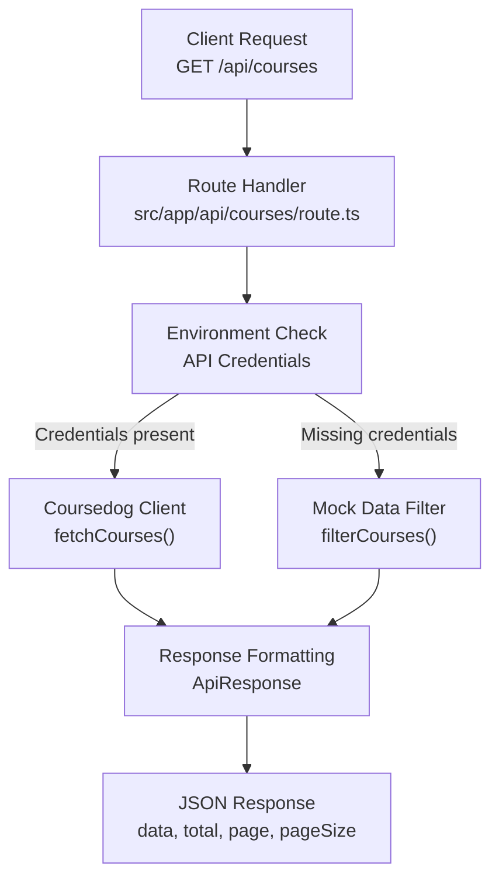
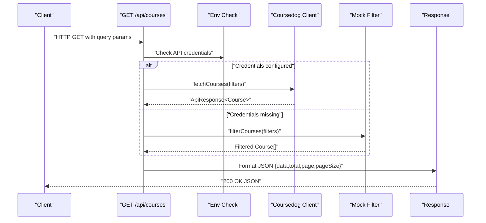
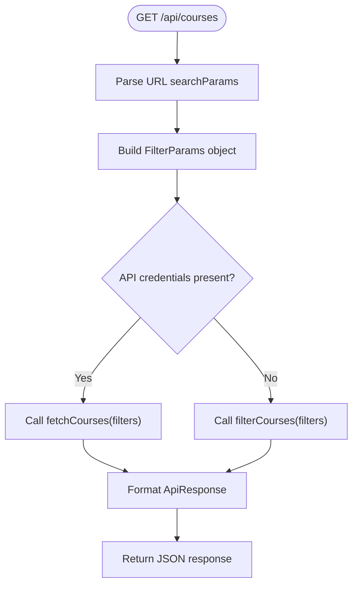
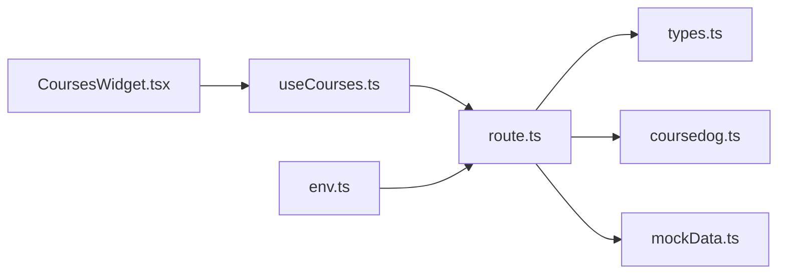

# Courses API Endpoint

<cite>
**Referenced Files in This Document**
- [route.ts](file://src/app/api/courses/route.ts)
- [coursedog.ts](file://src/lib/api/coursedog.ts)
- [mockData.ts](file://src/lib/api/mockData.ts)
- [types.ts](file://src/lib/api/types.ts)
- [useCourses.ts](file://src/hooks/useCourses.ts)
- [CoursesWidget.tsx](file://src/components/widgets/CoursesWidget.tsx)
- [useGlobalFilters.ts](file://src/hooks/useGlobalFilters.ts)
- [env.ts](file://src/lib/utils/env.ts)
</cite>

## Table of Contents
1. [Introduction](#introduction)
2. [Project Structure](#project-structure)
3. [Core Components](#core-components)
4. [Architecture Overview](#architecture-overview)
5. [Detailed Component Analysis](#detailed-component-analysis)
6. [Dependency Analysis](#dependency-analysis)
7. [Performance Considerations](#performance-considerations)
8. [Troubleshooting Guide](#troubleshooting-guide)
9. [Conclusion](#conclusion)
10. [Appendices](#appendices)

## Introduction
This document provides comprehensive API documentation for the Courses endpoint at /api/courses. It covers the GET method implementation, query parameter handling, course-specific filtering logic, integration with the Coursedog API client, and data transformation processes. It also documents response formatting, pagination metadata, error handling strategies, and practical usage examples for common course search and enrollment tracking scenarios.

## Project Structure
The Courses endpoint is implemented as a Next.js App Router API route. It integrates with a Coursedog API client for production data retrieval and falls back to mock data when API credentials are missing. Frontend components consume the endpoint via React Query hooks and display paginated, filtered results.

**Diagram sources**
- [route.ts:13-75](file://src/app/api/courses/route.ts#L13-L75)
- [coursedog.ts:70-72](file://src/lib/api/coursedog.ts#L70-L72)
- [mockData.ts:302-317](file://src/lib/api/mockData.ts#L302-L317)
- [types.ts:87-92](file://src/lib/api/types.ts#L87-L92)

**Section sources**
- [route.ts:1-76](file://src/app/api/courses/route.ts#L1-L76)
- [types.ts:49-61](file://src/lib/api/types.ts#L49-L61)

## Core Components
- Courses API Route: Parses query parameters, applies filters, and returns paginated course data.
- Coursedog Client: Fetches live course data from the external API with proper authentication and error handling.
- Mock Data Layer: Provides fallback filtering when API credentials are unavailable.
- Frontend Hooks and Widgets: Consume the endpoint and render course lists with status badges and enrollment metrics.

**Section sources**
- [route.ts:13-75](file://src/app/api/courses/route.ts#L13-L75)
- [coursedog.ts:36-59](file://src/lib/api/coursedog.ts#L36-L59)
- [mockData.ts:302-317](file://src/lib/api/mockData.ts#L302-L317)
- [useCourses.ts:6-23](file://src/hooks/useCourses.ts#L6-L23)
- [CoursesWidget.tsx:15-124](file://src/components/widgets/CoursesWidget.tsx#L15-L124)

## Architecture Overview
The Courses endpoint follows a layered architecture:
- HTTP Layer: Next.js route handler extracts query parameters and orchestrates data retrieval.
- Integration Layer: Coursedog client encapsulates API calls, authentication, and error propagation.
- Data Transformation Layer: Normalizes raw API responses into a consistent ApiResponse<T> shape.
- Presentation Layer: Frontend components render paginated results and handle user interactions.

**Diagram sources**
- [route.ts:13-75](file://src/app/api/courses/route.ts#L13-L75)
- [coursedog.ts:70-72](file://src/lib/api/coursedog.ts#L70-L72)
- [mockData.ts:302-317](file://src/lib/api/mockData.ts#L302-L317)
- [types.ts:87-92](file://src/lib/api/types.ts#L87-L92)

## Detailed Component Analysis

### Endpoint Definition and Behavior
- Endpoint: GET /api/courses
- Purpose: Retrieve paginated and filtered course listings with enrollment and scheduling details.
- Authentication: Uses Bearer token from environment variable for Coursedog API.
- Fallback: Returns mock data when API credentials are missing or invalid.

**Section sources**
- [route.ts:13-75](file://src/app/api/courses/route.ts#L13-L75)
- [coursedog.ts:70-72](file://src/lib/api/coursedog.ts#L70-L72)
- [env.ts:3-13](file://src/lib/utils/env.ts#L3-L13)

### Query Parameter Handling and Filtering Logic
Supported query parameters for course search and filtering:
- status: Filter by course status (active, cancelled, pending).
- room: Filter by room name (substring match).
- building: Filter by building name (substring match).
- instructor: Filter by instructor name (substring match).
- query: General text search across course code, title, and instructor.
- limit: Maximum number of results per page.
- offset: Starting index for pagination.

Behavior:
- Each parameter is parsed from the query string and added to the FilterParams object if present.
- Non-empty values are included in the filter pipeline.
- Pagination parameters (limit, offset) are converted to integers with defaults (limit=50, offset=0).
- The query parameter triggers a multi-field search across course code, title, and instructor.

**Diagram sources**
- [route.ts:15-55](file://src/app/api/courses/route.ts#L15-L55)
- [route.ts:60-74](file://src/app/api/courses/route.ts#L60-L74)
- [coursedog.ts:23-34](file://src/lib/api/coursedog.ts#L23-L34)
- [mockData.ts:302-317](file://src/lib/api/mockData.ts#L302-L317)
- [types.ts:87-92](file://src/lib/api/types.ts#L87-L92)

**Section sources**
- [route.ts:18-40](file://src/app/api/courses/route.ts#L18-L40)
- [route.ts:32-37](file://src/app/api/courses/route.ts#L32-L37)
- [route.ts:38-40](file://src/app/api/courses/route.ts#L38-L40)
- [types.ts:49-61](file://src/lib/api/types.ts#L49-L61)
- [mockData.ts:302-317](file://src/lib/api/mockData.ts#L302-L317)

### Coursedog API Client Integration
Responsibilities:
- Validates presence of COURSEDOG_API_KEY and COURSEDOG_INSTITUTION_ID.
- Constructs the API URL with institution ID and endpoint path.
- Builds query string from FilterParams, excluding undefined/null/empty values.
- Performs authenticated GET requests with Authorization header.
- Handles non-OK responses by throwing a descriptive error.
- Returns typed ApiResponse<Course>.

Key behaviors:
- Query string construction ensures clean parameter serialization.
- Error handling propagates HTTP errors upstream for graceful fallback.

**Section sources**
- [coursedog.ts:7-21](file://src/lib/api/coursedog.ts#L7-L21)
- [coursedog.ts:23-34](file://src/lib/api/coursedog.ts#L23-L34)
- [coursedog.ts:43-59](file://src/lib/api/coursedog.ts#L43-L59)
- [coursedog.ts:70-72](file://src/lib/api/coursedog.ts#L70-L72)

### Data Transformation and Response Formatting
Response shape:
- data: Array of Course objects matching filters.
- total: Total count of matching records.
- page: Current page number.
- pageSize: Number of items returned in this response.

Notes:
- When using mock data, the endpoint constructs a response with page=1 and pageSize equal to filtered length.
- When using the Coursedog client, the response is the raw ApiResponse<Course> returned by the client.

**Section sources**
- [route.ts:45-50](file://src/app/api/courses/route.ts#L45-L50)
- [route.ts:53-55](file://src/app/api/courses/route.ts#L53-L55)
- [types.ts:87-92](file://src/lib/api/types.ts#L87-L92)

### Frontend Consumption and Rendering
React Query Hook:
- useCourses builds a query key from current filters and fetches from /api/courses.
- Throws a user-friendly error if the server responds with an error payload.

Widget:
- CoursesWidget renders a data table with columns for course code, title, instructor, schedule, location, enrollment, and status.
- Displays a mock mode indicator when API credentials are missing.
- Shows an error state with a refresh action when the request fails.

**Section sources**
- [useCourses.ts:6-23](file://src/hooks/useCourses.ts#L6-L23)
- [CoursesWidget.tsx:15-124](file://src/components/widgets/CoursesWidget.tsx#L15-L124)
- [env.ts:3-13](file://src/lib/utils/env.ts#L3-L13)

## Dependency Analysis
The Courses endpoint depends on:
- FilterParams and ApiResponse types for consistent typing.
- Coursedog client for production data retrieval.
- Mock data filter for fallback behavior.
- Frontend hooks and widgets for consumption and rendering.

**Diagram sources**
- [route.ts:1-5](file://src/app/api/courses/route.ts#L1-L5)
- [types.ts:49-61](file://src/lib/api/types.ts#L49-L61)
- [coursedog.ts:3-3](file://src/lib/api/coursedog.ts#L3-L3)
- [mockData.ts:3-3](file://src/lib/api/mockData.ts#L3-L3)
- [useCourses.ts:3-4](file://src/hooks/useCourses.ts#L3-L4)
- [CoursesWidget.tsx:3-7](file://src/components/widgets/CoursesWidget.tsx#L3-L7)
- [env.ts:1-1](file://src/lib/utils/env.ts#L1-L1)

**Section sources**
- [route.ts:1-5](file://src/app/api/courses/route.ts#L1-L5)
- [types.ts:49-61](file://src/lib/api/types.ts#L49-L61)
- [coursedog.ts:3-3](file://src/lib/api/coursedog.ts#L3-L3)
- [mockData.ts:3-3](file://src/lib/api/mockData.ts#L3-L3)
- [useCourses.ts:3-4](file://src/hooks/useCourses.ts#L3-L4)
- [CoursesWidget.tsx:3-7](file://src/components/widgets/CoursesWidget.tsx#L3-L7)
- [env.ts:1-1](file://src/lib/utils/env.ts#L1-L1)

## Performance Considerations
- Pagination: Use limit and offset to control page size and navigate large datasets efficiently.
- Filtering: Prefer targeted filters (status, room, building) to reduce result sets.
- Query Scope: The query parameter performs substring matches across multiple fields; keep queries concise to minimize processing overhead.
- Caching: Consider adding caching headers or client-side caching strategies to reduce repeated requests.

## Troubleshooting Guide
Common issues and resolutions:
- Missing API credentials:
  - Symptom: Response falls back to mock data.
  - Cause: COURSEDOG_API_KEY or COURSEDOG_INSTITUTION_ID is not set or equals placeholder values.
  - Resolution: Set valid environment variables or remove placeholders.
- Coursedog API errors:
  - Symptom: Endpoint logs an error and falls back to mock data.
  - Cause: Unauthorized, rate-limited, or service unavailable response from Coursedog.
  - Resolution: Verify credentials, check service status, retry later.
- Invalid query parameters:
  - Symptom: Unexpected empty results or incorrect filtering.
  - Cause: Passing unsupported values for status or non-string values for limit/offset.
  - Resolution: Ensure status is one of the allowed values and limit/offset are numeric.

Operational checks:
- Confirm environment variables are properly configured.
- Validate that the institution ID exists in Coursedog.
- Test with minimal filters to isolate issues.

**Section sources**
- [route.ts:6-11](file://src/app/api/courses/route.ts#L6-L11)
- [route.ts:56-74](file://src/app/api/courses/route.ts#L56-L74)
- [coursedog.ts:53-56](file://src/lib/api/coursedog.ts#L53-L56)
- [env.ts:3-13](file://src/lib/utils/env.ts#L3-L13)

## Conclusion
The Courses endpoint provides a robust, filterable, and paginated interface for course data. It seamlessly integrates with the Coursedog API while offering a reliable mock fallback. The consistent response format and strong typing support enable predictable frontend consumption and maintainable integrations.

## Appendices

### API Definition
- Method: GET
- Path: /api/courses
- Query Parameters:
  - status: pending | approved | rejected | active | cancelled | available | occupied | maintenance
  - room: string
  - building: string
  - instructor: string
  - query: string
  - limit: number (default 50)
  - offset: number (default 0)

Response Schema:
- data: Course[]
- total: number
- page: number
- pageSize: number

Course Fields:
- id: string
- code: string
- title: string
- instructor: string
- schedule: string
- roomId: string
- roomName: string
- building: string
- credits: number
- enrollment: number
- capacity: number
- status: active | cancelled | pending

Status Codes:
- 200: Successful response with data
- 500: Internal error; response may fall back to mock data

**Section sources**
- [route.ts:18-40](file://src/app/api/courses/route.ts#L18-L40)
- [types.ts:34-47](file://src/lib/api/types.ts#L34-L47)
- [types.ts:87-92](file://src/lib/api/types.ts#L87-L92)

### Usage Examples

- Basic course listing:
  - GET /api/courses
  - Returns up to 50 courses starting at offset 0.

- Filter by status:
  - GET /api/courses?status=active

- Filter by room name:
  - GET /api/courses?room=Hall

- Filter by building:
  - GET /api/courses?building=Science

- Filter by instructor:
  - GET /api/courses?instructor=Johnson

- Text search across course fields:
  - GET /api/courses?query=intro

- Pagination:
  - GET /api/courses?limit=25&offset=50

- Combined filters:
  - GET /api/courses?status=active&room=Hall&limit=20&offset=0

- Enrollment tracking:
  - Use the enrollment and capacity fields to compute utilization percentages client-side.

**Section sources**
- [route.ts:18-40](file://src/app/api/courses/route.ts#L18-L40)
- [mockData.ts:302-317](file://src/lib/api/mockData.ts#L302-L317)
- [types.ts:34-47](file://src/lib/api/types.ts#L34-L47)

### Frontend Integration Notes
- useCourses automatically serializes filters into query parameters and handles errors.
- CoursesWidget displays course enrollment as “enrollment/capacity” and status via a badge.
- Global filters manage active filters across entities and update the Courses widget accordingly.

**Section sources**
- [useCourses.ts:6-23](file://src/hooks/useCourses.ts#L6-L23)
- [CoursesWidget.tsx:76-81](file://src/components/widgets/CoursesWidget.tsx#L76-L81)
- [useGlobalFilters.ts:64-66](file://src/hooks/useGlobalFilters.ts#L64-L66)