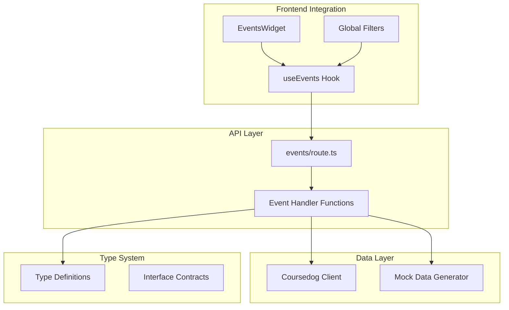
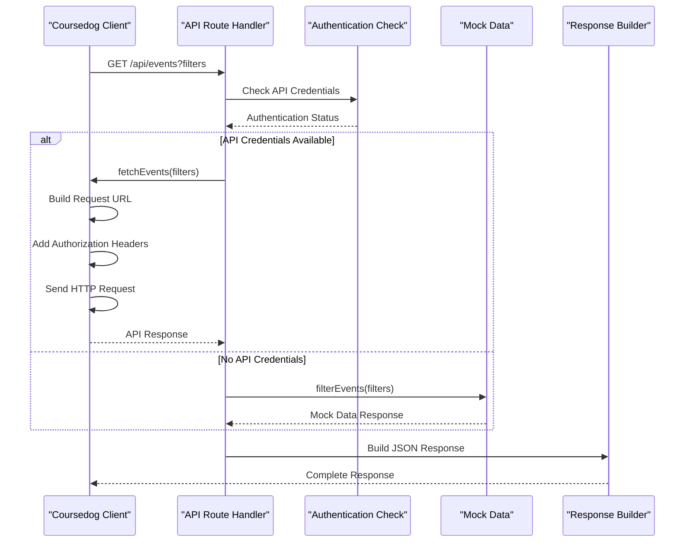
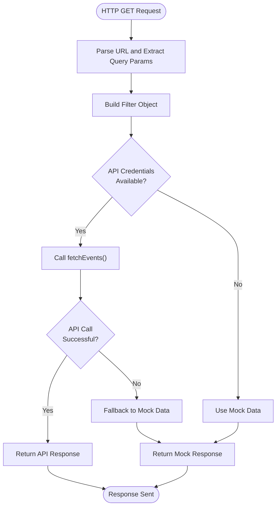
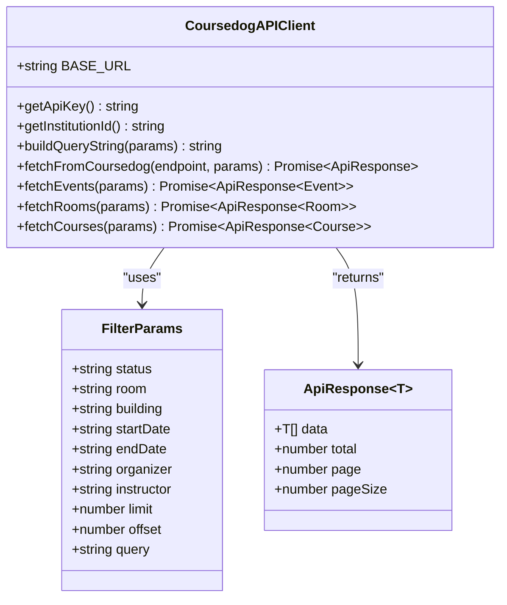
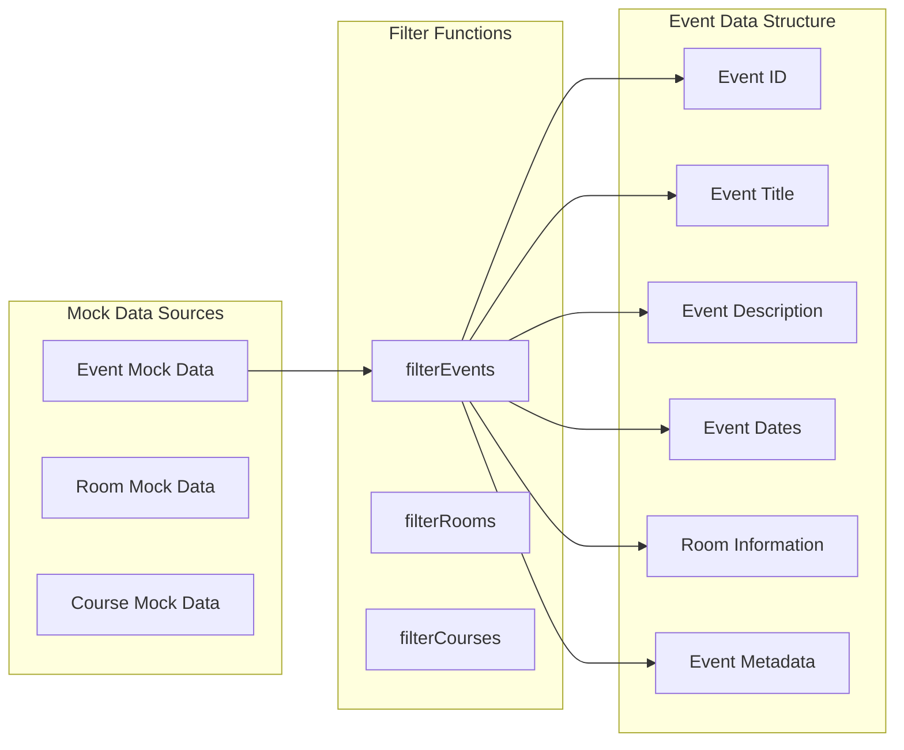
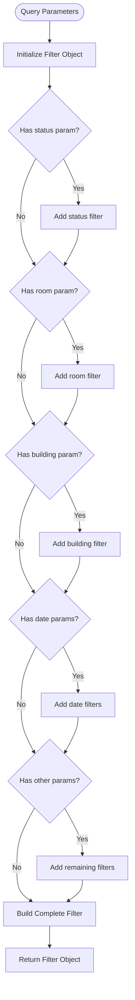
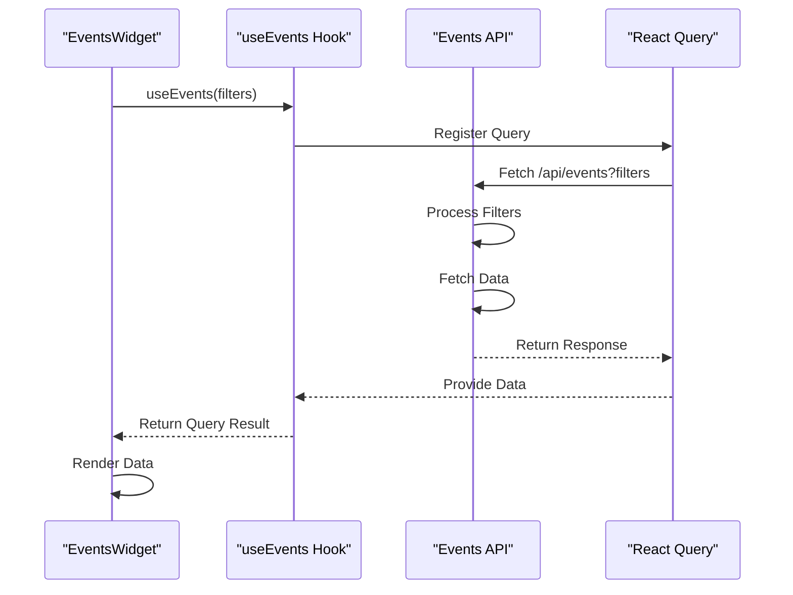
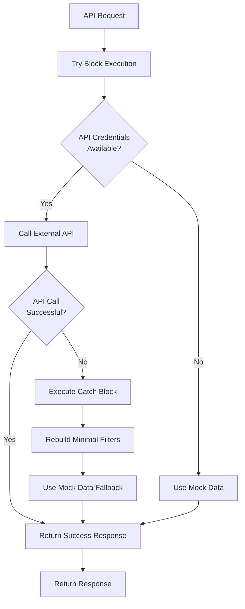
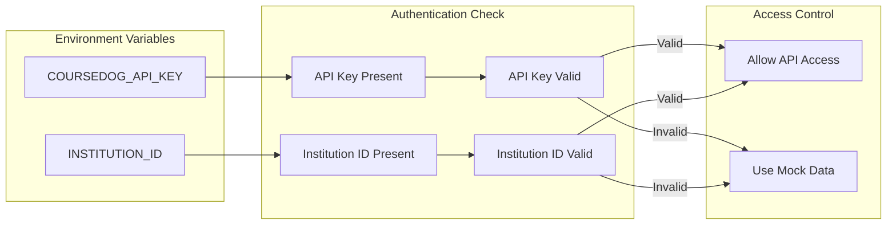
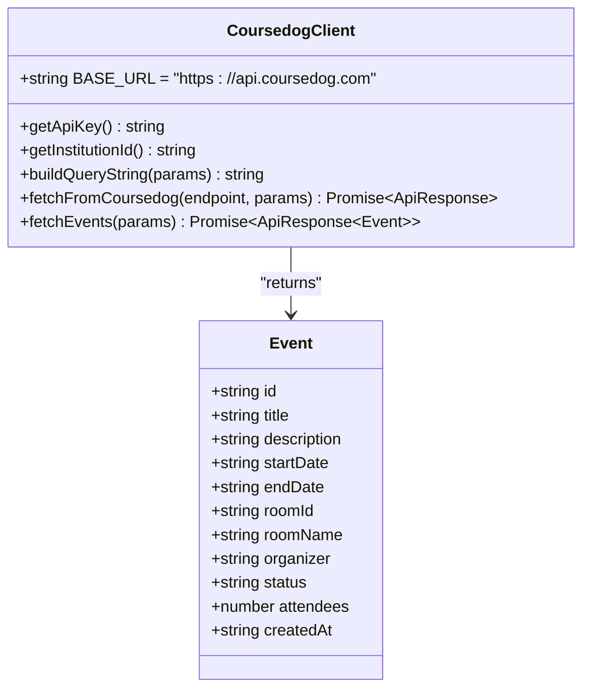

# Events API Endpoint

<cite>
**Referenced Files in This Document**
- [route.ts](file://src/app/api/events/route.ts)
- [coursedog.ts](file://src/lib/api/coursedog.ts)
- [mockData.ts](file://src/lib/api/mockData.ts)
- [types.ts](file://src/lib/api/types.ts)
- [useEvents.ts](file://src/hooks/useEvents.ts)
- [useGlobalFilters.ts](file://src/hooks/useGlobalFilters.ts)
- [EventsWidget.tsx](file://src/components/widgets/EventsWidget.tsx)
- [env.ts](file://src/lib/utils/env.ts)
</cite>

## Table of Contents
1. [Introduction](#introduction)
2. [Project Structure](#project-structure)
3. [Core Components](#core-components)
4. [Architecture Overview](#architecture-overview)
5. [Detailed Component Analysis](#detailed-component-analysis)
6. [API Specification](#api-specification)
7. [Filtering and Query Parameters](#filtering-and-query-parameters)
8. [Data Transformation Patterns](#data-transformations)
9. [Error Handling and Status Codes](#error-handling-and-status-codes)
10. [Integration with Coursedog API](#integration-with-coursedog-api)
11. [Practical Usage Examples](#practical-usage-examples)
12. [Performance Considerations](#performance-considerations)
13. [Troubleshooting Guide](#troubleshooting-guide)
14. [Conclusion](#conclusion)

## Introduction

The Events API endpoint provides a comprehensive interface for retrieving and filtering events data from the Coursedog platform. This endpoint serves as the central hub for event discovery, enabling clients to search, filter, and paginate through events while maintaining seamless integration with both real-time data and mock data fallback mechanisms.

The API implements robust error handling, supports advanced filtering capabilities, and provides a unified response format that maintains consistency across different data sources. The implementation follows modern React patterns with React Query for efficient data fetching and caching.

## Project Structure

The Events API implementation follows a modular architecture with clear separation of concerns:



**Diagram sources**
- [route.ts:1-81](file://src/app/api/events/route.ts#L1-L81)
- [coursedog.ts:1-72](file://src/lib/api/coursedog.ts#L1-L72)
- [types.ts:1-99](file://src/lib/api/types.ts#L1-L99)

**Section sources**
- [route.ts:1-81](file://src/app/api/events/route.ts#L1-L81)
- [types.ts:1-99](file://src/lib/api/types.ts#L1-L99)

## Core Components

The Events API consists of several interconnected components that work together to provide a seamless data retrieval experience:

### API Route Handler
The primary entry point processes HTTP requests, validates query parameters, and orchestrates data fetching from either the Coursedog API or mock data source.

### Coursedog API Client
Handles authentication, request building, and response processing for the external Coursedog service.

### Mock Data System
Provides fallback data when API credentials are unavailable, enabling development and testing without external dependencies.

### Type System
Defines strict contracts for data structures, filter parameters, and API responses ensuring type safety across the application.

**Section sources**
- [route.ts:13-80](file://src/app/api/events/route.ts#L13-L80)
- [coursedog.ts:36-59](file://src/lib/api/coursedog.ts#L36-L59)
- [mockData.ts:286-300](file://src/lib/api/mockData.ts#L286-L300)

## Architecture Overview

The Events API follows a layered architecture pattern that separates concerns and enables easy maintenance and extension:



**Diagram sources**
- [route.ts:13-80](file://src/app/api/events/route.ts#L13-L80)
- [coursedog.ts:36-68](file://src/lib/api/coursedog.ts#L36-L68)
- [mockData.ts:286-300](file://src/lib/api/mockData.ts#L286-L300)

## Detailed Component Analysis

### API Route Handler Implementation

The route handler implements sophisticated query parameter processing and response construction:



**Diagram sources**
- [route.ts:13-80](file://src/app/api/events/route.ts#L13-L80)

The handler processes query parameters with careful type conversion and validation:

| Parameter | Type | Description | Default |
|-----------|------|-------------|---------|
| `status` | Enum | Event status filter | None |
| `room` | String | Room name filter | None |
| `building` | String | Building filter | None |
| `startDate` | String | ISO date filter | None |
| `endDate` | String | ISO date filter | None |
| `organizer` | String | Organizer filter | None |
| `instructor` | String | Instructor filter | None |
| `limit` | Number | Results limit | 50 |
| `offset` | Number | Pagination offset | 0 |
| `query` | String | Full-text search query | None |

**Section sources**
- [route.ts:18-46](file://src/app/api/events/route.ts#L18-L46)
- [types.ts:50-61](file://src/lib/api/types.ts#L50-L61)

### Coursedog API Client

The client handles external API communication with robust error handling:



**Diagram sources**
- [coursedog.ts:1-72](file://src/lib/api/coursedog.ts#L1-L72)
- [types.ts:49-92](file://src/lib/api/types.ts#L49-L92)

**Section sources**
- [coursedog.ts:36-68](file://src/lib/api/coursedog.ts#L36-L68)
- [types.ts:49-92](file://src/lib/api/types.ts#L49-L92)

### Mock Data System

The mock data system provides comprehensive fallback functionality:



**Diagram sources**
- [mockData.ts:72-151](file://src/lib/api/mockData.ts#L72-L151)
- [mockData.ts:286-300](file://src/lib/api/mockData.ts#L286-L300)

**Section sources**
- [mockData.ts:286-300](file://src/lib/api/mockData.ts#L286-L300)
- [mockData.ts:72-151](file://src/lib/api/mockData.ts#L72-L151)

## API Specification

### Endpoint Definition

**Endpoint:** `GET /api/events`

**Description:** Retrieves filtered events data from the Coursedog platform with support for pagination and comprehensive filtering.

### Request Parameters

| Parameter | Type | Required | Description | Example |
|-----------|------|----------|-------------|---------|
| `status` | string | No | Filter by event status | `approved` |
| `room` | string | No | Filter by room name | `Lecture Hall A` |
| `building` | string | No | Filter by building name | `Science Building` |
| `startDate` | string | No | Filter by start date (ISO 8601) | `2024-01-01` |
| `endDate` | string | No | Filter by end date (ISO 8601) | `2024-12-31` |
| `organizer` | string | No | Filter by organizer name | `Dr. Johnson` |
| `instructor` | string | No | Filter by instructor name | `Prof. Smith` |
| `limit` | number | No | Maximum number of results | `50` |
| `offset` | number | No | Pagination offset | `0` |
| `query` | string | No | Full-text search query | `department meeting` |

### Response Format

The API returns a standardized response structure:

```typescript
interface ApiResponse<T> {
  data: T[];
  total: number;
  page: number;
  pageSize: number;
}
```

**Success Response Example:**
```json
{
  "data": [
    {
      "id": "evt-001",
      "title": "Computer Science Department Meeting",
      "description": "Monthly faculty meeting to discuss curriculum updates",
      "startDate": "2024-01-15T10:00:00Z",
      "endDate": "2024-01-15T12:00:00Z",
      "roomId": "room-001",
      "roomName": "Lecture Hall A",
      "organizer": "Dr. Sarah Johnson",
      "status": "approved",
      "attendees": 25,
      "createdAt": "2024-01-01T08:00:00Z"
    }
  ],
  "total": 1,
  "page": 1,
  "pageSize": 1
}
```

**Section sources**
- [route.ts:51-61](file://src/app/api/events/route.ts#L51-L61)
- [types.ts:87-92](file://src/lib/api/types.ts#L87-L92)

## Filtering and Query Parameters

### Filter Construction Logic

The API implements intelligent filter construction that processes query parameters into a structured filter object:



**Diagram sources**
- [route.ts:18-46](file://src/app/api/events/route.ts#L18-L46)

### Supported Filter Types

| Filter Type | Valid Values | Description |
|-------------|--------------|-------------|
| `status` | `pending`, `approved`, `rejected` | Event approval status |
| `room` | Any string | Partial match on room name |
| `building` | Any string | Partial match on building name |
| `startDate` | ISO 8601 date | Events on or after this date |
| `endDate` | ISO 8601 date | Events on or before this date |
| `organizer` | Any string | Partial match on organizer name |
| `instructor` | Any string | Partial match on instructor name |
| `query` | Any string | Full-text search across title, description, and organizer |

### Pagination Parameters

| Parameter | Type | Default | Description |
|-----------|------|---------|-------------|
| `limit` | number | 50 | Maximum number of results per page |
| `offset` | number | 0 | Starting position for pagination |

**Section sources**
- [route.ts:18-46](file://src/app/api/events/route.ts#L18-L46)
- [types.ts:50-61](file://src/lib/api/types.ts#L50-L61)

## Data Transformations

### Frontend Integration Pattern

The API integrates seamlessly with React applications through a dedicated hook system:



**Diagram sources**
- [useEvents.ts:6-23](file://src/hooks/useEvents.ts#L6-L23)
- [EventsWidget.tsx:15-16](file://src/components/widgets/EventsWidget.tsx#L15-L16)

### Data Transformation Pipeline

The API implements a multi-stage transformation pipeline:

1. **Query Parameter Processing**: Converts URL parameters to typed filter objects
2. **API Integration**: Handles authentication and external service communication
3. **Response Normalization**: Standardizes data structure across different sources
4. **Error Recovery**: Provides fallback mechanisms for graceful degradation

**Section sources**
- [useEvents.ts:6-23](file://src/hooks/useEvents.ts#L6-L23)
- [route.ts:48-79](file://src/app/api/events/route.ts#L48-L79)

## Error Handling and Status Codes

### Error Scenarios

The API implements comprehensive error handling with fallback mechanisms:



**Diagram sources**
- [route.ts:62-79](file://src/app/api/events/route.ts#L62-L79)

### Error Response Structure

When errors occur, the API returns a standardized error response:

```json
{
  "error": "Coursedog API error",
  "message": "API error details",
  "statusCode": 500
}
```

### Status Code Documentation

| Status Code | Scenario | Response Content |
|-------------|----------|------------------|
| 200 | Successful request | Event data response |
| 400 | Invalid parameters | Error object |
| 401 | Authentication failure | Error object |
| 500 | Internal server error | Error object |
| 503 | Service unavailable | Error object |

**Section sources**
- [route.ts:62-79](file://src/app/api/events/route.ts#L62-L79)
- [coursedog.ts:53-56](file://src/lib/api/coursedog.ts#L53-L56)
- [types.ts:94-98](file://src/lib/api/types.ts#L94-L98)

## Integration with Coursedog API

### Authentication Mechanism

The API implements secure authentication through environment variables:



**Diagram sources**
- [route.ts:7-11](file://src/app/api/events/route.ts#L7-L11)
- [coursedog.ts:7-21](file://src/lib/api/coursedog.ts#L7-L21)

### API Client Implementation

The Coursedog client provides a clean interface for external service communication:



**Diagram sources**
- [coursedog.ts:36-68](file://src/lib/api/coursedog.ts#L36-L68)
- [types.ts:20-32](file://src/lib/api/types.ts#L20-L32)

**Section sources**
- [coursedog.ts:36-68](file://src/lib/api/coursedog.ts#L36-L68)
- [route.ts:7-11](file://src/app/api/events/route.ts#L7-L11)

## Practical Usage Examples

### Basic Event Retrieval

**Request:**
```
GET /api/events
```

**Response:**
```json
{
  "data": [
    {
      "id": "evt-001",
      "title": "Department Meeting",
      "startDate": "2024-01-15T10:00:00Z",
      "endDate": "2024-01-15T11:00:00Z",
      "roomName": "Lecture Hall A",
      "organizer": "Dr. Johnson",
      "status": "approved"
    }
  ],
  "total": 1,
  "page": 1,
  "pageSize": 1
}
```

### Advanced Filtering

**Request:**
```
GET /api/events?status=approved&room=Lecture%20Hall%20A&startDate=2024-01-01&limit=10&offset=0
```

**Response:**
```json
{
  "data": [
    {
      "id": "evt-001",
      "title": "Computer Science Department Meeting",
      "description": "Monthly faculty meeting",
      "startDate": "2024-01-15T10:00:00Z",
      "endDate": "2024-01-15T12:00:00Z",
      "roomName": "Lecture Hall A",
      "organizer": "Dr. Sarah Johnson",
      "status": "approved",
      "attendees": 25
    }
  ],
  "total": 1,
  "page": 1,
  "pageSize": 1
}
```

### Full-Text Search

**Request:**
```
GET /api/events?query=department%20meeting&limit=20
```

**Response:**
```json
{
  "data": [
    {
      "id": "evt-001",
      "title": "Computer Science Department Meeting",
      "description": "Monthly faculty meeting to discuss curriculum updates",
      "startDate": "2024-01-15T10:00:00Z",
      "endDate": "2024-01-15T12:00:00Z",
      "roomName": "Lecture Hall A",
      "organizer": "Dr. Sarah Johnson",
      "status": "approved"
    }
  ],
  "total": 1,
  "page": 1,
  "pageSize": 1
}
```

### Pagination Example

**First Page:**
```
GET /api/events?limit=10&offset=0
```

**Second Page:**
```
GET /api/events?limit=10&offset=10
```

### Error Response Example

**Request:**
```
GET /api/events?invalid_param=value
```

**Response:**
```json
{
  "error": "Invalid parameter",
  "message": "Parameter 'invalid_param' is not supported",
  "statusCode": 400
}
```

**Section sources**
- [route.ts:51-61](file://src/app/api/events/route.ts#L51-L61)
- [useEvents.ts:6-23](file://src/hooks/useEvents.ts#L6-L23)

## Performance Considerations

### Caching Strategy

The API leverages React Query for intelligent caching and data synchronization:

- **Automatic Refetching**: Data automatically refreshes when filters change
- **Background Updates**: New data replaces old data without disrupting user experience
- **Stale Data Handling**: Provides immediate feedback while updating in background
- **Query Key Management**: Efficient cache invalidation based on filter parameters

### Optimization Techniques

1. **Lazy Loading**: Data is fetched only when components mount
2. **Debounced Queries**: Rapid filter changes are debounced to prevent excessive requests
3. **Efficient Filtering**: Client-side filtering minimizes network requests during development
4. **Pagination Support**: Built-in pagination prevents large payload transfers

### Scalability Features

- **Rate Limiting**: External API calls respect rate limits and timeouts
- **Graceful Degradation**: Mock data ensures functionality during service outages
- **Error Boundaries**: Comprehensive error handling prevents cascading failures
- **Resource Cleanup**: Automatic cleanup of unused resources and subscriptions

## Troubleshooting Guide

### Common Issues and Solutions

| Issue | Symptoms | Solution |
|-------|----------|----------|
| API Authentication Failure | 401 errors, mock data fallback | Verify COURSEDOG_API_KEY and COURSEDOG_INSTITUTION_ID environment variables |
| Network Connectivity | Timeout errors, service unavailable | Check external API connectivity and firewall settings |
| Invalid Parameters | 400 errors, malformed requests | Validate query parameters against supported filter types |
| Rate Limiting | 429 errors, throttled requests | Implement exponential backoff and reduce request frequency |
| Data Format Issues | Parsing errors, unexpected response structure | Verify response format matches expected API specification |

### Debugging Tools

1. **Console Logging**: API route handler logs detailed error information
2. **Network Inspection**: Browser developer tools show request/response details
3. **Environment Validation**: Check environment variable configuration
4. **Mock Mode Testing**: Verify functionality without external dependencies

### Environment Configuration

Ensure proper environment setup for production:

```bash
# Required Environment Variables
export COURSEDOG_API_KEY="your_actual_api_key"
export COURSEDOG_INSTITUTION_ID="your_institution_id"

# Development Environment
export NODE_ENV="development"
export NEXT_PUBLIC_MOCK_MODE="false"
```

**Section sources**
- [route.ts:62-79](file://src/app/api/events/route.ts#L62-L79)
- [env.ts:3-13](file://src/lib/utils/env.ts#L3-L13)

## Conclusion

The Events API endpoint provides a robust, scalable solution for event data retrieval with comprehensive filtering capabilities and seamless integration between real-time data and mock data fallback. The implementation demonstrates best practices in API design, error handling, and frontend integration.

Key strengths include:

- **Comprehensive Filtering**: Support for multiple filter types with flexible combinations
- **Robust Error Handling**: Graceful degradation and fallback mechanisms
- **Type Safety**: Strict TypeScript definitions ensure reliable data contracts
- **Performance Optimization**: Intelligent caching and pagination support
- **Developer Experience**: Clean API design with clear documentation and examples

The API serves as a foundation for building rich event discovery experiences while maintaining flexibility for future enhancements and extensions.