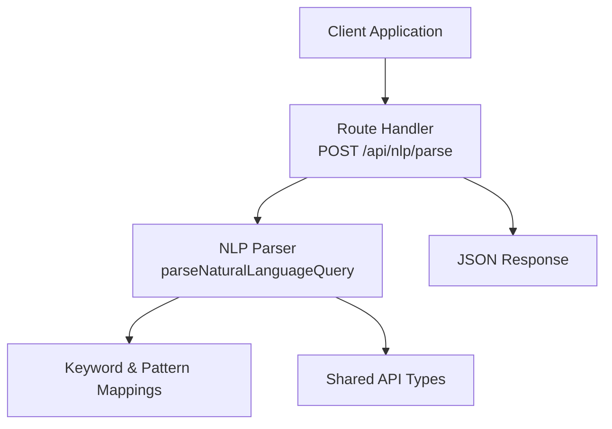
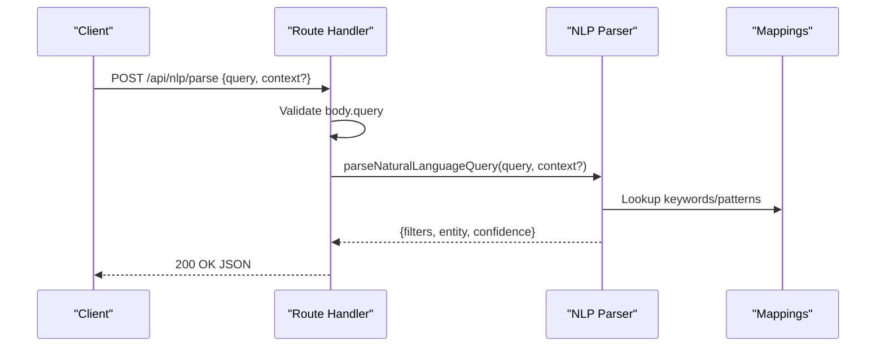
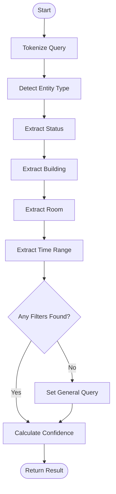
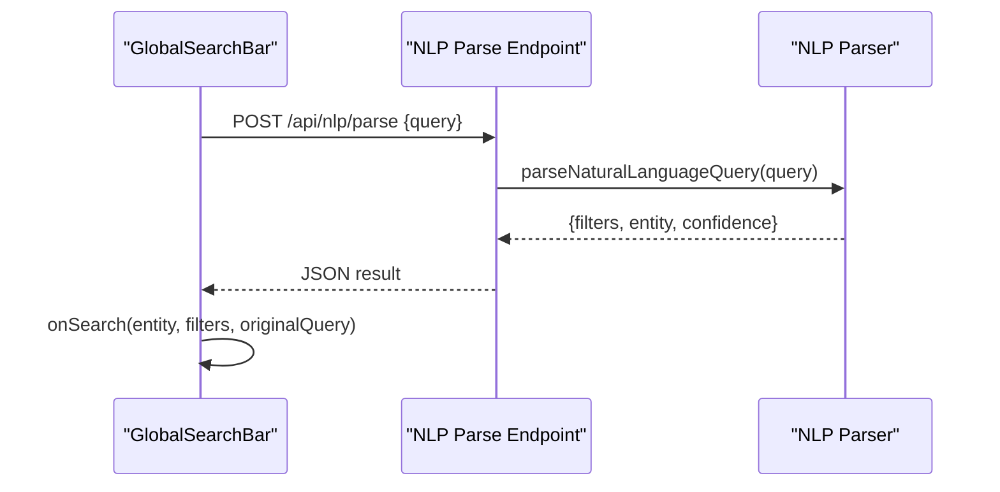
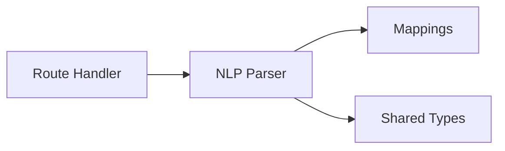

# NLP Parse Endpoint

<cite>
**Referenced Files in This Document**
- [route.ts](file://src/app/api/nlp/parse/route.ts)
- [parser.ts](file://src/lib/nlp/parser.ts)
- [mappings.ts](file://src/lib/nlp/mappings.ts)
- [types.ts](file://src/lib/api/types.ts)
- [GlobalSearchBar.tsx](file://src/components/search/GlobalSearchBar.tsx)
</cite>

## Table of Contents
1. [Introduction](#introduction)
2. [Project Structure](#project-structure)
3. [Core Components](#core-components)
4. [Architecture Overview](#architecture-overview)
5. [Detailed Component Analysis](#detailed-component-analysis)
6. [Dependency Analysis](#dependency-analysis)
7. [Performance Considerations](#performance-considerations)
8. [Troubleshooting Guide](#troubleshooting-guide)
9. [Conclusion](#conclusion)

## Introduction
This document provides comprehensive API documentation for the NLP Parse endpoint (/api/nlp/parse). It explains how natural language queries are parsed into structured filter parameters, how the endpoint integrates with the NLP parser and filter extraction algorithms, and how to use the endpoint effectively. It also covers request/response formats, error handling, confidence scoring, multi-entity detection, and performance considerations.

## Project Structure
The NLP Parse endpoint is implemented as a Next.js App Router API route. It delegates parsing logic to a dedicated NLP module and returns typed responses according to shared API types.

**Diagram sources**
- [route.ts:1-30](file://src/app/api/nlp/parse/route.ts#L1-L30)
- [parser.ts:1-202](file://src/lib/nlp/parser.ts#L1-L202)
- [mappings.ts:1-45](file://src/lib/nlp/mappings.ts#L1-L45)
- [types.ts:72-98](file://src/lib/api/types.ts#L72-L98)

**Section sources**
- [route.ts:1-30](file://src/app/api/nlp/parse/route.ts#L1-L30)
- [parser.ts:1-202](file://src/lib/nlp/parser.ts#L1-L202)
- [mappings.ts:1-45](file://src/lib/nlp/mappings.ts#L1-L45)
- [types.ts:72-98](file://src/lib/api/types.ts#L72-L98)

## Core Components
- API Route: Validates request body, invokes the NLP parser, and returns structured results or error responses.
- NLP Parser: Tokenizes input, detects entity type, extracts status, building/room, and time-range filters, and computes confidence.
- Keyword Mappings: Provides keyword sets and regex patterns used by the parser.
- Shared Types: Defines request/response shapes and filter parameter structures.

**Section sources**
- [route.ts:5-29](file://src/app/api/nlp/parse/route.ts#L5-L29)
- [parser.ts:155-201](file://src/lib/nlp/parser.ts#L155-L201)
- [mappings.ts:3-44](file://src/lib/nlp/mappings.ts#L3-L44)
- [types.ts:75-84](file://src/lib/api/types.ts#L75-L84)

## Architecture Overview
The endpoint follows a clean separation of concerns:
- The route handler focuses on HTTP concerns (validation, error handling, JSON serialization).
- The parser encapsulates NLP logic and returns a typed result.
- The mappings module centralizes keyword lists and patterns for maintainability.
- Shared types ensure consistent request/response contracts across the application.

**Diagram sources**
- [route.ts:5-29](file://src/app/api/nlp/parse/route.ts#L5-L29)
- [parser.ts:155-201](file://src/lib/nlp/parser.ts#L155-L201)
- [mappings.ts:3-44](file://src/lib/nlp/mappings.ts#L3-L44)

## Detailed Component Analysis

### Endpoint Definition
- Method: POST
- Path: /api/nlp/parse
- Purpose: Convert a natural language query into structured filters and entity type with confidence.

Request Body
- Fields:
  - query: string (required)
  - context: "rooms" | "events" | "courses" | "unknown" (optional)
- Validation:
  - Returns 400 if query is missing or not a string.

Processing Logic
- Delegates to parseNaturalLanguageQuery(query, context?).
- On success, returns the parsed result as JSON.
- On error, logs and returns 500 with an error message.

Response
- filters: FilterParams (see below)
- entity: "rooms" | "events" | "courses" | "unknown"
- confidence: number between 0 and 1

**Section sources**
- [route.ts:5-29](file://src/app/api/nlp/parse/route.ts#L5-L29)
- [types.ts:75-84](file://src/lib/api/types.ts#L75-L84)

### Request Body Format
- query: Required. The natural language string to parse.
- context: Optional. Overrides automatic entity detection when provided.

Usage Notes
- If context is omitted or "unknown", the parser attempts to detect the entity type from the query.
- If no filters are extracted, the query string is included as a general search term.

**Section sources**
- [types.ts:75-78](file://src/lib/api/types.ts#L75-L78)
- [parser.ts:155-163](file://src/lib/nlp/parser.ts#L155-L163)

### Response Structure
- filters: Contains zero or more of:
  - status: One of the supported statuses.
  - room: Extracted room identifier.
  - building: Extracted building name.
  - startDate: ISO date string.
  - endDate: ISO date string.
  - query: General search term when no specific filters are found.
  - limit, offset: Pagination hints (as defined in FilterParams).
- entity: Detected or forced entity type.
- confidence: Numeric score indicating parsing reliability.

Confidence Scoring
- Base score includes entity detection.
- Adds partial scores for discovered filters (status, building/room, time range).
- Normalized to a maximum of 1.0.

**Section sources**
- [types.ts:49-61](file://src/lib/api/types.ts#L49-L61)
- [parser.ts:125-153](file://src/lib/nlp/parser.ts#L125-L153)

### NLP Parsing Algorithm
High-Level Flow
- Tokenization: Split query into tokens.
- Entity Detection: Scan for entity keywords; fallback to context if provided.
- Status Extraction: Match against status keywords.
- Building/Room Extraction: Use keyword lists and regex patterns.
- Time Range Extraction: Map temporal phrases to start/end dates.
- Fallback: If nothing is extracted, treat the query as a general search term.
- Confidence Calculation: Aggregate scores and normalize.

**Diagram sources**
- [parser.ts:12-153](file://src/lib/nlp/parser.ts#L12-L153)

**Section sources**
- [parser.ts:155-201](file://src/lib/nlp/parser.ts#L155-L201)

### Keyword Mappings and Patterns
- STATUS_KEYWORDS: Maps status values to keyword arrays.
- ENTITY_KEYWORDS: Maps entity types to keyword arrays.
- BUILDING_KEYWORDS: Known building names.
- TIME_KEYWORDS: Temporal expressions mapped to time spans.
- ROOM_PATTERNS: Regex patterns for extracting room/building identifiers.

Integration
- The parser imports these mappings to drive detection and extraction.

**Section sources**
- [mappings.ts:3-44](file://src/lib/nlp/mappings.ts#L3-L44)
- [parser.ts:3-9](file://src/lib/nlp/parser.ts#L3-L9)

### Multi-Entity Detection
- The parser scans for keywords associated with each entity type.
- If multiple keywords are present, the first matched entity type wins.
- context can override detection to force a specific entity type.

**Section sources**
- [parser.ts:16-29](file://src/lib/nlp/parser.ts#L16-L29)
- [mappings.ts:13-17](file://src/lib/nlp/mappings.ts#L13-L17)

### Confidence Scoring Details
- Score components:
  - Entity detection: +1
  - Status: +0.5
  - Building/room: +0.5
  - Time range: +0.5
- Maximum base score: 2 (entity detection) plus partials for each discovered filter.
- Normalized to [0, 1].

**Section sources**
- [parser.ts:125-153](file://src/lib/nlp/parser.ts#L125-L153)

### Usage Examples
- Example 1: "Show me available rooms in the Student Union"
  - Entity: rooms
  - Filters: status=available, building="Student Union"
  - Confidence: high (entity + status + building)
- Example 2: "Find courses scheduled for this week"
  - Entity: courses
  - Filters: startDate, endDate covering the current week
  - Confidence: medium-high (entity + time range)
- Example 3: "Events that are pending approval"
  - Entity: events
  - Filters: status=pending
  - Confidence: medium (entity + status)
- Example 4: "Free rooms tomorrow"
  - Entity: rooms
  - Filters: status=available, startDate=tomorrow, endDate=tomorrow
  - Confidence: medium-high (entity + status + time range)
- Example 5: "Gymnasium availability next week"
  - Entity: rooms
  - Filters: building="Gymnasium", startDate/endDate for next week
  - Confidence: medium-high (entity + building + time range)

Note: These examples illustrate typical outcomes. Actual results depend on keyword matches and patterns.

**Section sources**
- [mappings.ts:3-36](file://src/lib/nlp/mappings.ts#L3-L36)
- [parser.ts:155-201](file://src/lib/nlp/parser.ts#L155-L201)

### Integration with Frontend
- The GlobalSearchBar component demonstrates how to call the endpoint:
  - Sends POST /api/nlp/parse with { query }
  - Parses the JSON response
  - Falls back to a general search if parsing fails
  - Uses the returned entity and filters to trigger downstream searches

**Diagram sources**
- [GlobalSearchBar.tsx:21-54](file://src/components/search/GlobalSearchBar.tsx#L21-L54)
- [route.ts:5-29](file://src/app/api/nlp/parse/route.ts#L5-L29)
- [parser.ts:155-201](file://src/lib/nlp/parser.ts#L155-L201)

**Section sources**
- [GlobalSearchBar.tsx:21-54](file://src/components/search/GlobalSearchBar.tsx#L21-L54)

## Dependency Analysis
The route depends on the parser, which in turn depends on mappings and shared types.

**Diagram sources**
- [route.ts:1-3](file://src/app/api/nlp/parse/route.ts#L1-L3)
- [parser.ts:1-10](file://src/lib/nlp/parser.ts#L1-L10)
- [mappings.ts:1-45](file://src/lib/nlp/mappings.ts#L1-L45)
- [types.ts:1-99](file://src/lib/api/types.ts#L1-L99)

**Section sources**
- [route.ts:1-3](file://src/app/api/nlp/parse/route.ts#L1-L3)
- [parser.ts:1-10](file://src/lib/nlp/parser.ts#L1-L10)
- [mappings.ts:1-45](file://src/lib/nlp/mappings.ts#L1-L45)
- [types.ts:1-99](file://src/lib/api/types.ts#L1-L99)

## Performance Considerations
- Complexity:
  - Tokenization: O(n) where n is the number of characters.
  - Keyword scanning: O(k) per keyword set (constant-time checks).
  - Regex matching: Linear in query length; bounded by a small number of patterns.
  - Overall: Expected linear in input size.
- Optimization Strategies:
  - Pre-tokenize once and reuse tokens across detectors.
  - Cache keyword lookup maps if frequently reused.
  - Limit query length at the route boundary to prevent excessive processing.
  - Consider early exits when sufficient filters are found.
  - Normalize input (lowercase) once at the start of processing.
  - Avoid repeated allocations inside loops; reuse buffers where possible.
- Scalability:
  - Keep mappings compact and static.
  - Offload heavy NLP to external services if needed, while retaining this lightweight parser for simple cases.

[No sources needed since this section provides general guidance]

## Troubleshooting Guide
Common Issues and Resolutions
- Malformed Query
  - Symptom: 400 Bad Request with a message indicating query must be a string.
  - Cause: Missing or non-string query field.
  - Resolution: Ensure the request body contains a valid string under query.
- Parsing Failure
  - Symptom: 500 Internal Server Error with a generic message.
  - Cause: Unexpected runtime errors during parsing.
  - Resolution: Check server logs for stack traces; validate input and mappings.
- Unsupported Keywords
  - Symptom: Low confidence or missing filters.
  - Cause: Query does not match known keywords or patterns.
  - Resolution: Expand mappings or adjust phrasing to include recognized terms.
- No Filters Extracted
  - Symptom: Response includes a general query term.
  - Cause: No explicit filters were detected.
  - Resolution: Provide clearer keywords or specify context to guide entity detection.

**Section sources**
- [route.ts:9-14](file://src/app/api/nlp/parse/route.ts#L9-L14)
- [route.ts:19-28](file://src/app/api/nlp/parse/route.ts#L19-L28)
- [parser.ts:189-192](file://src/lib/nlp/parser.ts#L189-L192)

## Conclusion
The /api/nlp/parse endpoint provides a robust, typed interface for converting natural language queries into structured filters. Its design cleanly separates HTTP concerns from NLP logic, leverages keyword mappings and patterns, and returns confidence scores to help applications decide how to handle ambiguous inputs. By following the request/response formats and leveraging the provided context parameter, developers can integrate powerful search capabilities with minimal effort.