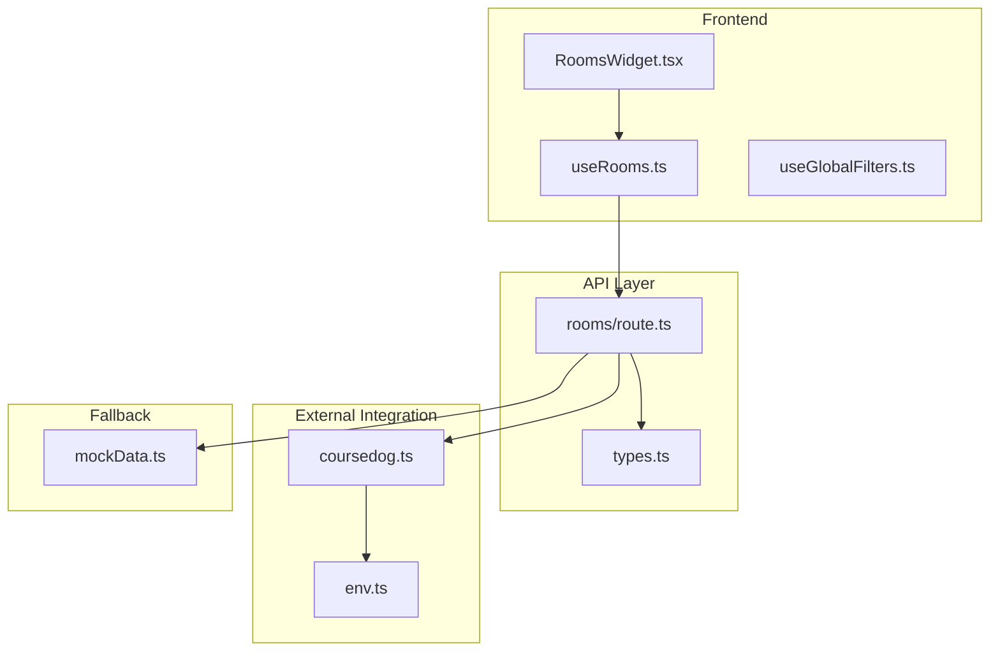
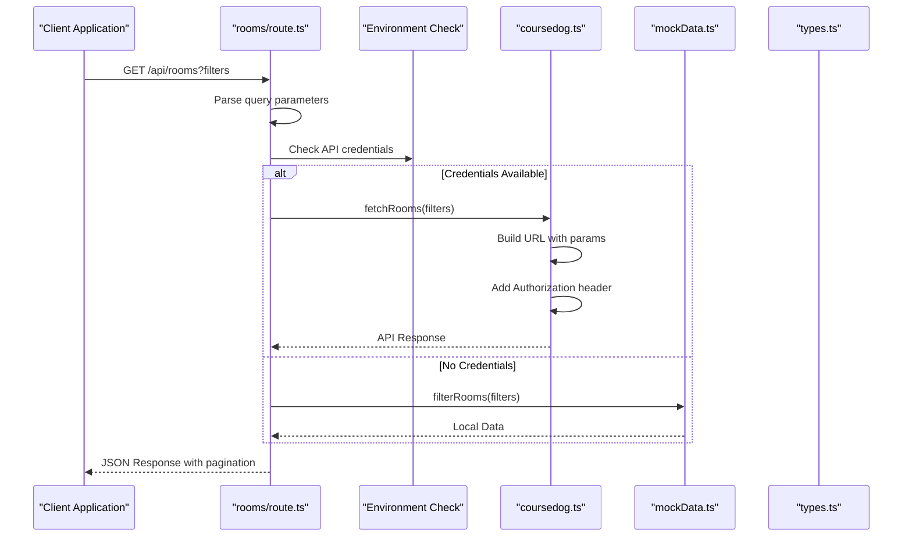
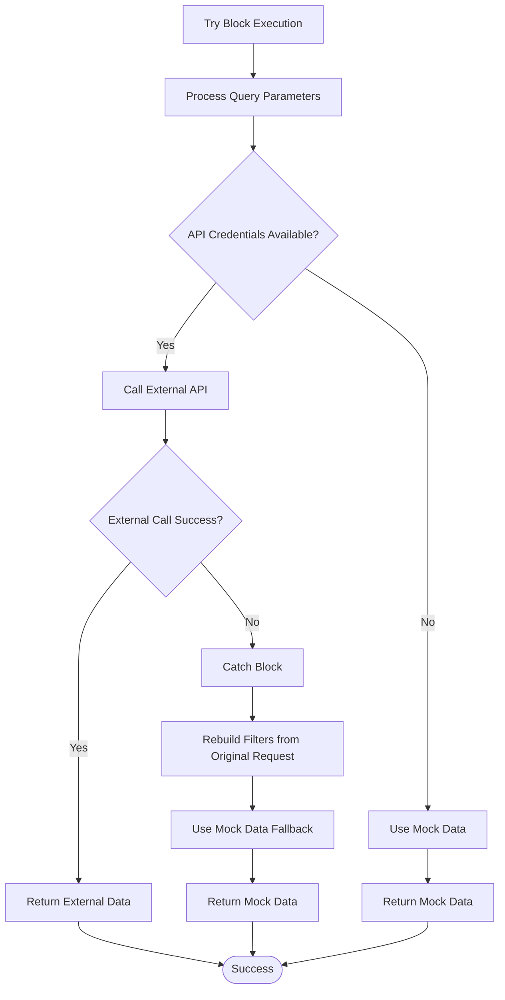
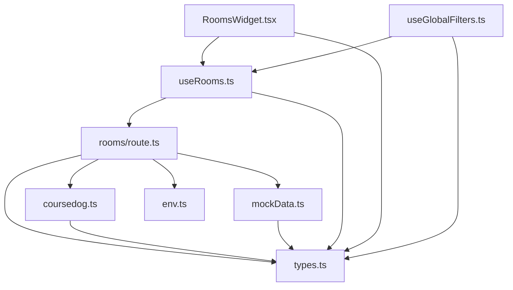

# Rooms API Endpoint

<cite>
**Referenced Files in This Document**
- [route.ts](file://src/app/api/rooms/route.ts)
- [coursedog.ts](file://src/lib/api/coursedog.ts)
- [types.ts](file://src/lib/api/types.ts)
- [mockData.ts](file://src/lib/api/mockData.ts)
- [useRooms.ts](file://src/hooks/useRooms.ts)
- [useGlobalFilters.ts](file://src/hooks/useGlobalFilters.ts)
- [RoomsWidget.tsx](file://src/components/widgets/RoomsWidget.tsx)
- [env.ts](file://src/lib/utils/env.ts)
</cite>

## Table of Contents
1. [Introduction](#introduction)
2. [Project Structure](#project-structure)
3. [Core Components](#core-components)
4. [Architecture Overview](#architecture-overview)
5. [Detailed Component Analysis](#detailed-component-analysis)
6. [Dependency Analysis](#dependency-analysis)
7. [Performance Considerations](#performance-considerations)
8. [Troubleshooting Guide](#troubleshooting-guide)
9. [Conclusion](#conclusion)

## Introduction
This document provides comprehensive API documentation for the Rooms endpoint (`/api/rooms`). It covers the GET method implementation, query parameter handling, filter processing logic, and integration with both the external Coursedog API and local mock data. The documentation includes supported query parameters, data transformation from query strings to API requests, request/response examples, error handling patterns, status code documentation, and practical usage examples for common filtering scenarios and pagination patterns.

## Project Structure
The Rooms API endpoint is implemented as a Next.js App Router API route. It integrates with a dedicated Coursedog API client and a mock data layer for fallback scenarios. The frontend consumes this endpoint through a React Query hook.

**Diagram sources**
- [route.ts:1-79](file://src/app/api/rooms/route.ts#L1-L79)
- [coursedog.ts:1-72](file://src/lib/api/coursedog.ts#L1-L72)
- [types.ts:1-99](file://src/lib/api/types.ts#L1-L99)
- [mockData.ts:1-318](file://src/lib/api/mockData.ts#L1-L318)
- [useRooms.ts:1-31](file://src/hooks/useRooms.ts#L1-L31)
- [useGlobalFilters.ts:1-79](file://src/hooks/useGlobalFilters.ts#L1-L79)
- [RoomsWidget.tsx:1-100](file://src/components/widgets/RoomsWidget.tsx#L1-L100)
- [env.ts:1-13](file://src/lib/utils/env.ts#L1-L13)

**Section sources**
- [route.ts:1-79](file://src/app/api/rooms/route.ts#L1-L79)
- [coursedog.ts:1-72](file://src/lib/api/coursedog.ts#L1-L72)
- [types.ts:1-99](file://src/lib/api/types.ts#L1-L99)
- [mockData.ts:1-318](file://src/lib/api/mockData.ts#L1-L318)
- [useRooms.ts:1-31](file://src/hooks/useRooms.ts#L1-L31)
- [useGlobalFilters.ts:1-79](file://src/hooks/useGlobalFilters.ts#L1-L79)
- [RoomsWidget.tsx:1-100](file://src/components/widgets/RoomsWidget.tsx#L1-L100)
- [env.ts:1-13](file://src/lib/utils/env.ts#L1-L13)

## Core Components
The Rooms API endpoint consists of several key components:

- **API Route Handler**: Processes GET requests, validates query parameters, and orchestrates data fetching
- **Coursedog API Client**: Handles external API communication with authentication and error handling
- **Filter Processing**: Converts query string parameters to typed FilterParams objects
- **Mock Data Fallback**: Provides local data when external API credentials are unavailable
- **React Query Hook**: Manages client-side caching, pagination, and error states

**Section sources**
- [route.ts:13-78](file://src/app/api/rooms/route.ts#L13-L78)
- [coursedog.ts:62-64](file://src/lib/api/coursedog.ts#L62-L64)
- [types.ts:49-61](file://src/lib/api/types.ts#L49-L61)
- [mockData.ts:269-284](file://src/lib/api/mockData.ts#L269-L284)
- [useRooms.ts:6-23](file://src/hooks/useRooms.ts#L6-L23)

## Architecture Overview
The Rooms API follows a layered architecture with clear separation of concerns:

**Diagram sources**
- [route.ts:13-78](file://src/app/api/rooms/route.ts#L13-L78)
- [coursedog.ts:36-59](file://src/lib/api/coursedog.ts#L36-L59)
- [mockData.ts:269-284](file://src/lib/api/mockData.ts#L269-L284)
- [types.ts:87-92](file://src/lib/api/types.ts#L87-L92)

## Detailed Component Analysis

### API Route Implementation
The `/api/rooms` endpoint handles GET requests with comprehensive query parameter processing and robust error handling.

#### Query Parameter Processing
The route extracts and processes query parameters into a strongly-typed FilterParams object:

```mermaid
flowchart TD
Start([Request Received]) --> ParseURL["Parse URL and extract searchParams"]
ParseURL --> InitFilters["Initialize FilterParams object"]
InitFilters --> CheckStatus{"Has status param?"}
CheckStatus --> |Yes| SetStatus["Set filters.status"]
CheckStatus --> |No| CheckRoom["Check room param"]
SetStatus --> CheckRoom
CheckRoom --> CheckRoomParam{"Has room param?"}
CheckRoomParam --> |Yes| SetRoom["Set filters.room"]
CheckRoomParam --> |No| CheckBuilding["Check building param"]
SetRoom --> CheckBuilding
CheckBuilding --> CheckBuildingParam{"Has building param?"}
CheckBuildingParam --> |Yes| SetBuilding["Set filters.building"]
CheckBuildingParam --> |No| CheckStartDate["Check startDate param"]
SetBuilding --> CheckStartDate
CheckStartDate --> CheckStartDateParam{"Has startDate param?"}
CheckStartDateParam --> |Yes| SetStartDate["Set filters.startDate"]
CheckStartDateParam --> |No| CheckEndDate["Check endDate param"]
SetStartDate --> CheckEndDate
CheckEndDate --> CheckEndDateParam{"Has endDate param?"}
CheckEndDateParam --> |Yes| SetEndDate["Set filters.endDate"]
CheckEndDateParam --> |No| CheckLimit["Check limit param"]
SetEndDate --> CheckLimit
CheckLimit --> CheckLimitParam{"Has limit param?"}
CheckLimitParam --> |Yes| SetLimit["Set filters.limit (parseInt)"]
CheckLimitParam --> |No| CheckOffset["Check offset param"]
SetLimit --> CheckOffset
CheckOffset --> CheckOffsetParam{"Has offset param?"}
CheckOffsetParam --> |Yes| SetOffset["Set filters.offset (parseInt)"]
CheckOffsetParam --> |No| CheckQuery["Check query param"]
SetOffset --> CheckQuery
CheckQuery --> CheckQueryParam{"Has query param?"}
CheckQueryParam --> |Yes| SetQuery["Set filters.query"]
CheckQueryParam --> |No| CheckCredentials["Check API credentials"]
SetQuery --> CheckCredentials
CheckCredentials --> HasCredentials{"Credentials available?"}
HasCredentials --> |Yes| CallAPI["Call fetchRooms(filters)"]
HasCredentials --> |No| UseMock["Use filterRooms(filters)"]
CallAPI --> ReturnResponse["Return JSON response"]
UseMock --> ReturnResponse
ReturnResponse --> End([End])
```

**Diagram sources**
- [route.ts:13-78](file://src/app/api/rooms/route.ts#L13-L78)

#### Error Handling and Fallback Logic
The endpoint implements comprehensive error handling with automatic fallback to mock data:

**Diagram sources**
- [route.ts:13-78](file://src/app/api/rooms/route.ts#L13-L78)

**Section sources**
- [route.ts:13-78](file://src/app/api/rooms/route.ts#L13-L78)

### FilterParams Interface
The FilterParams interface defines the contract for room filtering:

| Parameter | Type | Description | Default |
|-----------|------|-------------|---------|
| `status` | `'pending' \| 'approved' \| 'rejected' \| 'active' \| 'cancelled' \| 'available' \| 'occupied' \| 'maintenance'` | Room availability or operational status | undefined |
| `room` | string | Room name substring filter | undefined |
| `building` | string | Building name substring filter | undefined |
| `startDate` | string | ISO date for scheduling filter | undefined |
| `endDate` | string | ISO date for scheduling filter | undefined |
| `organizer` | string | Organizer name filter | undefined |
| `instructor` | string | Instructor name filter | undefined |
| `limit` | number | Maximum results per page | 50 |
| `offset` | number | Number of records to skip | 0 |
| `query` | string | Full-text search across room, building, and features | undefined |

**Section sources**
- [types.ts:49-61](file://src/lib/api/types.ts#L49-L61)

### Data Transformation Process
The transformation from query strings to API requests follows a consistent pattern:

```mermaid
flowchart LR
QueryString["Query String Parameters"] --> Extract["Extract from URL"]
Extract --> BuildObject["Build FilterParams Object"]
BuildObject --> Validate["Validate Types"]
Validate --> Transform["Transform Values"]
Transform --> BuildURL["Build External API URL"]
BuildURL --> AddHeaders["Add Authentication Headers"]
AddHeaders --> SendRequest["Send HTTP Request"]
SendRequest --> ProcessResponse["Process Response"]
ProcessResponse --> ReturnJSON["Return JSON Response"]
```

**Diagram sources**
- [route.ts:18-43](file://src/app/api/rooms/route.ts#L18-L43)
- [coursedog.ts:23-34](file://src/lib/api/coursedog.ts#L23-L34)
- [useRooms.ts:6-23](file://src/hooks/useRooms.ts#L6-L23)

**Section sources**
- [route.ts:18-43](file://src/app/api/rooms/route.ts#L18-L43)
- [coursedog.ts:23-34](file://src/lib/api/coursedog.ts#L23-L34)
- [useRooms.ts:6-23](file://src/hooks/useRooms.ts#L6-L23)

### External API Integration
The Coursedog API client handles authentication and request construction:

#### Authentication Requirements
- **API Key**: Must be configured in environment variables
- **Institution ID**: Required for API endpoint construction
- **Authorization Header**: Bearer token format

#### Request Construction
The client builds URLs in the format: `https://api.coursedog.com/api/v1/{institutionId}/rooms?{queryParameters}`

#### Response Processing
Returns standardized ApiResponse objects with pagination metadata:
- `data`: Array of Room objects
- `total`: Total count matching filters
- `page`: Current page number
- `pageSize`: Items per page

**Section sources**
- [coursedog.ts:5-21](file://src/lib/api/coursedog.ts#L5-L21)
- [coursedog.ts:43-59](file://src/lib/api/coursedog.ts#L43-L59)
- [types.ts:87-92](file://src/lib/api/types.ts#L87-L92)

### Mock Data Implementation
When API credentials are unavailable, the system falls back to local mock data:

#### Filter Logic
The mock filter implementation supports:
- Exact status matching
- Case-insensitive substring matching for building and room names
- Full-text search across room names, building names, and features
- Combined filtering logic with AND semantics

#### Data Structure
Mock rooms include realistic attributes:
- Unique identifiers
- Room names and building assignments
- Capacity and feature lists
- Availability status
- Optional schedule arrays

**Section sources**
- [mockData.ts:269-284](file://src/lib/api/mockData.ts#L269-L284)
- [mockData.ts:5-70](file://src/lib/api/mockData.ts#L5-L70)

### Frontend Integration
The React Query hook provides seamless client-side integration:

#### Hook Behavior
- Automatic query key generation based on filters
- Built-in caching and invalidation
- Error boundary handling
- Pagination support through limit/offset parameters

#### Widget Integration
The RoomsWidget component demonstrates practical usage:
- Real-time data fetching
- Loading state management
- Error display with refresh capability
- Mock mode detection

**Section sources**
- [useRooms.ts:25-30](file://src/hooks/useRooms.ts#L25-L30)
- [RoomsWidget.tsx:16-17](file://src/components/widgets/RoomsWidget.tsx#L16-L17)

## Dependency Analysis
The Rooms API has clear dependency relationships:

**Diagram sources**
- [route.ts:1-4](file://src/app/api/rooms/route.ts#L1-L4)
- [coursedog.ts:1-3](file://src/lib/api/coursedog.ts#L1-L3)
- [types.ts:1-1](file://src/lib/api/types.ts#L1-L1)
- [mockData.ts:1-3](file://src/lib/api/mockData.ts#L1-L3)
- [useRooms.ts:1-4](file://src/hooks/useRooms.ts#L1-L4)
- [RoomsWidget.tsx:1-7](file://src/components/widgets/RoomsWidget.tsx#L1-L7)
- [useGlobalFilters.ts:1-4](file://src/hooks/useGlobalFilters.ts#L1-L4)

**Section sources**
- [route.ts:1-4](file://src/app/api/rooms/route.ts#L1-L4)
- [coursedog.ts:1-3](file://src/lib/api/coursedog.ts#L1-L3)
- [types.ts:1-1](file://src/lib/api/types.ts#L1-L1)
- [mockData.ts:1-3](file://src/lib/api/mockData.ts#L1-L3)
- [useRooms.ts:1-4](file://src/hooks/useRooms.ts#L1-L4)
- [RoomsWidget.tsx:1-7](file://src/components/widgets/RoomsWidget.tsx#L1-L7)
- [useGlobalFilters.ts:1-4](file://src/hooks/useGlobalFilters.ts#L1-L4)

## Performance Considerations
The Rooms API implements several performance optimizations:

### Caching Strategy
- React Query provides automatic client-side caching
- Query keys include all filter parameters for cache isolation
- Built-in stale-while-revalidate behavior

### Network Efficiency
- Query parameters are only included when non-empty
- URLSearchParams ensures proper encoding
- Single request per filter combination

### Pagination Design
- Configurable limit/offset parameters
- Standardized pagination response format
- Efficient cursor-based navigation support

### Error Recovery
- Automatic fallback to mock data on external API failures
- Graceful degradation maintains application functionality
- Consistent response format regardless of data source

## Troubleshooting Guide

### Common Issues and Solutions

#### API Credentials Not Configured
**Symptoms**: Response returns mock data instead of external API results
**Solution**: Configure environment variables:
- `COURSEDOG_API_KEY`: Valid API key from Coursedog
- `COURSEDOG_INSTITUTION_ID`: Institution identifier

#### External API Errors
**Symptoms**: HTTP errors or timeout responses
**Behavior**: Automatic fallback to mock data with error logging
**Prevention**: Monitor API health and rate limits

#### Query Parameter Validation
**Issue**: Invalid parameter types cause runtime errors
**Solution**: The API performs type-safe parsing:
- `limit` and `offset` are parsed as integers
- String parameters use direct assignment
- Empty strings are treated as undefined

#### Response Format Consistency
**Issue**: Inconsistent response structure
**Solution**: The API always returns standardized ApiResponse format:
- `data`: Array of Room objects
- `total`: Total matching records
- `page`: Current page number
- `pageSize`: Items per page

**Section sources**
- [route.ts:59-77](file://src/app/api/rooms/route.ts#L59-L77)
- [coursedog.ts:53-56](file://src/lib/api/coursedog.ts#L53-L56)
- [env.ts:3-12](file://src/lib/utils/env.ts#L3-L12)

## Conclusion
The Rooms API endpoint provides a robust, scalable solution for room data retrieval with comprehensive filtering capabilities. Its architecture balances flexibility with reliability through:

- Strong typing and validation
- Clear separation of concerns
- Comprehensive error handling
- Seamless fallback mechanisms
- Client-side caching and optimization

The implementation supports advanced filtering scenarios while maintaining backward compatibility and performance. The modular design allows for easy extension and maintenance as requirements evolve.