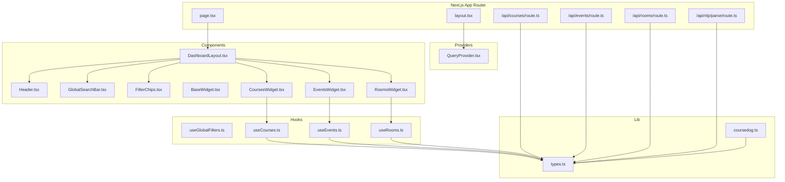
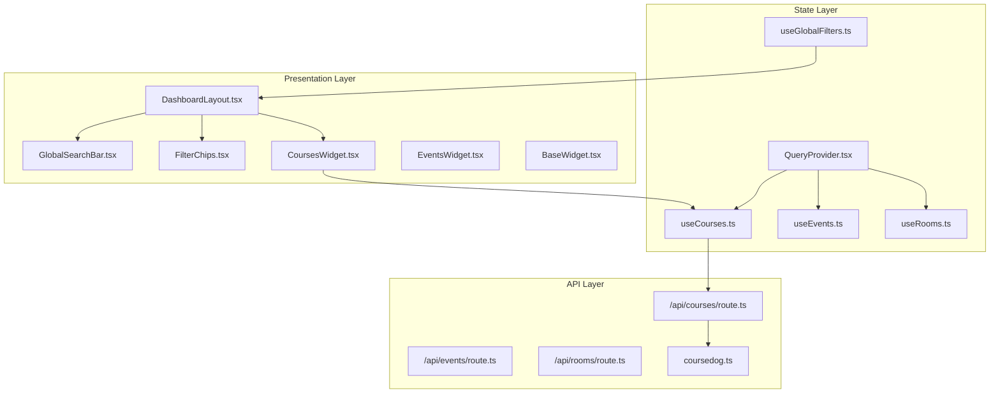
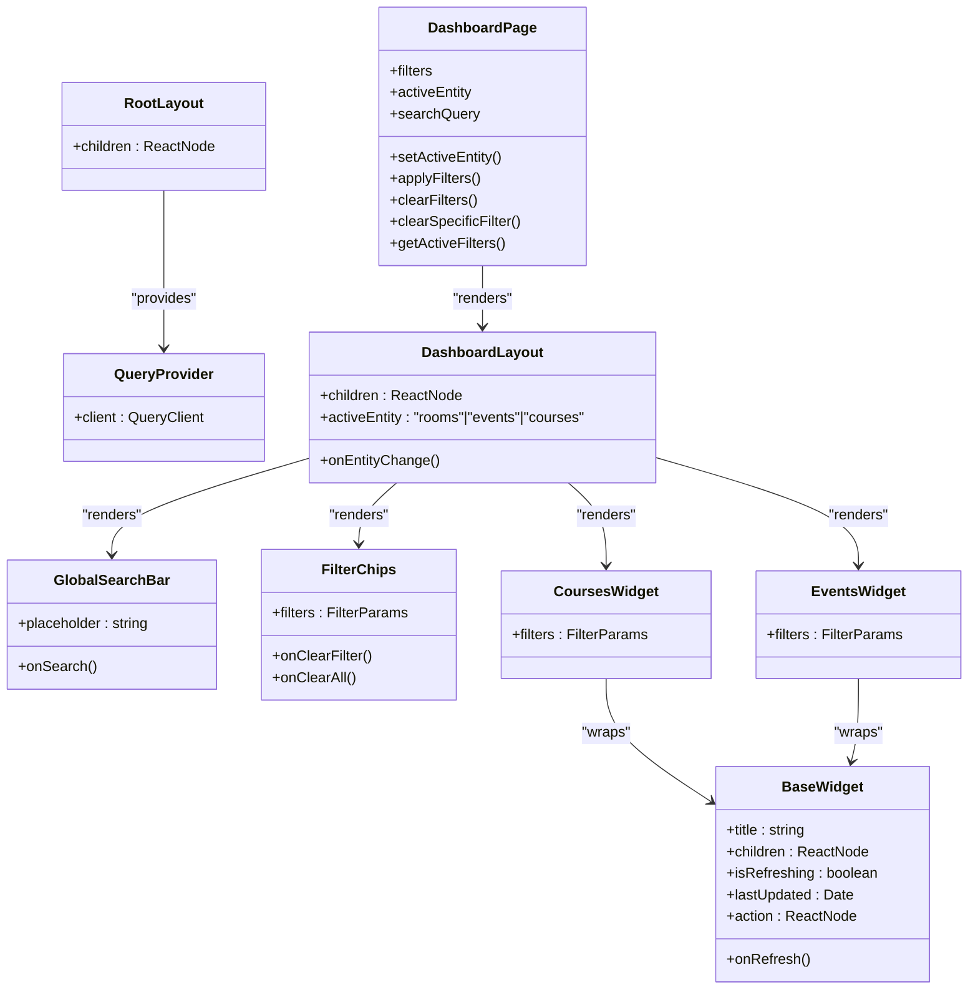
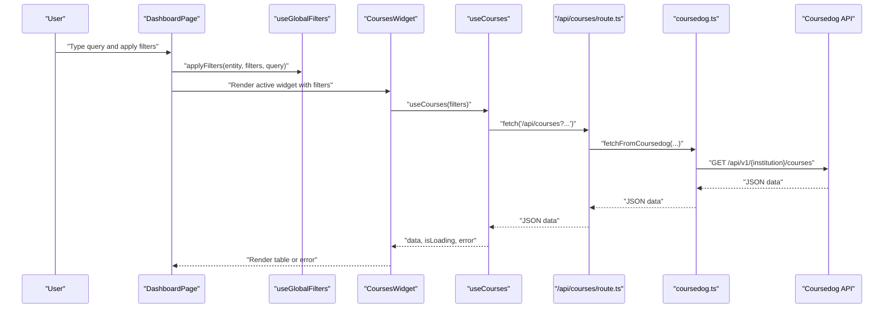
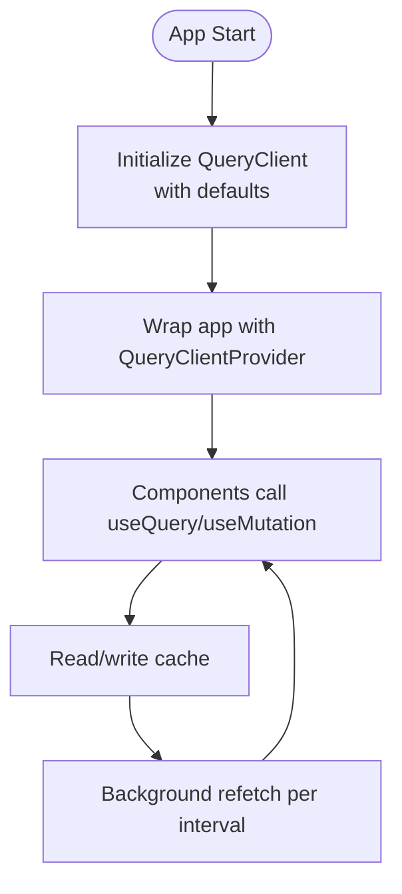
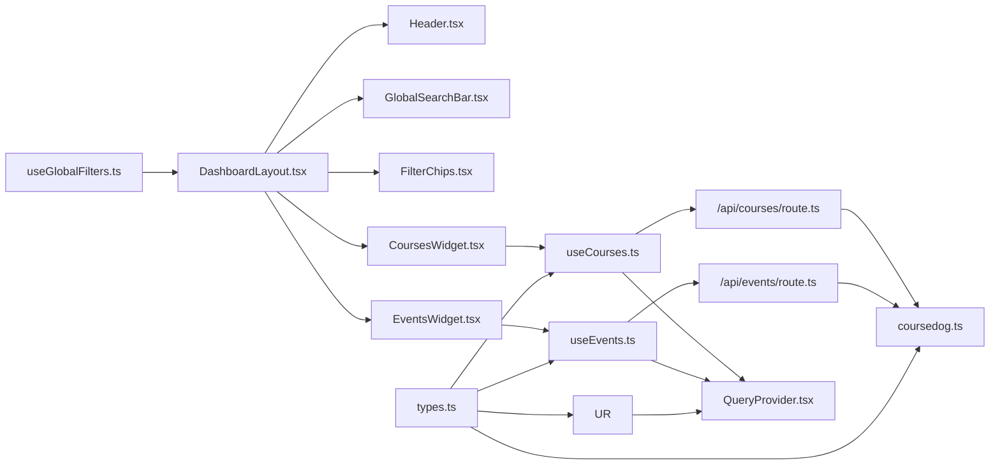

# Architecture Overview

<cite>
**Referenced Files in This Document**
- [src/app/layout.tsx](file://src/app/layout.tsx)
- [src/providers/QueryProvider.tsx](file://src/providers/QueryProvider.tsx)
- [src/app/page.tsx](file://src/app/page.tsx)
- [src/components/layout/DashboardLayout.tsx](file://src/components/layout/DashboardLayout.tsx)
- [src/components/layout/Header.tsx](file://src/components/layout/Header.tsx)
- [src/components/search/GlobalSearchBar.tsx](file://src/components/search/GlobalSearchBar.tsx)
- [src/components/search/FilterChips.tsx](file://src/components/search/FilterChips.tsx)
- [src/components/widgets/BaseWidget.tsx](file://src/components/widgets/BaseWidget.tsx)
- [src/components/widgets/CoursesWidget.tsx](file://src/components/widgets/CoursesWidget.tsx)
- [src/components/widgets/EventsWidget.tsx](file://src/components/widgets/EventsWidget.tsx)
- [src/components/widgets/RoomsWidget.tsx](file://src/components/widgets/RoomsWidget.tsx)
- [src/hooks/useGlobalFilters.ts](file://src/hooks/useGlobalFilters.ts)
- [src/hooks/useCourses.ts](file://src/hooks/useCourses.ts)
- [src/hooks/useEvents.ts](file://src/hooks/useEvents.ts)
- [src/hooks/useRooms.ts](file://src/hooks/useRooms.ts)
- [src/lib/api/types.ts](file://src/lib/api/types.ts)
- [src/lib/api/coursedog.ts](file://src/lib/api/coursedog.ts)
- [src/app/api/courses/route.ts](file://src/app/api/courses/route.ts)
- [src/app/api/events/route.ts](file://src/app/api/events/route.ts)
- [src/app/api/rooms/route.ts](file://src/app/api/rooms/route.ts)
- [src/app/api/nlp/parse/route.ts](file://src/app/api/nlp/parse/route.ts)
</cite>

## Table of Contents
1. [Introduction](#introduction)
2. [Project Structure](#project-structure)
3. [Core Components](#core-components)
4. [Architecture Overview](#architecture-overview)
5. [Detailed Component Analysis](#detailed-component-analysis)
6. [Dependency Analysis](#dependency-analysis)
7. [Performance Considerations](#performance-considerations)
8. [Troubleshooting Guide](#troubleshooting-guide)
9. [Conclusion](#conclusion)

## Introduction
This document describes the architecture of Course Puppy, a Next.js application that presents academic scheduling and resource data through a dashboard. The system follows a clear separation of concerns:
- Frontend presentation and interactivity powered by Next.js App Router, React components, and React Query for server state management
- Backend API integration via Next.js App Router API routes
- Provider pattern for global state and caching
- Component composition with a base widget abstraction
- Observer pattern for automatic data refresh
- Factory-like selection of widgets based on active entity

## Project Structure
The project is organized into feature-focused directories:
- src/app: Next.js App Router pages and API routes
- src/components: UI components grouped by domain (layout, search, ui, widgets)
- src/hooks: React Query hooks encapsulating data fetching per entity
- src/lib: Shared types and API client utilities
- src/providers: Application-wide providers (React Query)

**Diagram sources**
- [src/app/layout.tsx:1-39](file://src/app/layout.tsx#L1-L39)
- [src/providers/QueryProvider.tsx:1-35](file://src/providers/QueryProvider.tsx#L1-L35)
- [src/app/page.tsx:1-100](file://src/app/page.tsx#L1-L100)
- [src/components/layout/DashboardLayout.tsx:1-26](file://src/components/layout/DashboardLayout.tsx#L1-L26)
- [src/components/search/GlobalSearchBar.tsx](file://src/components/search/GlobalSearchBar.tsx)
- [src/components/search/FilterChips.tsx](file://src/components/search/FilterChips.tsx)
- [src/components/widgets/BaseWidget.tsx:1-58](file://src/components/widgets/BaseWidget.tsx#L1-L58)
- [src/components/widgets/CoursesWidget.tsx:1-121](file://src/components/widgets/CoursesWidget.tsx#L1-L121)
- [src/components/widgets/EventsWidget.tsx:1-116](file://src/components/widgets/EventsWidget.tsx#L1-L116)
- [src/components/widgets/RoomsWidget.tsx](file://src/components/widgets/RoomsWidget.tsx)
- [src/hooks/useGlobalFilters.ts:1-79](file://src/hooks/useGlobalFilters.ts#L1-L79)
- [src/hooks/useCourses.ts:1-31](file://src/hooks/useCourses.ts#L1-L31)
- [src/hooks/useEvents.ts:1-31](file://src/hooks/useEvents.ts#L1-L31)
- [src/hooks/useRooms.ts:1-31](file://src/hooks/useRooms.ts#L1-L31)
- [src/lib/api/types.ts:1-99](file://src/lib/api/types.ts#L1-L99)
- [src/lib/api/coursedog.ts:1-73](file://src/lib/api/coursedog.ts#L1-L73)
- [src/app/api/courses/route.ts](file://src/app/api/courses/route.ts)
- [src/app/api/events/route.ts](file://src/app/api/events/route.ts)
- [src/app/api/rooms/route.ts](file://src/app/api/rooms/route.ts)
- [src/app/api/nlp/parse/route.ts](file://src/app/api/nlp/parse/route.ts)

**Section sources**
- [src/app/layout.tsx:1-39](file://src/app/layout.tsx#L1-L39)
- [src/providers/QueryProvider.tsx:1-35](file://src/providers/QueryProvider.tsx#L1-L35)
- [src/app/page.tsx:1-100](file://src/app/page.tsx#L1-L100)

## Core Components
- Provider pattern: React Query is initialized once and provided to the entire app tree, enabling centralized caching, background refetching, and optimistic updates.
- Layout and navigation: DashboardLayout composes the header and main content area, managing the active entity and delegating navigation to the header.
- Widgets: BaseWidget provides a reusable shell for data displays with refresh controls and last-updated timestamps. Entity-specific widgets (CoursesWidget, EventsWidget, RoomsWidget) render tabular data and handle errors.
- Hooks: useGlobalFilters centralizes filter state and exposes actions to change the active entity and apply/clear filters. useCourses/useEvents/useRooms encapsulate data fetching via React Query and expose loading/error states.
- API client: courceDog API client handles authentication and request construction for the external service; Next.js API routes proxy requests to it.

**Section sources**
- [src/providers/QueryProvider.tsx:1-35](file://src/providers/QueryProvider.tsx#L1-L35)
- [src/components/layout/DashboardLayout.tsx:1-26](file://src/components/layout/DashboardLayout.tsx#L1-L26)
- [src/components/widgets/BaseWidget.tsx:1-58](file://src/components/widgets/BaseWidget.tsx#L1-L58)
- [src/components/widgets/CoursesWidget.tsx:1-121](file://src/components/widgets/CoursesWidget.tsx#L1-L121)
- [src/components/widgets/EventsWidget.tsx:1-116](file://src/components/widgets/EventsWidget.tsx#L1-L116)
- [src/hooks/useGlobalFilters.ts:1-79](file://src/hooks/useGlobalFilters.ts#L1-L79)
- [src/hooks/useCourses.ts:1-31](file://src/hooks/useCourses.ts#L1-L31)
- [src/hooks/useEvents.ts:1-31](file://src/hooks/useEvents.ts#L1-L31)
- [src/hooks/useRooms.ts:1-31](file://src/hooks/useRooms.ts#L1-L31)
- [src/lib/api/coursedog.ts:1-73](file://src/lib/api/coursedog.ts#L1-L73)

## Architecture Overview
The system enforces a strict separation between frontend presentation and backend integration:
- Presentation boundary: React components under src/components render UI and orchestrate data fetching via hooks.
- API boundary: Next.js API routes under src/app/api act as thin proxies to the external Coursedog API, handling environment configuration and response shaping.
- State boundary: React Query manages server state, while local global filters live in a dedicated hook.

**Diagram sources**
- [src/components/layout/DashboardLayout.tsx:1-26](file://src/components/layout/DashboardLayout.tsx#L1-L26)
- [src/components/search/GlobalSearchBar.tsx](file://src/components/search/GlobalSearchBar.tsx)
- [src/components/search/FilterChips.tsx](file://src/components/search/FilterChips.tsx)
- [src/components/widgets/CoursesWidget.tsx:1-121](file://src/components/widgets/CoursesWidget.tsx#L1-L121)
- [src/providers/QueryProvider.tsx:1-35](file://src/providers/QueryProvider.tsx#L1-L35)
- [src/hooks/useGlobalFilters.ts:1-79](file://src/hooks/useGlobalFilters.ts#L1-L79)
- [src/hooks/useCourses.ts:1-31](file://src/hooks/useCourses.ts#L1-L31)
- [src/app/api/courses/route.ts](file://src/app/api/courses/route.ts)
- [src/lib/api/coursedog.ts:1-73](file://src/lib/api/coursedog.ts#L1-L73)

## Detailed Component Analysis

### Component Hierarchy and Composition
The dashboard composes a layout-first structure:
- Root layout initializes providers and wraps children.
- Dashboard page composes the layout, search bar, chips, and the active widget.
- Widgets wrap content in BaseWidget and delegate data fetching to entity-specific hooks.

**Diagram sources**
- [src/app/layout.tsx:1-39](file://src/app/layout.tsx#L1-L39)
- [src/providers/QueryProvider.tsx:1-35](file://src/providers/QueryProvider.tsx#L1-L35)
- [src/app/page.tsx:1-100](file://src/app/page.tsx#L1-L100)
- [src/components/layout/DashboardLayout.tsx:1-26](file://src/components/layout/DashboardLayout.tsx#L1-L26)
- [src/components/search/GlobalSearchBar.tsx](file://src/components/search/GlobalSearchBar.tsx)
- [src/components/search/FilterChips.tsx](file://src/components/search/FilterChips.tsx)
- [src/components/widgets/BaseWidget.tsx:1-58](file://src/components/widgets/BaseWidget.tsx#L1-L58)
- [src/components/widgets/CoursesWidget.tsx:1-121](file://src/components/widgets/CoursesWidget.tsx#L1-L121)
- [src/components/widgets/EventsWidget.tsx:1-116](file://src/components/widgets/EventsWidget.tsx#L1-L116)

**Section sources**
- [src/app/layout.tsx:1-39](file://src/app/layout.tsx#L1-L39)
- [src/app/page.tsx:1-100](file://src/app/page.tsx#L1-L100)
- [src/components/layout/DashboardLayout.tsx:1-26](file://src/components/layout/DashboardLayout.tsx#L1-L26)
- [src/components/widgets/BaseWidget.tsx:1-58](file://src/components/widgets/BaseWidget.tsx#L1-L58)

### Data Flow: User Interactions to API Integration
The flow begins with user interactions in the search bar and filter chips, which update global filters. The active widget reads the current filters and fetches data via React Query. The API routes proxy requests to the external Coursedog service.

**Diagram sources**
- [src/app/page.tsx:1-100](file://src/app/page.tsx#L1-L100)
- [src/hooks/useGlobalFilters.ts:1-79](file://src/hooks/useGlobalFilters.ts#L1-L79)
- [src/components/widgets/CoursesWidget.tsx:1-121](file://src/components/widgets/CoursesWidget.tsx#L1-L121)
- [src/hooks/useCourses.ts:1-31](file://src/hooks/useCourses.ts#L1-L31)
- [src/app/api/courses/route.ts](file://src/app/api/courses/route.ts)
- [src/lib/api/coursedog.ts:1-73](file://src/lib/api/coursedog.ts#L1-L73)

**Section sources**
- [src/app/page.tsx:1-100](file://src/app/page.tsx#L1-L100)
- [src/hooks/useGlobalFilters.ts:1-79](file://src/hooks/useGlobalFilters.ts#L1-L79)
- [src/hooks/useCourses.ts:1-31](file://src/hooks/useCourses.ts#L1-L31)
- [src/app/api/courses/route.ts](file://src/app/api/courses/route.ts)
- [src/lib/api/coursedog.ts:1-73](file://src/lib/api/coursedog.ts#L1-L73)

### Provider Pattern Implementation
React Query’s provider pattern centralizes caching and refetching:
- QueryProvider creates a QueryClient with default options including refetch interval, stale time, and retry behavior.
- Root layout wraps the app with QueryProvider so all components can useQuery/useMutation.
- Widgets and hooks depend on React Query for data lifecycle management.

**Diagram sources**
- [src/providers/QueryProvider.tsx:1-35](file://src/providers/QueryProvider.tsx#L1-L35)
- [src/app/layout.tsx:1-39](file://src/app/layout.tsx#L1-L39)

**Section sources**
- [src/providers/QueryProvider.tsx:1-35](file://src/providers/QueryProvider.tsx#L1-L35)
- [src/app/layout.tsx:1-39](file://src/app/layout.tsx#L1-L39)

### Architectural Patterns
- Component composition: DashboardLayout composes child components; BaseWidget composes widget content; DataTable composes rows.
- Observer pattern: Automatic updates via React Query’s refetchInterval and background refetching.
- Factory pattern: Widget rendering is selected by active entity, effectively choosing the appropriate widget factory for the current context.

**Section sources**
- [src/components/layout/DashboardLayout.tsx:1-26](file://src/components/layout/DashboardLayout.tsx#L1-L26)
- [src/components/widgets/BaseWidget.tsx:1-58](file://src/components/widgets/BaseWidget.tsx#L1-L58)
- [src/app/page.tsx:1-100](file://src/app/page.tsx#L1-L100)
- [src/providers/QueryProvider.tsx:1-35](file://src/providers/QueryProvider.tsx#L1-L35)

### Cross-Cutting Concerns
- Error handling: Widgets render error messages returned by hooks; API routes validate response status and surface meaningful errors.
- Loading states: Widgets conditionally render loading indicators based on hook state; BaseWidget supports an isRefreshing prop.
- Real-time data synchronization: QueryProvider configures refetchInterval and staleTime to keep data fresh without manual intervention.

**Section sources**
- [src/components/widgets/CoursesWidget.tsx:1-121](file://src/components/widgets/CoursesWidget.tsx#L1-L121)
- [src/components/widgets/EventsWidget.tsx:1-116](file://src/components/widgets/EventsWidget.tsx#L1-L116)
- [src/providers/QueryProvider.tsx:1-35](file://src/providers/QueryProvider.tsx#L1-L35)

## Dependency Analysis
The following diagram highlights key dependencies among components and hooks:

**Diagram sources**
- [src/components/layout/DashboardLayout.tsx:1-26](file://src/components/layout/DashboardLayout.tsx#L1-L26)
- [src/components/search/GlobalSearchBar.tsx](file://src/components/search/GlobalSearchBar.tsx)
- [src/components/search/FilterChips.tsx](file://src/components/search/FilterChips.tsx)
- [src/components/widgets/CoursesWidget.tsx:1-121](file://src/components/widgets/CoursesWidget.tsx#L1-L121)
- [src/components/widgets/EventsWidget.tsx:1-116](file://src/components/widgets/EventsWidget.tsx#L1-L116)
- [src/hooks/useGlobalFilters.ts:1-79](file://src/hooks/useGlobalFilters.ts#L1-L79)
- [src/hooks/useCourses.ts:1-31](file://src/hooks/useCourses.ts#L1-L31)
- [src/hooks/useEvents.ts:1-31](file://src/hooks/useEvents.ts#L1-L31)
- [src/app/api/courses/route.ts](file://src/app/api/courses/route.ts)
- [src/app/api/events/route.ts](file://src/app/api/events/route.ts)
- [src/lib/api/coursedog.ts:1-73](file://src/lib/api/coursedog.ts#L1-L73)
- [src/lib/api/types.ts:1-99](file://src/lib/api/types.ts#L1-L99)
- [src/providers/QueryProvider.tsx:1-35](file://src/providers/QueryProvider.tsx#L1-L35)

**Section sources**
- [src/app/page.tsx:1-100](file://src/app/page.tsx#L1-L100)
- [src/hooks/useGlobalFilters.ts:1-79](file://src/hooks/useGlobalFilters.ts#L1-L79)
- [src/hooks/useCourses.ts:1-31](file://src/hooks/useCourses.ts#L1-L31)
- [src/hooks/useEvents.ts:1-31](file://src/hooks/useEvents.ts#L1-L31)
- [src/hooks/useRooms.ts:1-31](file://src/hooks/useRooms.ts#L1-L31)
- [src/lib/api/types.ts:1-99](file://src/lib/api/types.ts#L1-L99)
- [src/lib/api/coursedog.ts:1-73](file://src/lib/api/coursedog.ts#L1-L73)
- [src/app/api/courses/route.ts](file://src/app/api/courses/route.ts)
- [src/app/api/events/route.ts](file://src/app/api/events/route.ts)
- [src/app/api/rooms/route.ts](file://src/app/api/rooms/route.ts)
- [src/app/api/nlp/parse/route.ts](file://src/app/api/nlp/parse/route.ts)

## Performance Considerations
- Caching and staleness: Configure staleTime and refetchInterval to balance freshness and network usage.
- Pagination and limits: Use limit/offset filters to constrain payload sizes.
- Debouncing: Consider debouncing search input to reduce unnecessary requests.
- Conditional rendering: Render skeletons or minimal UI during loading to improve perceived performance.

## Troubleshooting Guide
- Environment variables: Ensure COURSEDOG_API_KEY and COURSEDOG_INSTITUTION_ID are set for the external API client.
- API route health: Verify that Next.js API routes return successful responses and propagate errors from the external service.
- React Query errors: Inspect query error states and retry counts; adjust retryDelay and retry options if needed.
- Widget-level errors: Check that widgets render error messages returned by hooks and provide a refresh action.

**Section sources**
- [src/lib/api/coursedog.ts:1-73](file://src/lib/api/coursedog.ts#L1-L73)
- [src/app/api/courses/route.ts](file://src/app/api/courses/route.ts)
- [src/app/api/events/route.ts](file://src/app/api/events/route.ts)
- [src/app/api/rooms/route.ts](file://src/app/api/rooms/route.ts)
- [src/components/widgets/CoursesWidget.tsx:1-121](file://src/components/widgets/CoursesWidget.tsx#L1-L121)
- [src/components/widgets/EventsWidget.tsx:1-116](file://src/components/widgets/EventsWidget.tsx#L1-L116)
- [src/providers/QueryProvider.tsx:1-35](file://src/providers/QueryProvider.tsx#L1-L35)

## Conclusion
Course Puppy’s architecture cleanly separates presentation from backend integration, leveraging Next.js App Router, React components, and React Query. The provider pattern centralizes state management, while component composition and a base widget abstraction promote maintainability. Automatic updates via React Query and explicit error/loading handling deliver a responsive user experience. The API boundary ensures that external service concerns remain encapsulated behind thin routes.