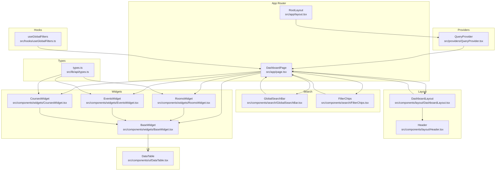
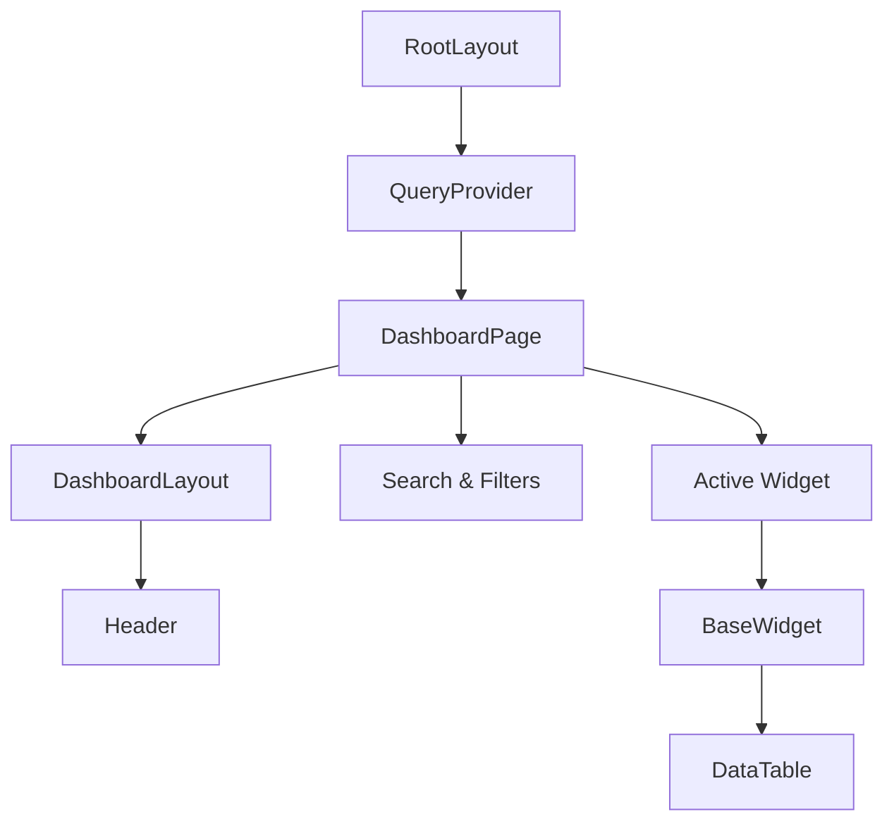
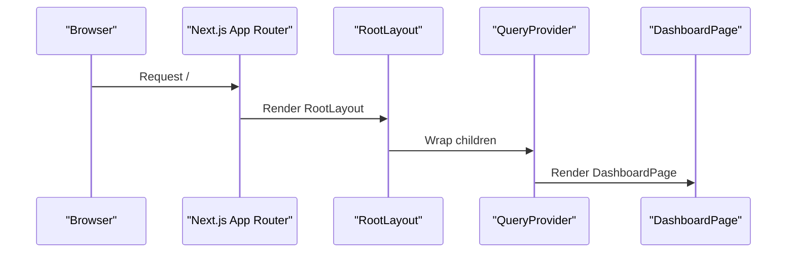
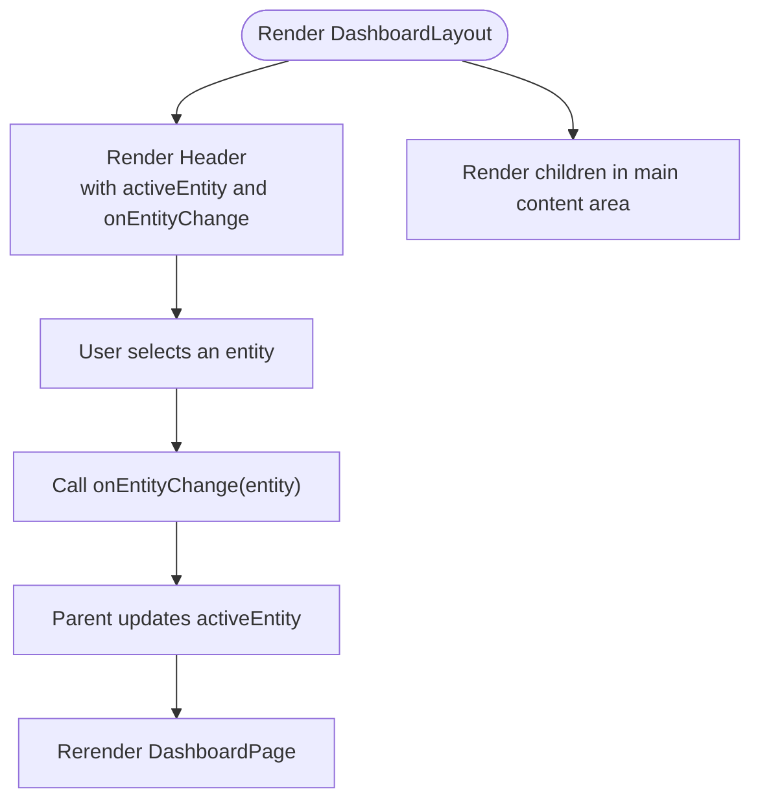
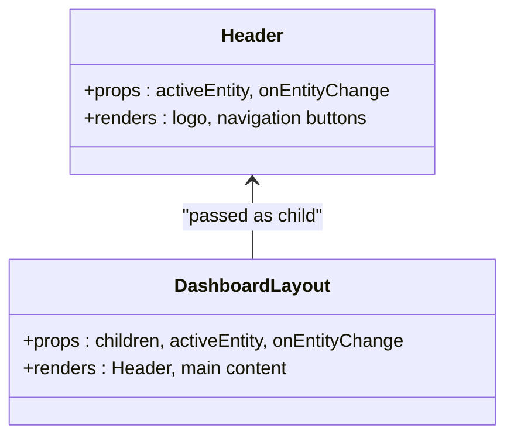
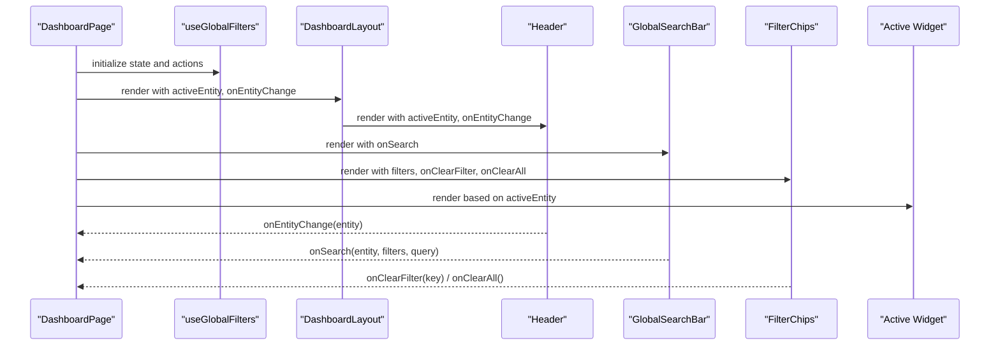
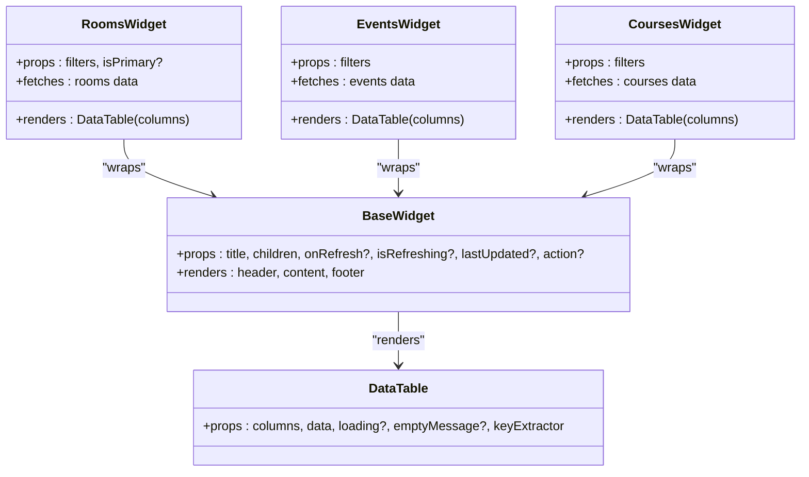
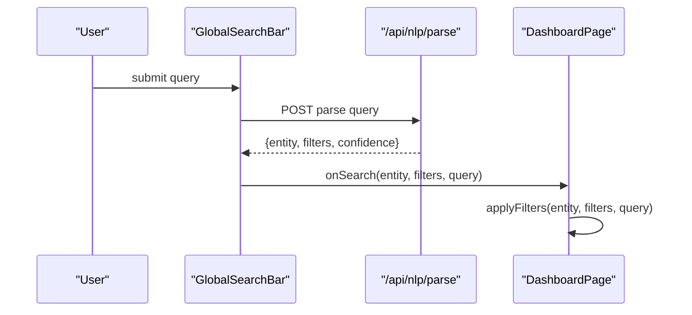
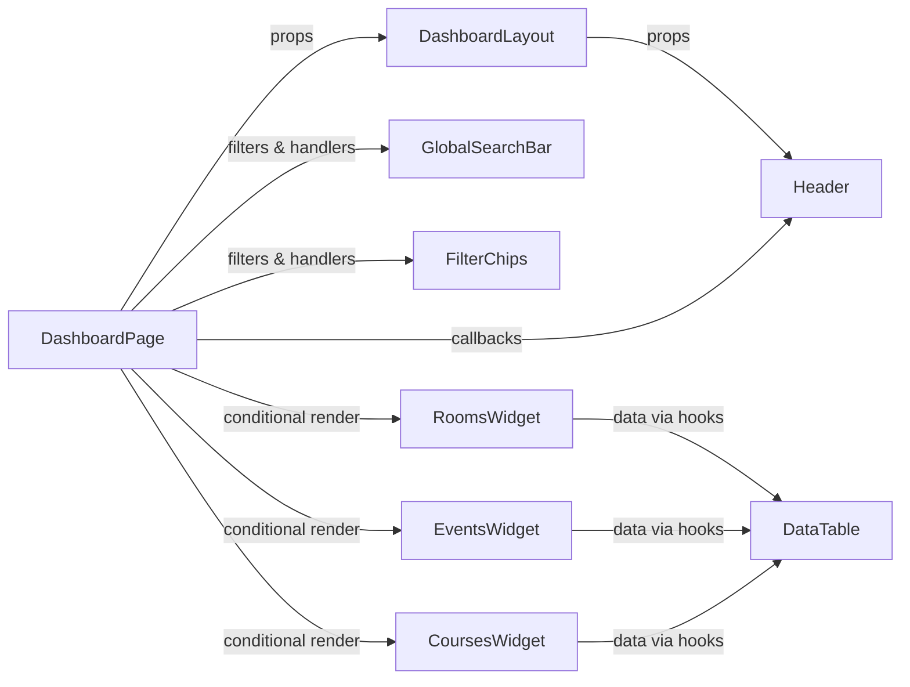

# Component Hierarchy

<cite>
**Referenced Files in This Document**
- [layout.tsx](file://src/app/layout.tsx)
- [page.tsx](file://src/app/page.tsx)
- [DashboardLayout.tsx](file://src/components/layout/DashboardLayout.tsx)
- [Header.tsx](file://src/components/layout/Header.tsx)
- [BaseWidget.tsx](file://src/components/widgets/BaseWidget.tsx)
- [RoomsWidget.tsx](file://src/components/widgets/RoomsWidget.tsx)
- [EventsWidget.tsx](file://src/components/widgets/EventsWidget.tsx)
- [CoursesWidget.tsx](file://src/components/widgets/CoursesWidget.tsx)
- [GlobalSearchBar.tsx](file://src/components/search/GlobalSearchBar.tsx)
- [FilterChips.tsx](file://src/components/search/FilterChips.tsx)
- [DataTable.tsx](file://src/components/ui/DataTable.tsx)
- [useGlobalFilters.ts](file://src/hooks/useGlobalFilters.ts)
- [QueryProvider.tsx](file://src/providers/QueryProvider.tsx)
- [types.ts](file://src/lib/api/types.ts)
</cite>

## Table of Contents
1. [Introduction](#introduction)
2. [Project Structure](#project-structure)
3. [Core Components](#core-components)
4. [Architecture Overview](#architecture-overview)
5. [Detailed Component Analysis](#detailed-component-analysis)
6. [Dependency Analysis](#dependency-analysis)
7. [Performance Considerations](#performance-considerations)
8. [Troubleshooting Guide](#troubleshooting-guide)
9. [Conclusion](#conclusion)

## Introduction
This document explains Course Puppy’s component hierarchy and architecture, starting from the root layout down to individual widgets. It focuses on how the DashboardLayout acts as the main container, how the Header integrates into the layout system, and how components communicate and compose. It also covers prop drilling prevention, lifecycle management, rendering optimizations, and reusable design patterns.

## Project Structure
The application follows a feature-based component organization under src/components, with dedicated folders for layout, search, UI primitives, and widgets. The Next.js App Router pages define the top-level routes and pass children to the layout system.

**Diagram sources**
- [layout.tsx:21-38](file://src/app/layout.tsx#L21-L38)
- [page.tsx:12-99](file://src/app/page.tsx#L12-L99)
- [DashboardLayout.tsx:12-25](file://src/components/layout/DashboardLayout.tsx#L12-L25)
- [Header.tsx:18-60](file://src/components/layout/Header.tsx#L18-L60)
- [GlobalSearchBar.tsx:13-84](file://src/components/search/GlobalSearchBar.tsx#L13-L84)
- [FilterChips.tsx:23-59](file://src/components/search/FilterChips.tsx#L23-L59)
- [BaseWidget.tsx:15-57](file://src/components/widgets/BaseWidget.tsx#L15-L57)
- [RoomsWidget.tsx:15-96](file://src/components/widgets/RoomsWidget.tsx#L15-L96)
- [EventsWidget.tsx:15-115](file://src/components/widgets/EventsWidget.tsx#L15-L115)
- [CoursesWidget.tsx:15-120](file://src/components/widgets/CoursesWidget.tsx#L15-L120)
- [DataTable.tsx:21-80](file://src/components/ui/DataTable.tsx#L21-L80)
- [useGlobalFilters.ts:14-78](file://src/hooks/useGlobalFilters.ts#L14-L78)
- [types.ts:3-99](file://src/lib/api/types.ts#L3-L99)

**Section sources**
- [layout.tsx:1-39](file://src/app/layout.tsx#L1-L39)
- [page.tsx:1-100](file://src/app/page.tsx#L1-L100)

## Core Components
- RootLayout: Provides global HTML wrapper, fonts, and wraps children with QueryProvider.
- DashboardLayout: Main container that renders Header and passes children as the page content area.
- Header: Navigation bar with entity selection and branding.
- DashboardPage: Orchestrates global filters, search, chips, and renders the active widget.
- Widgets: Reusable presentation containers built on BaseWidget, each specialized for a domain entity.
- UI Primitives: DataTable and LoadingSpinner support tabular data rendering and loading states.
- Hooks: useGlobalFilters centralizes state and actions for entity selection and filtering.
- Providers: QueryProvider configures TanStack Query defaults for caching, retries, and refresh intervals.

**Section sources**
- [layout.tsx:21-38](file://src/app/layout.tsx#L21-L38)
- [DashboardLayout.tsx:12-25](file://src/components/layout/DashboardLayout.tsx#L12-L25)
- [Header.tsx:18-60](file://src/components/layout/Header.tsx#L18-L60)
- [page.tsx:12-99](file://src/app/page.tsx#L12-L99)
- [BaseWidget.tsx:15-57](file://src/components/widgets/BaseWidget.tsx#L15-L57)
- [DataTable.tsx:21-80](file://src/components/ui/DataTable.tsx#L21-L80)
- [useGlobalFilters.ts:14-78](file://src/hooks/useGlobalFilters.ts#L14-L78)
- [QueryProvider.tsx:15-34](file://src/providers/QueryProvider.tsx#L15-L34)

## Architecture Overview
The component hierarchy centers around RootLayout → DashboardLayout → DashboardPage. DashboardPage composes search, filters, and the active widget. Widgets share a common BaseWidget for consistent headers, actions, and refresh UX. Data fetching is handled via TanStack Query through QueryProvider, and global state is managed by useGlobalFilters.

**Diagram sources**
- [layout.tsx:21-38](file://src/app/layout.tsx#L21-L38)
- [page.tsx:12-99](file://src/app/page.tsx#L12-L99)
- [DashboardLayout.tsx:12-25](file://src/components/layout/DashboardLayout.tsx#L12-L25)
- [Header.tsx:18-60](file://src/components/layout/Header.tsx#L18-L60)
- [BaseWidget.tsx:15-57](file://src/components/widgets/BaseWidget.tsx#L15-L57)
- [DataTable.tsx:21-80](file://src/components/ui/DataTable.tsx#L21-L80)
- [QueryProvider.tsx:15-34](file://src/providers/QueryProvider.tsx#L15-L34)

## Detailed Component Analysis

### RootLayout and Provider Setup
- RootLayout sets up fonts and wraps children with QueryProvider, ensuring all downstream components benefit from shared query caching and refetch behavior.
- QueryProvider initializes a QueryClient with default options including refetch interval, staleTime, retry policy, and retry delay.

**Diagram sources**
- [layout.tsx:21-38](file://src/app/layout.tsx#L21-L38)
- [QueryProvider.tsx:15-34](file://src/providers/QueryProvider.tsx#L15-L34)
- [page.tsx:12-99](file://src/app/page.tsx#L12-L99)

**Section sources**
- [layout.tsx:21-38](file://src/app/layout.tsx#L21-L38)
- [QueryProvider.tsx:15-34](file://src/providers/QueryProvider.tsx#L15-L34)

### DashboardLayout as Main Container
- Purpose: Central container that renders Header and exposes a main content area for page-specific content.
- Props: Accepts activeEntity and onEntityChange to coordinate navigation state with the Header.
- Composition: Renders children inside a container with padding and spacing.

**Diagram sources**
- [DashboardLayout.tsx:12-25](file://src/components/layout/DashboardLayout.tsx#L12-L25)
- [Header.tsx:18-60](file://src/components/layout/Header.tsx#L18-L60)
- [page.tsx:12-99](file://src/app/page.tsx#L12-L99)

**Section sources**
- [DashboardLayout.tsx:12-25](file://src/components/layout/DashboardLayout.tsx#L12-L25)

### Header Component and Layout Integration
- Role: Provides entity navigation (Rooms, Events, Courses) with icons and active state styling.
- Props: Receives activeEntity and onEntityChange to reflect current selection and propagate changes.
- Integration: Passed into DashboardLayout so the layout remains generic while the header controls navigation.

**Diagram sources**
- [Header.tsx:18-60](file://src/components/layout/Header.tsx#L18-L60)
- [DashboardLayout.tsx:12-25](file://src/components/layout/DashboardLayout.tsx#L12-L25)

**Section sources**
- [Header.tsx:18-60](file://src/components/layout/Header.tsx#L18-L60)
- [DashboardLayout.tsx:12-25](file://src/components/layout/DashboardLayout.tsx#L12-L25)

### DashboardPage: Orchestration and Composition
- Responsibilities:
  - Manages global filters and active entity via useGlobalFilters.
  - Renders search bar and filter chips.
  - Conditionally renders the active widget (Rooms, Events, or Courses).
  - Passes filters and callbacks to child components.
- Communication:
  - Propagates activeEntity and onEntityChange to DashboardLayout.
  - Passes filters and handlers to GlobalSearchBar and FilterChips.
  - Uses conditional rendering to switch widgets based on activeEntity.

**Diagram sources**
- [page.tsx:12-99](file://src/app/page.tsx#L12-L99)
- [useGlobalFilters.ts:14-78](file://src/hooks/useGlobalFilters.ts#L14-L78)
- [DashboardLayout.tsx:12-25](file://src/components/layout/DashboardLayout.tsx#L12-L25)
- [Header.tsx:18-60](file://src/components/layout/Header.tsx#L18-L60)
- [GlobalSearchBar.tsx:13-84](file://src/components/search/GlobalSearchBar.tsx#L13-L84)
- [FilterChips.tsx:23-59](file://src/components/search/FilterChips.tsx#L23-L59)

**Section sources**
- [page.tsx:12-99](file://src/app/page.tsx#L12-L99)
- [useGlobalFilters.ts:14-78](file://src/hooks/useGlobalFilters.ts#L14-L78)

### Widgets and BaseWidget Pattern
- BaseWidget: Provides a consistent header with title, optional action slot, refresh button, and footer with last-updated timestamp.
- RoomsWidget, EventsWidget, CoursesWidget: Specialized widgets that:
  - Fetch data using entity-specific hooks.
  - Define columns for their domain.
  - Render data via DataTable.
  - Handle errors and loading states.
- Reusability: All widgets wrap their content in BaseWidget, ensuring uniform UX and reducing duplication.

**Diagram sources**
- [BaseWidget.tsx:15-57](file://src/components/widgets/BaseWidget.tsx#L15-L57)
- [RoomsWidget.tsx:15-96](file://src/components/widgets/RoomsWidget.tsx#L15-L96)
- [EventsWidget.tsx:15-115](file://src/components/widgets/EventsWidget.tsx#L15-L115)
- [CoursesWidget.tsx:15-120](file://src/components/widgets/CoursesWidget.tsx#L15-L120)
- [DataTable.tsx:21-80](file://src/components/ui/DataTable.tsx#L21-L80)

**Section sources**
- [BaseWidget.tsx:15-57](file://src/components/widgets/BaseWidget.tsx#L15-L57)
- [RoomsWidget.tsx:15-96](file://src/components/widgets/RoomsWidget.tsx#L15-L96)
- [EventsWidget.tsx:15-115](file://src/components/widgets/EventsWidget.tsx#L15-L115)
- [CoursesWidget.tsx:15-120](file://src/components/widgets/CoursesWidget.tsx#L15-L120)
- [DataTable.tsx:21-80](file://src/components/ui/DataTable.tsx#L21-L80)

### Search and Filter Components
- GlobalSearchBar: Submits natural language queries to an NLP endpoint, parses results, and invokes onSearch with inferred entity and filters.
- FilterChips: Displays active filters as removable chips and supports clearing individual or all filters.
- Both components receive callbacks from DashboardPage to update global filters and trigger re-fetches.

**Diagram sources**
- [GlobalSearchBar.tsx:21-54](file://src/components/search/GlobalSearchBar.tsx#L21-L54)
- [page.tsx:24-26](file://src/app/page.tsx#L24-L26)
- [useGlobalFilters.ts:24-37](file://src/hooks/useGlobalFilters.ts#L24-L37)

**Section sources**
- [GlobalSearchBar.tsx:13-84](file://src/components/search/GlobalSearchBar.tsx#L13-L84)
- [FilterChips.tsx:23-59](file://src/components/search/FilterChips.tsx#L23-L59)
- [useGlobalFilters.ts:14-78](file://src/hooks/useGlobalFilters.ts#L14-L78)

## Dependency Analysis
- Parent-to-child props: DashboardPage passes activeEntity and onEntityChange to DashboardLayout; DashboardLayout passes them to Header. DashboardPage also passes filters and handlers to search and chips.
- Child-to-parent callbacks: Header invokes onEntityChange; GlobalSearchBar invokes onSearch; FilterChips invokes onClearFilter/onClearAll.
- Shared state: useGlobalFilters centralizes filters, activeEntity, and searchQuery, preventing prop drilling across multiple levels.
- Data fetching: Widgets rely on entity-specific hooks; TanStack Query is configured globally via QueryProvider.

**Diagram sources**
- [page.tsx:12-99](file://src/app/page.tsx#L12-L99)
- [DashboardLayout.tsx:12-25](file://src/components/layout/DashboardLayout.tsx#L12-L25)
- [Header.tsx:18-60](file://src/components/layout/Header.tsx#L18-L60)
- [GlobalSearchBar.tsx:13-84](file://src/components/search/GlobalSearchBar.tsx#L13-L84)
- [FilterChips.tsx:23-59](file://src/components/search/FilterChips.tsx#L23-L59)
- [RoomsWidget.tsx:15-96](file://src/components/widgets/RoomsWidget.tsx#L15-L96)
- [EventsWidget.tsx:15-115](file://src/components/widgets/EventsWidget.tsx#L15-L115)
- [CoursesWidget.tsx:15-120](file://src/components/widgets/CoursesWidget.tsx#L15-L120)
- [DataTable.tsx:21-80](file://src/components/ui/DataTable.tsx#L21-L80)

**Section sources**
- [page.tsx:12-99](file://src/app/page.tsx#L12-L99)
- [useGlobalFilters.ts:14-78](file://src/hooks/useGlobalFilters.ts#L14-L78)
- [QueryProvider.tsx:15-34](file://src/providers/QueryProvider.tsx#L15-L34)

## Performance Considerations
- Query caching and refetch: QueryProvider sets refetchInterval and staleTime to balance freshness and network usage. Adjust NEXT_PUBLIC_REFRESH_INTERVAL accordingly.
- Conditional rendering: DashboardPage conditionally renders only the active widget, minimizing DOM and re-renders.
- DataTable optimization: DataTable handles loading and empty states efficiently; avoid unnecessary re-renders by passing stable keyExtractor and memoized columns.
- BaseWidget refresh: Widgets expose onRefresh and isRefreshing to prevent concurrent refetches and provide visual feedback.
- Font optimization: RootLayout loads fonts via Next.js to leverage automatic optimization.

**Section sources**
- [QueryProvider.tsx:15-34](file://src/providers/QueryProvider.tsx#L15-L34)
- [page.tsx:57-76](file://src/app/page.tsx#L57-L76)
- [DataTable.tsx:21-80](file://src/components/ui/DataTable.tsx#L21-L80)
- [BaseWidget.tsx:15-57](file://src/components/widgets/BaseWidget.tsx#L15-L57)
- [layout.tsx:6-14](file://src/app/layout.tsx#L6-L14)

## Troubleshooting Guide
- Search parsing failures: GlobalSearchBar falls back to treating the query as a general room search if parsing fails. Inspect console logs for parsing errors.
- Widget error states: Widgets wrapped in BaseWidget display error messages and provide a refresh action; use onRefresh to retry.
- Active entity mismatch: Ensure onEntityChange updates activeEntity consistently; verify that DashboardPage conditionally renders the intended widget.
- Filter persistence: useGlobalFilters maintains separate filter sets per entity; confirm applyFilters targets the correct entity and clears searchQuery when needed.

**Section sources**
- [GlobalSearchBar.tsx:47-53](file://src/components/search/GlobalSearchBar.tsx#L47-L53)
- [CoursesWidget.tsx:89-101](file://src/components/widgets/CoursesWidget.tsx#L89-L101)
- [EventsWidget.tsx:84-96](file://src/components/widgets/EventsWidget.tsx#L84-L96)
- [RoomsWidget.tsx:65-77](file://src/components/widgets/RoomsWidget.tsx#L65-L77)
- [useGlobalFilters.ts:24-49](file://src/hooks/useGlobalFilters.ts#L24-L49)

## Conclusion
Course Puppy’s component hierarchy is structured around a clean separation of concerns: RootLayout provides global providers, DashboardLayout offers a reusable container, and DashboardPage orchestrates search, filters, and the active widget. The Header integrates seamlessly with the layout, and the BaseWidget pattern ensures consistent UX across domain-specific widgets. Prop drilling is minimized through useGlobalFilters, while TanStack Query optimizes data fetching and refresh behavior. This modular design promotes reusability, maintainability, and scalability.