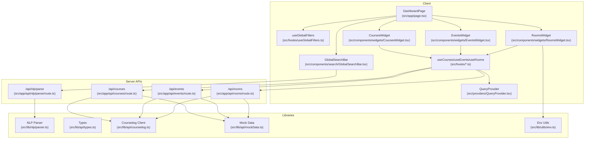
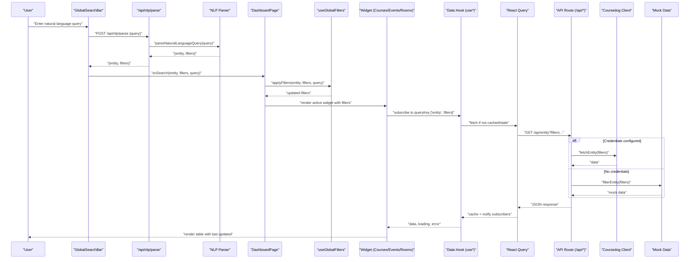
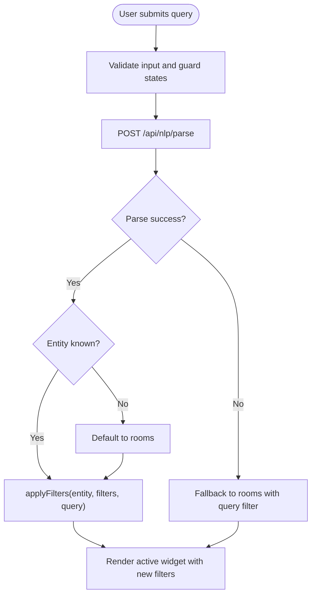
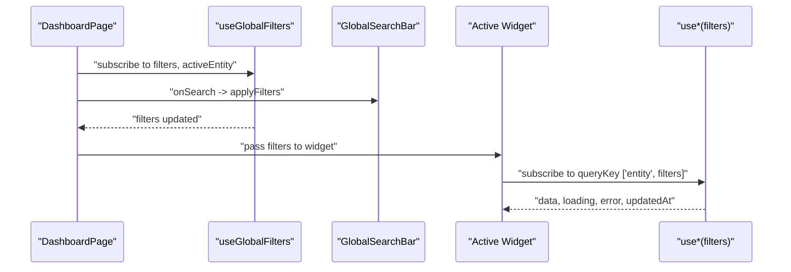
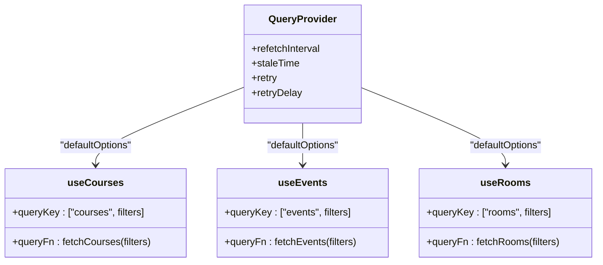
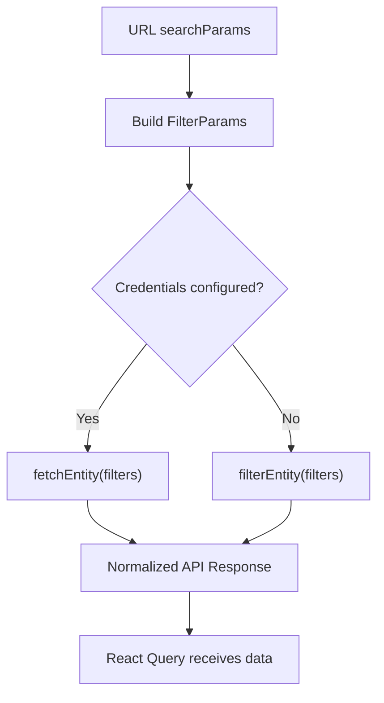
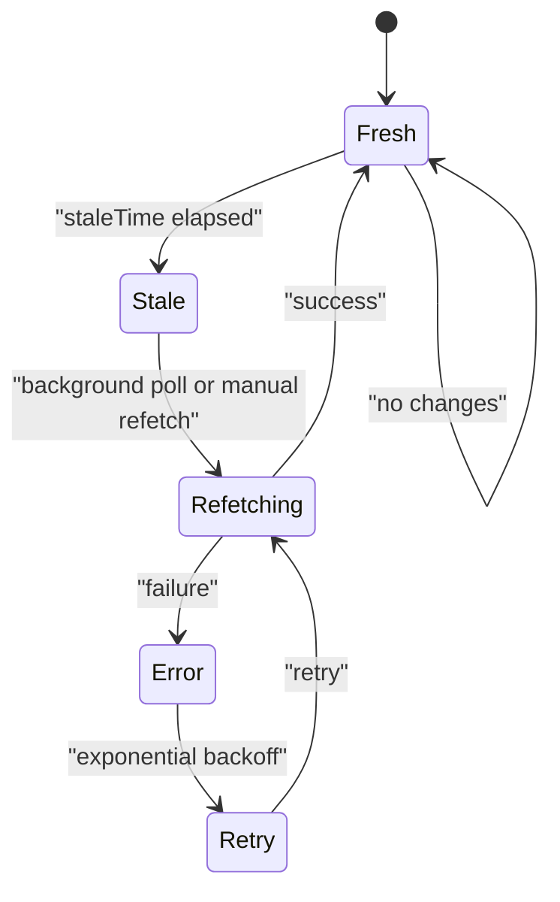
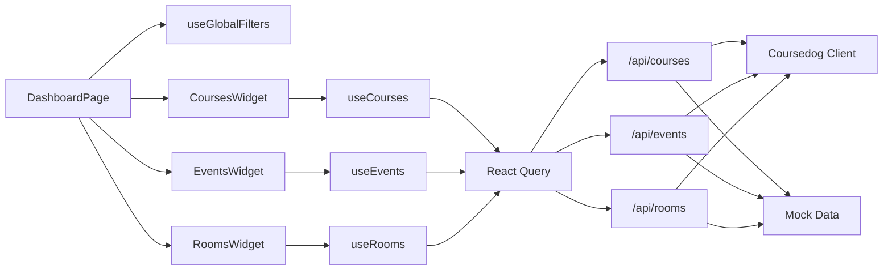

# Data Flow Architecture

<cite>
**Referenced Files in This Document**
- [src/app/page.tsx](file://src/app/page.tsx)
- [src/providers/QueryProvider.tsx](file://src/providers/QueryProvider.tsx)
- [src/hooks/useGlobalFilters.ts](file://src/hooks/useGlobalFilters.ts)
- [src/components/search/GlobalSearchBar.tsx](file://src/components/search/GlobalSearchBar.tsx)
- [src/app/api/nlp/parse/route.ts](file://src/app/api/nlp/parse/route.ts)
- [src/lib/nlp/parser.ts](file://src/lib/nlp/parser.ts)
- [src/app/api/courses/route.ts](file://src/app/api/courses/route.ts)
- [src/app/api/events/route.ts](file://src/app/api/events/route.ts)
- [src/app/api/rooms/route.ts](file://src/app/api/rooms/route.ts)
- [src/hooks/useCourses.ts](file://src/hooks/useCourses.ts)
- [src/hooks/useEvents.ts](file://src/hooks/useEvents.ts)
- [src/hooks/useRooms.ts](file://src/hooks/useRooms.ts)
- [src/components/widgets/CoursesWidget.tsx](file://src/components/widgets/CoursesWidget.tsx)
- [src/components/widgets/EventsWidget.tsx](file://src/components/widgets/EventsWidget.tsx)
- [src/components/widgets/RoomsWidget.tsx](file://src/components/widgets/RoomsWidget.tsx)
- [src/lib/api/types.ts](file://src/lib/api/types.ts)
- [src/lib/api/coursedog.ts](file://src/lib/api/coursedog.ts)
- [src/lib/api/mockData.ts](file://src/lib/api/mockData.ts)
- [src/lib/utils/env.ts](file://src/lib/utils/env.ts)
</cite>

## Table of Contents
1. [Introduction](#introduction)
2. [Project Structure](#project-structure)
3. [Core Components](#core-components)
4. [Architecture Overview](#architecture-overview)
5. [Detailed Component Analysis](#detailed-component-analysis)
6. [Dependency Analysis](#dependency-analysis)
7. [Performance Considerations](#performance-considerations)
8. [Troubleshooting Guide](#troubleshooting-guide)
9. [Conclusion](#conclusion)

## Introduction
This document explains Course Puppy’s data flow architecture from user interactions to API integration and state management. It covers:
- Natural language processing (NLP) parsing pipeline and fallback behavior
- Filter propagation from the global search bar through global filters to API requests
- React Query cache management and server state synchronization
- Real-time update mechanisms via background polling
- Data transformation and error handling strategies
- Loading state management and performance optimizations

## Project Structure
The application follows a clear separation of concerns:
- UI pages and widgets under src/app and src/components/widgets
- Shared state and caching under src/providers and src/hooks
- API routes under src/app/api/*
- Utilities for NLP, API integrations, and environment checks under src/lib/*

**Diagram sources**
- [src/app/page.tsx:12-99](file://src/app/page.tsx#L12-L99)
- [src/components/search/GlobalSearchBar.tsx:13-84](file://src/components/search/GlobalSearchBar.tsx#L13-L84)
- [src/hooks/useGlobalFilters.ts:14-78](file://src/hooks/useGlobalFilters.ts#L14-L78)
- [src/providers/QueryProvider.tsx:15-34](file://src/providers/QueryProvider.tsx#L15-L34)
- [src/components/widgets/CoursesWidget.tsx:14-120](file://src/components/widgets/CoursesWidget.tsx#L14-L120)
- [src/components/widgets/EventsWidget.tsx:14-115](file://src/components/widgets/EventsWidget.tsx#L14-L115)
- [src/components/widgets/RoomsWidget.tsx:16-98](file://src/components/widgets/RoomsWidget.tsx#L16-L98)
- [src/hooks/useCourses.ts:25-30](file://src/hooks/useCourses.ts#L25-L30)
- [src/hooks/useEvents.ts:25-30](file://src/hooks/useEvents.ts#L25-L30)
- [src/hooks/useRooms.ts:25-30](file://src/hooks/useRooms.ts#L25-L30)
- [src/app/api/nlp/parse/route.ts:5-29](file://src/app/api/nlp/parse/route.ts#L5-L29)
- [src/app/api/courses/route.ts:13-75](file://src/app/api/courses/route.ts#L13-L75)
- [src/app/api/events/route.ts:13-79](file://src/app/api/events/route.ts#L13-L79)
- [src/app/api/rooms/route.ts:13-78](file://src/app/api/rooms/route.ts#L13-L78)
- [src/lib/nlp/parser.ts](file://src/lib/nlp/parser.ts)
- [src/lib/api/types.ts](file://src/lib/api/types.ts)
- [src/lib/api/coursedog.ts](file://src/lib/api/coursedog.ts)
- [src/lib/api/mockData.ts](file://src/lib/api/mockData.ts)
- [src/lib/utils/env.ts](file://src/lib/utils/env.ts)

**Section sources**
- [src/app/page.tsx:12-99](file://src/app/page.tsx#L12-L99)
- [src/providers/QueryProvider.tsx:15-34](file://src/providers/QueryProvider.tsx#L15-L34)

## Core Components
- Global search and filter orchestration:
  - GlobalSearchBar captures user input, triggers NLP parsing, and invokes the parent callback with parsed filters and entity.
  - useGlobalFilters maintains a global filter state scoped per entity and exposes actions to apply, clear, and query filters.
- Widgets and data hooks:
  - CoursesWidget, EventsWidget, and RoomsWidget consume their respective data hooks (useCourses, useEvents, useRooms) to render paginated, filtered lists.
  - Each hook wraps a React Query query keyed by entity and current filters, enabling cache reuse and background refresh.
- API routes:
  - /api/nlp/parse parses natural language queries and returns structured filters and target entity.
  - /api/courses, /api/events, /api/rooms accept query parameters derived from filters, delegate to Coursedog client when configured, otherwise fall back to mock data.
- Provider and caching:
  - QueryProvider configures React Query defaults including refetch interval, staleTime, retries, and retry delays.

**Section sources**
- [src/components/search/GlobalSearchBar.tsx:13-84](file://src/components/search/GlobalSearchBar.tsx#L13-L84)
- [src/hooks/useGlobalFilters.ts:14-78](file://src/hooks/useGlobalFilters.ts#L14-L78)
- [src/components/widgets/CoursesWidget.tsx:14-120](file://src/components/widgets/CoursesWidget.tsx#L14-L120)
- [src/components/widgets/EventsWidget.tsx:14-115](file://src/components/widgets/EventsWidget.tsx#L14-L115)
- [src/components/widgets/RoomsWidget.tsx:16-98](file://src/components/widgets/RoomsWidget.tsx#L16-L98)
- [src/hooks/useCourses.ts:25-30](file://src/hooks/useCourses.ts#L25-L30)
- [src/hooks/useEvents.ts:25-30](file://src/hooks/useEvents.ts#L25-L30)
- [src/hooks/useRooms.ts:25-30](file://src/hooks/useRooms.ts#L25-L30)
- [src/app/api/nlp/parse/route.ts:5-29](file://src/app/api/nlp/parse/route.ts#L5-L29)
- [src/app/api/courses/route.ts:13-75](file://src/app/api/courses/route.ts#L13-L75)
- [src/app/api/events/route.ts:13-79](file://src/app/api/events/route.ts#L13-L79)
- [src/app/api/rooms/route.ts:13-78](file://src/app/api/rooms/route.ts#L13-L78)
- [src/providers/QueryProvider.tsx:15-34](file://src/providers/QueryProvider.tsx#L15-L34)

## Architecture Overview
The end-to-end data flow:
1. User enters a natural language query in GlobalSearchBar.
2. The client posts the query to /api/nlp/parse, which delegates to the NLP parser.
3. The API returns parsed filters and target entity; the client updates global filters accordingly.
4. The active widget’s data hook (useCourses/useEvents/useRooms) triggers a React Query fetch with the current filters.
5. The API route builds FilterParams from query string, optionally calls the Coursedog client, and falls back to mock data if credentials are missing.
6. React Query caches the response; background polling keeps it fresh according to provider configuration.

**Diagram sources**
- [src/components/search/GlobalSearchBar.tsx:21-54](file://src/components/search/GlobalSearchBar.tsx#L21-L54)
- [src/app/api/nlp/parse/route.ts:5-29](file://src/app/api/nlp/parse/route.ts#L5-L29)
- [src/lib/nlp/parser.ts](file://src/lib/nlp/parser.ts)
- [src/app/page.tsx:24-36](file://src/app/page.tsx#L24-L36)
- [src/hooks/useGlobalFilters.ts:24-37](file://src/hooks/useGlobalFilters.ts#L24-L37)
- [src/components/widgets/CoursesWidget.tsx:14-120](file://src/components/widgets/CoursesWidget.tsx#L14-L120)
- [src/hooks/useCourses.ts:6-23](file://src/hooks/useCourses.ts#L6-L23)
- [src/app/api/courses/route.ts:13-75](file://src/app/api/courses/route.ts#L13-L75)
- [src/lib/api/coursedog.ts](file://src/lib/api/coursedog.ts)
- [src/lib/api/mockData.ts](file://src/lib/api/mockData.ts)

## Detailed Component Analysis

### Global Search and NLP Parsing Pipeline
- GlobalSearchBar:
  - Prevents concurrent submissions and toggles a parsing state while awaiting the NLP endpoint.
  - On success, determines the target entity (defaulting to rooms if unknown) and calls the parent onSearch handler.
  - On failure, logs the error and falls back to treating the query as a general text search against rooms.
- NLP API route:
  - Validates the incoming request payload and delegates to the NLP parser.
  - Returns structured results or a 500 error with a message.
- useGlobalFilters:
  - Centralized state for filters per entity, active entity, and search query.
  - Provides setters to apply, clear, and clear specific filters, plus a getter for active filters.

**Diagram sources**
- [src/components/search/GlobalSearchBar.tsx:21-54](file://src/components/search/GlobalSearchBar.tsx#L21-L54)
- [src/app/api/nlp/parse/route.ts:5-29](file://src/app/api/nlp/parse/route.ts#L5-L29)
- [src/hooks/useGlobalFilters.ts:24-37](file://src/hooks/useGlobalFilters.ts#L24-L37)

**Section sources**
- [src/components/search/GlobalSearchBar.tsx:13-84](file://src/components/search/GlobalSearchBar.tsx#L13-L84)
- [src/app/api/nlp/parse/route.ts:5-29](file://src/app/api/nlp/parse/route.ts#L5-L29)
- [src/hooks/useGlobalFilters.ts:14-78](file://src/hooks/useGlobalFilters.ts#L14-L78)

### Filter Propagation and Widget Rendering
- DashboardPage:
  - Consumes useGlobalFilters and wires handlers to GlobalSearchBar and FilterChips.
  - Renders the active widget based on activeEntity and passes current filters to it.
- Widget components:
  - CoursesWidget, EventsWidget, RoomsWidget subscribe to their respective data hooks and render a data table with status badges and metadata.
  - They surface last updated timestamps and expose a manual refresh action via the hook’s refetch function.

**Diagram sources**
- [src/app/page.tsx:12-99](file://src/app/page.tsx#L12-L99)
- [src/hooks/useGlobalFilters.ts:14-78](file://src/hooks/useGlobalFilters.ts#L14-L78)
- [src/components/widgets/CoursesWidget.tsx:14-120](file://src/components/widgets/CoursesWidget.tsx#L14-L120)
- [src/components/widgets/EventsWidget.tsx:14-115](file://src/components/widgets/EventsWidget.tsx#L14-L115)
- [src/components/widgets/RoomsWidget.tsx:16-98](file://src/components/widgets/RoomsWidget.tsx#L16-L98)

**Section sources**
- [src/app/page.tsx:12-99](file://src/app/page.tsx#L12-L99)
- [src/components/widgets/CoursesWidget.tsx:14-120](file://src/components/widgets/CoursesWidget.tsx#L14-L120)
- [src/components/widgets/EventsWidget.tsx:14-115](file://src/components/widgets/EventsWidget.tsx#L14-L115)
- [src/components/widgets/RoomsWidget.tsx:16-98](file://src/components/widgets/RoomsWidget.tsx#L16-L98)

### React Query Cache Management and Server State Synchronization
- QueryProvider:
  - Sets a default refetch interval from an environment variable, a 1-minute staleTime, and exponential backoff retries.
  - Ensures automatic background refresh without manual intervention.
- Data hooks:
  - Each hook defines a queryKey combining the entity and current filters, enabling precise cache partitioning.
  - The fetchers append non-empty filters to the URL and handle HTTP errors by throwing descriptive errors.
- Widget integration:
  - Widgets receive isLoading, error, data, and dataUpdatedAt from the hooks, allowing consistent loading and error UI and accurate “last updated” timestamps.

**Diagram sources**
- [src/providers/QueryProvider.tsx:15-34](file://src/providers/QueryProvider.tsx#L15-L34)
- [src/hooks/useCourses.ts:25-30](file://src/hooks/useCourses.ts#L25-L30)
- [src/hooks/useEvents.ts:25-30](file://src/hooks/useEvents.ts#L25-L30)
- [src/hooks/useRooms.ts:25-30](file://src/hooks/useRooms.ts#L25-L30)

**Section sources**
- [src/providers/QueryProvider.tsx:15-34](file://src/providers/QueryProvider.tsx#L15-L34)
- [src/hooks/useCourses.ts:6-23](file://src/hooks/useCourses.ts#L6-L23)
- [src/hooks/useEvents.ts:6-23](file://src/hooks/useEvents.ts#L6-L23)
- [src/hooks/useRooms.ts:6-23](file://src/hooks/useRooms.ts#L6-L23)
- [src/components/widgets/CoursesWidget.tsx:14-120](file://src/components/widgets/CoursesWidget.tsx#L14-L120)
- [src/components/widgets/EventsWidget.tsx:14-115](file://src/components/widgets/EventsWidget.tsx#L14-L115)
- [src/components/widgets/RoomsWidget.tsx:16-98](file://src/components/widgets/RoomsWidget.tsx#L16-L98)

### API Layer: Filter Transformation and Fallback Behavior
- API routes:
  - Convert URL searchParams into FilterParams, supporting status, room/building, dates, limits, offsets, and free-text query.
  - If credentials are missing or invalid, routes fall back to mock data and still return a normalized response shape.
- Coursedog client:
  - Delegates actual network calls to external services; errors are caught and surfaced to the UI.
- Mock data:
  - Provides deterministic filtering for development and testing scenarios.

**Diagram sources**
- [src/app/api/courses/route.ts:13-75](file://src/app/api/courses/route.ts#L13-L75)
- [src/app/api/events/route.ts:13-79](file://src/app/api/events/route.ts#L13-L79)
- [src/app/api/rooms/route.ts:13-78](file://src/app/api/rooms/route.ts#L13-L78)
- [src/lib/api/coursedog.ts](file://src/lib/api/coursedog.ts)
- [src/lib/api/mockData.ts](file://src/lib/api/mockData.ts)

**Section sources**
- [src/app/api/courses/route.ts:13-75](file://src/app/api/courses/route.ts#L13-L75)
- [src/app/api/events/route.ts:13-79](file://src/app/api/events/route.ts#L13-L79)
- [src/app/api/rooms/route.ts:13-78](file://src/app/api/rooms/route.ts#L13-L78)
- [src/lib/api/coursedog.ts](file://src/lib/api/coursedog.ts)
- [src/lib/api/mockData.ts](file://src/lib/api/mockData.ts)

### Observer Pattern for Automatic Data Refresh and Real-Time Updates
- Background polling:
  - QueryProvider sets refetchInterval globally, causing React Query to periodically re-fetch queries automatically.
- Staleness and cache:
  - staleTime ensures the UI remains responsive while minimizing redundant network calls.
- Manual refresh:
  - Widgets expose a refresh button that calls the hook’s refetch function, immediately updating the cache and UI.

**Diagram sources**
- [src/providers/QueryProvider.tsx:15-34](file://src/providers/QueryProvider.tsx#L15-L34)
- [src/components/widgets/CoursesWidget.tsx:93-101](file://src/components/widgets/CoursesWidget.tsx#L93-L101)
- [src/components/widgets/EventsWidget.tsx:84-96](file://src/components/widgets/EventsWidget.tsx#L84-L96)
- [src/components/widgets/RoomsWidget.tsx:67-79](file://src/components/widgets/RoomsWidget.tsx#L67-L79)

**Section sources**
- [src/providers/QueryProvider.tsx:15-34](file://src/providers/QueryProvider.tsx#L15-L34)
- [src/components/widgets/CoursesWidget.tsx:93-101](file://src/components/widgets/CoursesWidget.tsx#L93-L101)
- [src/components/widgets/EventsWidget.tsx:84-96](file://src/components/widgets/EventsWidget.tsx#L84-L96)
- [src/components/widgets/RoomsWidget.tsx:67-79](file://src/components/widgets/RoomsWidget.tsx#L67-L79)

## Dependency Analysis
- Coupling:
  - DashboardPage depends on useGlobalFilters and widget components.
  - Widgets depend on data hooks; hooks depend on React Query and API routes.
  - API routes depend on the Coursedog client and mock data utilities.
- Cohesion:
  - Each API route encapsulates filter parsing and fallback logic.
  - Data hooks encapsulate query construction and error handling.
- External dependencies:
  - @tanstack/react-query for caching and polling.
  - Environment variables controlling refresh intervals and feature flags.

**Diagram sources**
- [src/app/page.tsx:12-99](file://src/app/page.tsx#L12-L99)
- [src/hooks/useGlobalFilters.ts:14-78](file://src/hooks/useGlobalFilters.ts#L14-L78)
- [src/components/widgets/CoursesWidget.tsx:14-120](file://src/components/widgets/CoursesWidget.tsx#L14-L120)
- [src/components/widgets/EventsWidget.tsx:14-115](file://src/components/widgets/EventsWidget.tsx#L14-L115)
- [src/components/widgets/RoomsWidget.tsx:16-98](file://src/components/widgets/RoomsWidget.tsx#L16-L98)
- [src/hooks/useCourses.ts:25-30](file://src/hooks/useCourses.ts#L25-L30)
- [src/hooks/useEvents.ts:25-30](file://src/hooks/useEvents.ts#L25-L30)
- [src/hooks/useRooms.ts:25-30](file://src/hooks/useRooms.ts#L25-L30)
- [src/app/api/courses/route.ts:13-75](file://src/app/api/courses/route.ts#L13-L75)
- [src/app/api/events/route.ts:13-79](file://src/app/api/events/route.ts#L13-L79)
- [src/app/api/rooms/route.ts:13-78](file://src/app/api/rooms/route.ts#L13-L78)
- [src/lib/api/coursedog.ts](file://src/lib/api/coursedog.ts)
- [src/lib/api/mockData.ts](file://src/lib/api/mockData.ts)

**Section sources**
- [src/app/page.tsx:12-99](file://src/app/page.tsx#L12-L99)
- [src/hooks/useGlobalFilters.ts:14-78](file://src/hooks/useGlobalFilters.ts#L14-L78)
- [src/components/widgets/CoursesWidget.tsx:14-120](file://src/components/widgets/CoursesWidget.tsx#L14-L120)
- [src/components/widgets/EventsWidget.tsx:14-115](file://src/components/widgets/EventsWidget.tsx#L14-L115)
- [src/components/widgets/RoomsWidget.tsx:16-98](file://src/components/widgets/RoomsWidget.tsx#L16-L98)
- [src/hooks/useCourses.ts:25-30](file://src/hooks/useCourses.ts#L25-L30)
- [src/hooks/useEvents.ts:25-30](file://src/hooks/useEvents.ts#L25-L30)
- [src/hooks/useRooms.ts:25-30](file://src/hooks/useRooms.ts#L25-L30)
- [src/app/api/courses/route.ts:13-75](file://src/app/api/courses/route.ts#L13-L75)
- [src/app/api/events/route.ts:13-79](file://src/app/api/events/route.ts#L13-L79)
- [src/app/api/rooms/route.ts:13-78](file://src/app/api/rooms/route.ts#L13-L78)

## Performance Considerations
- Caching strategies:
  - queryKey partitions cache per entity and filters; avoid unnecessary re-renders by memoizing callbacks and using shallow equality where possible.
  - staleTime balances freshness and bandwidth; adjust based on data volatility.
- Background polling:
  - refetchInterval reduces latency for real-time-like updates; tune to environment variable for production.
- Network efficiency:
  - Only append non-empty filters to reduce query string noise.
  - Normalize API responses to minimize client-side transformations.
- Error resilience:
  - Exponential backoff prevents thundering herds during outages.
  - Mock fallback ensures UX continuity when external services are unavailable.

[No sources needed since this section provides general guidance]

## Troubleshooting Guide
- NLP parsing failures:
  - The client falls back to rooms with a text query filter; verify the NLP endpoint returns a valid entity and filters.
- API credential issues:
  - When credentials are missing, routes return mock data; confirm environment variables are set and not placeholders.
- React Query errors:
  - Hooks throw descriptive errors on HTTP failures; check the error message and ensure filters are well-formed.
- Widget rendering:
  - Widgets display an error state with a refresh action; use the manual refetch to retry after resolving upstream issues.

**Section sources**
- [src/components/search/GlobalSearchBar.tsx:47-53](file://src/components/search/GlobalSearchBar.tsx#L47-L53)
- [src/app/api/nlp/parse/route.ts:19-28](file://src/app/api/nlp/parse/route.ts#L19-L28)
- [src/app/api/courses/route.ts:56-74](file://src/app/api/courses/route.ts#L56-L74)
- [src/app/api/events/route.ts:62-79](file://src/app/api/events/route.ts#L62-L79)
- [src/app/api/rooms/route.ts:59-77](file://src/app/api/rooms/route.ts#L59-L77)
- [src/hooks/useCourses.ts:17-20](file://src/hooks/useCourses.ts#L17-L20)
- [src/components/widgets/CoursesWidget.tsx:89-102](file://src/components/widgets/CoursesWidget.tsx#L89-L102)

## Conclusion
Course Puppy’s data flow integrates natural language understanding, centralized filtering, robust caching, and resilient API fallbacks. The combination of React Query’s background polling and precise query keys enables efficient, real-time-like updates while maintaining a responsive UI. The modular architecture supports easy extension to new entities and filters, and the fallback mechanisms ensure reliability in diverse deployment environments.