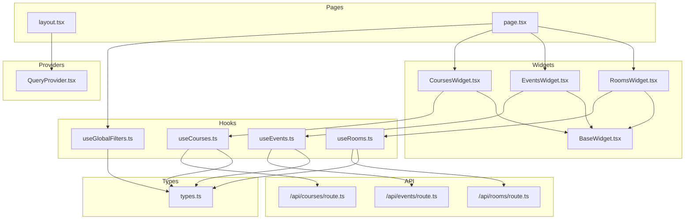
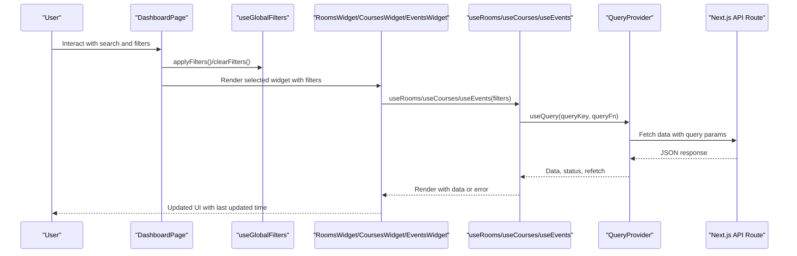
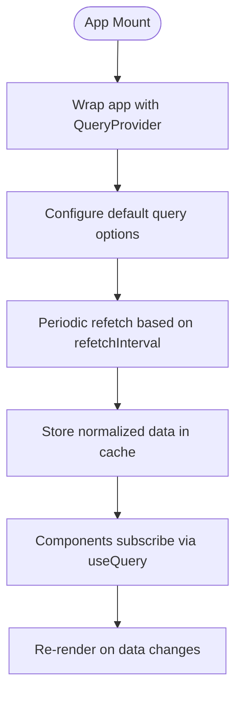
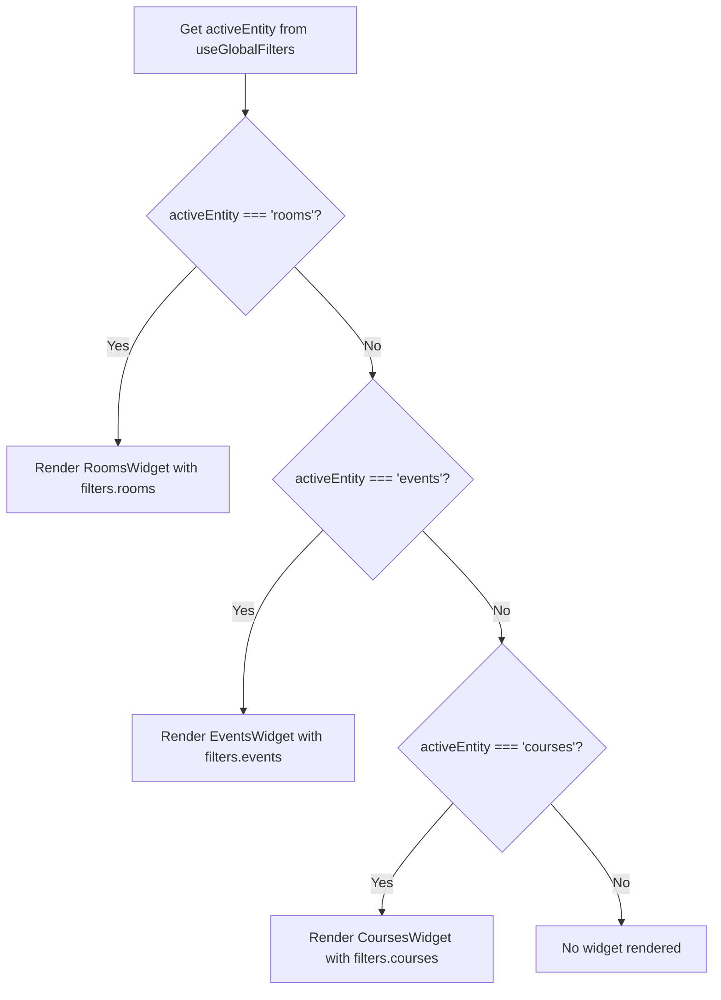
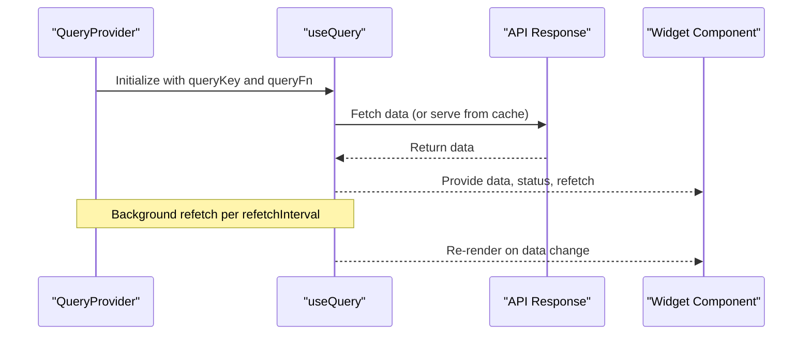
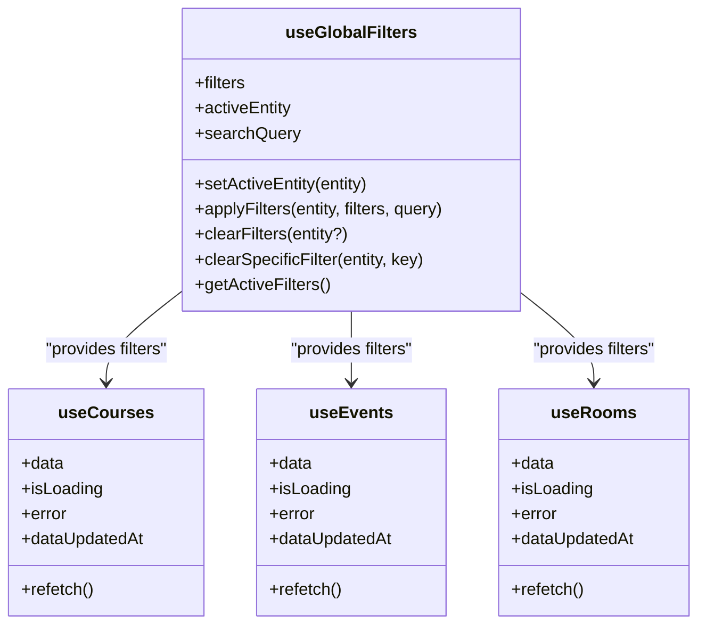
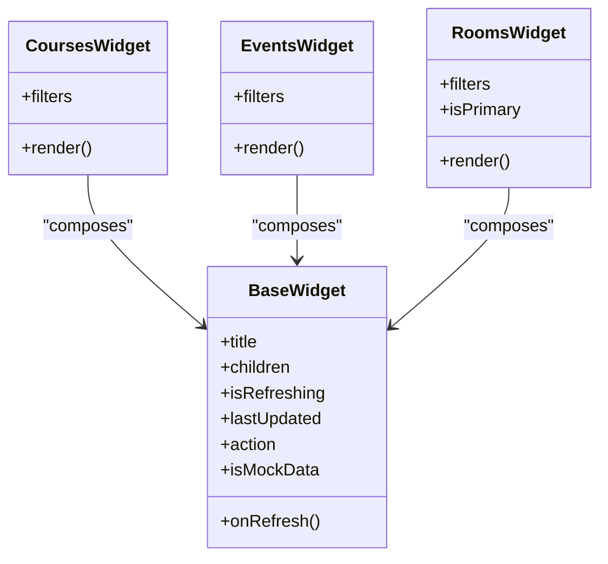
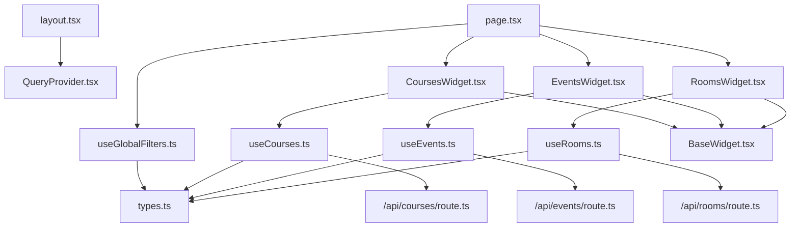

# Design Patterns Implementation

<cite>
**Referenced Files in This Document**
- [src/providers/QueryProvider.tsx](file://src/providers/QueryProvider.tsx)
- [src/hooks/useCourses.ts](file://src/hooks/useCourses.ts)
- [src/hooks/useEvents.ts](file://src/hooks/useEvents.ts)
- [src/hooks/useRooms.ts](file://src/hooks/useRooms.ts)
- [src/hooks/useGlobalFilters.ts](file://src/hooks/useGlobalFilters.ts)
- [src/components/widgets/BaseWidget.tsx](file://src/components/widgets/BaseWidget.tsx)
- [src/components/widgets/CoursesWidget.tsx](file://src/components/widgets/CoursesWidget.tsx)
- [src/components/widgets/EventsWidget.tsx](file://src/components/widgets/EventsWidget.tsx)
- [src/components/widgets/RoomsWidget.tsx](file://src/components/widgets/RoomsWidget.tsx)
- [src/app/layout.tsx](file://src/app/layout.tsx)
- [src/app/page.tsx](file://src/app/page.tsx)
- [src/lib/api/types.ts](file://src/lib/api/types.ts)
- [src/app/api/courses/route.ts](file://src/app/api/courses/route.ts)
- [src/app/api/events/route.ts](file://src/app/api/events/route.ts)
- [src/app/api/rooms/route.ts](file://src/app/api/rooms/route.ts)
</cite>

## Table of Contents
1. [Introduction](#introduction)
2. [Project Structure](#project-structure)
3. [Core Components](#core-components)
4. [Architecture Overview](#architecture-overview)
5. [Detailed Component Analysis](#detailed-component-analysis)
6. [Dependency Analysis](#dependency-analysis)
7. [Performance Considerations](#performance-considerations)
8. [Troubleshooting Guide](#troubleshooting-guide)
9. [Conclusion](#conclusion)

## Introduction
This document analyzes the design patterns implemented in Course Puppy, focusing on how Provider, Factory, Observer, Hook, and Component Composition patterns collaborate to deliver a scalable and maintainable architecture. The system leverages React Query for global state and caching, custom hooks for encapsulated business logic, a base widget component for reusable UI scaffolding, and a widget composition model for dynamic rendering. These patterns collectively enable automatic data refresh, real-time-like updates, and modular extensibility.

## Project Structure
The application follows a feature-based structure with clear separation of concerns:
- Providers: Global state and caching via React Query
- Hooks: Encapsulated data fetching and state logic
- Widgets: Reusable UI components with shared behavior
- Pages: Orchestration of filters, widgets, and layout
- API Routes: Data access layer with fallback to mock data

**Diagram sources**
- [src/providers/QueryProvider.tsx:1-35](file://src/providers/QueryProvider.tsx#L1-L35)
- [src/hooks/useGlobalFilters.ts:1-79](file://src/hooks/useGlobalFilters.ts#L1-L79)
- [src/hooks/useCourses.ts:1-31](file://src/hooks/useCourses.ts#L1-L31)
- [src/hooks/useEvents.ts:1-31](file://src/hooks/useEvents.ts#L1-L31)
- [src/hooks/useRooms.ts:1-31](file://src/hooks/useRooms.ts#L1-L31)
- [src/components/widgets/BaseWidget.tsx:1-68](file://src/components/widgets/BaseWidget.tsx#L1-L68)
- [src/components/widgets/CoursesWidget.tsx:1-125](file://src/components/widgets/CoursesWidget.tsx#L1-L125)
- [src/components/widgets/EventsWidget.tsx:1-120](file://src/components/widgets/EventsWidget.tsx#L1-L120)
- [src/components/widgets/RoomsWidget.tsx:1-101](file://src/components/widgets/RoomsWidget.tsx#L1-L101)
- [src/app/layout.tsx:1-39](file://src/app/layout.tsx#L1-L39)
- [src/app/page.tsx:1-100](file://src/app/page.tsx#L1-L100)
- [src/lib/api/types.ts:1-99](file://src/lib/api/types.ts#L1-L99)
- [src/app/api/courses/route.ts:1-76](file://src/app/api/courses/route.ts#L1-L76)
- [src/app/api/events/route.ts:1-81](file://src/app/api/events/route.ts#L1-L81)
- [src/app/api/rooms/route.ts:1-79](file://src/app/api/rooms/route.ts#L1-L79)

**Section sources**
- [src/app/layout.tsx:1-39](file://src/app/layout.tsx#L1-L39)
- [src/app/page.tsx:1-100](file://src/app/page.tsx#L1-L100)

## Core Components
This section documents the primary patterns and their implementations:

- Provider Pattern (React Query): Centralized caching and automatic refetching are provided via a top-level provider. It configures default query options including refetch intervals, stale times, and retry behavior.
- Factory Pattern (Widget System): Dynamic rendering of entity-specific widgets is achieved by composing components based on the active entity. The factory-like orchestration selects the appropriate widget component for rooms, events, or courses.
- Observer Pattern (Automatic Data Refresh): Automatic periodic refetching and reactive UI updates occur through React Query’s observer mechanism. Components subscribe to query keys and re-render when data changes.
- Hook Pattern (Custom Business Logic): Custom hooks encapsulate data fetching, filtering, and state transitions. They expose a simple API to components while managing complexity internally.
- Component Composition (Modularity): BaseWidget provides a shared UI shell, enabling consistent headers, actions, and footers across widgets. Individual widgets focus on entity-specific rendering and column definitions.

**Section sources**
- [src/providers/QueryProvider.tsx:15-34](file://src/providers/QueryProvider.tsx#L15-L34)
- [src/app/page.tsx:56-76](file://src/app/page.tsx#L56-L76)
- [src/hooks/useGlobalFilters.ts:14-78](file://src/hooks/useGlobalFilters.ts#L14-L78)
- [src/hooks/useCourses.ts:25-30](file://src/hooks/useCourses.ts#L25-L30)
- [src/hooks/useEvents.ts:25-30](file://src/hooks/useEvents.ts#L25-L30)
- [src/hooks/useRooms.ts:25-30](file://src/hooks/useRooms.ts#L25-L30)
- [src/components/widgets/BaseWidget.tsx:16-67](file://src/components/widgets/BaseWidget.tsx#L16-L67)

## Architecture Overview
The system architecture integrates global state, data fetching, and UI composition:

**Diagram sources**
- [src/app/page.tsx:12-99](file://src/app/page.tsx#L12-L99)
- [src/hooks/useGlobalFilters.ts:14-78](file://src/hooks/useGlobalFilters.ts#L14-L78)
- [src/components/widgets/RoomsWidget.tsx:16-100](file://src/components/widgets/RoomsWidget.tsx#L16-L100)
- [src/components/widgets/CoursesWidget.tsx:16-124](file://src/components/widgets/CoursesWidget.tsx#L16-L124)
- [src/components/widgets/EventsWidget.tsx:16-119](file://src/components/widgets/EventsWidget.tsx#L16-L119)
- [src/hooks/useRooms.ts:25-30](file://src/hooks/useRooms.ts#L25-L30)
- [src/hooks/useCourses.ts:25-30](file://src/hooks/useCourses.ts#L25-L30)
- [src/hooks/useEvents.ts:25-30](file://src/hooks/useEvents.ts#L25-L30)
- [src/providers/QueryProvider.tsx:15-34](file://src/providers/QueryProvider.tsx#L15-L34)
- [src/app/api/rooms/route.ts:13-78](file://src/app/api/rooms/route.ts#L13-L78)
- [src/app/api/courses/route.ts:13-75](file://src/app/api/courses/route.ts#L13-L75)
- [src/app/api/events/route.ts:13-80](file://src/app/api/events/route.ts#L13-L80)

## Detailed Component Analysis

### Provider Pattern: Global State Management with React Query
- Purpose: Provide a centralized cache and refetching mechanism across the application.
- Implementation: A provider wraps the app and configures default query options such as refetch interval, stale time, retry count, and retry delay.
- Benefits: Reduces duplication, ensures consistent caching behavior, and enables automatic background updates.
- Maintenance: Centralized configuration simplifies tuning of caching and retry policies.

**Diagram sources**
- [src/providers/QueryProvider.tsx:15-34](file://src/providers/QueryProvider.tsx#L15-L34)
- [src/app/layout.tsx:32-34](file://src/app/layout.tsx#L32-L34)

**Section sources**
- [src/providers/QueryProvider.tsx:15-34](file://src/providers/QueryProvider.tsx#L15-L34)
- [src/app/layout.tsx:32-34](file://src/app/layout.tsx#L32-L34)

### Factory Pattern: Dynamic Widget Rendering
- Purpose: Select and render the appropriate widget based on the active entity.
- Implementation: The page orchestrates rendering by checking the active entity and passing filters to the corresponding widget component.
- Benefits: Encourages modularity and easy extension when adding new entities.
- Maintenance: Adding a new entity requires registering a new widget and updating the factory-like selector.

**Diagram sources**
- [src/app/page.tsx:56-76](file://src/app/page.tsx#L56-L76)
- [src/hooks/useGlobalFilters.ts:64-66](file://src/hooks/useGlobalFilters.ts#L64-L66)

**Section sources**
- [src/app/page.tsx:56-76](file://src/app/page.tsx#L56-L76)
- [src/hooks/useGlobalFilters.ts:14-78](file://src/hooks/useGlobalFilters.ts#L14-L78)

### Observer Pattern: Automatic Data Refresh and Real-Time Updates
- Purpose: Keep data fresh and trigger UI updates reactively.
- Implementation: React Query’s observer pattern automatically refetches data at configured intervals and notifies subscribed components when data changes. Components receive loading, error, and updated timestamps.
- Benefits: Transparent caching, background synchronization, and minimal boilerplate for observers.
- Maintenance: Tune refetch intervals and stale times to balance freshness and performance.

**Diagram sources**
- [src/providers/QueryProvider.tsx:15-34](file://src/providers/QueryProvider.tsx#L15-L34)
- [src/hooks/useCourses.ts:25-30](file://src/hooks/useCourses.ts#L25-L30)
- [src/hooks/useEvents.ts:25-30](file://src/hooks/useEvents.ts#L25-L30)
- [src/hooks/useRooms.ts:25-30](file://src/hooks/useRooms.ts#L25-L30)
- [src/components/widgets/CoursesWidget.tsx:16-124](file://src/components/widgets/CoursesWidget.tsx#L16-L124)
- [src/components/widgets/EventsWidget.tsx:16-119](file://src/components/widgets/EventsWidget.tsx#L16-L119)
- [src/components/widgets/RoomsWidget.tsx:17-100](file://src/components/widgets/RoomsWidget.tsx#L17-L100)

**Section sources**
- [src/providers/QueryProvider.tsx:15-34](file://src/providers/QueryProvider.tsx#L15-L34)
- [src/hooks/useCourses.ts:25-30](file://src/hooks/useCourses.ts#L25-L30)
- [src/hooks/useEvents.ts:25-30](file://src/hooks/useEvents.ts#L25-L30)
- [src/hooks/useRooms.ts:25-30](file://src/hooks/useRooms.ts#L25-L30)
- [src/components/widgets/CoursesWidget.tsx:16-124](file://src/components/widgets/CoursesWidget.tsx#L16-L124)
- [src/components/widgets/EventsWidget.tsx:16-119](file://src/components/widgets/EventsWidget.tsx#L16-L119)
- [src/components/widgets/RoomsWidget.tsx:17-100](file://src/components/widgets/RoomsWidget.tsx#L17-L100)

### Hook Pattern: Custom Business Logic Encapsulation
- Purpose: Encapsulate data fetching, filtering, and state transitions behind a simple API.
- Implementation: Custom hooks manage query keys, fetch functions, and error handling. A global filters hook centralizes filter state and exposes mutation methods.
- Benefits: Promotes reuse, reduces component complexity, and improves testability.
- Maintenance: Keep hooks focused on a single responsibility and avoid cross-hook coupling.

**Diagram sources**
- [src/hooks/useGlobalFilters.ts:14-78](file://src/hooks/useGlobalFilters.ts#L14-L78)
- [src/hooks/useCourses.ts:25-30](file://src/hooks/useCourses.ts#L25-L30)
- [src/hooks/useEvents.ts:25-30](file://src/hooks/useEvents.ts#L25-L30)
- [src/hooks/useRooms.ts:25-30](file://src/hooks/useRooms.ts#L25-L30)

**Section sources**
- [src/hooks/useGlobalFilters.ts:14-78](file://src/hooks/useGlobalFilters.ts#L14-L78)
- [src/hooks/useCourses.ts:25-30](file://src/hooks/useCourses.ts#L25-L30)
- [src/hooks/useEvents.ts:25-30](file://src/hooks/useEvents.ts#L25-L30)
- [src/hooks/useRooms.ts:25-30](file://src/hooks/useRooms.ts#L25-L30)

### Component Composition Pattern: Modularity and Reusability
- Purpose: Build consistent UI shells with shared behavior across widgets.
- Implementation: BaseWidget defines a common header, action area, content area, and footer with last-updated timestamps. Entity-specific widgets compose around this shell.
- Benefits: Consistent UX, reduced duplication, and easier theming or behavior changes.
- Maintenance: Changes to the shell propagate across all widgets; keep the base minimal and flexible.

**Diagram sources**
- [src/components/widgets/BaseWidget.tsx:16-67](file://src/components/widgets/BaseWidget.tsx#L16-L67)
- [src/components/widgets/CoursesWidget.tsx:15-124](file://src/components/widgets/CoursesWidget.tsx#L15-L124)
- [src/components/widgets/EventsWidget.tsx:15-119](file://src/components/widgets/EventsWidget.tsx#L15-L119)
- [src/components/widgets/RoomsWidget.tsx:16-100](file://src/components/widgets/RoomsWidget.tsx#L16-L100)

**Section sources**
- [src/components/widgets/BaseWidget.tsx:16-67](file://src/components/widgets/BaseWidget.tsx#L16-L67)
- [src/components/widgets/CoursesWidget.tsx:15-124](file://src/components/widgets/CoursesWidget.tsx#L15-L124)
- [src/components/widgets/EventsWidget.tsx:15-119](file://src/components/widgets/EventsWidget.tsx#L15-L119)
- [src/components/widgets/RoomsWidget.tsx:16-100](file://src/components/widgets/RoomsWidget.tsx#L16-L100)

## Dependency Analysis
The following diagram shows how components depend on each other and on shared resources:

**Diagram sources**
- [src/app/layout.tsx:32-34](file://src/app/layout.tsx#L32-L34)
- [src/app/page.tsx:56-76](file://src/app/page.tsx#L56-L76)
- [src/hooks/useGlobalFilters.ts:14-78](file://src/hooks/useGlobalFilters.ts#L14-L78)
- [src/components/widgets/CoursesWidget.tsx:15-124](file://src/components/widgets/CoursesWidget.tsx#L15-L124)
- [src/components/widgets/EventsWidget.tsx:15-119](file://src/components/widgets/EventsWidget.tsx#L15-L119)
- [src/components/widgets/RoomsWidget.tsx:16-100](file://src/components/widgets/RoomsWidget.tsx#L16-L100)
- [src/hooks/useCourses.ts:25-30](file://src/hooks/useCourses.ts#L25-L30)
- [src/hooks/useEvents.ts:25-30](file://src/hooks/useEvents.ts#L25-L30)
- [src/hooks/useRooms.ts:25-30](file://src/hooks/useRooms.ts#L25-L30)
- [src/app/api/courses/route.ts:13-75](file://src/app/api/courses/route.ts#L13-L75)
- [src/app/api/events/route.ts:13-80](file://src/app/api/events/route.ts#L13-L80)
- [src/app/api/rooms/route.ts:13-78](file://src/app/api/rooms/route.ts#L13-L78)
- [src/components/widgets/BaseWidget.tsx:16-67](file://src/components/widgets/BaseWidget.tsx#L16-L67)
- [src/lib/api/types.ts:64-70](file://src/lib/api/types.ts#L64-L70)

**Section sources**
- [src/app/layout.tsx:32-34](file://src/app/layout.tsx#L32-L34)
- [src/app/page.tsx:56-76](file://src/app/page.tsx#L56-L76)
- [src/hooks/useGlobalFilters.ts:14-78](file://src/hooks/useGlobalFilters.ts#L14-L78)
- [src/components/widgets/BaseWidget.tsx:16-67](file://src/components/widgets/BaseWidget.tsx#L16-L67)
- [src/lib/api/types.ts:64-70](file://src/lib/api/types.ts#L64-L70)

## Performance Considerations
- Caching and Staleness: Configure staleTime and refetchInterval to balance freshness and network usage. Lower intervals improve real-time feel but increase load.
- Retry Strategy: Exponential backoff prevents thundering herds and reduces pressure on upstream APIs.
- Component-Level Loading: Use loading states and skeleton placeholders to maintain responsiveness during refetches.
- Mock Data Fallback: API routes gracefully fall back to mock data when credentials are missing, ensuring continuous operation during development or credential misconfiguration.
- Column Rendering: Avoid heavy computations in render props; memoize or precompute where possible.

[No sources needed since this section provides general guidance]

## Troubleshooting Guide
- No Data Displayed:
  - Verify API credentials are configured; otherwise, mock data is used.
  - Check query keys and filters passed to hooks.
- Frequent Network Requests:
  - Adjust staleTime and refetchInterval in the provider configuration.
- Unexpected Errors:
  - Inspect hook error handling and ensure components render error states.
- Widget Not Updating:
  - Confirm the widget receives updated filters and that refetch is invoked on user actions.

**Section sources**
- [src/app/api/courses/route.ts:42-51](file://src/app/api/courses/route.ts#L42-L51)
- [src/app/api/events/route.ts:49-57](file://src/app/api/events/route.ts#L49-L57)
- [src/app/api/rooms/route.ts:46-54](file://src/app/api/rooms/route.ts#L46-L54)
- [src/providers/QueryProvider.tsx:15-34](file://src/providers/QueryProvider.tsx#L15-L34)
- [src/components/widgets/CoursesWidget.tsx:91-105](file://src/components/widgets/CoursesWidget.tsx#L91-L105)
- [src/components/widgets/EventsWidget.tsx:86-100](file://src/components/widgets/EventsWidget.tsx#L86-L100)
- [src/components/widgets/RoomsWidget.tsx:67-81](file://src/components/widgets/RoomsWidget.tsx#L67-L81)

## Conclusion
Course Puppy’s architecture demonstrates a cohesive blend of Provider, Factory, Observer, Hook, and Component Composition patterns. Together, they enable scalable data management, dynamic UI rendering, and robust real-time-like updates. The Provider pattern centralizes caching and refetching; the Factory pattern simplifies widget orchestration; the Observer pattern ensures reactive updates; the Hook pattern encapsulates business logic; and Component Composition promotes modularity. This combination yields a maintainable, extensible system suitable for evolving requirements.