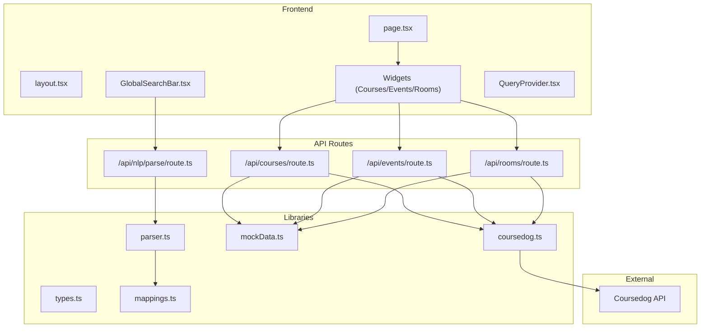
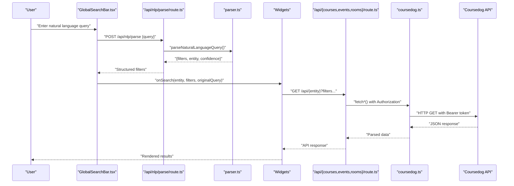
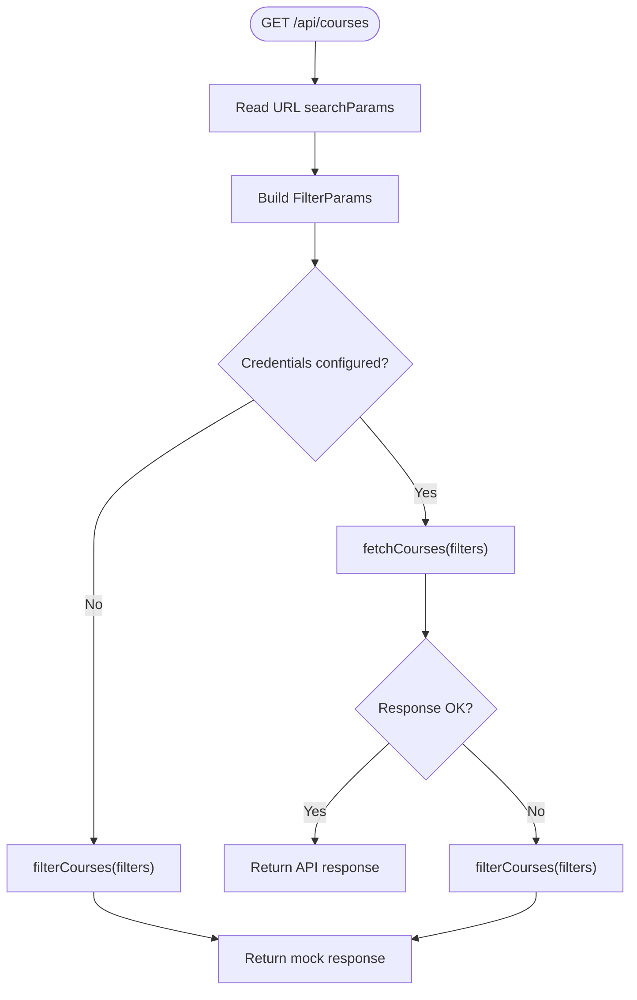
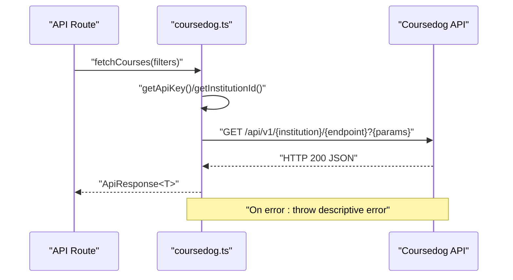
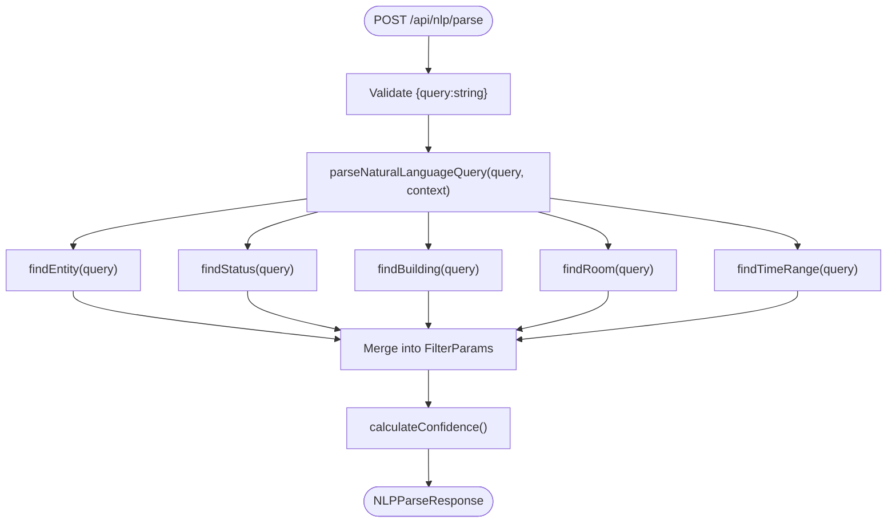
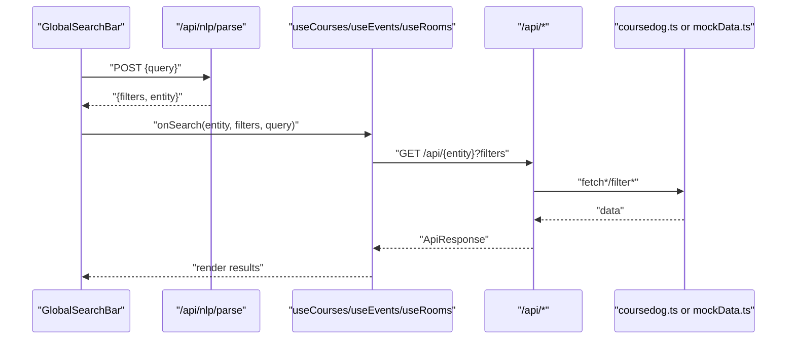
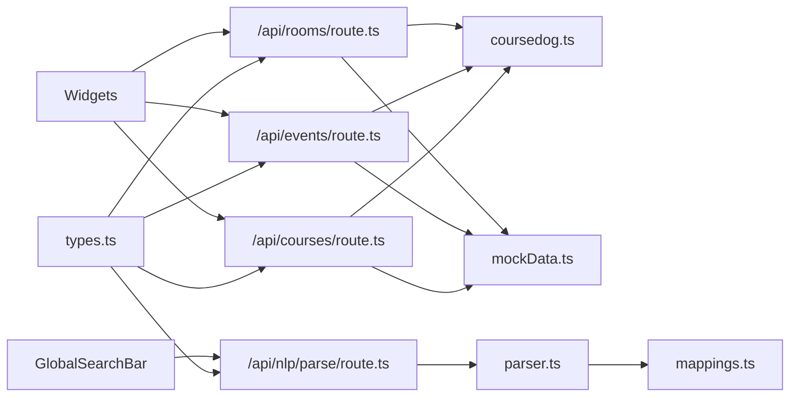
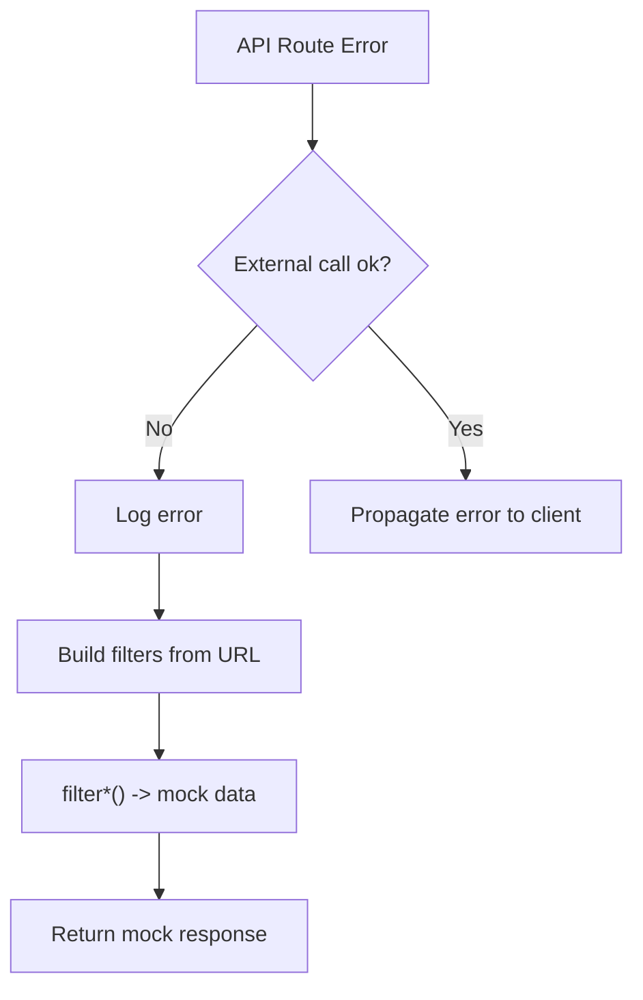

# System Boundaries and Integration

<cite>
**Referenced Files in This Document**
- [README.md](file://README.md)
- [package.json](file://package.json)
- [src/app/layout.tsx](file://src/app/layout.tsx)
- [src/app/page.tsx](file://src/app/page.tsx)
- [src/app/api/courses/route.ts](file://src/app/api/courses/route.ts)
- [src/app/api/events/route.ts](file://src/app/api/events/route.ts)
- [src/app/api/rooms/route.ts](file://src/app/api/rooms/route.ts)
- [src/app/api/nlp/parse/route.ts](file://src/app/api/nlp/parse/route.ts)
- [src/lib/api/types.ts](file://src/lib/api/types.ts)
- [src/lib/api/coursedog.ts](file://src/lib/api/coursedog.ts)
- [src/lib/api/mockData.ts](file://src/lib/api/mockData.ts)
- [src/lib/nlp/parser.ts](file://src/lib/nlp/parser.ts)
- [src/lib/nlp/mappings.ts](file://src/lib/nlp/mappings.ts)
- [src/components/search/GlobalSearchBar.tsx](file://src/components/search/GlobalSearchBar.tsx)
- [src/hooks/useCourses.ts](file://src/hooks/useCourses.ts)
- [src/hooks/useEvents.ts](file://src/hooks/useEvents.ts)
- [src/hooks/useRooms.ts](file://src/hooks/useRooms.ts)
- [src/providers/QueryProvider.tsx](file://src/providers/QueryProvider.tsx)
</cite>

## Table of Contents
1. [Introduction](#introduction)
2. [Project Structure](#project-structure)
3. [Core Components](#core-components)
4. [Architecture Overview](#architecture-overview)
5. [Detailed Component Analysis](#detailed-component-analysis)
6. [Dependency Analysis](#dependency-analysis)
7. [Performance Considerations](#performance-considerations)
8. [Security Considerations](#security-considerations)
9. [Error Handling and Fallback Strategies](#error-handling-and-fallback-strategies)
10. [Extensibility Guidelines](#extensibility-guidelines)
11. [Troubleshooting Guide](#troubleshooting-guide)
12. [Conclusion](#conclusion)

## Introduction
This document describes Course Puppy’s system boundaries and external integrations. It explains how the frontend presentation layer interacts with backend API routes, how the system integrates with the Coursedog external API, and how natural language queries are parsed and routed. It also covers security considerations, data validation at system boundaries, error handling strategies, and guidelines for extending the system while preserving architectural integrity.

## Project Structure
Course Puppy is a Next.js application organized around a strict separation of concerns:
- Frontend presentation layer: React components, UI widgets, and search interfaces.
- Backend API routes: Next.js App Router API handlers under src/app/api/.
- Shared domain models and types: src/lib/api/types.ts.
- External API client: src/lib/api/coursedog.ts.
- Mock data provider: src/lib/api/mockData.ts.
- NLP parser: src/lib/nlp/parser.ts and keyword mappings: src/lib/nlp/mappings.ts.
- Data fetching hooks: src/hooks/useCourses.ts, src/hooks/useEvents.ts, src/hooks/useRooms.ts.
- Query caching provider: src/providers/QueryProvider.tsx.

**Diagram sources**
- [src/app/layout.tsx](file://src/app/layout.tsx)
- [src/app/page.tsx](file://src/app/page.tsx)
- [src/components/search/GlobalSearchBar.tsx](file://src/components/search/GlobalSearchBar.tsx)
- [src/app/api/courses/route.ts](file://src/app/api/courses/route.ts)
- [src/app/api/events/route.ts](file://src/app/api/events/route.ts)
- [src/app/api/rooms/route.ts](file://src/app/api/rooms/route.ts)
- [src/app/api/nlp/parse/route.ts](file://src/app/api/nlp/parse/route.ts)
- [src/lib/api/types.ts](file://src/lib/api/types.ts)
- [src/lib/api/coursedog.ts](file://src/lib/api/coursedog.ts)
- [src/lib/api/mockData.ts](file://src/lib/api/mockData.ts)
- [src/lib/nlp/parser.ts](file://src/lib/nlp/parser.ts)
- [src/lib/nlp/mappings.ts](file://src/lib/nlp/mappings.ts)

**Section sources**
- [README.md](file://README.md)
- [package.json](file://package.json)

## Core Components
- API routes define server-side entry points for courses, events, rooms, and NLP parsing. They validate environment configuration, construct filter parameters from query strings, and either call the external Coursedog API or return mock data.
- The Coursedog client encapsulates authentication and request construction, returning standardized API responses.
- The NLP parser extracts structured filters and entity type from natural language queries.
- React hooks provide typed data fetching with caching and retry behavior.
- The global search bar coordinates NLP parsing and subsequent filtering across entities.

**Section sources**
- [src/app/api/courses/route.ts](file://src/app/api/courses/route.ts)
- [src/app/api/events/route.ts](file://src/app/api/events/route.ts)
- [src/app/api/rooms/route.ts](file://src/app/api/rooms/route.ts)
- [src/app/api/nlp/parse/route.ts](file://src/app/api/nlp/parse/route.ts)
- [src/lib/api/coursedog.ts](file://src/lib/api/coursedog.ts)
- [src/lib/nlp/parser.ts](file://src/lib/nlp/parser.ts)
- [src/hooks/useCourses.ts](file://src/hooks/useCourses.ts)
- [src/hooks/useEvents.ts](file://src/hooks/useEvents.ts)
- [src/hooks/useRooms.ts](file://src/hooks/useRooms.ts)

## Architecture Overview
The system enforces clear boundaries:
- Presentation boundary: React components render UI and orchestrate user interactions.
- API boundary: Next.js API routes accept requests, validate inputs, and delegate to internal libraries.
- Integration boundary: The Coursedog client handles authentication and transport to the external service.
- Processing boundary: The NLP parser transforms natural language into structured filters.

**Diagram sources**
- [src/components/search/GlobalSearchBar.tsx](file://src/components/search/GlobalSearchBar.tsx)
- [src/app/api/nlp/parse/route.ts](file://src/app/api/nlp/parse/route.ts)
- [src/lib/nlp/parser.ts](file://src/lib/nlp/parser.ts)
- [src/app/api/courses/route.ts](file://src/app/api/courses/route.ts)
- [src/app/api/events/route.ts](file://src/app/api/events/route.ts)
- [src/app/api/rooms/route.ts](file://src/app/api/rooms/route.ts)
- [src/lib/api/coursedog.ts](file://src/lib/api/coursedog.ts)

## Detailed Component Analysis

### API Route Architecture and Server-Side Processing
- Courses API route: Reads query parameters, constructs FilterParams, conditionally uses mock data if credentials are missing, otherwise calls the Coursedog client. Includes robust error handling with fallback to mock data.
- Events API route: Mirrors the courses route with additional date-based filters and similar fallback behavior.
- Rooms API route: Similar pattern with room-specific filters and fallback.
- NLP Parse route: Validates request body, delegates to parser, and returns structured filters and entity type.

**Diagram sources**
- [src/app/api/courses/route.ts](file://src/app/api/courses/route.ts)
- [src/lib/api/coursedog.ts](file://src/lib/api/coursedog.ts)
- [src/lib/api/mockData.ts](file://src/lib/api/mockData.ts)

**Section sources**
- [src/app/api/courses/route.ts](file://src/app/api/courses/route.ts)
- [src/app/api/events/route.ts](file://src/app/api/events/route.ts)
- [src/app/api/rooms/route.ts](file://src/app/api/rooms/route.ts)
- [src/app/api/nlp/parse/route.ts](file://src/app/api/nlp/parse/route.ts)

### Coursedog API Integration Patterns
- Authentication: Uses bearer tokens via environment variables for API key and institution ID.
- Request construction: Builds query strings from FilterParams and appends them to institution-scoped endpoints.
- Response handling: Validates HTTP status and parses JSON; throws descriptive errors on failure.
- Fallback behavior: API routes gracefully fall back to mock data when credentials are missing or external calls fail.

**Diagram sources**
- [src/lib/api/coursedog.ts](file://src/lib/api/coursedog.ts)
- [src/app/api/courses/route.ts](file://src/app/api/courses/route.ts)

**Section sources**
- [src/lib/api/coursedog.ts](file://src/lib/api/coursedog.ts)
- [src/app/api/courses/route.ts](file://src/app/api/courses/route.ts)

### Natural Language Processing Boundary
- Input validation: Ensures a non-empty string query is present.
- Parsing: Tokenization, keyword matching against mappings, and extraction of status, building, room, and time range.
- Confidence scoring: Quantifies parsing quality based on detected features.
- Fallback: If entity is unknown, defaults to rooms; if no filters extracted, forwards the raw query as a general search.

**Diagram sources**
- [src/app/api/nlp/parse/route.ts](file://src/app/api/nlp/parse/route.ts)
- [src/lib/nlp/parser.ts](file://src/lib/nlp/parser.ts)
- [src/lib/nlp/mappings.ts](file://src/lib/nlp/mappings.ts)

**Section sources**
- [src/app/api/nlp/parse/route.ts](file://src/app/api/nlp/parse/route.ts)
- [src/lib/nlp/parser.ts](file://src/lib/nlp/parser.ts)
- [src/lib/nlp/mappings.ts](file://src/lib/nlp/mappings.ts)

### Frontend Presentation Layer and Data Fetching
- GlobalSearchBar: Submits queries to the NLP route, handles loading states, and falls back to a general rooms search on error.
- Hooks: useCourses, useEvents, useRooms serialize filters into query strings, call the respective API routes, and surface errors to the UI.
- QueryProvider: Configures caching, retries, and refresh intervals for all data fetching.

**Diagram sources**
- [src/components/search/GlobalSearchBar.tsx](file://src/components/search/GlobalSearchBar.tsx)
- [src/hooks/useCourses.ts](file://src/hooks/useCourses.ts)
- [src/hooks/useEvents.ts](file://src/hooks/useEvents.ts)
- [src/hooks/useRooms.ts](file://src/hooks/useRooms.ts)
- [src/app/api/courses/route.ts](file://src/app/api/courses/route.ts)
- [src/app/api/events/route.ts](file://src/app/api/events/route.ts)
- [src/app/api/rooms/route.ts](file://src/app/api/rooms/route.ts)
- [src/lib/api/coursedog.ts](file://src/lib/api/coursedog.ts)
- [src/lib/api/mockData.ts](file://src/lib/api/mockData.ts)

**Section sources**
- [src/components/search/GlobalSearchBar.tsx](file://src/components/search/GlobalSearchBar.tsx)
- [src/hooks/useCourses.ts](file://src/hooks/useCourses.ts)
- [src/hooks/useEvents.ts](file://src/hooks/useEvents.ts)
- [src/hooks/useRooms.ts](file://src/hooks/useRooms.ts)
- [src/providers/QueryProvider.tsx](file://src/providers/QueryProvider.tsx)

## Dependency Analysis
- API routes depend on shared types and either the Coursedog client or mock data.
- The NLP route depends on the parser, which in turn depends on mappings.
- Frontend hooks depend on API routes and shared types.
- QueryProvider configures caching for all data fetching.

**Diagram sources**
- [src/lib/api/types.ts](file://src/lib/api/types.ts)
- [src/app/api/courses/route.ts](file://src/app/api/courses/route.ts)
- [src/app/api/events/route.ts](file://src/app/api/events/route.ts)
- [src/app/api/rooms/route.ts](file://src/app/api/rooms/route.ts)
- [src/app/api/nlp/parse/route.ts](file://src/app/api/nlp/parse/route.ts)
- [src/lib/api/coursedog.ts](file://src/lib/api/coursedog.ts)
- [src/lib/api/mockData.ts](file://src/lib/api/mockData.ts)
- [src/lib/nlp/parser.ts](file://src/lib/nlp/parser.ts)
- [src/lib/nlp/mappings.ts](file://src/lib/nlp/mappings.ts)

**Section sources**
- [src/lib/api/types.ts](file://src/lib/api/types.ts)
- [src/app/api/courses/route.ts](file://src/app/api/courses/route.ts)
- [src/app/api/events/route.ts](file://src/app/api/events/route.ts)
- [src/app/api/rooms/route.ts](file://src/app/api/rooms/route.ts)
- [src/app/api/nlp/parse/route.ts](file://src/app/api/nlp/parse/route.ts)
- [src/lib/api/coursedog.ts](file://src/lib/api/coursedog.ts)
- [src/lib/api/mockData.ts](file://src/lib/api/mockData.ts)
- [src/lib/nlp/parser.ts](file://src/lib/nlp/parser.ts)
- [src/lib/nlp/mappings.ts](file://src/lib/nlp/mappings.ts)

## Performance Considerations
- Caching and retries: QueryProvider sets refetch intervals and retry delays to reduce redundant network calls and improve resilience.
- Pagination and limits: API routes accept limit and offset parameters; ensure clients use pagination to avoid large payloads.
- Filtering strategy: Prefer server-side filtering via query parameters to minimize client-side computation.
- NLP parsing cost: Keep queries concise; consider throttling repeated submissions in the UI.

[No sources needed since this section provides general guidance]

## Security Considerations
- Authentication: API key and institution ID are required environment variables. The Coursedog client enforces their presence and uses bearer tokens for Authorization headers.
- Input validation: API routes validate presence and types of query parameters; NLP route validates request body shape.
- Exposure surfaces: API routes expose only the minimal set of parameters needed for filtering; avoid leaking sensitive fields.
- Secrets management: Store COURSEDOG_API_KEY and COURSEDOG_INSTITUTION_ID in environment variables; do not hardcode secrets.

**Section sources**
- [src/lib/api/coursedog.ts](file://src/lib/api/coursedog.ts)
- [src/app/api/courses/route.ts](file://src/app/api/courses/route.ts)
- [src/app/api/events/route.ts](file://src/app/api/events/route.ts)
- [src/app/api/rooms/route.ts](file://src/app/api/rooms/route.ts)
- [src/app/api/nlp/parse/route.ts](file://src/app/api/nlp/parse/route.ts)

## Error Handling and Fallback Strategies
- API routes:
  - Missing credentials: Return mock data with appropriate counts.
  - External API failures: Log error and return mock data derived from current filters.
- NLP route:
  - Invalid request body: Return 400 with error details.
  - Parser exceptions: Return 500 with sanitized message.
- Frontend:
  - use* hooks surface HTTP errors from API routes; GlobalSearchBar falls back to a general rooms search when NLP fails.

**Diagram sources**
- [src/app/api/courses/route.ts](file://src/app/api/courses/route.ts)
- [src/app/api/events/route.ts](file://src/app/api/events/route.ts)
- [src/app/api/rooms/route.ts](file://src/app/api/rooms/route.ts)
- [src/app/api/nlp/parse/route.ts](file://src/app/api/nlp/parse/route.ts)

**Section sources**
- [src/app/api/courses/route.ts](file://src/app/api/courses/route.ts)
- [src/app/api/events/route.ts](file://src/app/api/events/route.ts)
- [src/app/api/rooms/route.ts](file://src/app/api/rooms/route.ts)
- [src/app/api/nlp/parse/route.ts](file://src/app/api/nlp/parse/route.ts)
- [src/components/search/GlobalSearchBar.tsx](file://src/components/search/GlobalSearchBar.tsx)

## Extensibility Guidelines
- Adding a new entity:
  - Define types in types.ts if needed.
  - Add a new API route under src/app/api/<entity>/route.ts mirroring existing patterns.
  - Implement a fetch function in coursedog.ts or a filter function in mockData.ts.
  - Create a use<Entity>.ts hook following the existing pattern.
  - Wire UI components to call the new hook and route.
- Integrating a new external API:
  - Create a dedicated client module similar to coursedog.ts with environment validation and error handling.
  - Add a new API route that delegates to the client and returns standardized ApiResponse.
  - Implement fallback to mock data for development and testing.
- Enhancing NLP:
  - Extend mappings.ts with new keywords and patterns.
  - Update parser.ts to incorporate new extraction logic.
  - Adjust API routes to interpret new filter fields.
- Maintaining architectural integrity:
  - Keep presentation logic in components; keep business logic in hooks and libraries.
  - Centralize shared types in types.ts.
  - Enforce input validation at API boundaries.
  - Preserve fallback behavior for external dependencies.

[No sources needed since this section provides general guidance]

## Troubleshooting Guide
- Symptoms: No data shown for courses/events/rooms.
  - Causes: Missing or invalid COURSEDOG_API_KEY and COURSEDOG_INSTITUTION_ID; external API down.
  - Actions: Verify environment variables; check console logs; confirm fallback to mock data.
- Symptoms: NLP parsing fails.
  - Causes: Missing query field; parser error.
  - Actions: Ensure POST body includes query; inspect returned error message; test with simpler queries.
- Symptoms: UI does not update after search.
  - Causes: Network errors; invalid filters.
  - Actions: Inspect use* hooks’ error handling; verify query string serialization; confirm API route parameters.

**Section sources**
- [src/lib/api/coursedog.ts](file://src/lib/api/coursedog.ts)
- [src/app/api/courses/route.ts](file://src/app/api/courses/route.ts)
- [src/app/api/events/route.ts](file://src/app/api/events/route.ts)
- [src/app/api/rooms/route.ts](file://src/app/api/rooms/route.ts)
- [src/app/api/nlp/parse/route.ts](file://src/app/api/nlp/parse/route.ts)
- [src/components/search/GlobalSearchBar.tsx](file://src/components/search/GlobalSearchBar.tsx)
- [src/hooks/useCourses.ts](file://src/hooks/useCourses.ts)
- [src/hooks/useEvents.ts](file://src/hooks/useEvents.ts)
- [src/hooks/useRooms.ts](file://src/hooks/useRooms.ts)

## Conclusion
Course Puppy’s architecture cleanly separates the frontend presentation layer from backend API routes, with well-defined boundaries for external integrations and NLP processing. Robust fallbacks, input validation, and standardized response formats ensure reliability and maintainability. Following the extensibility guidelines will help preserve these boundaries when adding new features or integrating additional services.