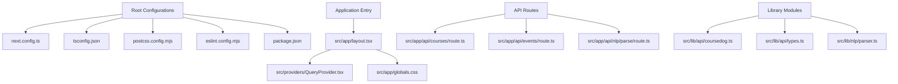
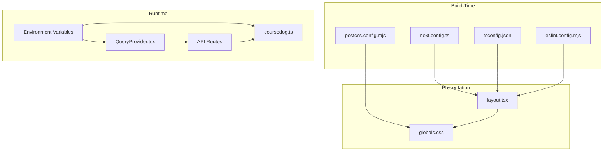
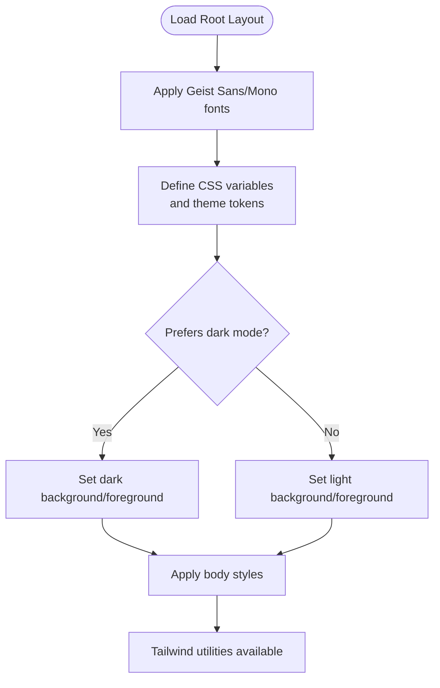
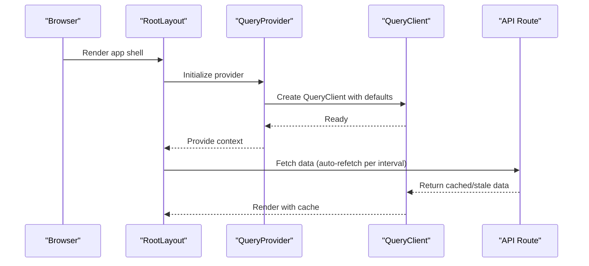
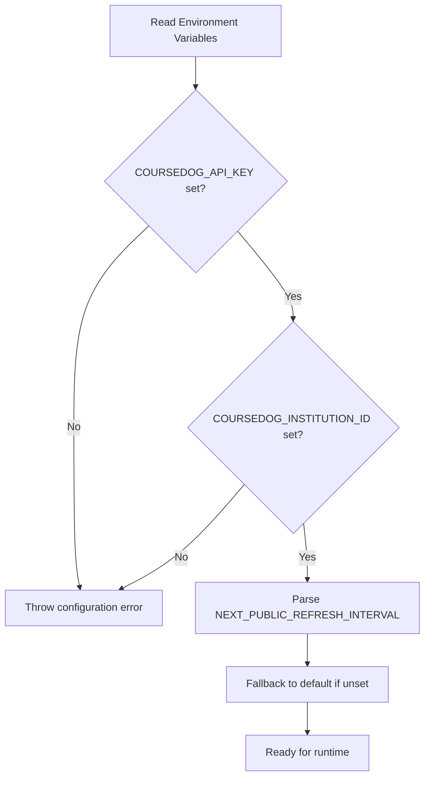
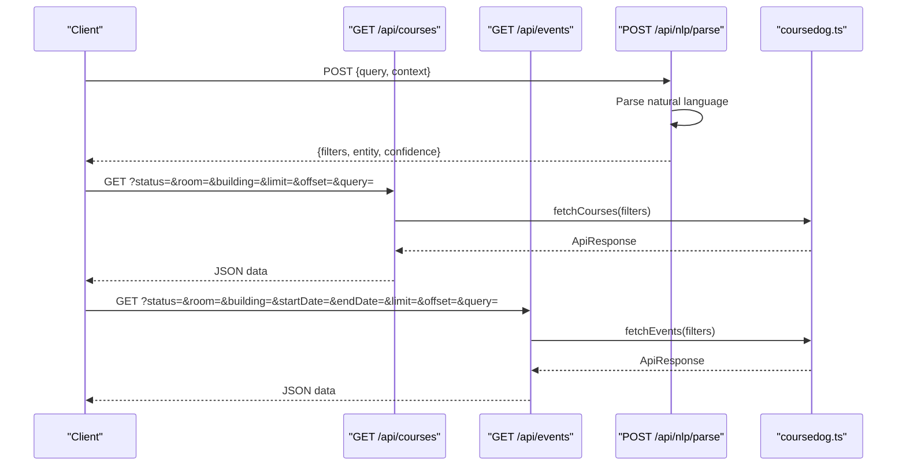
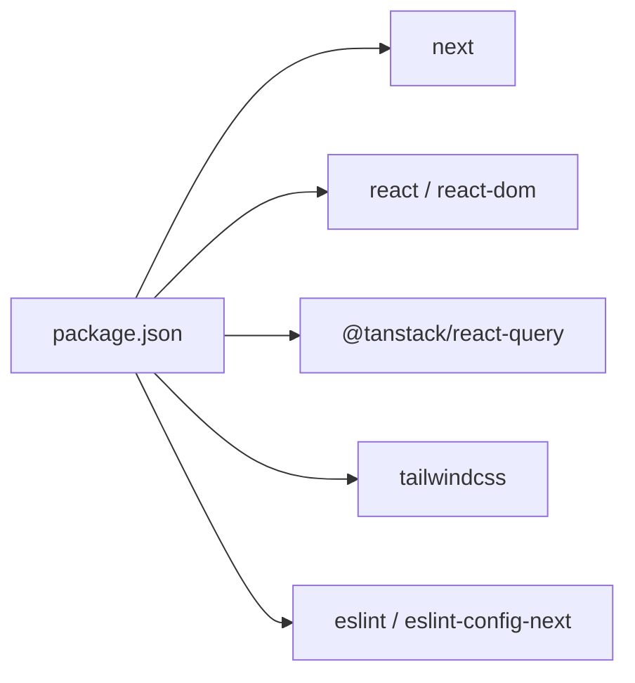

# Configuration and Environment

<cite>
**Referenced Files in This Document**
- [next.config.ts](file://next.config.ts)
- [tsconfig.json](file://tsconfig.json)
- [package.json](file://package.json)
- [postcss.config.mjs](file://postcss.config.mjs)
- [eslint.config.mjs](file://eslint.config.mjs)
- [src/app/layout.tsx](file://src/app/layout.tsx)
- [src/app/globals.css](file://src/app/globals.css)
- [src/providers/QueryProvider.tsx](file://src/providers/QueryProvider.tsx)
- [src/app/api/courses/route.ts](file://src/app/api/courses/route.ts)
- [src/app/api/events/route.ts](file://src/app/api/events/route.ts)
- [src/app/api/nlp/parse/route.ts](file://src/app/api/nlp/parse/route.ts)
- [src/lib/api/coursedog.ts](file://src/lib/api/coursedog.ts)
- [src/lib/api/types.ts](file://src/lib/api/types.ts)
- [src/lib/nlp/parser.ts](file://src/lib/nlp/parser.ts)
</cite>

## Table of Contents
1. [Introduction](#introduction)
2. [Project Structure](#project-structure)
3. [Core Components](#core-components)
4. [Architecture Overview](#architecture-overview)
5. [Detailed Component Analysis](#detailed-component-analysis)
6. [Dependency Analysis](#dependency-analysis)
7. [Performance Considerations](#performance-considerations)
8. [Troubleshooting Guide](#troubleshooting-guide)
9. [Conclusion](#conclusion)
10. [Appendices](#appendices)

## Introduction
This document explains Course Puppy’s configuration system across Next.js, TypeScript, PostCSS/Tailwind, ESLint, environment variables, and React Query. It also covers production build and asset optimization settings, environment setup for development, staging, and production, and security considerations for sensitive configuration data.

## Project Structure
Course Puppy follows a conventional Next.js app directory layout with a dedicated providers directory for React Query and a modular src structure. Key configuration files reside at the repository root and under src.

**Diagram sources**
- [next.config.ts:1-8](file://next.config.ts#L1-L8)
- [tsconfig.json:1-35](file://tsconfig.json#L1-L35)
- [postcss.config.mjs:1-8](file://postcss.config.mjs#L1-L8)
- [eslint.config.mjs:1-19](file://eslint.config.mjs#L1-L19)
- [package.json:1-29](file://package.json#L1-L29)
- [src/app/layout.tsx:1-39](file://src/app/layout.tsx#L1-L39)
- [src/providers/QueryProvider.tsx:1-35](file://src/providers/QueryProvider.tsx#L1-L35)
- [src/app/globals.css:1-27](file://src/app/globals.css#L1-L27)
- [src/app/api/courses/route.ts:1-48](file://src/app/api/courses/route.ts#L1-L48)
- [src/app/api/events/route.ts:1-53](file://src/app/api/events/route.ts#L1-L53)
- [src/app/api/nlp/parse/route.ts:1-29](file://src/app/api/nlp/parse/route.ts#L1-L29)
- [src/lib/api/coursedog.ts:1-72](file://src/lib/api/coursedog.ts#L1-L72)
- [src/lib/api/types.ts:1-99](file://src/lib/api/types.ts#L1-L99)
- [src/lib/nlp/parser.ts:1-202](file://src/lib/nlp/parser.ts#L1-L202)

**Section sources**
- [next.config.ts:1-8](file://next.config.ts#L1-L8)
- [tsconfig.json:1-35](file://tsconfig.json#L1-L35)
- [postcss.config.mjs:1-8](file://postcss.config.mjs#L1-L8)
- [eslint.config.mjs:1-19](file://eslint.config.mjs#L1-L19)
- [package.json:1-29](file://package.json#L1-L29)
- [src/app/layout.tsx:1-39](file://src/app/layout.tsx#L1-L39)
- [src/providers/QueryProvider.tsx:1-35](file://src/providers/QueryProvider.tsx#L1-L35)
- [src/app/globals.css:1-27](file://src/app/globals.css#L1-L27)
- [src/app/api/courses/route.ts:1-48](file://src/app/api/courses/route.ts#L1-L48)
- [src/app/api/events/route.ts:1-53](file://src/app/api/events/route.ts#L1-L53)
- [src/app/api/nlp/parse/route.ts:1-29](file://src/app/api/nlp/parse/route.ts#L1-L29)
- [src/lib/api/coursedog.ts:1-72](file://src/lib/api/coursedog.ts#L1-L72)
- [src/lib/api/types.ts:1-99](file://src/lib/api/types.ts#L1-L99)
- [src/lib/nlp/parser.ts:1-202](file://src/lib/nlp/parser.ts#L1-L202)

## Core Components
- Next.js configuration: Minimal configuration currently defined; ready for build and runtime enhancements.
- TypeScript configuration: Strict mode enabled with bundler module resolution, path aliases, and incremental builds.
- PostCSS/Tailwind: Tailwind plugin configured via PostCSS; CSS variables and theme tokens defined in globals.
- ESLint: Next.js recommended configs for TypeScript and web vitals with custom overrides.
- React Query provider: Centralized caching and refetch behavior configured with environment-driven refresh interval.
- Environment variables: API keys and institution identifiers for external service integration; public refresh interval for auto-refresh.

**Section sources**
- [next.config.ts:1-8](file://next.config.ts#L1-L8)
- [tsconfig.json:1-35](file://tsconfig.json#L1-L35)
- [postcss.config.mjs:1-8](file://postcss.config.mjs#L1-L8)
- [eslint.config.mjs:1-19](file://eslint.config.mjs#L1-L19)
- [src/providers/QueryProvider.tsx:1-35](file://src/providers/QueryProvider.tsx#L1-L35)
- [src/lib/api/coursedog.ts:1-72](file://src/lib/api/coursedog.ts#L1-L72)

## Architecture Overview
The configuration system orchestrates build-time, runtime, and presentation concerns:
- Build-time: Next.js and TypeScript compile-time settings.
- Runtime: Environment variables consumed by API clients and React Query defaults.
- Presentation: Tailwind CSS and CSS variables for theming and responsive design.

**Diagram sources**
- [next.config.ts:1-8](file://next.config.ts#L1-L8)
- [tsconfig.json:1-35](file://tsconfig.json#L1-L35)
- [postcss.config.mjs:1-8](file://postcss.config.mjs#L1-L8)
- [eslint.config.mjs:1-19](file://eslint.config.mjs#L1-L19)
- [src/providers/QueryProvider.tsx:1-35](file://src/providers/QueryProvider.tsx#L1-L35)
- [src/lib/api/coursedog.ts:1-72](file://src/lib/api/coursedog.ts#L1-L72)
- [src/app/layout.tsx:1-39](file://src/app/layout.tsx#L1-L39)
- [src/app/globals.css:1-27](file://src/app/globals.css#L1-L27)

## Detailed Component Analysis

### Next.js Configuration
- Purpose: Central place to configure Next.js behavior such as output tracing, experimental features, and build-time optimizations.
- Current state: Empty configuration block; ready for extension.
- Recommendations:
  - Enable output tracing for smaller serverless bundles.
  - Configure image optimization and static export if applicable.
  - Add experimental flags cautiously and test thoroughly.

**Section sources**
- [next.config.ts:1-8](file://next.config.ts#L1-L8)

### TypeScript Configuration
- Strictness: Enabled for safer code and better DX.
- Module resolution: Uses bundler for compatibility with Next.js app dir.
- Path aliases: @/* mapped to ./src for clean imports.
- Incremental compilation: Improves rebuild times during development.
- Plugins: Next.js TypeScript plugin included.

**Section sources**
- [tsconfig.json:1-35](file://tsconfig.json#L1-L35)

### Tailwind CSS and Custom Styling
- Plugin setup: Tailwind plugin configured via PostCSS.
- Theming: CSS variables define background/foreground and font families; media-query-based dark mode support.
- Fonts: Next.js Google Fonts integration applied at the root layout level.

**Diagram sources**
- [src/app/layout.tsx:1-39](file://src/app/layout.tsx#L1-L39)
- [src/app/globals.css:1-27](file://src/app/globals.css#L1-L27)

**Section sources**
- [postcss.config.mjs:1-8](file://postcss.config.mjs#L1-L8)
- [src/app/layout.tsx:1-39](file://src/app/layout.tsx#L1-L39)
- [src/app/globals.css:1-27](file://src/app/globals.css#L1-L27)

### React Query Provider Configuration
- Purpose: Provide a centralized QueryClient with default caching and refetch behavior.
- Key settings:
  - Refetch interval: Controlled by NEXT_PUBLIC_REFRESH_INTERVAL (default 300000 ms).
  - Stale time: 60000 ms (1 minute).
  - Retry policy: Up to 2 attempts with exponential backoff capped at 30000 ms.
- Placement: Wrapped around the root layout to provide caching for all pages.

**Diagram sources**
- [src/providers/QueryProvider.tsx:1-35](file://src/providers/QueryProvider.tsx#L1-L35)
- [src/app/layout.tsx:1-39](file://src/app/layout.tsx#L1-L39)

**Section sources**
- [src/providers/QueryProvider.tsx:1-35](file://src/providers/QueryProvider.tsx#L1-L35)
- [src/app/layout.tsx:1-39](file://src/app/layout.tsx#L1-L39)

### Environment Variable Setup
- External service credentials:
  - COURSEDOG_API_KEY: Required for Coursedog API access.
  - COURSEDOG_INSTITUTION_ID: Required to target the correct institution endpoint.
- Public client-side refresh interval:
  - NEXT_PUBLIC_REFRESH_INTERVAL: Controls auto-refresh frequency for queries (default 300000 ms).
- API endpoints:
  - Courses: GET /api/courses with optional filters.
  - Events: GET /api/events with optional filters.
  - NLP Parse: POST /api/nlp/parse for natural language query interpretation.

**Diagram sources**
- [src/lib/api/coursedog.ts:1-72](file://src/lib/api/coursedog.ts#L1-L72)
- [src/providers/QueryProvider.tsx:1-35](file://src/providers/QueryProvider.tsx#L1-L35)

**Section sources**
- [src/lib/api/coursedog.ts:1-72](file://src/lib/api/coursedog.ts#L1-L72)
- [src/providers/QueryProvider.tsx:1-35](file://src/providers/QueryProvider.tsx#L1-L35)
- [src/app/api/courses/route.ts:1-48](file://src/app/api/courses/route.ts#L1-L48)
- [src/app/api/events/route.ts:1-53](file://src/app/api/events/route.ts#L1-L53)
- [src/app/api/nlp/parse/route.ts:1-29](file://src/app/api/nlp/parse/route.ts#L1-L29)

### API Routes and Data Flow
- Courses route: Parses query parameters into FilterParams and delegates to coursedog client.
- Events route: Similar filtering and delegation for events.
- NLP parse route: Accepts a natural language query and returns structured filters and entity type.

**Diagram sources**
- [src/app/api/courses/route.ts:1-48](file://src/app/api/courses/route.ts#L1-L48)
- [src/app/api/events/route.ts:1-53](file://src/app/api/events/route.ts#L1-L53)
- [src/app/api/nlp/parse/route.ts:1-29](file://src/app/api/nlp/parse/route.ts#L1-L29)
- [src/lib/api/coursedog.ts:1-72](file://src/lib/api/coursedog.ts#L1-L72)

**Section sources**
- [src/app/api/courses/route.ts:1-48](file://src/app/api/courses/route.ts#L1-L48)
- [src/app/api/events/route.ts:1-53](file://src/app/api/events/route.ts#L1-L53)
- [src/app/api/nlp/parse/route.ts:1-29](file://src/app/api/nlp/parse/route.ts#L1-L29)
- [src/lib/api/coursedog.ts:1-72](file://src/lib/api/coursedog.ts#L1-L72)

### TypeScript and Type Safety
- Strict compiler options enable robust type checking.
- Path aliases simplify imports and improve maintainability.
- Type definitions for API responses and NLP parsing ensure consistent data contracts.

**Section sources**
- [tsconfig.json:1-35](file://tsconfig.json#L1-L35)
- [src/lib/api/types.ts:1-99](file://src/lib/api/types.ts#L1-L99)
- [src/lib/nlp/parser.ts:1-202](file://src/lib/nlp/parser.ts#L1-L202)

### ESLint Configuration
- Integrates Next.js recommended rules for TypeScript and web vitals.
- Overrides default ignores to include generated Next.js types and app directory.

**Section sources**
- [eslint.config.mjs:1-19](file://eslint.config.mjs#L1-L19)

## Dependency Analysis
- Next.js: Core framework with app directory support.
- React Query: State management and caching for data fetching.
- Tailwind CSS: Utility-first CSS framework integrated via PostCSS.
- TypeScript: Type safety and modern JavaScript features.
- ESLint: Code quality and consistency enforcement.

**Diagram sources**
- [package.json:1-29](file://package.json#L1-L29)

**Section sources**
- [package.json:1-29](file://package.json#L1-L29)

## Performance Considerations
- Next.js build settings:
  - Enable output tracing to reduce serverless bundle size.
  - Consider static export if content is largely static.
- React Query:
  - Adjust staleTime and refetchInterval based on data volatility.
  - Use query invalidation strategically to minimize unnecessary refetches.
- Asset optimization:
  - Leverage Next.js image optimization and CDN integration.
  - Minimize CSS by scoping Tailwind utilities and purging unused styles.
- TypeScript:
  - Keep strict mode enabled for early bug detection.
  - Use incremental builds to speed up development iterations.

[No sources needed since this section provides general guidance]

## Troubleshooting Guide
- Missing environment variables:
  - COURSEDOG_API_KEY or COURSEDOG_INSTITUTION_ID missing will cause runtime errors when calling the external API.
  - NEXT_PUBLIC_REFRESH_INTERVAL must be a valid integer; otherwise, defaults apply.
- API route errors:
  - Non-OK responses from the external API surface as errors; inspect returned messages for details.
- React Query:
  - If auto-refresh does not occur, verify NEXT_PUBLIC_REFRESH_INTERVAL is set and valid.
  - Excessive retries may indicate network instability; adjust retry policy as needed.
- Styling issues:
  - Ensure Tailwind plugin is present and CSS variables are defined in globals.
  - Confirm font variables are applied at the root layout level.

**Section sources**
- [src/lib/api/coursedog.ts:1-72](file://src/lib/api/coursedog.ts#L1-L72)
- [src/providers/QueryProvider.tsx:1-35](file://src/providers/QueryProvider.tsx#L1-L35)
- [src/app/api/courses/route.ts:1-48](file://src/app/api/courses/route.ts#L1-L48)
- [src/app/api/events/route.ts:1-53](file://src/app/api/events/route.ts#L1-L53)
- [src/app/globals.css:1-27](file://src/app/globals.css#L1-L27)

## Conclusion
Course Puppy’s configuration system combines minimal Next.js setup, strict TypeScript, Tailwind CSS via PostCSS, and a centralized React Query provider. Environment variables securely manage external service credentials and client-side refresh behavior. The system is designed for scalability and maintainability, with clear separation of concerns across build-time, runtime, and presentation layers.

[No sources needed since this section summarizes without analyzing specific files]

## Appendices

### Environment Setup Guides
- Development:
  - Set COURSEDOG_API_KEY and COURSEDOG_INSTITUTION_ID.
  - Optionally set NEXT_PUBLIC_REFRESH_INTERVAL to control auto-refresh.
  - Run the development server using the provided script.
- Staging:
  - Mirror production secrets with staging credentials.
  - Validate API responses and caching behavior.
- Production:
  - Ensure all environment variables are present at build and runtime.
  - Verify asset optimization and bundle sizes.
  - Monitor React Query cache performance and retry behavior.

**Section sources**
- [package.json:1-29](file://package.json#L1-L29)
- [src/lib/api/coursedog.ts:1-72](file://src/lib/api/coursedog.ts#L1-L72)
- [src/providers/QueryProvider.tsx:1-35](file://src/providers/QueryProvider.tsx#L1-L35)

### Security Considerations
- Never commit secrets; use environment variables exclusively.
- Limit exposure of private keys to backend-only contexts.
- Validate and sanitize inputs in API routes.
- Prefer HTTPS endpoints for external APIs.
- Regularly rotate secrets and audit access logs.

[No sources needed since this section provides general guidance]