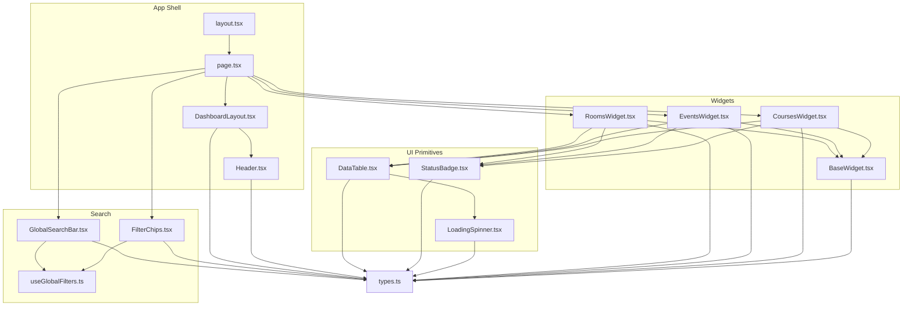
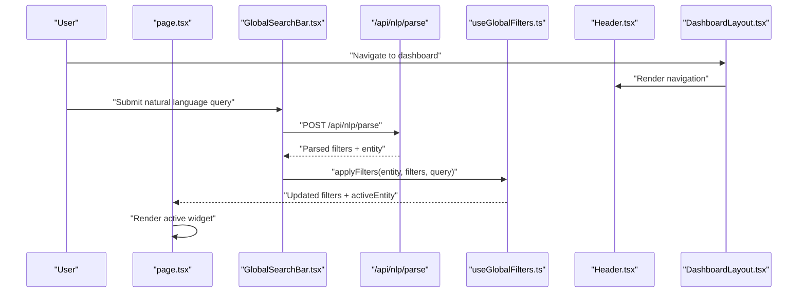
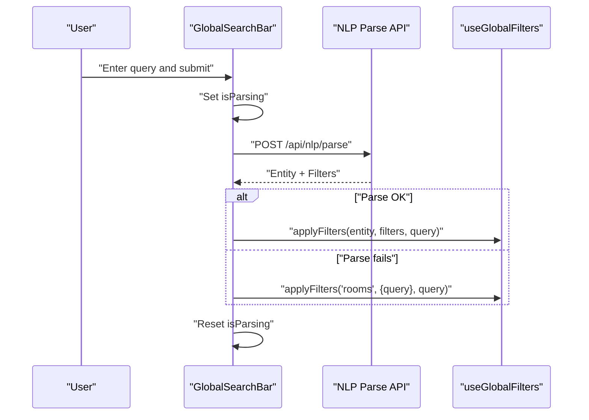
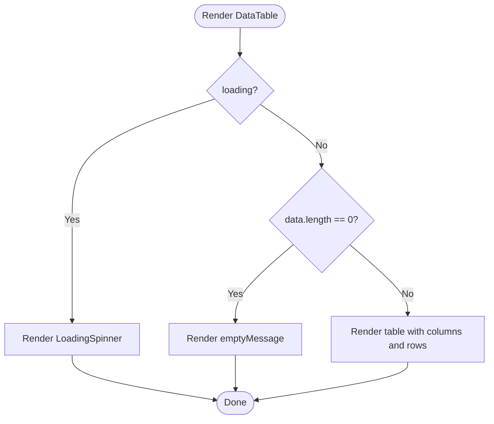
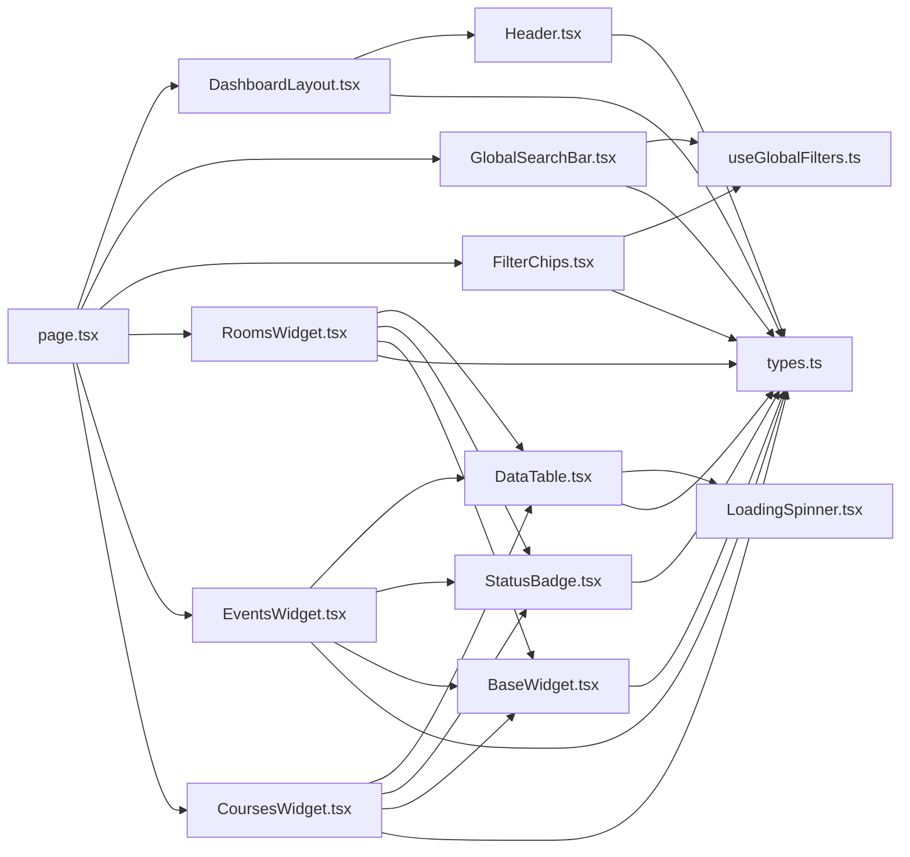

# Core Components

<cite>
**Referenced Files in This Document**
- [DashboardLayout.tsx](file://src/components/layout/DashboardLayout.tsx)
- [Header.tsx](file://src/components/layout/Header.tsx)
- [GlobalSearchBar.tsx](file://src/components/search/GlobalSearchBar.tsx)
- [FilterChips.tsx](file://src/components/search/FilterChips.tsx)
- [DataTable.tsx](file://src/components/ui/DataTable.tsx)
- [StatusBadge.tsx](file://src/components/ui/StatusBadge.tsx)
- [LoadingSpinner.tsx](file://src/components/ui/LoadingSpinner.tsx)
- [types.ts](file://src/lib/api/types.ts)
- [useGlobalFilters.ts](file://src/hooks/useGlobalFilters.ts)
- [page.tsx](file://src/app/page.tsx)
- [layout.tsx](file://src/app/layout.tsx)
- [RoomsWidget.tsx](file://src/components/widgets/RoomsWidget.tsx)
- [EventsWidget.tsx](file://src/components/widgets/EventsWidget.tsx)
- [CoursesWidget.tsx](file://src/components/widgets/CoursesWidget.tsx)
- [BaseWidget.tsx](file://src/components/widgets/BaseWidget.tsx)
</cite>

## Table of Contents
1. [Introduction](#introduction)
2. [Project Structure](#project-structure)
3. [Core Components](#core-components)
4. [Architecture Overview](#architecture-overview)
5. [Detailed Component Analysis](#detailed-component-analysis)
6. [Dependency Analysis](#dependency-analysis)
7. [Performance Considerations](#performance-considerations)
8. [Troubleshooting Guide](#troubleshooting-guide)
9. [Conclusion](#conclusion)
10. [Appendices](#appendices)

## Introduction
This document provides comprehensive documentation for Course Puppy’s core UI components. It focuses on the DashboardLayout and Header for navigation and layout, the GlobalSearchBar for natural language processing and filter extraction, the FilterChips component for managing active filters and their persistence, the DataTable component for displaying tabular academic data, the StatusBadge component for visual status indicators, and the LoadingSpinner for async operations. The guide includes component props, events, styling options, integration patterns, usage examples, customization guidelines, responsive design considerations, and accessibility features.

## Project Structure
The core UI components are organized by feature and responsibility:
- Layout: DashboardLayout and Header manage the global shell and navigation.
- Search: GlobalSearchBar and FilterChips implement NLP-powered search and filter chips.
- UI: DataTable, StatusBadge, and LoadingSpinner provide reusable UI primitives.
- Widgets: RoomsWidget, EventsWidget, and CoursesWidget integrate data fetching and rendering.
- Hooks and Types: useGlobalFilters centralizes filter state, and types.ts defines shared types.

**Diagram sources**
- [layout.tsx:1-39](file://src/app/layout.tsx#L1-L39)
- [page.tsx:1-100](file://src/app/page.tsx#L1-L100)
- [DashboardLayout.tsx:1-26](file://src/components/layout/DashboardLayout.tsx#L1-L26)
- [Header.tsx:1-61](file://src/components/layout/Header.tsx#L1-L61)
- [GlobalSearchBar.tsx:1-85](file://src/components/search/GlobalSearchBar.tsx#L1-L85)
- [FilterChips.tsx:1-60](file://src/components/search/FilterChips.tsx#L1-L60)
- [DataTable.tsx:1-81](file://src/components/ui/DataTable.tsx#L1-L81)
- [StatusBadge.tsx:1-78](file://src/components/ui/StatusBadge.tsx#L1-L78)
- [LoadingSpinner.tsx:1-17](file://src/components/ui/LoadingSpinner.tsx#L1-L17)
- [RoomsWidget.tsx:1-97](file://src/components/widgets/RoomsWidget.tsx#L1-L97)
- [EventsWidget.tsx:1-116](file://src/components/widgets/EventsWidget.tsx#L1-L116)
- [CoursesWidget.tsx:1-121](file://src/components/widgets/CoursesWidget.tsx#L1-L121)
- [BaseWidget.tsx:1-58](file://src/components/widgets/BaseWidget.tsx#L1-L58)
- [types.ts:1-99](file://src/lib/api/types.ts#L1-L99)
- [useGlobalFilters.ts:1-79](file://src/hooks/useGlobalFilters.ts#L1-L79)

**Section sources**
- [layout.tsx:1-39](file://src/app/layout.tsx#L1-L39)
- [page.tsx:1-100](file://src/app/page.tsx#L1-L100)

## Core Components
This section documents the primary UI components and their roles in the dashboard.

- DashboardLayout: Provides the global layout container, renders the Header, and wraps page content with consistent spacing and background.
- Header: Implements top navigation with three entity tabs (Rooms, Events, Courses) and brand identity.
- GlobalSearchBar: Accepts natural language queries, calls the NLP parser endpoint, and emits parsed filters and entity selection.
- FilterChips: Displays active filters as interactive chips with per-filter removal and “Clear all” actions.
- DataTable: Renders paginated, sortable tabular data with loading and empty states; integrates with LoadingSpinner.
- StatusBadge: Visual indicator for status values with configurable sizes and color semantics.
- LoadingSpinner: Lightweight spinner component for async operations.

**Section sources**
- [DashboardLayout.tsx:1-26](file://src/components/layout/DashboardLayout.tsx#L1-L26)
- [Header.tsx:1-61](file://src/components/layout/Header.tsx#L1-L61)
- [GlobalSearchBar.tsx:1-85](file://src/components/search/GlobalSearchBar.tsx#L1-L85)
- [FilterChips.tsx:1-60](file://src/components/search/FilterChips.tsx#L1-L60)
- [DataTable.tsx:1-81](file://src/components/ui/DataTable.tsx#L1-L81)
- [StatusBadge.tsx:1-78](file://src/components/ui/StatusBadge.tsx#L1-L78)
- [LoadingSpinner.tsx:1-17](file://src/components/ui/LoadingSpinner.tsx#L1-L17)

## Architecture Overview
The dashboard composes the layout, search, and widgets. The GlobalSearchBar delegates NLP parsing to the backend and updates the global filter state via useGlobalFilters. The active filters drive the selected widget (Rooms/Events/Courses), which renders a DataTable with StatusBadge and LoadingSpinner.

**Diagram sources**
- [page.tsx:12-36](file://src/app/page.tsx#L12-L36)
- [GlobalSearchBar.tsx:21-54](file://src/components/search/GlobalSearchBar.tsx#L21-L54)
- [useGlobalFilters.ts:24-37](file://src/hooks/useGlobalFilters.ts#L24-L37)
- [Header.tsx:18-58](file://src/components/layout/Header.tsx#L18-L58)
- [DashboardLayout.tsx:12-25](file://src/components/layout/DashboardLayout.tsx#L12-L25)

## Detailed Component Analysis

### DashboardLayout
- Purpose: Provides the global layout shell with a white background and containerized main content area. Integrates the Header and forwards active entity and change handler props.
- Props:
  - children: ReactNode
  - activeEntity: 'rooms' | 'events' | 'courses'
  - onEntityChange: (entity: 'rooms' | 'events' | 'courses') => void
- Behavior:
  - Renders Header with activeEntity and onEntityChange.
  - Wraps children in a container with horizontal padding and vertical spacing.
- Accessibility and responsiveness:
  - Uses semantic container classes and maintains consistent spacing across breakpoints.
- Integration pattern:
  - Consumed by the dashboard page to establish the layout contract.

**Section sources**
- [DashboardLayout.tsx:6-25](file://src/components/layout/DashboardLayout.tsx#L6-L25)
- [layout.tsx:21-38](file://src/app/layout.tsx#L21-L38)

### Header
- Purpose: Top navigation bar with brand identity and entity selector.
- Props:
  - activeEntity: 'rooms' | 'events' | 'courses'
  - onEntityChange: (entity: 'entities) => void
- Behavior:
  - Renders logo and brand text.
  - Renders three navigation buttons mapped from navItems, applying active state styling when the button matches activeEntity.
  - Calls onEntityChange when a button is clicked.
- Styling options:
  - Active state uses blue palette; inactive states use gray palette with hover effects.
- Accessibility:
  - Buttons use appropriate contrast and focus states; aria-labels are present on interactive elements in related components.

**Section sources**
- [Header.tsx:7-58](file://src/components/layout/Header.tsx#L7-L58)
- [DashboardLayout.tsx:18-19](file://src/components/layout/DashboardLayout.tsx#L18-L19)

### GlobalSearchBar
- Purpose: Accepts natural language queries, parses them via the NLP endpoint, and emits structured filters and entity selection.
- Props:
  - onSearch: (entity: EntityType, filters: FilterParams, query: string) => void
  - isLoading?: boolean (propagated to indicate downstream loading)
  - placeholder?: string
- Behavior:
  - Tracks local query state and parsing state.
  - Submits query to /api/nlp/parse with JSON payload.
  - On success, selects entity (defaults to rooms if unknown) and invokes onSearch with parsed filters and original query.
  - On failure, logs error and falls back to treating the query as a general text search against rooms.
  - Disables input while parsing or when isLoading is true.
- Events:
  - Emits onSearch with parsed filters and entity.
- Styling options:
  - Uses Lucide icons inside the input field; shows Loader2 during parsing; Enter key hint visible on small screens.
- Integration pattern:
  - Used by the dashboard page; integrates with useGlobalFilters via applyFilters.

**Diagram sources**
- [GlobalSearchBar.tsx:21-54](file://src/components/search/GlobalSearchBar.tsx#L21-L54)
- [useGlobalFilters.ts:24-37](file://src/hooks/useGlobalFilters.ts#L24-L37)

**Section sources**
- [GlobalSearchBar.tsx:7-54](file://src/components/search/GlobalSearchBar.tsx#L7-L54)
- [types.ts:72-84](file://src/lib/api/types.ts#L72-L84)

### FilterChips
- Purpose: Visual representation of active filters with per-filter removal and “Clear all”.
- Props:
  - filters: FilterParams
  - onClearFilter: (key: keyof FilterParams) => void
  - onClearAll: () => void
- Behavior:
  - Filters out undefined, null, and empty values.
  - Maps filter keys to human-readable labels via filterLabels.
  - Renders a chip per active filter with remove button and “Clear all” link.
- Persistence:
  - Removal triggers clearSpecificFilter; clearing all triggers clearFilters.
- Accessibility:
  - Remove buttons include aria-labels for screen readers.

**Section sources**
- [FilterChips.tsx:6-59](file://src/components/search/FilterChips.tsx#L6-L59)
- [useGlobalFilters.ts:39-62](file://src/hooks/useGlobalFilters.ts#L39-L62)
- [types.ts:49-70](file://src/lib/api/types.ts#L49-L70)

### DataTable
- Purpose: Generic table renderer for lists of items with loading and empty states.
- Props:
  - columns: Column<T>[] with key, header, optional width, optional render function
  - data: T[]
  - loading?: boolean
  - emptyMessage?: string
  - keyExtractor: (item: T) => string
- Behavior:
  - If loading is true, renders a centered LoadingSpinner.
  - If data length is zero, renders an empty message.
  - Otherwise, renders a responsive table with headers and rows; supports custom cell rendering.
- Styling options:
  - Column widths supported via inline styles; hover and row borders for readability.
- Integration pattern:
  - Used by RoomsWidget, EventsWidget, and CoursesWidget to render entity lists.

**Diagram sources**
- [DataTable.tsx:21-80](file://src/components/ui/DataTable.tsx#L21-L80)

**Section sources**
- [DataTable.tsx:13-80](file://src/components/ui/DataTable.tsx#L13-L80)
- [RoomsWidget.tsx:87-93](file://src/components/widgets/RoomsWidget.tsx#L87-L93)
- [EventsWidget.tsx:106-112](file://src/components/widgets/EventsWidget.tsx#L106-L112)
- [CoursesWidget.tsx:111-117](file://src/components/widgets/CoursesWidget.tsx#L111-L117)

### StatusBadge
- Purpose: Visual status indicator with configurable size and semantic colors.
- Props:
  - status: FilterParams['status'] (union of allowed statuses)
  - size?: 'sm' | 'md' | 'lg'
- Behavior:
  - Selects styling based on status; defaults to neutral gray if status is unrecognized.
  - Renders a rounded badge with background, text color, and size class.
- Integration pattern:
  - Used within DataTable columns for status fields across Rooms, Events, and Courses widgets.

**Section sources**
- [StatusBadge.tsx:7-77](file://src/components/ui/StatusBadge.tsx#L7-L77)
- [RoomsWidget.tsx:61](file://src/components/widgets/RoomsWidget.tsx#L61)
- [EventsWidget.tsx:80](file://src/components/widgets/EventsWidget.tsx#L80)
- [CoursesWidget.tsx:85](file://src/components/widgets/CoursesWidget.tsx#L85)

### LoadingSpinner
- Purpose: Lightweight spinner for async operations.
- Props:
  - size?: number (default 24)
  - className?: string
- Behavior:
  - Centers the spinner icon with animation; applies optional extra class.
- Integration pattern:
  - Used by DataTable when loading is true.

**Section sources**
- [LoadingSpinner.tsx:5-16](file://src/components/ui/LoadingSpinner.tsx#L5-L16)
- [DataTable.tsx:28-33](file://src/components/ui/DataTable.tsx#L28-L33)

### Widget Integration (Rooms/Events/Courses)
- Purpose: Entity-specific data presentation built on BaseWidget and DataTable.
- Key patterns:
  - Fetch data via dedicated hooks (useRooms, useEvents, useCourses).
  - Define columns with custom renderers and widths.
  - Pass data, loading, and empty messages to DataTable.
  - Wrap content in BaseWidget for consistent header/footer and refresh controls.
- Responsive design:
  - DataTable enables horizontal scrolling on small screens.
  - Columns define widths to improve readability on larger screens.

**Section sources**
- [RoomsWidget.tsx:15-96](file://src/components/widgets/RoomsWidget.tsx#L15-L96)
- [EventsWidget.tsx:14-115](file://src/components/widgets/EventsWidget.tsx#L14-L115)
- [CoursesWidget.tsx:14-120](file://src/components/widgets/CoursesWidget.tsx#L14-L120)
- [BaseWidget.tsx:15-57](file://src/components/widgets/BaseWidget.tsx#L15-L57)

## Dependency Analysis
The following diagram shows how components depend on each other and on shared types and hooks.

**Diagram sources**
- [types.ts:1-99](file://src/lib/api/types.ts#L1-L99)
- [useGlobalFilters.ts:1-79](file://src/hooks/useGlobalFilters.ts#L1-L79)
- [page.tsx:1-100](file://src/app/page.tsx#L1-L100)
- [DashboardLayout.tsx:1-26](file://src/components/layout/DashboardLayout.tsx#L1-L26)
- [Header.tsx:1-61](file://src/components/layout/Header.tsx#L1-L61)
- [GlobalSearchBar.tsx:1-85](file://src/components/search/GlobalSearchBar.tsx#L1-L85)
- [FilterChips.tsx:1-60](file://src/components/search/FilterChips.tsx#L1-L60)
- [RoomsWidget.tsx:1-97](file://src/components/widgets/RoomsWidget.tsx#L1-L97)
- [EventsWidget.tsx:1-116](file://src/components/widgets/EventsWidget.tsx#L1-L116)
- [CoursesWidget.tsx:1-121](file://src/components/widgets/CoursesWidget.tsx#L1-L121)
- [DataTable.tsx:1-81](file://src/components/ui/DataTable.tsx#L1-L81)
- [StatusBadge.tsx:1-78](file://src/components/ui/StatusBadge.tsx#L1-L78)
- [LoadingSpinner.tsx:1-17](file://src/components/ui/LoadingSpinner.tsx#L1-L17)
- [BaseWidget.tsx:1-58](file://src/components/widgets/BaseWidget.tsx#L1-L58)

**Section sources**
- [page.tsx:12-36](file://src/app/page.tsx#L12-L36)
- [useGlobalFilters.ts:14-77](file://src/hooks/useGlobalFilters.ts#L14-L77)

## Performance Considerations
- Virtualization: For very large datasets, consider virtualizing DataTable rows to reduce DOM nodes.
- Debouncing: Debounce GlobalSearchBar input to avoid excessive NLP requests during rapid typing.
- Pagination: Implement server-side pagination in API responses to limit payload sizes.
- Memoization: Memoize column definitions and render functions to prevent unnecessary re-renders.
- Lazy loading: Defer heavy widget initialization until after initial hydration.

## Troubleshooting Guide
- GlobalSearchBar does nothing on submit:
  - Ensure onSearch prop is passed and not blocked by isLoading.
  - Verify /api/nlp/parse endpoint availability and CORS configuration.
- NLP parsing errors:
  - The component falls back to a general rooms search; check console for error logs.
- FilterChips not updating:
  - Confirm onClearFilter and onClearAll handlers update the active entity’s filters via useGlobalFilters.
- DataTable not rendering:
  - Check that data is an array and keyExtractor returns unique strings.
  - Ensure loading prop is false when data exists.
- StatusBadge missing:
  - Verify status values match allowed union types in FilterParams.

**Section sources**
- [GlobalSearchBar.tsx:47-53](file://src/components/search/GlobalSearchBar.tsx#L47-L53)
- [useGlobalFilters.ts:39-62](file://src/hooks/useGlobalFilters.ts#L39-L62)
- [DataTable.tsx:28-42](file://src/components/ui/DataTable.tsx#L28-L42)

## Conclusion
The core UI components form a cohesive dashboard foundation: DashboardLayout and Header provide structure and navigation; GlobalSearchBar and FilterChips enable expressive search and filter management; DataTable, StatusBadge, and LoadingSpinner deliver consistent, accessible data presentation. Together with the widget layer and global filter state, they support a responsive, accessible, and extensible academic data dashboard.

## Appendices

### Props Reference Summary
- DashboardLayout
  - children: ReactNode
  - activeEntity: 'rooms' | 'events' | 'courses'
  - onEntityChange: (entity) => void
- Header
  - activeEntity: 'rooms' | 'events' | 'courses'
  - onEntityChange: (entity) => void
- GlobalSearchBar
  - onSearch: (entity, filters, query) => void
  - isLoading?: boolean
  - placeholder?: string
- FilterChips
  - filters: FilterParams
  - onClearFilter: (key) => void
  - onClearAll: () => void
- DataTable
  - columns: Column<T>[]
  - data: T[]
  - loading?: boolean
  - emptyMessage?: string
  - keyExtractor: (item) => string
- StatusBadge
  - status: FilterParams['status']
  - size?: 'sm' | 'md' | 'lg'
- LoadingSpinner
  - size?: number
  - className?: string

**Section sources**
- [DashboardLayout.tsx:6-10](file://src/components/layout/DashboardLayout.tsx#L6-L10)
- [Header.tsx:7-10](file://src/components/layout/Header.tsx#L7-L10)
- [GlobalSearchBar.tsx:7-11](file://src/components/search/GlobalSearchBar.tsx#L7-L11)
- [FilterChips.tsx:6-10](file://src/components/search/FilterChips.tsx#L6-L10)
- [DataTable.tsx:13-19](file://src/components/ui/DataTable.tsx#L13-L19)
- [StatusBadge.tsx:7-10](file://src/components/ui/StatusBadge.tsx#L7-L10)
- [LoadingSpinner.tsx:5-8](file://src/components/ui/LoadingSpinner.tsx#L5-L8)

### Usage Examples and Customization Guidelines
- DashboardLayout
  - Wrap page content and pass activeEntity and onEntityChange from useGlobalFilters.
- Header
  - Use onEntityChange to switch activeEntity; ensure activeEntity reflects current view.
- GlobalSearchBar
  - Subscribe to onSearch to update filters; pass isLoading from upstream loaders.
  - Customize placeholder to reflect domain-specific expectations.
- FilterChips
  - Wire onClearFilter to clearSpecificFilter and onClearAll to clearFilters.
  - Extend filterLabels to localize or expand labels.
- DataTable
  - Provide column widths for readability; supply custom renderers for complex cells.
  - Use keyExtractor to ensure stable row identities for large datasets.
- StatusBadge
  - Add new statuses to statusConfig with appropriate colors and labels.
  - Adjust size for compact contexts (sm) versus summaries (md/large).
- LoadingSpinner
  - Use size to match surrounding typography; add className for alignment.

**Section sources**
- [page.tsx:38-76](file://src/app/page.tsx#L38-L76)
- [useGlobalFilters.ts:17-62](file://src/hooks/useGlobalFilters.ts#L17-L62)
- [FilterChips.tsx:12-21](file://src/components/search/FilterChips.tsx#L12-L21)
- [StatusBadge.tsx:12-53](file://src/components/ui/StatusBadge.tsx#L12-L53)
- [DataTable.tsx:44-79](file://src/components/ui/DataTable.tsx#L44-L79)

### Responsive Design Considerations
- GlobalSearchBar
  - Input width is fluid; Enter hint appears on small screens.
- DataTable
  - Enables horizontal scrolling for narrow viewports; column widths help readability.
- Header
  - Navigation buttons stack and adapt to available space; active state remains clear.
- Widgets
  - BaseWidget footer shows last updated time; content areas remain readable across breakpoints.

**Section sources**
- [GlobalSearchBar.tsx:58-82](file://src/components/search/GlobalSearchBar.tsx#L58-L82)
- [DataTable.tsx:44-79](file://src/components/ui/DataTable.tsx#L44-L79)
- [Header.tsx:35-55](file://src/components/layout/Header.tsx#L35-L55)
- [BaseWidget.tsx:50-54](file://src/components/widgets/BaseWidget.tsx#L50-L54)

### Accessibility Features
- GlobalSearchBar
  - Disabled state prevents interaction during parsing/loading.
  - Enter key hint improves discoverability.
- FilterChips
  - Remove buttons include aria-labels for assistive technologies.
- Header
  - Buttons use clear focus states and hover feedback.
- StatusBadge
  - Uses semantic labels and color to convey meaning.
- LoadingSpinner
  - Animated spinner indicates ongoing operations.

**Section sources**
- [GlobalSearchBar.tsx:73-74](file://src/components/search/GlobalSearchBar.tsx#L73-L74)
- [FilterChips.tsx:44](file://src/components/search/FilterChips.tsx#L44)
- [Header.tsx:44-48](file://src/components/layout/Header.tsx#L44-L48)
- [StatusBadge.tsx:61-76](file://src/components/ui/StatusBadge.tsx#L61-L76)
- [LoadingSpinner.tsx:10-15](file://src/components/ui/LoadingSpinner.tsx#L10-L15)