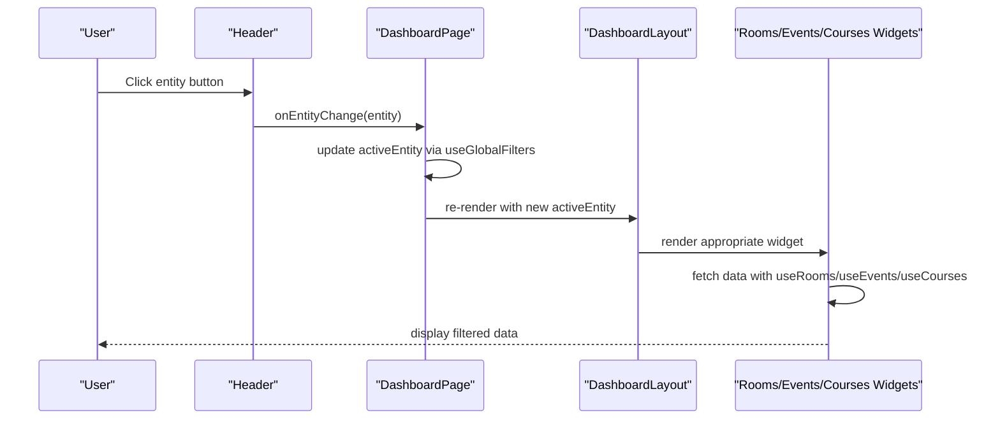
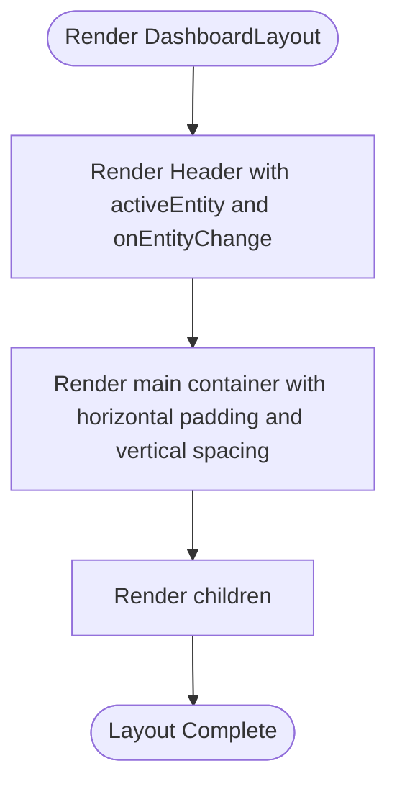
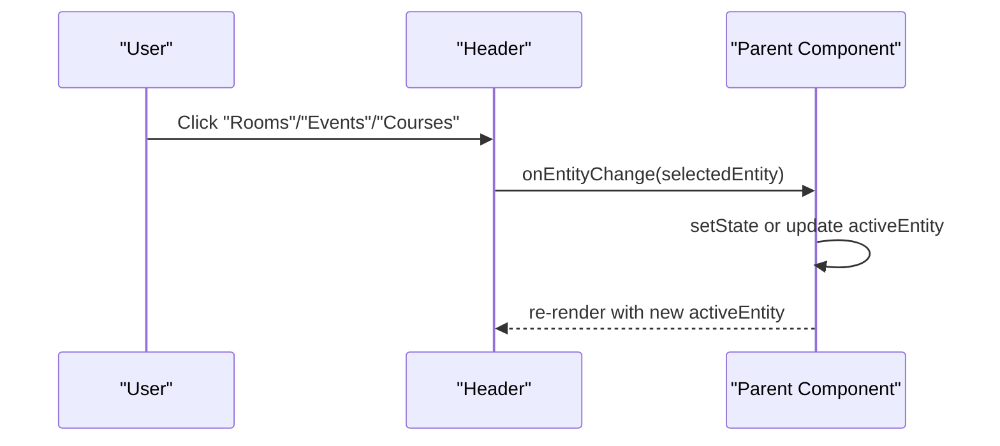
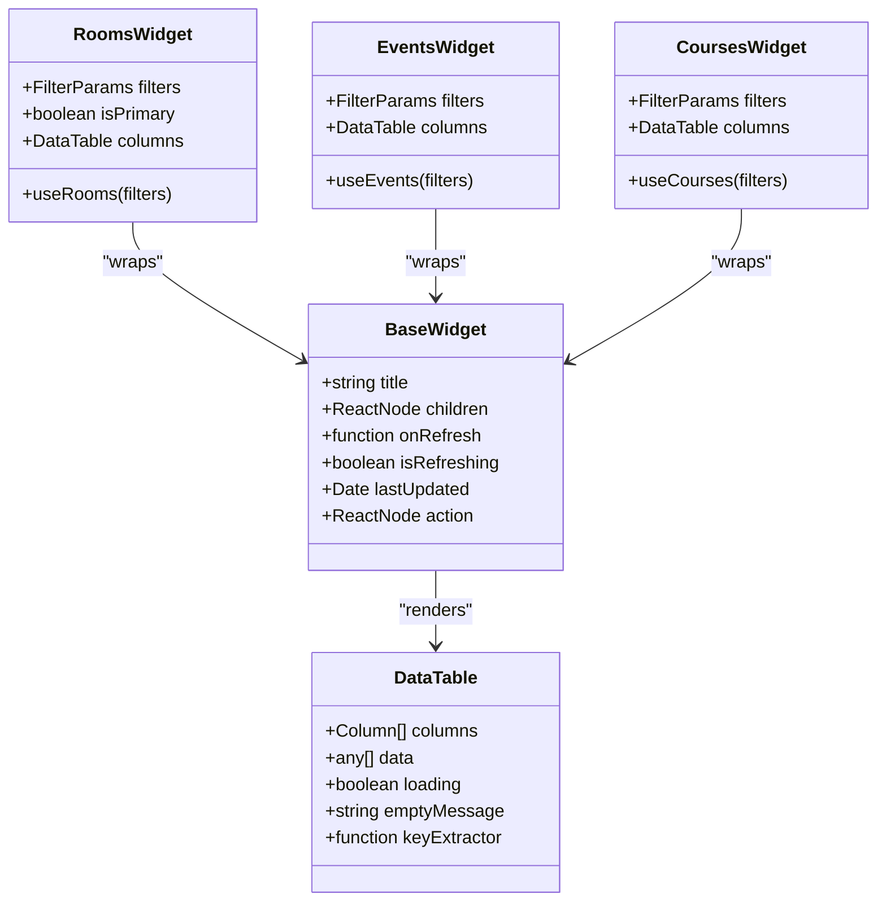
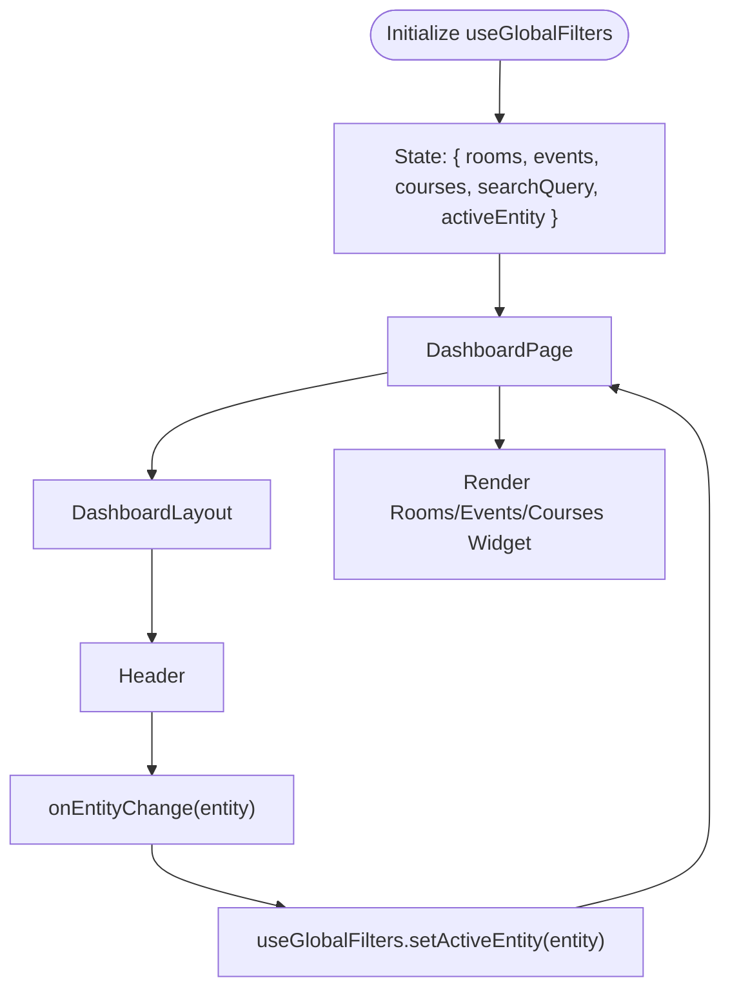
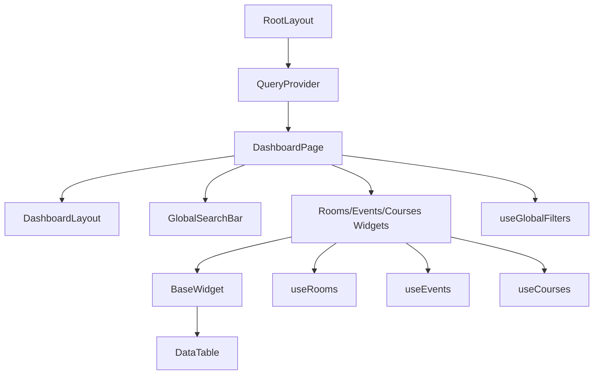
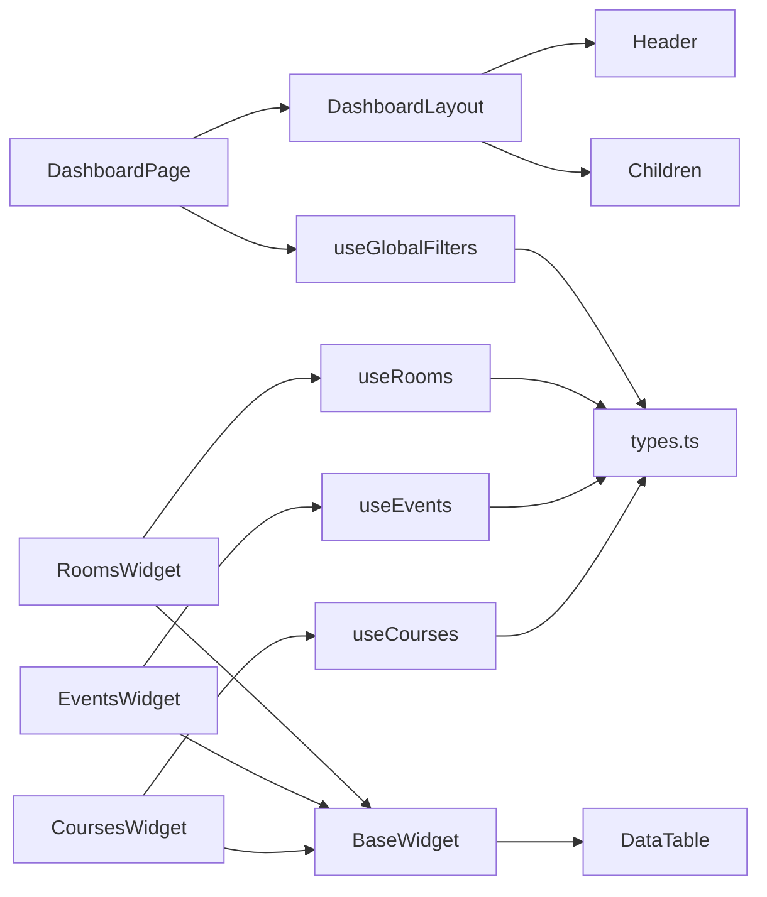

# Dashboard Layout System

<cite>
**Referenced Files in This Document**
- [DashboardLayout.tsx](file://src/components/layout/DashboardLayout.tsx)
- [Header.tsx](file://src/components/layout/Header.tsx)
- [page.tsx](file://src/app/page.tsx)
- [layout.tsx](file://src/app/layout.tsx)
- [useGlobalFilters.ts](file://src/hooks/useGlobalFilters.ts)
- [GlobalSearchBar.tsx](file://src/components/search/GlobalSearchBar.tsx)
- [RoomsWidget.tsx](file://src/components/widgets/RoomsWidget.tsx)
- [EventsWidget.tsx](file://src/components/widgets/EventsWidget.tsx)
- [CoursesWidget.tsx](file://src/components/widgets/CoursesWidget.tsx)
- [BaseWidget.tsx](file://src/components/widgets/BaseWidget.tsx)
- [DataTable.tsx](file://src/components/ui/DataTable.tsx)
- [types.ts](file://src/lib/api/types.ts)
- [QueryProvider.tsx](file://src/providers/QueryProvider.tsx)
- [useRooms.ts](file://src/hooks/useRooms.ts)
- [useEvents.ts](file://src/hooks/useEvents.ts)
- [useCourses.ts](file://src/hooks/useCourses.ts)
</cite>

## Table of Contents
1. [Introduction](#introduction)
2. [Project Structure](#project-structure)
3. [Core Components](#core-components)
4. [Architecture Overview](#architecture-overview)
5. [Detailed Component Analysis](#detailed-component-analysis)
6. [Dependency Analysis](#dependency-analysis)
7. [Performance Considerations](#performance-considerations)
8. [Troubleshooting Guide](#troubleshooting-guide)
9. [Conclusion](#conclusion)
10. [Appendices](#appendices)

## Introduction
This document describes the Dashboard Layout System, focusing on the DashboardLayout and Header components, their props, child rendering, and active entity management. It explains the layout hierarchy, container classes, and responsive design patterns. It also covers component composition, prop forwarding, integration with the overall dashboard architecture, styling conventions, accessibility considerations, and customization options for different entity contexts.

## Project Structure
The Dashboard Layout System resides under the components/layout directory and integrates with the page, hooks, widgets, and UI components. The global layout wraps the application with providers and fonts.

```mermaid
graph TB
subgraph "App Shell"
RootLayout["RootLayout<br/>(app/layout.tsx)"]
QueryProvider["QueryProvider<br/>(providers/QueryProvider.tsx)"]
end
subgraph "Dashboard Page"
DashboardPage["DashboardPage<br/>(app/page.tsx)"]
DashboardLayout["DashboardLayout<br/>(components/layout/DashboardLayout.tsx)"]
Header["Header<br/>(components/layout/Header.tsx)"]
end
subgraph "Widgets"
RoomsWidget["RoomsWidget<br/>(components/widgets/RoomsWidget.tsx)"]
EventsWidget["EventsWidget<br/>(components/widgets/EventsWidget.tsx)"]
CoursesWidget["CoursesWidget<br/>(components/widgets/CoursesWidget.tsx)"]
BaseWidget["BaseWidget<br/>(components/widgets/BaseWidget.tsx)"]
DataTable["DataTable<br/>(components/ui/DataTable.tsx)"]
end
subgraph "State & Hooks"
useGlobalFilters["useGlobalFilters<br/>(hooks/useGlobalFilters.ts)"]
useRooms["useRooms<br/>(hooks/useRooms.ts)"]
useEvents["useEvents<br/>(hooks/useEvents.ts)"]
useCourses["useCourses<br/>(hooks/useCourses.ts)"]
end
subgraph "Types"
Types["API Types<br/>(lib/api/types.ts)"]
end
RootLayout --> QueryProvider --> DashboardPage
DashboardPage --> DashboardLayout
DashboardLayout --> Header
DashboardPage --> RoomsWidget
DashboardPage --> EventsWidget
DashboardPage --> CoursesWidget
RoomsWidget --> BaseWidget
EventsWidget --> BaseWidget
CoursesWidget --> BaseWidget
BaseWidget --> DataTable
DashboardPage --> useGlobalFilters
RoomsWidget --> useRooms
EventsWidget --> useEvents
CoursesWidget --> useCourses
useGlobalFilters --> Types
useRooms --> Types
useEvents --> Types
useCourses --> Types
```

**Diagram sources**
- [layout.tsx:21-38](file://src/app/layout.tsx#L21-L38)
- [QueryProvider.tsx:15-34](file://src/providers/QueryProvider.tsx#L15-L34)
- [page.tsx:12-99](file://src/app/page.tsx#L12-L99)
- [DashboardLayout.tsx:12-25](file://src/components/layout/DashboardLayout.tsx#L12-L25)
- [Header.tsx:18-60](file://src/components/layout/Header.tsx#L18-L60)
- [RoomsWidget.tsx:15-96](file://src/components/widgets/RoomsWidget.tsx#L15-L96)
- [EventsWidget.tsx:14-115](file://src/components/widgets/EventsWidget.tsx#L14-L115)
- [CoursesWidget.tsx:14-120](file://src/components/widgets/CoursesWidget.tsx#L14-L120)
- [BaseWidget.tsx:15-57](file://src/components/widgets/BaseWidget.tsx#L15-L57)
- [DataTable.tsx:21-80](file://src/components/ui/DataTable.tsx#L21-L80)
- [useGlobalFilters.ts:14-78](file://src/hooks/useGlobalFilters.ts#L14-L78)
- [useRooms.ts:25-30](file://src/hooks/useRooms.ts#L25-L30)
- [useEvents.ts:25-30](file://src/hooks/useEvents.ts#L25-L30)
- [useCourses.ts:25-30](file://src/hooks/useCourses.ts#L25-L30)
- [types.ts:64-70](file://src/lib/api/types.ts#L64-L70)

**Section sources**
- [layout.tsx:21-38](file://src/app/layout.tsx#L21-L38)
- [page.tsx:12-99](file://src/app/page.tsx#L12-L99)

## Core Components
This section documents the primary layout components and their roles.

- DashboardLayout
  - Purpose: Provides the top-level layout shell with a header and a main content area.
  - Props:
    - children: ReactNode — content rendered inside the main area.
    - activeEntity: 'rooms' | 'events' | 'courses' — current active entity.
    - onEntityChange: (entity: 'rooms' | 'events' | 'courses') => void — handler invoked when the user switches entities via the header.
  - Rendering:
    - Renders the Header with activeEntity and onEntityChange.
    - Wraps children in a container with horizontal padding and vertical spacing.
  - Container classes:
    - Root container sets minimum height and background color.
    - Main content container centers content with horizontal padding and vertical spacing.

- Header
  - Purpose: Presents entity navigation with icons and labels, reflecting the active entity and invoking onEntityChange when clicked.
  - Props:
    - activeEntity: 'rooms' | 'events' | 'courses'
    - onEntityChange: (entity: 'rooms' | 'events' | 'courses') => void
  - Navigation items:
    - Rooms, Events, Courses — mapped to icons and labels.
  - Active state:
    - Uses activeEntity to determine which button is highlighted.
  - Styling:
    - Uses Tailwind utility classes for layout, spacing, colors, and transitions.

**Section sources**
- [DashboardLayout.tsx:6-25](file://src/components/layout/DashboardLayout.tsx#L6-L25)
- [Header.tsx:7-60](file://src/components/layout/Header.tsx#L7-L60)

## Architecture Overview
The Dashboard Layout System composes the layout shell around the dashboard page. The page manages global filters and active entity state, forwards them to DashboardLayout, which renders Header and passes callbacks down. The page conditionally renders entity-specific widgets based on activeEntity.



**Diagram sources**
- [Header.tsx:36-54](file://src/components/layout/Header.tsx#L36-L54)
- [page.tsx:12-99](file://src/app/page.tsx#L12-L99)
- [DashboardLayout.tsx:12-25](file://src/components/layout/DashboardLayout.tsx#L12-L25)
- [useGlobalFilters.ts:17-22](file://src/hooks/useGlobalFilters.ts#L17-L22)
- [RoomsWidget.tsx:15-96](file://src/components/widgets/RoomsWidget.tsx#L15-L96)
- [EventsWidget.tsx:14-115](file://src/components/widgets/EventsWidget.tsx#L14-L115)
- [CoursesWidget.tsx:14-120](file://src/components/widgets/CoursesWidget.tsx#L14-L120)

## Detailed Component Analysis

### DashboardLayout Component
- Structure:
  - Accepts children, activeEntity, and onEntityChange.
  - Renders Header with activeEntity and onEntityChange.
  - Renders children inside a container with horizontal padding and vertical spacing.
- Props interface:
  - children: ReactNode
  - activeEntity: 'rooms' | 'events' | 'courses'
  - onEntityChange: (entity: 'rooms' | 'events' | 'courses') => void
- Child rendering:
  - Passes children directly into the main content area.
- Active entity management:
  - Delegates active entity selection to Header; does not manage state itself.
- Styling and containers:
  - Root container sets min-height and background.
  - Main content container centers content with horizontal padding and vertical spacing.



**Diagram sources**
- [DashboardLayout.tsx:12-25](file://src/components/layout/DashboardLayout.tsx#L12-L25)

**Section sources**
- [DashboardLayout.tsx:6-25](file://src/components/layout/DashboardLayout.tsx#L6-L25)

### Header Component
- Role in entity navigation:
  - Provides three navigation buttons for rooms, events, and courses.
  - Uses activeEntity to highlight the current selection.
  - Invokes onEntityChange when a button is clicked.
- Active entity state:
  - Receives activeEntity as a prop.
  - Does not manage state; relies on parent to update it.
- Callback handling:
  - onEntityChange receives the selected entity and is called on button click.
- Styling and responsiveness:
  - Uses flexbox for alignment and spacing.
  - Responsive container with horizontal padding.
  - Hover and active states for interactive feedback.



**Diagram sources**
- [Header.tsx:36-54](file://src/components/layout/Header.tsx#L36-L54)

**Section sources**
- [Header.tsx:7-60](file://src/components/layout/Header.tsx#L7-L60)

### Entity-Specific Widgets and Data Flow
- RoomsWidget
  - Fetches room data using useRooms with current filters.
  - Renders a BaseWidget containing a DataTable with columns for name, building, capacity, and status.
  - Supports refresh via BaseWidget’s onRefresh and displays last updated time.
- EventsWidget
  - Fetches event data using useEvents with current filters.
  - Renders a BaseWidget containing a DataTable with columns for title, date/time, location, organizer, and status.
  - Supports refresh via BaseWidget’s onRefresh and displays last updated time.
- CoursesWidget
  - Fetches course data using useCourses with current filters.
  - Renders a BaseWidget containing a DataTable with columns for code/title, instructor, schedule, location, enrollment, and status.
  - Supports refresh via BaseWidget’s onRefresh and displays last updated time.
- BaseWidget
  - Provides a consistent widget shell with title, optional action slot, refresh button, and footer with last updated time.
  - Exposes onRefresh, isRefreshing, and lastUpdated props for integration with data hooks.
- DataTable
  - Generic table renderer with configurable columns, loading state, and empty message.
  - Uses keyExtractor to uniquely identify rows.



**Diagram sources**
- [BaseWidget.tsx:6-57](file://src/components/widgets/BaseWidget.tsx#L6-L57)
- [RoomsWidget.tsx:10-96](file://src/components/widgets/RoomsWidget.tsx#L10-L96)
- [EventsWidget.tsx:10-115](file://src/components/widgets/EventsWidget.tsx#L10-L115)
- [CoursesWidget.tsx:10-120](file://src/components/widgets/CoursesWidget.tsx#L10-L120)
- [DataTable.tsx:13-80](file://src/components/ui/DataTable.tsx#L13-L80)

**Section sources**
- [RoomsWidget.tsx:15-96](file://src/components/widgets/RoomsWidget.tsx#L15-L96)
- [EventsWidget.tsx:14-115](file://src/components/widgets/EventsWidget.tsx#L14-L115)
- [CoursesWidget.tsx:14-120](file://src/components/widgets/CoursesWidget.tsx#L14-L120)
- [BaseWidget.tsx:15-57](file://src/components/widgets/BaseWidget.tsx#L15-L57)
- [DataTable.tsx:21-80](file://src/components/ui/DataTable.tsx#L21-L80)

### Active Entity Management and Prop Forwarding
- State management:
  - useGlobalFilters maintains activeEntity and global filters for rooms, events, and courses.
  - setActiveEntity updates the active entity.
  - applyFilters updates filters for the specified entity and sets activeEntity.
  - getActiveFilters returns the filters for the currently active entity.
- Prop forwarding:
  - DashboardPage reads activeEntity and setActiveEntity from useGlobalFilters.
  - DashboardPage forwards activeEntity and setActiveEntity to DashboardLayout.
  - DashboardLayout forwards activeEntity and onEntityChange to Header.
  - Header invokes onEntityChange with the selected entity.
  - DashboardPage conditionally renders the appropriate widget based on activeEntity.



**Diagram sources**
- [useGlobalFilters.ts:14-78](file://src/hooks/useGlobalFilters.ts#L14-L78)
- [page.tsx:12-99](file://src/app/page.tsx#L12-L99)
- [DashboardLayout.tsx:12-25](file://src/components/layout/DashboardLayout.tsx#L12-L25)
- [Header.tsx:36-54](file://src/components/layout/Header.tsx#L36-L54)

**Section sources**
- [useGlobalFilters.ts:14-78](file://src/hooks/useGlobalFilters.ts#L14-L78)
- [page.tsx:12-99](file://src/app/page.tsx#L12-L99)

### Integration with Dashboard Architecture
- Provider stack:
  - RootLayout applies fonts and wraps children with QueryProvider.
  - QueryProvider configures React Query defaults including refetch intervals and retries.
- Page composition:
  - DashboardPage composes search, filters, and entity widgets.
  - Integrates GlobalSearchBar, FilterChips, and entity widgets.
- Data fetching:
  - useRooms, useEvents, useCourses integrate with API endpoints and React Query.
  - DataTable renders paginated and filtered data consistently.



**Diagram sources**
- [layout.tsx:21-38](file://src/app/layout.tsx#L21-L38)
- [QueryProvider.tsx:15-34](file://src/providers/QueryProvider.tsx#L15-L34)
- [page.tsx:12-99](file://src/app/page.tsx#L12-L99)
- [DashboardLayout.tsx:12-25](file://src/components/layout/DashboardLayout.tsx#L12-L25)
- [GlobalSearchBar.tsx:13-84](file://src/components/search/GlobalSearchBar.tsx#L13-L84)
- [RoomsWidget.tsx:15-96](file://src/components/widgets/RoomsWidget.tsx#L15-L96)
- [EventsWidget.tsx:14-115](file://src/components/widgets/EventsWidget.tsx#L14-L115)
- [CoursesWidget.tsx:14-120](file://src/components/widgets/CoursesWidget.tsx#L14-L120)
- [BaseWidget.tsx:15-57](file://src/components/widgets/BaseWidget.tsx#L15-L57)
- [DataTable.tsx:21-80](file://src/components/ui/DataTable.tsx#L21-L80)
- [useGlobalFilters.ts:14-78](file://src/hooks/useGlobalFilters.ts#L14-L78)
- [useRooms.ts:25-30](file://src/hooks/useRooms.ts#L25-L30)
- [useEvents.ts:25-30](file://src/hooks/useEvents.ts#L25-L30)
- [useCourses.ts:25-30](file://src/hooks/useCourses.ts#L25-L30)

**Section sources**
- [layout.tsx:21-38](file://src/app/layout.tsx#L21-L38)
- [QueryProvider.tsx:15-34](file://src/providers/QueryProvider.tsx#L15-L34)
- [page.tsx:12-99](file://src/app/page.tsx#L12-L99)

## Dependency Analysis
- DashboardLayout depends on Header and renders children.
- Header depends on activeEntity and onEntityChange props.
- DashboardPage composes DashboardLayout and manages activeEntity via useGlobalFilters.
- Widgets depend on BaseWidget and DataTable; BaseWidget depends on DataTable.
- Data hooks (useRooms, useEvents, useCourses) depend on API types and React Query.



**Diagram sources**
- [DashboardLayout.tsx:12-25](file://src/components/layout/DashboardLayout.tsx#L12-L25)
- [Header.tsx:18-60](file://src/components/layout/Header.tsx#L18-L60)
- [page.tsx:12-99](file://src/app/page.tsx#L12-L99)
- [useGlobalFilters.ts:14-78](file://src/hooks/useGlobalFilters.ts#L14-L78)
- [RoomsWidget.tsx:15-96](file://src/components/widgets/RoomsWidget.tsx#L15-L96)
- [EventsWidget.tsx:14-115](file://src/components/widgets/EventsWidget.tsx#L14-L115)
- [CoursesWidget.tsx:14-120](file://src/components/widgets/CoursesWidget.tsx#L14-L120)
- [BaseWidget.tsx:15-57](file://src/components/widgets/BaseWidget.tsx#L15-L57)
- [DataTable.tsx:21-80](file://src/components/ui/DataTable.tsx#L21-L80)
- [useRooms.ts:25-30](file://src/hooks/useRooms.ts#L25-L30)
- [useEvents.ts:25-30](file://src/hooks/useEvents.ts#L25-L30)
- [useCourses.ts:25-30](file://src/hooks/useCourses.ts#L25-L30)
- [types.ts:64-70](file://src/lib/api/types.ts#L64-L70)

**Section sources**
- [DashboardLayout.tsx:12-25](file://src/components/layout/DashboardLayout.tsx#L12-L25)
- [Header.tsx:18-60](file://src/components/layout/Header.tsx#L18-L60)
- [page.tsx:12-99](file://src/app/page.tsx#L12-L99)
- [useGlobalFilters.ts:14-78](file://src/hooks/useGlobalFilters.ts#L14-L78)
- [RoomsWidget.tsx:15-96](file://src/components/widgets/RoomsWidget.tsx#L15-L96)
- [EventsWidget.tsx:14-115](file://src/components/widgets/EventsWidget.tsx#L14-L115)
- [CoursesWidget.tsx:14-120](file://src/components/widgets/CoursesWidget.tsx#L14-L120)
- [BaseWidget.tsx:15-57](file://src/components/widgets/BaseWidget.tsx#L15-L57)
- [DataTable.tsx:21-80](file://src/components/ui/DataTable.tsx#L21-L80)
- [useRooms.ts:25-30](file://src/hooks/useRooms.ts#L25-L30)
- [useEvents.ts:25-30](file://src/hooks/useEvents.ts#L25-L30)
- [useCourses.ts:25-30](file://src/hooks/useCourses.ts#L25-L30)
- [types.ts:64-70](file://src/lib/api/types.ts#L64-L70)

## Performance Considerations
- Data fetching:
  - React Query is configured with a default refetch interval and retry delays to balance freshness and network load.
  - Queries use queryKey arrays to enable cache partitioning per entity and filters.
- Rendering:
  - Conditional rendering of widgets based on activeEntity reduces unnecessary component instantiation.
  - DataTable supports loading and empty states to avoid heavy computations during transitions.
- Accessibility:
  - Buttons use semantic attributes and hover/focus states for keyboard navigation.
  - Icons are accompanied by labels for clarity.

[No sources needed since this section provides general guidance]

## Troubleshooting Guide
- Entity navigation not updating:
  - Verify onEntityChange is passed from DashboardPage to DashboardLayout and from DashboardLayout to Header.
  - Confirm setActiveEntity updates the activeEntity in useGlobalFilters.
- Widgets not refreshing:
  - Ensure BaseWidget’s onRefresh triggers refetch from the respective data hook.
  - Check that dataUpdatedAt is provided by the data hook and formatted correctly.
- Search not applying filters:
  - Confirm GlobalSearchBar calls onSearch with parsed filters and entity.
  - Verify applyFilters updates filters for the correct entity and activeEntity.

**Section sources**
- [Header.tsx:36-54](file://src/components/layout/Header.tsx#L36-L54)
- [page.tsx:12-99](file://src/app/page.tsx#L12-L99)
- [useGlobalFilters.ts:17-37](file://src/hooks/useGlobalFilters.ts#L17-L37)
- [BaseWidget.tsx:30-40](file://src/components/widgets/BaseWidget.tsx#L30-L40)
- [GlobalSearchBar.tsx:21-54](file://src/components/search/GlobalSearchBar.tsx#L21-L54)

## Conclusion
The Dashboard Layout System provides a clean separation of concerns: DashboardLayout handles layout and passes active entity state to Header, which controls navigation. DashboardPage manages global state and renders entity-specific widgets. The system leverages React Query for data fetching, BaseWidget for consistent widget shells, and DataTable for tabular rendering. Styling follows Tailwind utility classes, and accessibility is addressed through semantic markup and interactive states.

[No sources needed since this section summarizes without analyzing specific files]

## Appendices

### Styling Conventions
- Layout containers:
  - Root container sets min-height and background color.
  - Main content container centers content with horizontal padding and vertical spacing.
- Header:
  - Uses flexbox for alignment and spacing.
  - Responsive container with horizontal padding.
  - Hover and active states for interactive feedback.
- Widgets:
  - Consistent card-like appearance with rounded corners, shadows, and borders.
  - Title bar with action slots and refresh controls.
  - Footer with last updated timestamps.

**Section sources**
- [DashboardLayout.tsx:18-22](file://src/components/layout/DashboardLayout.tsx#L18-L22)
- [Header.tsx:20-58](file://src/components/layout/Header.tsx#L20-L58)
- [BaseWidget.tsx:24-54](file://src/components/widgets/BaseWidget.tsx#L24-L54)

### Accessibility Considerations
- Interactive elements:
  - Buttons use hover and focus states for keyboard navigation.
  - Icons are paired with text labels for clarity.
- Feedback:
  - Loading indicators and disabled states communicate state changes.
  - Clear visual feedback for active selections.

**Section sources**
- [Header.tsx:44-48](file://src/components/layout/Header.tsx#L44-L48)
- [BaseWidget.tsx:31-40](file://src/components/widgets/BaseWidget.tsx#L31-L40)
- [GlobalSearchBar.tsx:74-75](file://src/components/search/GlobalSearchBar.tsx#L74-L75)

### Customization Options
- Entity contexts:
  - Extend the entity type union to support additional contexts.
  - Add new navigation items in Header and corresponding widgets in the page.
- Styling:
  - Adjust Tailwind classes to match brand guidelines.
  - Customize widget headers and footers for different contexts.
- Data fetching:
  - Integrate new API endpoints via dedicated hooks following the existing patterns.

**Section sources**
- [types.ts:73-73](file://src/lib/api/types.ts#L73-L73)
- [Header.tsx:12-16](file://src/components/layout/Header.tsx#L12-L16)
- [page.tsx:58-76](file://src/app/page.tsx#L58-L76)