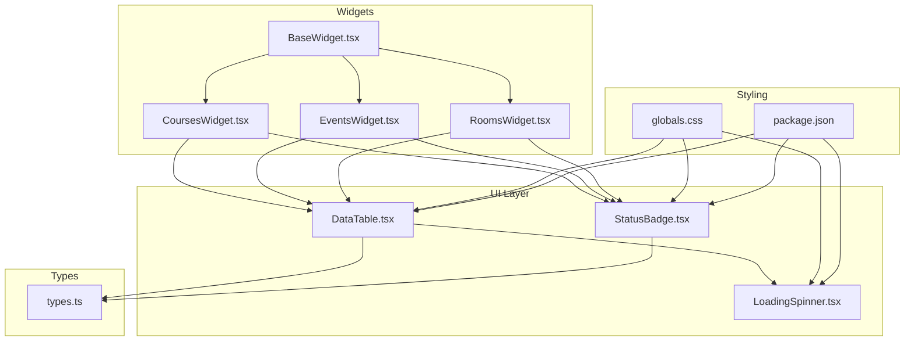
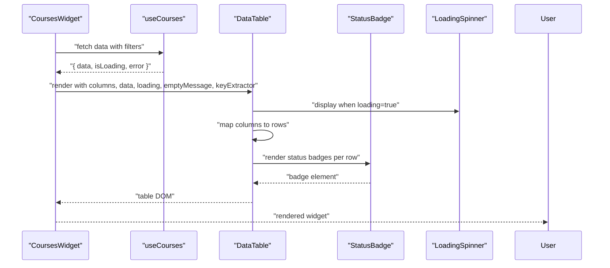
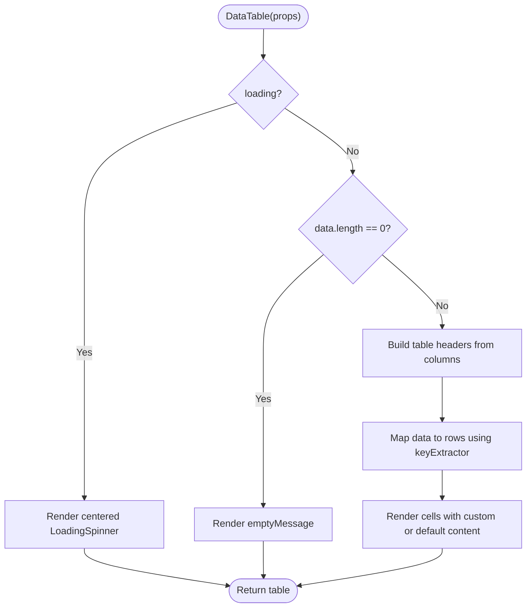
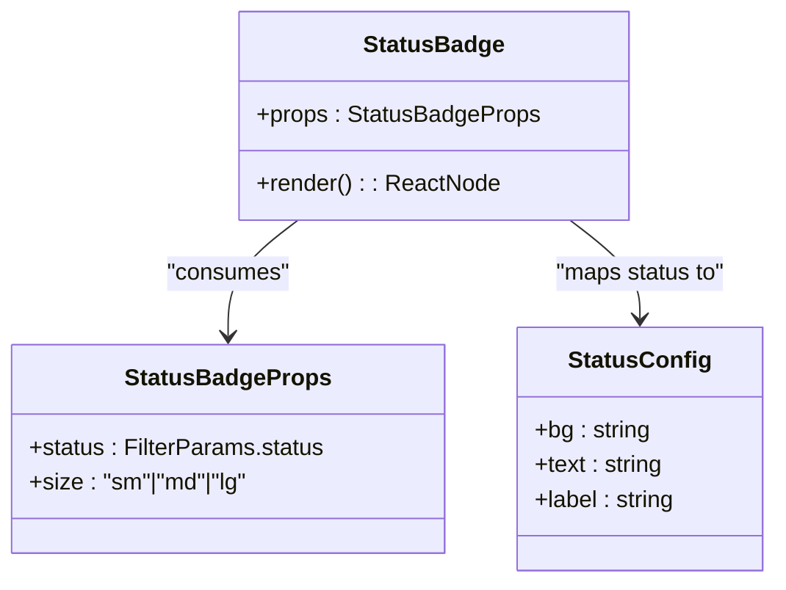
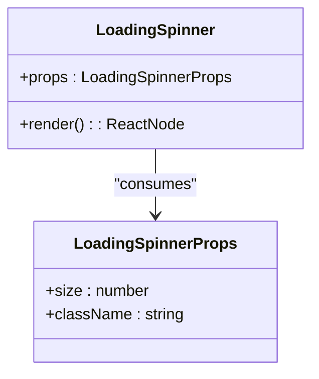
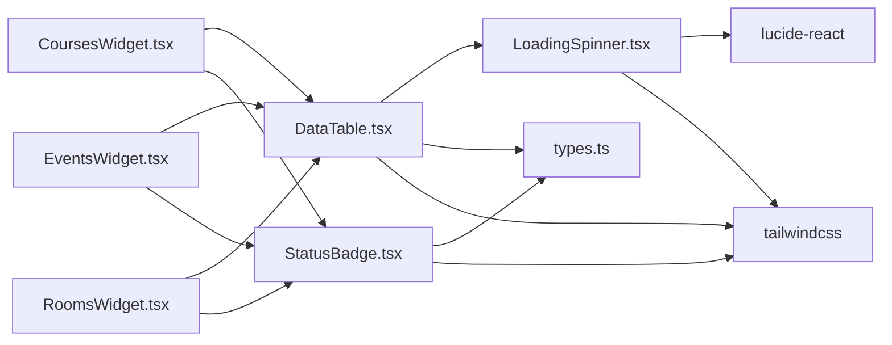

# Data Display Components

<cite>
**Referenced Files in This Document**
- [DataTable.tsx](file://src/components/ui/DataTable.tsx)
- [StatusBadge.tsx](file://src/components/ui/StatusBadge.tsx)
- [LoadingSpinner.tsx](file://src/components/ui/LoadingSpinner.tsx)
- [globals.css](file://src/app/globals.css)
- [package.json](file://package.json)
- [types.ts](file://src/lib/api/types.ts)
- [CoursesWidget.tsx](file://src/components/widgets/CoursesWidget.tsx)
- [EventsWidget.tsx](file://src/components/widgets/EventsWidget.tsx)
- [RoomsWidget.tsx](file://src/components/widgets/RoomsWidget.tsx)
- [BaseWidget.tsx](file://src/components/widgets/BaseWidget.tsx)
</cite>

## Table of Contents
1. [Introduction](#introduction)
2. [Project Structure](#project-structure)
3. [Core Components](#core-components)
4. [Architecture Overview](#architecture-overview)
5. [Detailed Component Analysis](#detailed-component-analysis)
6. [Dependency Analysis](#dependency-analysis)
7. [Performance Considerations](#performance-considerations)
8. [Accessibility and Cross-Browser Compliance](#accessibility-and-cross-browser-compliance)
9. [Usage Examples](#usage-examples)
10. [Troubleshooting Guide](#troubleshooting-guide)
11. [Conclusion](#conclusion)

## Introduction
This document provides comprehensive documentation for the Data Display Components suite, focusing on three UI primitives:
- DataTable: A flexible tabular data renderer with loading and empty states, designed for responsive layouts.
- StatusBadge: A concise visual indicator for status values with color coding and configurable sizing.
- LoadingSpinner: A lightweight spinner component for asynchronous operation feedback.

These components integrate with the application’s widget system to present structured data across courses, events, and rooms, while leveraging Tailwind CSS for styling and Lucide icons for visual cues.

## Project Structure
The Data Display Components reside under the UI module and are consumed by the widget layer. The styling system is powered by Tailwind CSS v4, and the project uses Next.js 16 with TypeScript.

**Diagram sources**
- [DataTable.tsx:1-81](file://src/components/ui/DataTable.tsx#L1-L81)
- [StatusBadge.tsx:1-78](file://src/components/ui/StatusBadge.tsx#L1-L78)
- [LoadingSpinner.tsx:1-17](file://src/components/ui/LoadingSpinner.tsx#L1-L17)
- [CoursesWidget.tsx:1-125](file://src/components/widgets/CoursesWidget.tsx#L1-L125)
- [EventsWidget.tsx:1-120](file://src/components/widgets/EventsWidget.tsx#L1-L120)
- [RoomsWidget.tsx:1-101](file://src/components/widgets/RoomsWidget.tsx#L1-L101)
- [BaseWidget.tsx:1-68](file://src/components/widgets/BaseWidget.tsx#L1-L68)
- [globals.css:1-27](file://src/app/globals.css#L1-L27)
- [package.json:1-29](file://package.json#L1-L29)
- [types.ts:1-99](file://src/lib/api/types.ts#L1-L99)

**Section sources**
- [globals.css:1-27](file://src/app/globals.css#L1-L27)
- [package.json:1-29](file://package.json#L1-L29)

## Core Components
This section documents the props, behavior, styling hooks, and customization options for each component.

- DataTable
  - Purpose: Render tabular data with optional loading and empty states.
  - Props:
    - columns: Array of column descriptors with key, header, optional width, and optional render function.
    - data: Array of row items to render.
    - loading: Boolean flag to show a centered loading spinner.
    - emptyMessage: Message to display when data is empty.
    - keyExtractor: Function to derive a unique key per row item.
  - Behavior:
    - Displays a centered LoadingSpinner when loading is true.
    - Renders an empty message when data length is zero.
    - Otherwise renders a responsive table with headers and rows.
  - Styling hooks:
    - Uses Tailwind utility classes for spacing, borders, hover effects, and responsive horizontal scrolling.
  - Customization:
    - Provide a render function per column to customize cell content.
    - Control column widths via width property.
    - Override empty message via prop.
  - Accessibility:
    - Uses semantic table markup and th scope attributes for headers.
  - Performance:
    - Renders only visible rows; consider virtualization for very large datasets.

- StatusBadge
  - Purpose: Display a status value as a colored, rounded badge with optional sizing.
  - Props:
    - status: One of the supported status values from FilterParams.
    - size: Optional size variant (sm, md, lg).
  - Behavior:
    - Maps status to background, text color, and label using an internal configuration.
    - Returns null if status is falsy.
  - Styling hooks:
    - Uses Tailwind color utilities and padding/typography classes.
  - Customization:
    - Extend the internal statusConfig to support additional statuses.
    - Adjust size classes to match brand guidelines.
  - Accessibility:
    - Renders a span; ensure sufficient color contrast for text/background combinations.

- LoadingSpinner
  - Purpose: Provide a consistent spinner indicator during async operations.
  - Props:
    - size: Numeric icon size.
    - className: Additional container classes for alignment or layout.
  - Behavior:
    - Renders a spinning loader icon centered in its container.
  - Styling hooks:
    - Uses Tailwind for centering and icon color.
  - Customization:
    - Change size and container classes to fit different contexts.

**Section sources**
- [DataTable.tsx:13-19](file://src/components/ui/DataTable.tsx#L13-L19)
- [DataTable.tsx:21-80](file://src/components/ui/DataTable.tsx#L21-L80)
- [StatusBadge.tsx:7-10](file://src/components/ui/StatusBadge.tsx#L7-L10)
- [StatusBadge.tsx:61-77](file://src/components/ui/StatusBadge.tsx#L61-L77)
- [LoadingSpinner.tsx:5-8](file://src/components/ui/LoadingSpinner.tsx#L5-L8)
- [LoadingSpinner.tsx:10-16](file://src/components/ui/LoadingSpinner.tsx#L10-L16)

## Architecture Overview
The widgets orchestrate data fetching and pass structured data to DataTable, which renders rows and cells. StatusBadge is embedded within DataTable columns to visualize status values. LoadingSpinner appears when the table is in a loading state.

**Diagram sources**
- [CoursesWidget.tsx:15-124](file://src/components/widgets/CoursesWidget.tsx#L15-L124)
- [DataTable.tsx:21-80](file://src/components/ui/DataTable.tsx#L21-L80)
- [StatusBadge.tsx:61-77](file://src/components/ui/StatusBadge.tsx#L61-L77)
- [LoadingSpinner.tsx:10-16](file://src/components/ui/LoadingSpinner.tsx#L10-L16)

## Detailed Component Analysis

### DataTable Component
- Implementation highlights:
  - Conditional rendering for loading and empty states.
  - Responsive design via horizontal overflow wrapper.
  - Column-driven rendering with optional custom renderers.
  - Row key extraction via a provided function.
- Data model mapping:
  - Accepts generic data items; columns define how to extract or render fields.
- Rendering pipeline:
  - Header row built from column definitions.
  - Body rows mapped from data array using keyExtractor.
  - Cells either use custom renderers or default property access.

**Diagram sources**
- [DataTable.tsx:21-80](file://src/components/ui/DataTable.tsx#L21-L80)

**Section sources**
- [DataTable.tsx:1-81](file://src/components/ui/DataTable.tsx#L1-L81)

### StatusBadge Component
- Implementation highlights:
  - Type-safe status mapping using FilterParams status union.
  - Configurable size classes for consistent spacing.
  - Graceful fallback for unknown statuses.
- Color coding:
  - Background and text colors selected per status category.
- Integration:
  - Used within DataTable columns to visualize item statuses.

**Diagram sources**
- [StatusBadge.tsx:7-10](file://src/components/ui/StatusBadge.tsx#L7-L10)
- [StatusBadge.tsx:12-53](file://src/components/ui/StatusBadge.tsx#L12-L53)
- [StatusBadge.tsx:61-77](file://src/components/ui/StatusBadge.tsx#L61-L77)

**Section sources**
- [StatusBadge.tsx:1-78](file://src/components/ui/StatusBadge.tsx#L1-L78)
- [types.ts:49-61](file://src/lib/api/types.ts#L49-L61)

### LoadingSpinner Component
- Implementation highlights:
  - Thin wrapper around a spinning icon with configurable size and container classes.
- Integration:
  - Used by DataTable during loading states.

**Diagram sources**
- [LoadingSpinner.tsx:5-8](file://src/components/ui/LoadingSpinner.tsx#L5-L8)
- [LoadingSpinner.tsx:10-16](file://src/components/ui/LoadingSpinner.tsx#L10-L16)

**Section sources**
- [LoadingSpinner.tsx:1-17](file://src/components/ui/LoadingSpinner.tsx#L1-L17)

## Dependency Analysis
- Internal dependencies:
  - DataTable depends on LoadingSpinner for loading visuals.
  - StatusBadge is used by widget components to render status indicators.
- External dependencies:
  - Tailwind CSS v4 for utility-first styling.
  - Lucide React for icons.
- Type dependencies:
  - StatusBadge relies on FilterParams status union from shared types.

**Diagram sources**
- [DataTable.tsx:4-4](file://src/components/ui/DataTable.tsx#L4-L4)
- [StatusBadge.tsx:3-3](file://src/components/ui/StatusBadge.tsx#L3-L3)
- [LoadingSpinner.tsx:3-3](file://src/components/ui/LoadingSpinner.tsx#L3-L3)
- [CoursesWidget.tsx:5-6](file://src/components/widgets/CoursesWidget.tsx#L5-L6)
- [EventsWidget.tsx:5-6](file://src/components/widgets/EventsWidget.tsx#L5-L6)
- [RoomsWidget.tsx:5-6](file://src/components/widgets/RoomsWidget.tsx#L5-L6)
- [package.json:11-16](file://package.json#L11-L16)

**Section sources**
- [package.json:11-16](file://package.json#L11-L16)
- [types.ts:49-61](file://src/lib/api/types.ts#L49-L61)

## Performance Considerations
- DataTable
  - Rendering scale: The current implementation maps over data and columns for each row. For large datasets, consider:
    - Virtualization to render only visible rows.
    - Pagination to reduce DOM nodes.
    - Memoization of render functions to avoid unnecessary re-renders.
- StatusBadge
  - Mapping lookup is O(1); performance is negligible.
  - Avoid excessive re-renders by memoizing props upstream.
- LoadingSpinner
  - Lightweight; minimal performance impact.
- Styling
  - Tailwind utilities are applied at build time; ensure purge configuration avoids unused classes in production builds.

[No sources needed since this section provides general guidance]

## Accessibility and Cross-Browser Compliance
- Accessibility
  - DataTable uses semantic table markup with proper header scoping, aiding screen readers in understanding column relationships.
  - StatusBadge renders a span; ensure sufficient color contrast for text and background pairs.
  - LoadingSpinner uses a centered layout; ensure focus management and ARIA labels are added where appropriate in higher-level containers.
- Cross-browser compatibility
  - Tailwind CSS v4 and Next.js 16 provide broad browser support.
  - Icons from Lucide React are SVG-based and widely compatible.
  - No legacy JavaScript polyfills are required for these components.

[No sources needed since this section provides general guidance]

## Usage Examples
Below are practical usage patterns derived from the widget implementations.

- Courses table with status badges
  - Columns include course code, title, instructor, schedule, location, enrollment, and status.
  - Status rendered via StatusBadge with small size.
  - Empty state message customized to “No courses found matching your criteria”.
  - Key extractor uses course id.

- Events table with formatted dates and status badges
  - Custom date formatter displays localized date/time.
  - Status rendered via StatusBadge with small size.
  - Empty state message customized to “No events found matching your criteria”.

- Rooms table with capacity and status badges
  - Features preview and capacity display.
  - Status rendered via StatusBadge with small size.
  - Empty state message customized to “No rooms found matching your criteria”.

- Widget integration
  - Each widget wraps DataTable inside BaseWidget, which provides a consistent header, refresh action, and last-updated footer.

**Section sources**
- [CoursesWidget.tsx:19-89](file://src/components/widgets/CoursesWidget.tsx#L19-L89)
- [CoursesWidget.tsx:115-121](file://src/components/widgets/CoursesWidget.tsx#L115-L121)
- [EventsWidget.tsx:29-84](file://src/components/widgets/EventsWidget.tsx#L29-L84)
- [EventsWidget.tsx:110-116](file://src/components/widgets/EventsWidget.tsx#L110-L116)
- [RoomsWidget.tsx:20-65](file://src/components/widgets/RoomsWidget.tsx#L20-L65)
- [RoomsWidget.tsx:91-97](file://src/components/widgets/RoomsWidget.tsx#L91-L97)
- [BaseWidget.tsx:16-67](file://src/components/widgets/BaseWidget.tsx#L16-L67)

## Troubleshooting Guide
- DataTable shows empty state unexpectedly
  - Verify data is an array and not null/undefined.
  - Confirm keyExtractor returns unique, stable identifiers.
  - Check that emptyMessage is intentionally set.
- StatusBadge does not render
  - Ensure status matches one of the supported values from FilterParams.
  - If using an unsupported status, the component returns null; extend statusConfig accordingly.
- LoadingSpinner not visible
  - Ensure loading prop is true and passed to DataTable.
  - Confirm container has adequate height for centered layout.
- Styling inconsistencies
  - Verify Tailwind utilities are applied and not overridden by conflicting styles.
  - Check globals.css for theme overrides affecting colors or fonts.

**Section sources**
- [DataTable.tsx:28-42](file://src/components/ui/DataTable.tsx#L28-L42)
- [StatusBadge.tsx:61-68](file://src/components/ui/StatusBadge.tsx#L61-L68)
- [LoadingSpinner.tsx:10-16](file://src/components/ui/LoadingSpinner.tsx#L10-L16)
- [globals.css:1-27](file://src/app/globals.css#L1-L27)

## Conclusion
The Data Display Components suite delivers a cohesive, accessible, and extensible foundation for rendering tabular data, status indicators, and async feedback. DataTable’s column-driven design and responsive layout, combined with StatusBadge’s color-coded semantics and LoadingSpinner’s consistent feedback, enable rapid development of data-rich pages. By following the usage patterns and performance recommendations outlined here, teams can maintain high-quality UX across diverse datasets and browsers.