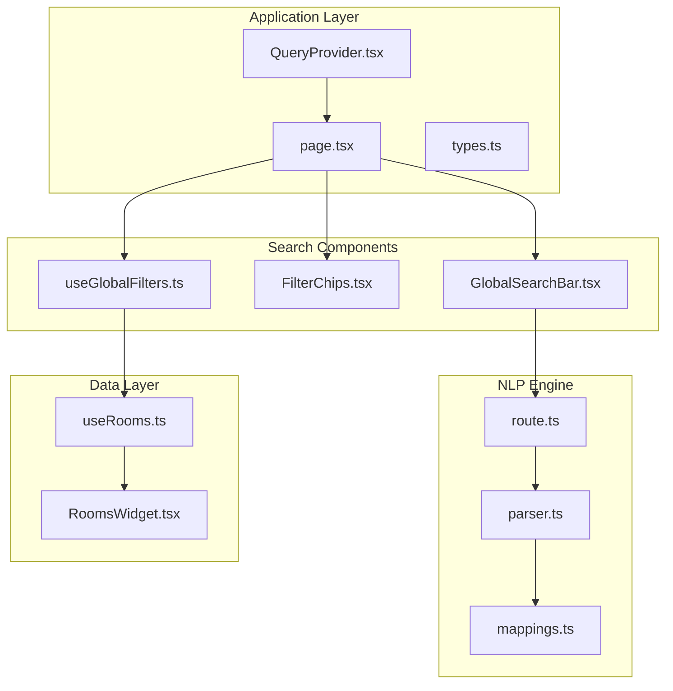
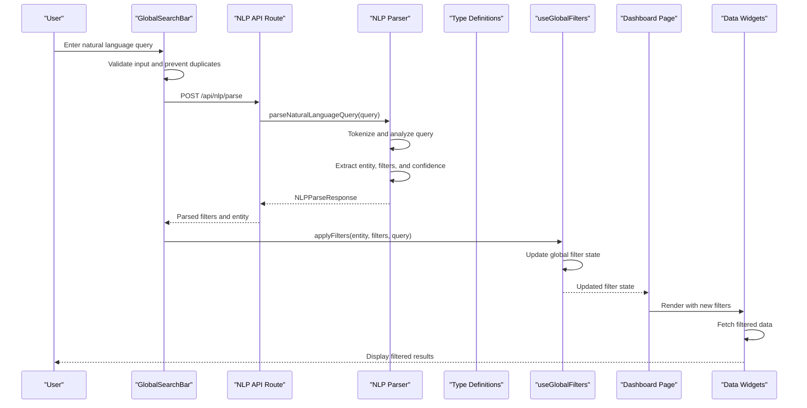
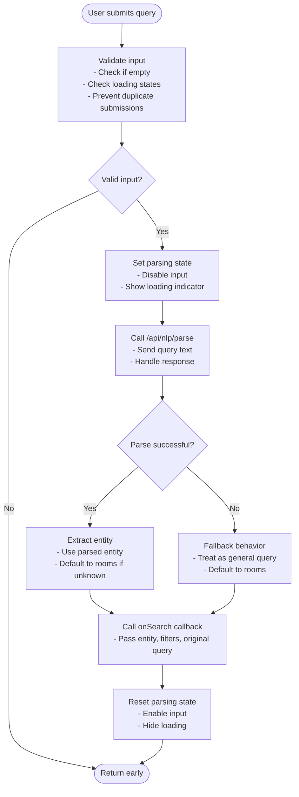
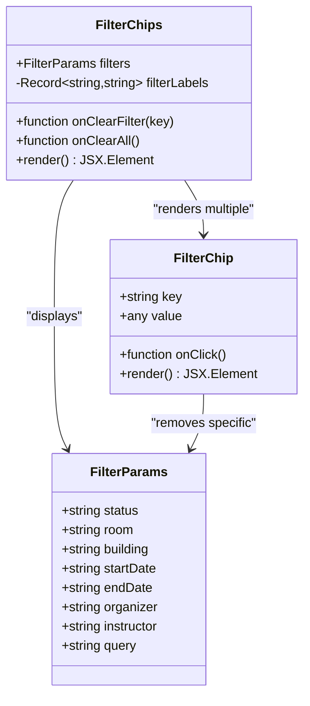
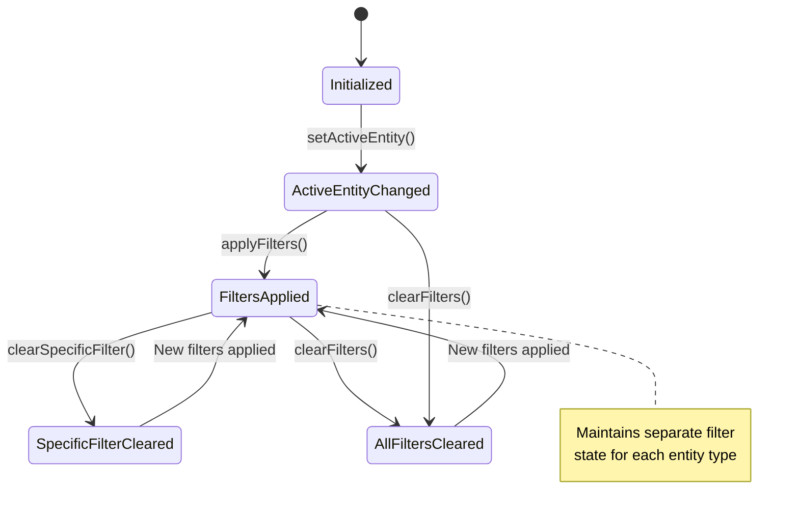
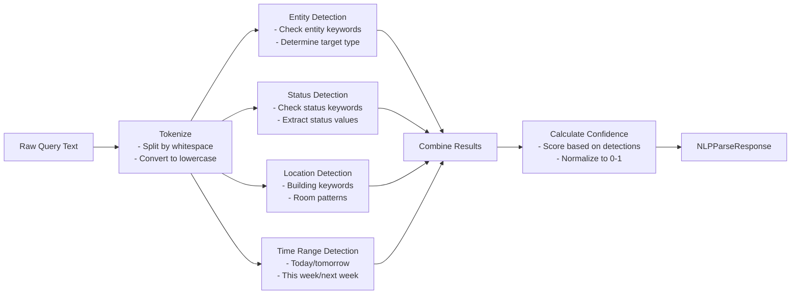
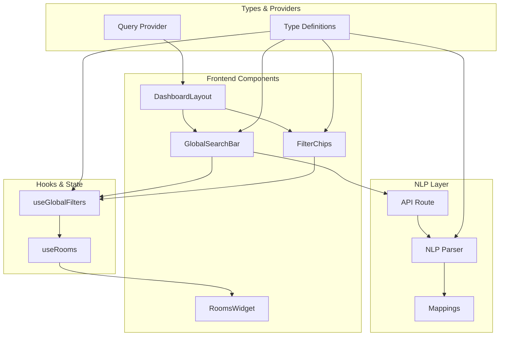

# Search and Filter System

<cite>
**Referenced Files in This Document**
- [GlobalSearchBar.tsx](file://src/components/search/GlobalSearchBar.tsx)
- [FilterChips.tsx](file://src/components/search/FilterChips.tsx)
- [useGlobalFilters.ts](file://src/hooks/useGlobalFilters.ts)
- [parser.ts](file://src/lib/nlp/parser.ts)
- [mappings.ts](file://src/lib/nlp/mappings.ts)
- [route.ts](file://src/app/api/nlp/parse/route.ts)
- [types.ts](file://src/lib/api/types.ts)
- [page.tsx](file://src/app/page.tsx)
- [QueryProvider.tsx](file://src/providers/QueryProvider.tsx)
- [RoomsWidget.tsx](file://src/components/widgets/RoomsWidget.tsx)
- [useRooms.ts](file://src/hooks/useRooms.ts)
- [DashboardLayout.tsx](file://src/components/layout/DashboardLayout.tsx)
</cite>

## Table of Contents
1. [Introduction](#introduction)
2. [Project Structure](#project-structure)
3. [Core Components](#core-components)
4. [Architecture Overview](#architecture-overview)
5. [Detailed Component Analysis](#detailed-component-analysis)
6. [Dependency Analysis](#dependency-analysis)
7. [Performance Considerations](#performance-considerations)
8. [Accessibility Features](#accessibility-features)
9. [Responsive Behavior](#responsive-behavior)
10. [Supported Query Patterns](#supported-query-patterns)
11. [Troubleshooting Guide](#troubleshooting-guide)
12. [Conclusion](#conclusion)

## Introduction

The Search and Filter System in Course Puppy provides a comprehensive natural language processing (NLP) powered search experience that allows users to discover rooms, events, and courses through intuitive voice-like queries. The system combines a natural language parser with interactive filter chips to create an intelligent search interface that understands user intent and maintains persistent filter states across different entity types.

The system consists of three primary components: the GlobalSearchBar for natural language input, the FilterChips component for displaying active filters, and the useGlobalFilters hook for managing global filter state. These components work together to provide a seamless search experience with real-time feedback and persistent filter management.

## Project Structure

The Search and Filter System is organized into several key areas within the Course Puppy application:

**Diagram sources**
- [GlobalSearchBar.tsx:1-85](file://src/components/search/GlobalSearchBar.tsx#L1-L85)
- [FilterChips.tsx:1-60](file://src/components/search/FilterChips.tsx#L1-L60)
- [useGlobalFilters.ts:1-79](file://src/hooks/useGlobalFilters.ts#L1-L79)
- [parser.ts:1-202](file://src/lib/nlp/parser.ts#L1-L202)
- [mappings.ts:1-45](file://src/lib/nlp/mappings.ts#L1-L45)
- [route.ts:1-30](file://src/app/api/nlp/parse/route.ts#L1-L30)
- [page.tsx:1-100](file://src/app/page.tsx#L1-L100)
- [types.ts:1-99](file://src/lib/api/types.ts#L1-L99)
- [QueryProvider.tsx:1-35](file://src/providers/QueryProvider.tsx#L1-L35)
- [RoomsWidget.tsx:1-97](file://src/components/widgets/RoomsWidget.tsx#L1-L97)
- [useRooms.ts:1-31](file://src/hooks/useRooms.ts#L1-L31)

**Section sources**
- [page.tsx:12-100](file://src/app/page.tsx#L12-L100)
- [GlobalSearchBar.tsx:13-85](file://src/components/search/GlobalSearchBar.tsx#L13-L85)
- [FilterChips.tsx:23-60](file://src/components/search/FilterChips.tsx#L23-L60)
- [useGlobalFilters.ts:14-79](file://src/hooks/useGlobalFilters.ts#L14-L79)

## Core Components

The Search and Filter System is built around three core components that work together to provide a cohesive user experience:

### GlobalSearchBar Component
The GlobalSearchBar serves as the primary entry point for natural language queries. It provides an input field with integrated loading states, error handling, and automatic NLP parsing through the backend API.

### FilterChips Component
The FilterChips component displays active filters as interactive chips with remove functionality. It provides visual feedback of current search criteria and allows users to easily modify or clear filters.

### useGlobalFilters Hook
The useGlobalFilters hook manages the global filter state across all entity types (rooms, events, courses). It provides methods for applying filters, clearing specific filters, and maintaining persistent state during entity transitions.

**Section sources**
- [GlobalSearchBar.tsx:13-85](file://src/components/search/GlobalSearchBar.tsx#L13-L85)
- [FilterChips.tsx:23-60](file://src/components/search/FilterChips.tsx#L23-L60)
- [useGlobalFilters.ts:14-79](file://src/hooks/useGlobalFilters.ts#L14-L79)

## Architecture Overview

The Search and Filter System follows a client-server architecture with NLP processing handled server-side:

**Diagram sources**
- [GlobalSearchBar.tsx:21-54](file://src/components/search/GlobalSearchBar.tsx#L21-L54)
- [route.ts:5-29](file://src/app/api/nlp/parse/route.ts#L5-L29)
- [parser.ts:155-201](file://src/lib/nlp/parser.ts#L155-L201)
- [useGlobalFilters.ts:24-37](file://src/hooks/useGlobalFilters.ts#L24-L37)
- [page.tsx:24-26](file://src/app/page.tsx#L24-L26)

The architecture ensures separation of concerns with the frontend handling user interaction and state management, while the backend handles complex NLP processing and data fetching.

**Section sources**
- [parser.ts:155-201](file://src/lib/nlp/parser.ts#L155-L201)
- [route.ts:5-29](file://src/app/api/nlp/parse/route.ts#L5-L29)
- [useGlobalFilters.ts:24-37](file://src/hooks/useGlobalFilters.ts#L24-L37)

## Detailed Component Analysis

### GlobalSearchBar Component Analysis

The GlobalSearchBar component implements a sophisticated natural language processing workflow:

**Diagram sources**
- [GlobalSearchBar.tsx:21-54](file://src/components/search/GlobalSearchBar.tsx#L21-L54)

Key features of the GlobalSearchBar component:

- **Input Validation**: Prevents duplicate submissions and handles loading states
- **Error Handling**: Graceful fallback to general search when NLP parsing fails
- **Visual Feedback**: Loading indicators and disabled states during processing
- **Accessibility**: Keyboard navigation support with Enter key binding

**Section sources**
- [GlobalSearchBar.tsx:13-85](file://src/components/search/GlobalSearchBar.tsx#L13-L85)

### FilterChips Component Analysis

The FilterChips component provides an intuitive interface for managing active filters:

**Diagram sources**
- [FilterChips.tsx:6-21](file://src/components/search/FilterChips.tsx#L6-L21)
- [FilterChips.tsx:23-60](file://src/components/search/FilterChips.tsx#L23-L60)
- [types.ts:50-61](file://src/lib/api/types.ts#L50-L61)

The component features:

- **Dynamic Chip Generation**: Creates chips for all active filter parameters
- **Intuitive Removal**: Individual chip removal with accessible button controls
- **Bulk Clear**: Option to clear all filters at once
- **Visual Organization**: Proper labeling and formatting of filter values

**Section sources**
- [FilterChips.tsx:12-60](file://src/components/search/FilterChips.tsx#L12-L60)

### useGlobalFilters Hook Analysis

The useGlobalFilters hook manages the global filter state with sophisticated entity-aware filtering:

**Diagram sources**
- [useGlobalFilters.ts:14-79](file://src/hooks/useGlobalFilters.ts#L14-L79)

The hook provides:

- **Entity-Aware State Management**: Separate filter contexts for rooms, events, and courses
- **Persistent State**: Maintains filter state during entity transitions
- **Flexible Filter Operations**: Supports clearing specific filters or all filters
- **Active Filter Access**: Easy access to current entity's active filters

**Section sources**
- [useGlobalFilters.ts:6-79](file://src/hooks/useGlobalFilters.ts#L6-L79)

### NLP Parser Implementation

The NLP parser implements a multi-stage query analysis system:

**Diagram sources**
- [parser.ts:12-153](file://src/lib/nlp/parser.ts#L12-L153)
- [parser.ts:155-201](file://src/lib/nlp/parser.ts#L155-L201)

**Section sources**
- [parser.ts:1-202](file://src/lib/nlp/parser.ts#L1-L202)
- [mappings.ts:3-44](file://src/lib/nlp/mappings.ts#L3-L44)

## Dependency Analysis

The Search and Filter System has well-defined dependencies that ensure modularity and maintainability:

**Diagram sources**
- [GlobalSearchBar.tsx:3-11](file://src/components/search/GlobalSearchBar.tsx#L3-L11)
- [FilterChips.tsx:3-4](file://src/components/search/FilterChips.tsx#L3-L4)
- [useGlobalFilters.ts:3-4](file://src/hooks/useGlobalFilters.ts#L3-L4)
- [parser.ts:3-10](file://src/lib/nlp/parser.ts#L3-L10)
- [route.ts:1-3](file://src/app/api/nlp/parse/route.ts#L1-L3)
- [types.ts:1-10](file://src/lib/api/types.ts#L1-L10)
- [QueryProvider.tsx:3-4](file://src/providers/QueryProvider.tsx#L3-L4)

**Section sources**
- [types.ts:1-99](file://src/lib/api/types.ts#L1-L99)
- [parser.ts:1-202](file://src/lib/nlp/parser.ts#L1-L202)

## Performance Considerations

The Search and Filter System implements several performance optimizations:

- **Query Caching**: React Query automatically caches API responses with configurable stale times
- **Debounced Processing**: Input validation prevents duplicate submissions during rapid typing
- **Selective Rendering**: Filter chips only render when active filters exist
- **Efficient State Updates**: useGlobalFilters uses immutable state updates to minimize re-renders
- **Lazy Loading**: Data widgets only fetch data when filters change

**Section sources**
- [QueryProvider.tsx:16-27](file://src/providers/QueryProvider.tsx#L16-L27)
- [GlobalSearchBar.tsx:21-24](file://src/components/search/GlobalSearchBar.tsx#L21-L24)
- [useGlobalFilters.ts:24-37](file://src/hooks/useGlobalFilters.ts#L24-L37)

## Accessibility Features

The system implements comprehensive accessibility features:

- **Keyboard Navigation**: Enter key submission, tab navigation between interactive elements
- **Screen Reader Support**: Proper ARIA labels for filter removal buttons
- **Focus Management**: Automatic focus restoration and logical tab order
- **Color Contrast**: Sufficient color contrast for text and interactive elements
- **Accessible Forms**: Proper form labeling and error indication
- **Responsive Design**: Touch-friendly targets and readable text sizes

**Section sources**
- [GlobalSearchBar.tsx:44-46](file://src/components/search/GlobalSearchBar.tsx#L44-L46)
- [FilterChips.tsx:41-47](file://src/components/search/FilterChips.tsx#L41-L47)

## Responsive Behavior

The system adapts gracefully to different screen sizes:

- **Mobile-First Design**: Touch-friendly input areas and chip sizing
- **Flexible Layout**: Chips wrap to new lines on smaller screens
- **Adaptive Typography**: Font sizes scale appropriately across devices
- **Touch Targets**: Minimum 44px touch targets for interactive elements
- **Responsive Spacing**: Padding and margins adjust for mobile devices
- **Collapsible Elements**: Filter chips stack vertically on small screens

**Section sources**
- [GlobalSearchBar.tsx:58-82](file://src/components/search/GlobalSearchBar.tsx#L58-L82)
- [FilterChips.tsx:32-58](file://src/components/search/FilterChips.tsx#L32-L58)

## Supported Query Patterns

The NLP parser supports a wide range of natural language patterns:

### Entity Detection Keywords
- **Rooms**: "room", "rooms", "space", "location", "venue", "classroom", "lecture hall"
- **Events**: "event", "meeting", "gathering", "appointment", "reservation"
- **Courses**: "course", "class", "lecture", "section", "subject"

### Status Extraction Patterns
- **Available**: "available", "free", "open", "unoccupied", "vacant"
- **Occupied**: "occupied", "busy", "in use", "taken", "booked"
- **Maintenance**: "maintenance", "repair", "unavailable", "closed", "out of service"
- **Pending**: "pending", "awaiting", "waiting", "under review"
- **Approved**: "approved", "confirmed", "accepted", "scheduled"
- **Cancelled**: "cancelled", "canceled", "called off", "terminated"

### Location Detection Patterns
- **Building Names**: "Student Union", "Library", "Science Building", "Engineering Hall"
- **Room Number Patterns**: "Room 101", "Building A205", "Hall 3001"
- **Generic Patterns**: Numbers 3 digits or more

### Time Range Detection
- **Today**: "today", "this day"
- **Tomorrow**: "tomorrow", "next day"
- **This Week**: "this week", "current week"
- **Next Week**: "next week", "following week"

**Section sources**
- [mappings.ts:3-44](file://src/lib/nlp/mappings.ts#L3-L44)
- [parser.ts:16-123](file://src/lib/nlp/parser.ts#L16-L123)

## Troubleshooting Guide

Common issues and their solutions:

### NLP Parsing Failures
- **Symptom**: Queries fall back to general search
- **Cause**: Network errors or malformed requests
- **Solution**: Check network connectivity and API endpoint availability

### Filter State Issues
- **Symptom**: Filters persist incorrectly across entity changes
- **Cause**: State management conflicts
- **Solution**: Verify useGlobalFilters implementation and ensure proper entity context

### Performance Problems
- **Symptom**: Slow search responses or frequent re-renders
- **Cause**: Excessive API calls or inefficient state updates
- **Solution**: Review query caching configuration and optimize filter application

### Accessibility Issues
- **Symptom**: Screen reader problems or keyboard navigation issues
- **Cause**: Missing ARIA attributes or focus management
- **Solution**: Verify proper accessibility attributes and focus handling

**Section sources**
- [GlobalSearchBar.tsx:47-53](file://src/components/search/GlobalSearchBar.tsx#L47-L53)
- [useGlobalFilters.ts:39-49](file://src/hooks/useGlobalFilters.ts#L39-L49)

## Conclusion

The Search and Filter System in Course Puppy demonstrates a sophisticated approach to natural language processing integration within a React application. The system successfully combines client-side user interface components with server-side NLP processing to create an intuitive search experience.

Key strengths of the implementation include:

- **Robust NLP Integration**: Comprehensive keyword mapping and pattern recognition
- **State Management**: Sophisticated global filter state with entity awareness
- **User Experience**: Intuitive filter chips with clear removal mechanisms
- **Accessibility**: Comprehensive accessibility features and responsive design
- **Performance**: Efficient caching and state management optimizations

The system provides a solid foundation for natural language search that can be extended with additional entity types, more sophisticated NLP patterns, and enhanced user interaction capabilities.