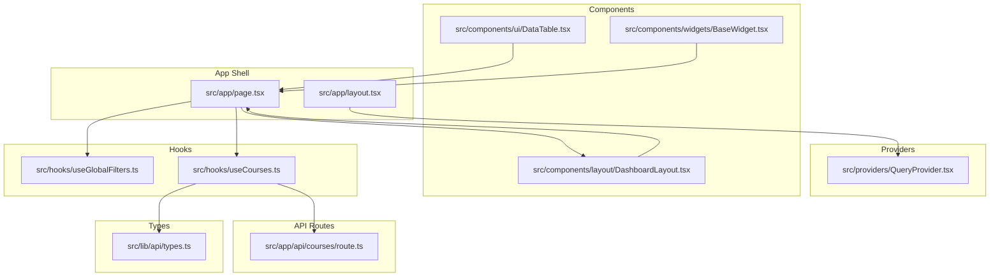
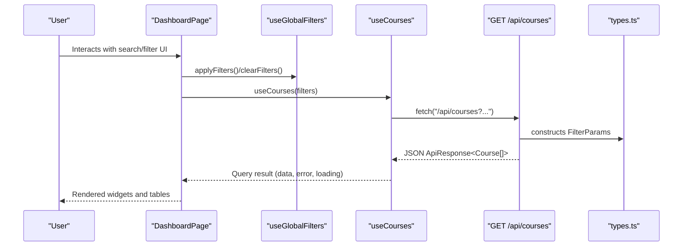
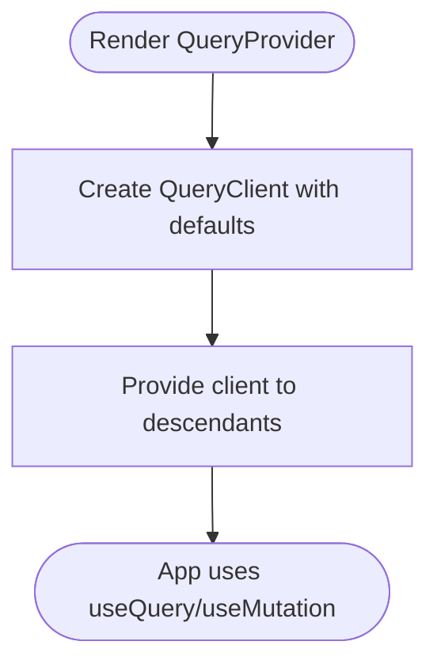
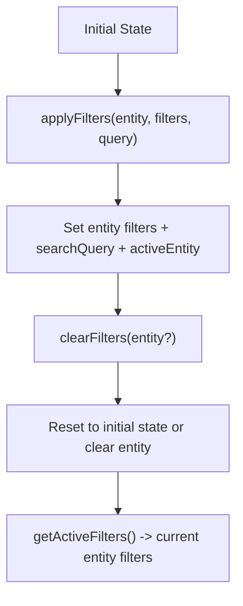
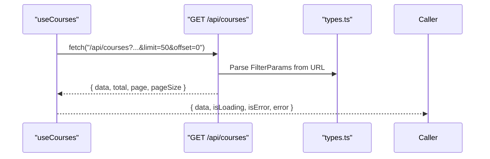
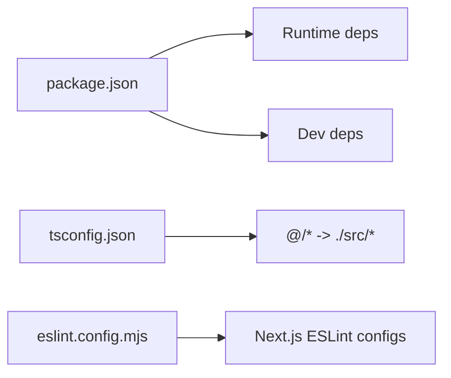

# Development Guidelines

<cite>
**Referenced Files in This Document**
- [package.json](file://package.json)
- [eslint.config.mjs](file://eslint.config.mjs)
- [tsconfig.json](file://tsconfig.json)
- [next.config.ts](file://next.config.ts)
- [README.md](file://README.md)
- [src/app/layout.tsx](file://src/app/layout.tsx)
- [src/app/page.tsx](file://src/app/page.tsx)
- [src/providers/QueryProvider.tsx](file://src/providers/QueryProvider.tsx)
- [src/hooks/useGlobalFilters.ts](file://src/hooks/useGlobalFilters.ts)
- [src/hooks/useCourses.ts](file://src/hooks/useCourses.ts)
- [src/lib/api/types.ts](file://src/lib/api/types.ts)
- [src/app/api/courses/route.ts](file://src/app/api/courses/route.ts)
- [src/components/ui/DataTable.tsx](file://src/components/ui/DataTable.tsx)
- [src/components/layout/DashboardLayout.tsx](file://src/components/layout/DashboardLayout.tsx)
- [src/components/widgets/BaseWidget.tsx](file://src/components/widgets/BaseWidget.tsx)
</cite>

## Table of Contents
1. [Introduction](#introduction)
2. [Project Structure](#project-structure)
3. [Core Components](#core-components)
4. [Architecture Overview](#architecture-overview)
5. [Detailed Component Analysis](#detailed-component-analysis)
6. [Dependency Analysis](#dependency-analysis)
7. [Performance Considerations](#performance-considerations)
8. [Testing Strategies](#testing-strategies)
9. [Code Quality Standards](#code-quality-standards)
10. [Component Naming and File Organization](#component-naming-and-file-organization)
11. [Commit Message Conventions and Branch Naming](#commit-message-conventions-and-branch-naming)
12. [Code Review Guidelines and Pull Request Templates](#code-review-guidelines-and-pull-request-templates)
13. [Development Workflow](#development-workflow)
14. [Accessibility Requirements](#accessibility-requirements)
15. [Troubleshooting Guide](#troubleshooting-guide)
16. [Build Process and Quality Assurance](#build-process-and-quality-assurance)
17. [Conclusion](#conclusion)

## Introduction
This document defines development guidelines for Course Puppy contributors. It consolidates code quality standards, architectural principles, component conventions, testing strategies, workflow practices, performance and accessibility requirements, and troubleshooting guidance. The project is a Next.js 16 application using TypeScript, ESLint, Tailwind CSS, and TanStack React Query for data fetching and caching.

## Project Structure
Course Puppy follows a conventional Next.js App Router structure with a clear separation of concerns:
- Application shell and global providers live under src/app
- Shared UI components under src/components
- Hooks under src/hooks
- API routes under src/app/api
- Type definitions under src/lib/api
- Providers under src/providers

**Diagram sources**
- [src/app/layout.tsx:1-39](file://src/app/layout.tsx#L1-L39)
- [src/app/page.tsx:1-100](file://src/app/page.tsx#L1-L100)
- [src/providers/QueryProvider.tsx:1-35](file://src/providers/QueryProvider.tsx#L1-L35)
- [src/components/layout/DashboardLayout.tsx:1-26](file://src/components/layout/DashboardLayout.tsx#L1-L26)
- [src/components/ui/DataTable.tsx:1-81](file://src/components/ui/DataTable.tsx#L1-L81)
- [src/components/widgets/BaseWidget.tsx:1-58](file://src/components/widgets/BaseWidget.tsx#L1-L58)
- [src/hooks/useGlobalFilters.ts:1-79](file://src/hooks/useGlobalFilters.ts#L1-L79)
- [src/hooks/useCourses.ts:1-31](file://src/hooks/useCourses.ts#L1-L31)
- [src/app/api/courses/route.ts:1-48](file://src/app/api/courses/route.ts#L1-L48)
- [src/lib/api/types.ts:1-99](file://src/lib/api/types.ts#L1-L99)

**Section sources**
- [README.md:1-37](file://README.md#L1-L37)
- [src/app/layout.tsx:1-39](file://src/app/layout.tsx#L1-L39)
- [src/app/page.tsx:1-100](file://src/app/page.tsx#L1-L100)

## Core Components
- Provider layer: QueryProvider sets up TanStack React Query defaults (staleTime, refetch interval, retry behavior) and exposes a client to the app tree.
- Page composition: DashboardPage orchestrates layout, search/filter chips, and entity-specific widgets, driven by useGlobalFilters and per-entity hooks.
- Data fetching: useCourses encapsulates fetching course data via a Next.js API route, with robust error handling and query caching.
- Shared UI: DataTable provides a generic table renderer with loading and empty states; BaseWidget standardizes widget headers, actions, and refresh UX.

**Section sources**
- [src/providers/QueryProvider.tsx:1-35](file://src/providers/QueryProvider.tsx#L1-L35)
- [src/app/page.tsx:1-100](file://src/app/page.tsx#L1-L100)
- [src/hooks/useCourses.ts:1-31](file://src/hooks/useCourses.ts#L1-L31)
- [src/components/ui/DataTable.tsx:1-81](file://src/components/ui/DataTable.tsx#L1-L81)
- [src/components/widgets/BaseWidget.tsx:1-58](file://src/components/widgets/BaseWidget.tsx#L1-L58)

## Architecture Overview
The application follows a layered architecture:
- UI layer: Page and components
- State and data layer: React Query provider and hooks
- API layer: Next.js App Router API routes
- Types layer: Shared TypeScript interfaces and enums

**Diagram sources**
- [src/app/page.tsx:1-100](file://src/app/page.tsx#L1-L100)
- [src/hooks/useGlobalFilters.ts:1-79](file://src/hooks/useGlobalFilters.ts#L1-L79)
- [src/hooks/useCourses.ts:1-31](file://src/hooks/useCourses.ts#L1-L31)
- [src/app/api/courses/route.ts:1-48](file://src/app/api/courses/route.ts#L1-L48)
- [src/lib/api/types.ts:1-99](file://src/lib/api/types.ts#L1-L99)

## Detailed Component Analysis

### QueryProvider
- Purpose: Initialize a TanStack React Query client with default options for refetch intervals, staleness, retries, and retry delays.
- Environment integration: Reads NEXT_PUBLIC_REFRESH_INTERVAL to configure refetch behavior.
- Scope: Wraps the entire app to enable caching and background updates.

**Diagram sources**
- [src/providers/QueryProvider.tsx:1-35](file://src/providers/QueryProvider.tsx#L1-L35)

**Section sources**
- [src/providers/QueryProvider.tsx:1-35](file://src/providers/QueryProvider.tsx#L1-L35)

### useGlobalFilters
- Purpose: Centralized state for entity-scoped filters, active entity selection, and search query.
- Behavior: Provides callbacks to update filters, clear filters, and compute active filters for the current entity.
- Integration: Drives which widget renders and which hook is used for data fetching.

**Diagram sources**
- [src/hooks/useGlobalFilters.ts:1-79](file://src/hooks/useGlobalFilters.ts#L1-L79)

**Section sources**
- [src/hooks/useGlobalFilters.ts:1-79](file://src/hooks/useGlobalFilters.ts#L1-L79)

### useCourses
- Purpose: Fetch course data with React Query using a stable query key derived from filters.
- Error handling: Validates response.ok and throws a typed error with a user-friendly message.
- Integration: Consumed by CoursesWidget and orchestrated by DashboardPage.

**Diagram sources**
- [src/hooks/useCourses.ts:1-31](file://src/hooks/useCourses.ts#L1-L31)
- [src/app/api/courses/route.ts:1-48](file://src/app/api/courses/route.ts#L1-L48)
- [src/lib/api/types.ts:1-99](file://src/lib/api/types.ts#L1-L99)

**Section sources**
- [src/hooks/useCourses.ts:1-31](file://src/hooks/useCourses.ts#L1-L31)
- [src/app/api/courses/route.ts:1-48](file://src/app/api/courses/route.ts#L1-L48)
- [src/lib/api/types.ts:1-99](file://src/lib/api/types.ts#L1-L99)

### DashboardLayout
- Purpose: Provides a consistent layout with a header and main content area.
- Props: Accepts activeEntity and onEntityChange to coordinate navigation between entities.

**Section sources**
- [src/components/layout/DashboardLayout.tsx:1-26](file://src/components/layout/DashboardLayout.tsx#L1-L26)

### DataTable
- Purpose: Generic table renderer with loading and empty-state handling.
- Props: Columns, data, loading flag, empty message, and key extractor.
- Rendering: Iterates over data and columns to render rows and cells.

**Section sources**
- [src/components/ui/DataTable.tsx:1-81](file://src/components/ui/DataTable.tsx#L1-L81)

### BaseWidget
- Purpose: Standardized widget container with optional refresh action, last updated footer, and action slot.
- Accessibility: Includes aria-label and title attributes for refresh button.

**Section sources**
- [src/components/widgets/BaseWidget.tsx:1-58](file://src/components/widgets/BaseWidget.tsx#L1-L58)

## Dependency Analysis
- Runtime dependencies: React 19, Next.js 16, TanStack React Query, Lucide React.
- Dev dependencies: TypeScript, ESLint, Tailwind CSS, and Next.js ESLint configs.
- Path aliases: @/* resolves to ./src/* for clean imports.

**Diagram sources**
- [package.json:1-29](file://package.json#L1-L29)
- [tsconfig.json:1-35](file://tsconfig.json#L1-L35)
- [eslint.config.mjs:1-19](file://eslint.config.mjs#L1-L19)

**Section sources**
- [package.json:1-29](file://package.json#L1-L29)
- [tsconfig.json:1-35](file://tsconfig.json#L1-L35)
- [eslint.config.mjs:1-19](file://eslint.config.mjs#L1-L19)

## Performance Considerations
- Query caching: Configure staleTime and refetchInterval in QueryProvider to balance freshness and network usage.
- Pagination: Use limit and offset in FilterParams to cap payload sizes.
- Conditional rendering: Render only the active entity’s widget to minimize DOM and re-renders.
- Image and font optimization: Leverage Next.js automatic optimization via next/font.
- Bundle size: Prefer component-level lazy loading for heavy widgets if needed; avoid unnecessary re-renders by memoizing props.

[No sources needed since this section provides general guidance]

## Testing Strategies
- Unit tests for hooks:
  - useGlobalFilters: Verify state transitions for applyFilters, clearFilters, clearSpecificFilter, and getActiveFilters.
  - useCourses: Mock fetch, assert queryKey formation, and test error handling paths.
- Component tests:
  - DashboardLayout: Ensure activeEntity and onEntityChange are passed correctly.
  - DataTable: Verify loading state, empty state, and cell rendering.
  - BaseWidget: Confirm refresh button behavior and last updated display.
- API route tests:
  - src/app/api/courses/route.ts: Validate query param parsing, error responses, and successful JSON payloads.
- Integration tests:
  - Simulate filter changes and verify that the correct widget renders and that useCourses is called with the expected query key.

[No sources needed since this section provides general guidance]

## Code Quality Standards
- ESLint configuration:
  - Uses eslint-config-next core-web-vitals and typescript presets.
  - Overrides default ignores to include relevant paths.
- TypeScript strictness:
  - Strict mode enabled with noEmit and JSX via react-jsx.
  - Bundler module resolution and isolated modules for accurate type checking.
- Formatting and linting:
  - Run npm run lint to enforce style and correctness rules.
- Commit hygiene:
  - Keep commits focused and descriptive; reference related issues.

**Section sources**
- [eslint.config.mjs:1-19](file://eslint.config.mjs#L1-L19)
- [tsconfig.json:1-35](file://tsconfig.json#L1-L35)
- [package.json:9-9](file://package.json#L9-L9)

## Component Naming and File Organization
- Naming conventions:
  - PascalCase for components (e.g., DashboardLayout, DataTable).
  - kebab-case for files (e.g., dashboard-layout.tsx, data-table.tsx).
  - Prefix reusable UI components with ui/ (e.g., src/components/ui/DataTable.tsx).
- File organization patterns:
  - Feature-based grouping: src/components/widgets/, src/components/layout/, src/components/ui/.
  - Hooks colocated near consumers or grouped under src/hooks/.
  - API routes under src/app/api/<resource>/route.ts.
  - Shared types under src/lib/api/types.ts.
- Imports:
  - Use path aliases (@/*) consistently for cleaner imports.

**Section sources**
- [src/components/layout/DashboardLayout.tsx:1-26](file://src/components/layout/DashboardLayout.tsx#L1-L26)
- [src/components/ui/DataTable.tsx:1-81](file://src/components/ui/DataTable.tsx#L1-L81)
- [tsconfig.json:21-23](file://tsconfig.json#L21-L23)

## Commit Message Conventions and Branch Naming
- Commit messages:
  - Use imperative mood: “Add feature” vs. “Added feature.”
  - Keep subject concise (< 50 chars), explain motivation and effects.
  - Reference issue numbers when applicable.
- Branch naming:
  - feature/<issue-number>-short-description
  - fix/<issue-number>-short-description
  - chore/<description>
  - docs/<description>

[No sources needed since this section provides general guidance]

## Code Review Guidelines and Pull Request Templates
- Code review checklist:
  - Correctness: Does the change address the stated problem?
  - Tests: Are new or modified tests included?
  - Performance: Are there unnecessary re-renders or excessive network requests?
  - Accessibility: Are ARIA attributes and semantic HTML used appropriately?
  - TypeScript: Are types accurate and errors handled?
  - Security: Are inputs sanitized and secrets not exposed?
- Pull request template:
  - Summary of changes
  - Motivation and context
  - Breaking changes
  - How to test
  - Screenshots or links to demo

[No sources needed since this section provides general guidance]

## Development Workflow
- Local setup:
  - Install dependencies and run npm run dev.
- Feature creation:
  - Create a feature branch, implement changes, and add tests.
- Code quality:
  - Run lint and ensure no TypeScript errors.
- API integration:
  - Add or modify API routes under src/app/api and update types under src/lib/api/types.
- Preview and merge:
  - Open a PR, address feedback, and merge after approval.
- Deployment:
  - Follow Next.js deployment guidance for Vercel.

**Section sources**
- [README.md:3-17](file://README.md#L3-L17)
- [package.json:5-10](file://package.json#L5-L10)

## Accessibility Requirements
- Semantic HTML: Use proper headings, lists, and tables.
- ARIA: Provide aria-labels for icon buttons and convey state changes.
- Keyboard navigation: Ensure focus order is logical and visible.
- Contrast and readability: Maintain sufficient color contrast and readable fonts.
- Forms and inputs: Associate labels with inputs and provide clear error messaging.

**Section sources**
- [src/components/widgets/BaseWidget.tsx:30-40](file://src/components/widgets/BaseWidget.tsx#L30-L40)
- [src/components/ui/DataTable.tsx:46-78](file://src/components/ui/DataTable.tsx#L46-L78)

## Troubleshooting Guide
- Lint failures:
  - Run npm run lint and resolve reported issues; ensure TypeScript strictness is met.
- Query errors:
  - Check useCourses error handling and confirm API route returns structured error payloads.
- Network timeouts:
  - Adjust refetchInterval and retry settings in QueryProvider.
- Build issues:
  - Verify tsconfig settings and ensure path aliases are correct.

**Section sources**
- [package.json:9-9](file://package.json#L9-L9)
- [src/hooks/useCourses.ts:17-22](file://src/hooks/useCourses.ts#L17-L22)
- [src/providers/QueryProvider.tsx:16-27](file://src/providers/QueryProvider.tsx#L16-L27)
- [tsconfig.json:1-35](file://tsconfig.json#L1-L35)

## Build Process and Quality Assurance
- Build:
  - npm run build generates optimized production assets.
- Start:
  - npm run start runs the production server.
- Lint:
  - npm run lint enforces ESLint rules aligned with Next.js conventions.
- Quality gates:
  - Ensure no lint errors, passing unit/integration tests, and acceptable bundle size.

**Section sources**
- [package.json:5-10](file://package.json#L5-L10)
- [next.config.ts:1-8](file://next.config.ts#L1-L8)

## Conclusion
These guidelines standardize development practices across Course Puppy. By adhering to the established conventions for code quality, component organization, testing, and workflow, contributors can deliver reliable, maintainable, and accessible features efficiently.