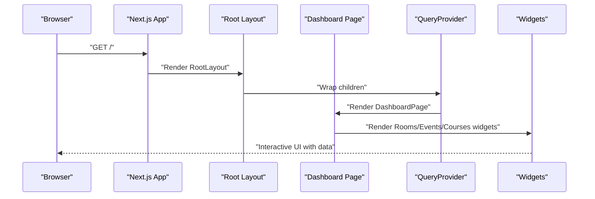

# Getting Started

<cite>
**Referenced Files in This Document**
- [README.md](file://README.md)
- [package.json](file://package.json)
- [next.config.ts](file://next.config.ts)
- [tsconfig.json](file://tsconfig.json)
- [eslint.config.mjs](file://eslint.config.mjs)
- [postcss.config.mjs](file://postcss.config.mjs)
- [src/app/layout.tsx](file://src/app/layout.tsx)
- [src/app/page.tsx](file://src/app/page.tsx)
- [src/providers/QueryProvider.tsx](file://src/providers/QueryProvider.tsx)
- [src/hooks/useGlobalFilters.ts](file://src/hooks/useGlobalFilters.ts)
- [src/components/layout/DashboardLayout.tsx](file://src/components/layout/DashboardLayout.tsx)
- [src/components/widgets/CoursesWidget.tsx](file://src/components/widgets/CoursesWidget.tsx)
- [src/components/widgets/EventsWidget.tsx](file://src/components/widgets/EventsWidget.tsx)
- [src/components/widgets/RoomsWidget.tsx](file://src/components/widgets/RoomsWidget.tsx)
</cite>

## Table of Contents
1. [Introduction](#introduction)
2. [Prerequisites](#prerequisites)
3. [Installation](#installation)
4. [Development Workflow](#development-workflow)
5. [Project Structure](#project-structure)
6. [Verification](#verification)
7. [Troubleshooting](#troubleshooting)
8. [Conclusion](#conclusion)

## Introduction
Course Puppy is a Next.js application that provides an academic dashboard for browsing and filtering rooms, events, and courses. It uses modern frontend technologies and a clean component architecture to deliver a responsive and interactive user interface.

## Prerequisites
Before installing Course Puppy, ensure your development environment meets the following requirements:

- Node.js: Version 18 or higher is recommended for optimal compatibility with Next.js 16 and modern tooling.
- Package Manager: Choose one of the following supported package managers:
  - npm (Node Package Manager)
  - yarn
  - pnpm
  - bun
- Basic Next.js Knowledge: Familiarity with Next.js concepts such as pages, app directory structure, client/server components, and routing will help you navigate and extend the application effectively.

These requirements align with the project's configuration and dependencies as defined in the repository.

**Section sources**
- [package.json:11-27](file://package.json#L11-L27)
- [tsconfig.json:3-23](file://tsconfig.json#L3-L23)

## Installation
Follow these step-by-step instructions to install and set up Course Puppy locally:

1. **Clone the Repository**
   - Clone the repository to your local machine using your preferred Git client or command-line tool.

2. **Install Dependencies**
   - Navigate to the project root directory.
   - Install dependencies using your chosen package manager:
     - npm: `npm install`
     - yarn: `yarn install`
     - pnpm: `pnpm install`
     - bun: `bun install`

3. **Environment Setup**
   - The project includes linting and styling configurations:
     - ESLint is configured via a dedicated configuration file.
     - PostCSS is configured with Tailwind CSS integration.
   - TypeScript is enabled with strict compiler options and path aliases.

4. **Run the Development Server**
   - Start the development server using one of the supported commands:
     - `npm run dev`
     - `yarn dev`
     - `pnpm dev`
     - `bun dev`
   - Open http://localhost:3000 in your browser to view the application.

5. **Optional: Build and Start Production**
   - Build the project: `npm run build`
   - Start the production server: `npm run start`

These steps are derived from the project’s scripts and configuration files.

**Section sources**
- [README.md:5-17](file://README.md#L5-L17)
- [package.json:5-10](file://package.json#L5-L10)
- [eslint.config.mjs:1-19](file://eslint.config.mjs#L1-L19)
- [postcss.config.mjs:1-8](file://postcss.config.mjs#L1-L8)
- [tsconfig.json:21-23](file://tsconfig.json#L21-L23)

## Development Workflow
During development, you will primarily work with the following areas:

- Application Entry Points
  - Root layout and metadata are defined in the root layout component.
  - The main dashboard page renders the primary widgets and search/filter controls.

- State and Data Fetching
  - A global provider sets up React Query with default caching and refresh behavior.
  - Hooks manage global filters and coordinate data fetching for rooms, events, and courses.

- UI Components
  - Layout components provide consistent navigation and page structure.
  - Widget components render tabular data for rooms, events, and courses with status indicators.

- Configuration
  - Next.js configuration is minimal and ready for customization.
  - TypeScript paths enable convenient imports using the @ alias.

**Diagram sources**
- [src/app/layout.tsx:21-38](file://src/app/layout.tsx#L21-L38)
- [src/app/page.tsx:12-99](file://src/app/page.tsx#L12-L99)
- [src/providers/QueryProvider.tsx:15-34](file://src/providers/QueryProvider.tsx#L15-L34)

**Section sources**
- [src/app/layout.tsx:16-19](file://src/app/layout.tsx#L16-L19)
- [src/app/layout.tsx:26-36](file://src/app/layout.tsx#L26-L36)
- [src/app/page.tsx:3-11](file://src/app/page.tsx#L3-L11)
- [src/providers/QueryProvider.tsx:6-9](file://src/providers/QueryProvider.tsx#L6-L9)
- [src/providers/QueryProvider.tsx:16-27](file://src/providers/QueryProvider.tsx#L16-L27)

## Project Structure
Course Puppy follows a conventional Next.js app directory structure with a focus on components, hooks, providers, and API routes. Key directories and files include:

- src/app
  - Contains the root layout, global styles, and the main dashboard page.
  - API routes under src/app/api handle backend interactions.
- src/components
  - UI components organized by feature: layout, search, ui, and widgets.
- src/hooks
  - Custom hooks for managing filters and data fetching.
- src/lib
  - Shared libraries for API types and utilities.
- src/providers
  - Providers for global state and data fetching.
- Configuration files
  - next.config.ts, tsconfig.json, eslint.config.mjs, postcss.config.mjs

```mermaid
graph TB
A["src/app"] --> A1["layout.tsx"]
A["src/app"] --> A2["page.tsx"]
A["src/app"] --> A3["globals.css"]
A["src/app"] --> A4["api/"]
B["src/components"] --> B1["layout/"]
B["src/components"] --> B2["search/"]
B["src/components"] --> B3["ui/"]
B["src/components"] --> B4["widgets/"]
C["src/hooks"] --> C1["useGlobalFilters.ts"]
C --> C2["useCourses.ts"]
C --> C3["useEvents.ts"]
C --> C4["useRooms.ts"]
D["src/providers"] --> D1["QueryProvider.tsx"]
E["Configuration"] --> E1["next.config.ts"]
E --> E2["tsconfig.json"]
E --> E3["eslint.config.mjs"]
E --> E4["postcss.config.mjs"]
```

**Diagram sources**
- [src/app/layout.tsx:1-39](file://src/app/layout.tsx#L1-L39)
- [src/app/page.tsx:1-100](file://src/app/page.tsx#L1-L100)
- [src/hooks/useGlobalFilters.ts:1-79](file://src/hooks/useGlobalFilters.ts#L1-L79)
- [src/providers/QueryProvider.tsx:1-35](file://src/providers/QueryProvider.tsx#L1-L35)
- [next.config.ts:1-8](file://next.config.ts#L1-L8)
- [tsconfig.json:1-35](file://tsconfig.json#L1-L35)
- [eslint.config.mjs:1-19](file://eslint.config.mjs#L1-L19)
- [postcss.config.mjs:1-8](file://postcss.config.mjs#L1-L8)

**Section sources**
- [src/app/layout.tsx:1-39](file://src/app/layout.tsx#L1-L39)
- [src/app/page.tsx:1-100](file://src/app/page.tsx#L1-L100)
- [src/hooks/useGlobalFilters.ts:1-79](file://src/hooks/useGlobalFilters.ts#L1-L79)
- [src/providers/QueryProvider.tsx:1-35](file://src/providers/QueryProvider.tsx#L1-L35)
- [next.config.ts:1-8](file://next.config.ts#L1-L8)
- [tsconfig.json:1-35](file://tsconfig.json#L1-L35)
- [eslint.config.mjs:1-19](file://eslint.config.mjs#L1-L19)
- [postcss.config.mjs:1-8](file://postcss.config.mjs#L1-L8)

## Verification
After completing installation and starting the development server, verify your setup with the following steps:

- Confirm the Development Server
  - Ensure the development server is running and accessible at http://localhost:3000.
  - The root layout defines site metadata and fonts; confirm the page loads without errors.

- Test the Dashboard
  - The main dashboard page renders three widgets: rooms, events, and courses.
  - Interact with the global search bar and filter chips to verify filter state updates.

- Check Provider Configuration
  - Verify that the QueryProvider is wrapping the application and applying default query options.

- Validate TypeScript Paths
  - Confirm that imports using the @ alias resolve correctly within the project.

- Run Linting
  - Execute the linter to catch any configuration or style issues.

**Section sources**
- [README.md:17-17](file://README.md#L17-L17)
- [src/app/layout.tsx:16-19](file://src/app/layout.tsx#L16-L19)
- [src/app/page.tsx:12-99](file://src/app/page.tsx#L12-L99)
- [src/providers/QueryProvider.tsx:15-34](file://src/providers/QueryProvider.tsx#L15-L34)
- [tsconfig.json:21-23](file://tsconfig.json#L21-L23)
- [package.json:9-9](file://package.json#L9-L9)

## Troubleshooting
Common setup issues and their solutions:

- Node.js Version Issues
  - Symptom: Errors during installation or runtime related to unsupported Node.js features.
  - Solution: Upgrade to Node.js 18 or later to match Next.js 16 requirements.

- Package Manager Conflicts
  - Symptom: Dependency resolution errors or inconsistent installs.
  - Solution: Use only one package manager per installation. Clear lock files and cache if switching between npm, yarn, pnpm, or bun.

- Port Already in Use
  - Symptom: Development server fails to start due to port 3000 being occupied.
  - Solution: Stop the conflicting process or configure a different port in your environment.

- Missing Environment Variables
  - Symptom: Unexpected behavior in data fetching or UI refresh intervals.
  - Solution: Ensure NEXT_PUBLIC_REFRESH_INTERVAL is set appropriately if you want to customize automatic refresh behavior.

- TypeScript Path Resolution Errors
  - Symptom: Import errors for @/* paths.
  - Solution: Verify tsconfig.json includes the path mapping and that the src directory exists.

- ESLint or Formatting Issues
  - Symptom: Linting errors blocking development.
  - Solution: Review eslint.config.mjs and fix reported issues. Re-run the linter after changes.

**Section sources**
- [package.json:11-27](file://package.json#L11-L27)
- [src/providers/QueryProvider.tsx:6-9](file://src/providers/QueryProvider.tsx#L6-L9)
- [tsconfig.json:21-23](file://tsconfig.json#L21-L23)
- [eslint.config.mjs:1-19](file://eslint.config.mjs#L1-L19)

## Conclusion
You are now ready to develop with Course Puppy. Use the development server for iterative changes, explore the component architecture, and leverage the provided hooks and providers to extend functionality. Refer to the project structure and configuration files to maintain consistency as you build new features.