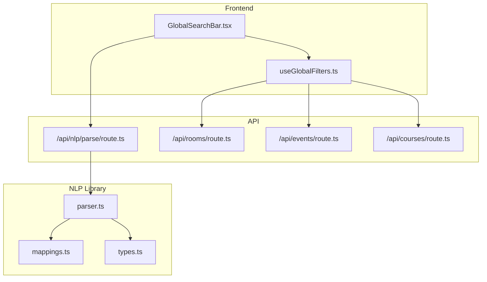
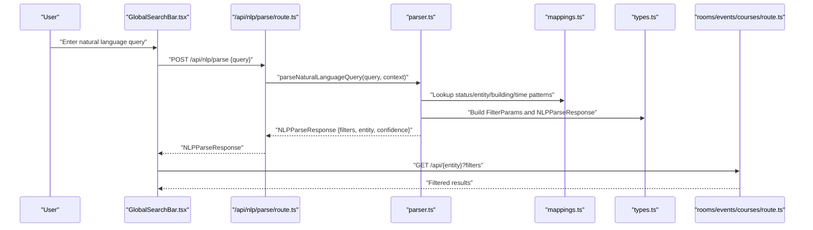
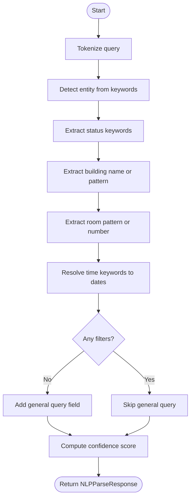
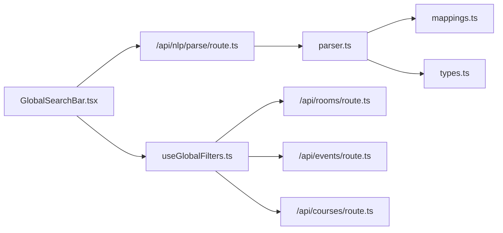

# Natural Language Processing

<cite>
**Referenced Files in This Document**
- [route.ts](file://src/app/api/nlp/parse/route.ts)
- [parser.ts](file://src/lib/nlp/parser.ts)
- [mappings.ts](file://src/lib/nlp/mappings.ts)
- [types.ts](file://src/lib/api/types.ts)
- [GlobalSearchBar.tsx](file://src/components/search/GlobalSearchBar.tsx)
- [useGlobalFilters.ts](file://src/hooks/useGlobalFilters.ts)
- [QueryProvider.tsx](file://src/providers/QueryProvider.tsx)
- [rooms/route.ts](file://src/app/api/rooms/route.ts)
- [events/route.ts](file://src/app/api/events/route.ts)
- [courses/route.ts](file://src/app/api/courses/route.ts)
</cite>

## Table of Contents
1. [Introduction](#introduction)
2. [Project Structure](#project-structure)
3. [Core Components](#core-components)
4. [Architecture Overview](#architecture-overview)
5. [Detailed Component Analysis](#detailed-component-analysis)
6. [Dependency Analysis](#dependency-analysis)
7. [Performance Considerations](#performance-considerations)
8. [Troubleshooting Guide](#troubleshooting-guide)
9. [Conclusion](#conclusion)
10. [Appendices](#appendices)

## Introduction
This document explains Course Puppy’s Natural Language Processing (NLP) system for transforming free-form queries into structured filters. It covers the query parsing algorithm, confidence scoring, keyword mapping system, filter extraction, multi-entity detection, supported patterns, accuracy metrics, and extension guidelines. It also documents how the parsed results integrate with the application’s search UI and backend APIs.

## Project Structure
The NLP system is implemented under the NLP library and exposed via a dedicated API endpoint. The frontend integrates with the NLP parser through a global search bar, which sends queries to the backend and applies the resulting filters to the active entity.



**Diagram sources**
- [route.ts:1-30](file://src/app/api/nlp/parse/route.ts#L1-L30)
- [parser.ts:1-202](file://src/lib/nlp/parser.ts#L1-L202)
- [mappings.ts:1-45](file://src/lib/nlp/mappings.ts#L1-L45)
- [types.ts:1-99](file://src/lib/api/types.ts#L1-L99)
- [GlobalSearchBar.tsx:1-85](file://src/components/search/GlobalSearchBar.tsx#L1-L85)
- [useGlobalFilters.ts:1-79](file://src/hooks/useGlobalFilters.ts#L1-L79)
- [rooms/route.ts:1-51](file://src/app/api/rooms/route.ts#L1-L51)
- [events/route.ts:1-54](file://src/app/api/events/route.ts#L1-L54)
- [courses/route.ts:1-48](file://src/app/api/courses/route.ts#L1-L48)

**Section sources**
- [route.ts:1-30](file://src/app/api/nlp/parse/route.ts#L1-L30)
- [parser.ts:1-202](file://src/lib/nlp/parser.ts#L1-L202)
- [mappings.ts:1-45](file://src/lib/nlp/mappings.ts#L1-L45)
- [types.ts:1-99](file://src/lib/api/types.ts#L1-L99)
- [GlobalSearchBar.tsx:1-85](file://src/components/search/GlobalSearchBar.tsx#L1-L85)
- [useGlobalFilters.ts:1-79](file://src/hooks/useGlobalFilters.ts#L1-L79)
- [rooms/route.ts:1-51](file://src/app/api/rooms/route.ts#L1-L51)
- [events/route.ts:1-54](file://src/app/api/events/route.ts#L1-L54)
- [courses/route.ts:1-48](file://src/app/api/courses/route.ts#L1-L48)

## Core Components
- NLP Parser: Tokenizes input, detects entity, extracts status, building, room, and time range filters, and computes a confidence score.
- Keyword Mappings: Defines status, entity, building, time, and room pattern mappings.
- API Endpoint: Validates input, invokes the parser, and returns structured results.
- Frontend Integration: Sends queries to the NLP endpoint and applies filters to the active entity.

Key responsibilities:
- Entity detection: rooms, events, courses, or unknown.
- Status extraction: maps natural language status to typed enums.
- Location extraction: building names and room identifiers.
- Temporal extraction: today, tomorrow, this week, next week.
- Confidence scoring: quantifies parsing reliability.

**Section sources**
- [parser.ts:125-153](file://src/lib/nlp/parser.ts#L125-L153)
- [mappings.ts:3-44](file://src/lib/nlp/mappings.ts#L3-L44)
- [route.ts:5-29](file://src/app/api/nlp/parse/route.ts#L5-L29)
- [types.ts:72-84](file://src/lib/api/types.ts#L72-L84)

## Architecture Overview
The NLP pipeline transforms a user query into a structured filter object and an entity type, then feeds the filters into the appropriate backend API.



**Diagram sources**
- [route.ts:5-29](file://src/app/api/nlp/parse/route.ts#L5-L29)
- [parser.ts:155-201](file://src/lib/nlp/parser.ts#L155-L201)
- [mappings.ts:1-45](file://src/lib/nlp/mappings.ts#L1-L45)
- [types.ts:49-84](file://src/lib/api/types.ts#L49-L84)
- [rooms/route.ts:5-39](file://src/app/api/rooms/route.ts#L5-L39)
- [events/route.ts:5-41](file://src/app/api/events/route.ts#L5-L41)
- [courses/route.ts:5-34](file://src/app/api/courses/route.ts#L5-L34)

## Detailed Component Analysis

### Query Parsing Algorithm
The parser performs the following steps:
1. Tokenization: splits the query into tokens and normalizes to lowercase.
2. Entity detection: scans for entity keywords to determine the target resource type.
3. Status extraction: maps status keywords to typed statuses.
4. Building extraction: matches known building names or extracts from patterns.
5. Room extraction: matches room/building patterns or numeric room identifiers.
6. Time range extraction: resolves temporal keywords to ISO date ranges.
7. General query fallback: if no filters are extracted, stores the original query for general search.
8. Confidence calculation: scores the parsing outcome based on detected components.



**Diagram sources**
- [parser.ts:12-153](file://src/lib/nlp/parser.ts#L12-L153)

**Section sources**
- [parser.ts:12-153](file://src/lib/nlp/parser.ts#L12-L153)

### Confidence Scoring Mechanism
Confidence is computed as a normalized score based on detected components:
- Base score: 1 for successful entity detection.
- Additional points: 0.5 for each of status, building/room, and time range detection.
- Normalized to [0, 1].

Thresholds:
- High confidence: ≥ 0.8
- Medium confidence: 0.5–0.79
- Low confidence: < 0.5

Guidance:
- Treat low-confidence results as general queries.
- Use medium confidence for cautious filtering.

**Section sources**
- [parser.ts:125-153](file://src/lib/nlp/parser.ts#L125-L153)

### Keyword Mapping System
- Status keywords: map to statuses such as pending, approved, rejected, available, occupied, maintenance, cancelled.
- Entity keywords: map to rooms, events, courses.
- Building keywords: known building names.
- Time keywords: today, tomorrow, this week, next week, this month.
- Room patterns: regex patterns to extract room/building identifiers.

Extending mappings:
- Add synonyms to existing arrays.
- Introduce new patterns in room patterns.
- Ensure consistent casing normalization and pattern specificity.

**Section sources**
- [mappings.ts:3-44](file://src/lib/nlp/mappings.ts#L3-L44)

### Filter Extraction Process
- Status: extracted if any mapped status keyword is present.
- Building: matched against known buildings or via pattern extraction.
- Room: matched via patterns or numeric room identifiers.
- Time range: resolved to ISO date strings for start/end.
- General query: stored when no other filters are detected.

Integration:
- Filters are passed to the active entity’s API route, which builds FilterParams from query string.

**Section sources**
- [parser.ts:165-192](file://src/lib/nlp/parser.ts#L165-L192)
- [rooms/route.ts:9-35](file://src/app/api/rooms/route.ts#L9-L35)
- [events/route.ts:9-38](file://src/app/api/events/route.ts#L9-L38)
- [courses/route.ts:9-32](file://src/app/api/courses/route.ts#L9-L32)

### Multi-Entity Detection and Complex Queries
- Entity detection prioritizes explicit entity keywords; otherwise defaults to unknown.
- Context-aware behavior: if a context is provided, it overrides detection.
- Complex queries: multiple filters can be extracted simultaneously (e.g., status + building + time range).

Fallback behavior:
- Unknown entity: defaults to rooms.
- No filters: falls back to general query mode.

**Section sources**
- [parser.ts:161-164](file://src/lib/nlp/parser.ts#L161-L164)
- [GlobalSearchBar.tsx:43-46](file://src/components/search/GlobalSearchBar.tsx#L43-L46)

### Supported Query Patterns and Outputs
Examples of supported patterns and their typical outputs:
- “Show me available rooms in the Student Union”
  - Entity: rooms
  - Filters: status=available, building=Student Union
  - Confidence: high
- “Find events scheduled for today”
  - Entity: events
  - Filters: startDate=YYYY-MM-DD, endDate=YYYY-MM-DD
  - Confidence: high
- “Show me courses in room 2050”
  - Entity: courses
  - Filters: room=2050
  - Confidence: medium-high
- “Show me pending events this week”
  - Entity: events
  - Filters: status=pending, startDate=startOfWeek, endDate=endOfWeek
  - Confidence: high
- “Free rooms tomorrow”
  - Entity: rooms
  - Filters: status=available, startDate=tomorrow, endDate=tomorrow
  - Confidence: high

Notes:
- Outputs are represented as FilterParams objects with entity and confidence included.
- General queries fall back to a query string when no structured filters are detected.

**Section sources**
- [parser.ts:155-201](file://src/lib/nlp/parser.ts#L155-L201)
- [types.ts:49-84](file://src/lib/api/types.ts#L49-L84)

### Accuracy Metrics and Thresholds
- Confidence score: normalized to [0, 1].
- Thresholds:
  - High confidence: ≥ 0.8
  - Medium confidence: 0.5–0.79
  - Low confidence: < 0.5
- Recommendations:
  - Use high confidence for strict filtering.
  - Use medium confidence for exploratory queries.
  - Treat low confidence as general search.

**Section sources**
- [parser.ts:125-153](file://src/lib/nlp/parser.ts#L125-L153)

### Guidelines for Extending Keyword Mappings and Improving Accuracy
- Extend mappings:
  - Add synonyms to STATUS_KEYWORDS, ENTITY_KEYWORDS, BUILDING_KEYWORDS.
  - Add room/building patterns to ROOM_PATTERNS.
  - Add temporal keywords to TIME_KEYWORDS.
- Improve accuracy:
  - Prefer specific patterns over broad ones.
  - Normalize casing and whitespace.
  - Test with diverse phrasings and edge cases.
- Validation:
  - Ensure keyword arrays remain exhaustive and mutually exclusive where appropriate.
  - Validate regex patterns to avoid false positives.

**Section sources**
- [mappings.ts:3-44](file://src/lib/nlp/mappings.ts#L3-L44)

### Edge Cases and Error Handling
- Missing or invalid input:
  - API endpoint validates presence and type of query and returns a 400 error on failure.
- Unknown entity:
  - Defaults to rooms when entity is unknown.
- Parsing errors:
  - API endpoint catches exceptions and returns a 500 error with a message.
- Frontend fallback:
  - On NLP failure, the UI falls back to treating the query as a general search.

**Section sources**
- [route.ts:9-29](file://src/app/api/nlp/parse/route.ts#L9-L29)
- [GlobalSearchBar.tsx:37-53](file://src/components/search/GlobalSearchBar.tsx#L37-L53)

## Dependency Analysis
The NLP system depends on:
- Keyword mappings for entity, status, building, time, and room patterns.
- Type definitions for FilterParams and NLPParseResponse.
- API routes for rooms, events, and courses to consume the parsed filters.



**Diagram sources**
- [parser.ts:1-202](file://src/lib/nlp/parser.ts#L1-L202)
- [mappings.ts:1-45](file://src/lib/nlp/mappings.ts#L1-L45)
- [types.ts:1-99](file://src/lib/api/types.ts#L1-L99)
- [route.ts:1-30](file://src/app/api/nlp/parse/route.ts#L1-L30)
- [GlobalSearchBar.tsx:1-85](file://src/components/search/GlobalSearchBar.tsx#L1-L85)
- [useGlobalFilters.ts:1-79](file://src/hooks/useGlobalFilters.ts#L1-L79)
- [rooms/route.ts:1-51](file://src/app/api/rooms/route.ts#L1-L51)
- [events/route.ts:1-54](file://src/app/api/events/route.ts#L1-L54)
- [courses/route.ts:1-48](file://src/app/api/courses/route.ts#L1-L48)

**Section sources**
- [parser.ts:1-202](file://src/lib/nlp/parser.ts#L1-L202)
- [mappings.ts:1-45](file://src/lib/nlp/mappings.ts#L1-L45)
- [types.ts:1-99](file://src/lib/api/types.ts#L1-L99)
- [route.ts:1-30](file://src/app/api/nlp/parse/route.ts#L1-L30)
- [GlobalSearchBar.tsx:1-85](file://src/components/search/GlobalSearchBar.tsx#L1-L85)
- [useGlobalFilters.ts:1-79](file://src/hooks/useGlobalFilters.ts#L1-L79)
- [rooms/route.ts:1-51](file://src/app/api/rooms/route.ts#L1-L51)
- [events/route.ts:1-54](file://src/app/api/events/route.ts#L1-L54)
- [courses/route.ts:1-48](file://src/app/api/courses/route.ts#L1-L48)

## Performance Considerations
- Tokenization and linear scans over keyword arrays are O(n) per category; keep keyword lists concise.
- Regex room patterns are executed sequentially; order patterns by specificity to reduce unnecessary checks.
- Confidence computation is constant-time; minimal overhead.
- Frontend caching and query provider settings help reduce repeated requests.

[No sources needed since this section provides general guidance]

## Troubleshooting Guide
- Query returns unknown entity:
  - Ensure entity keywords are present or pass a context to override detection.
- No filters extracted:
  - Verify mappings include relevant keywords; consider adding room/building patterns.
- Low confidence results:
  - Improve keyword coverage or adjust thresholds in the UI.
- API errors:
  - Check query payload shape and content type; confirm the endpoint is reachable.

**Section sources**
- [route.ts:9-29](file://src/app/api/nlp/parse/route.ts#L9-L29)
- [GlobalSearchBar.tsx:37-53](file://src/components/search/GlobalSearchBar.tsx#L37-L53)

## Conclusion
Course Puppy’s NLP system provides a robust, extensible foundation for converting natural language queries into structured filters. Its keyword-driven parsing, confidence scoring, and seamless integration with entity-specific APIs enable flexible and accurate search experiences. Extending mappings and refining patterns will improve accuracy across diverse query styles.

[No sources needed since this section summarizes without analyzing specific files]

## Appendices

### Data Model for Filters and Responses
```mermaid
classDiagram
class FilterParams {
+status
+room
+building
+startDate
+endDate
+organizer
+instructor
+limit
+offset
+query
}
class NLPParseResponse {
+filters
+entity
+confidence
}
class EntityType {
<<enumeration>>
"rooms"
"events"
"courses"
"unknown"
}
NLPParseResponse --> FilterParams : "contains"
NLPParseResponse --> EntityType : "entity type"
```

**Diagram sources**
- [types.ts:49-84](file://src/lib/api/types.ts#L49-L84)