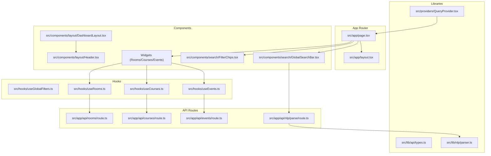
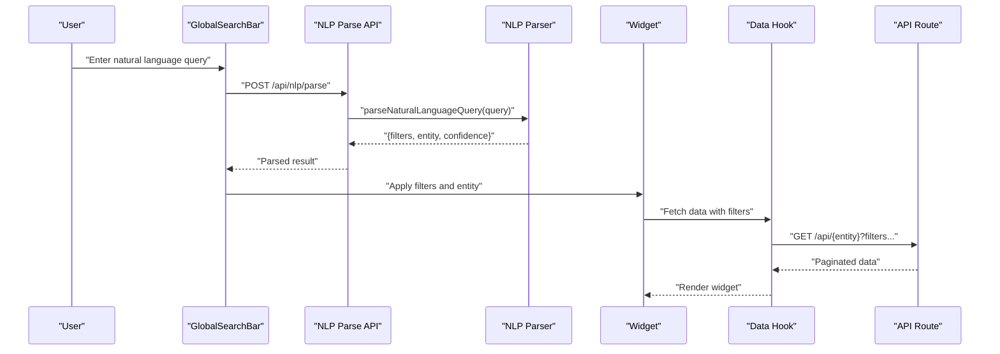
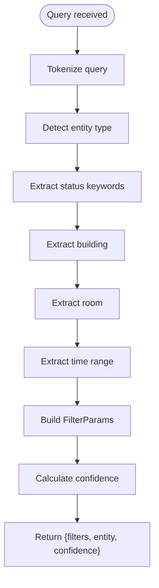
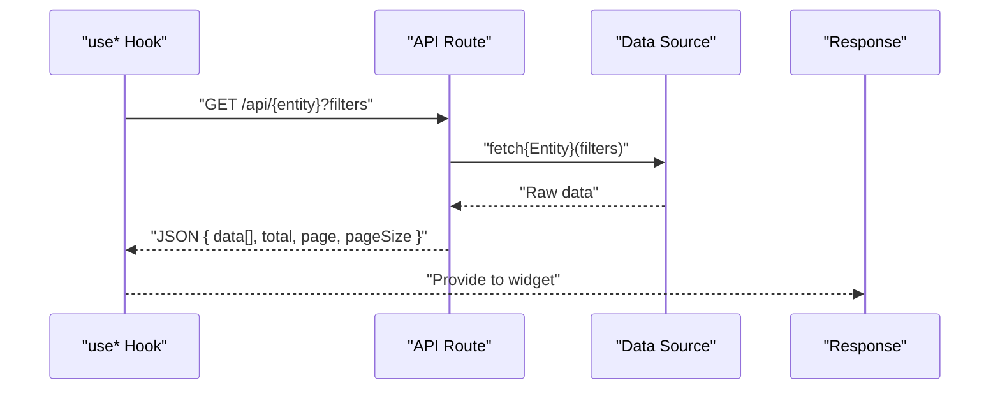
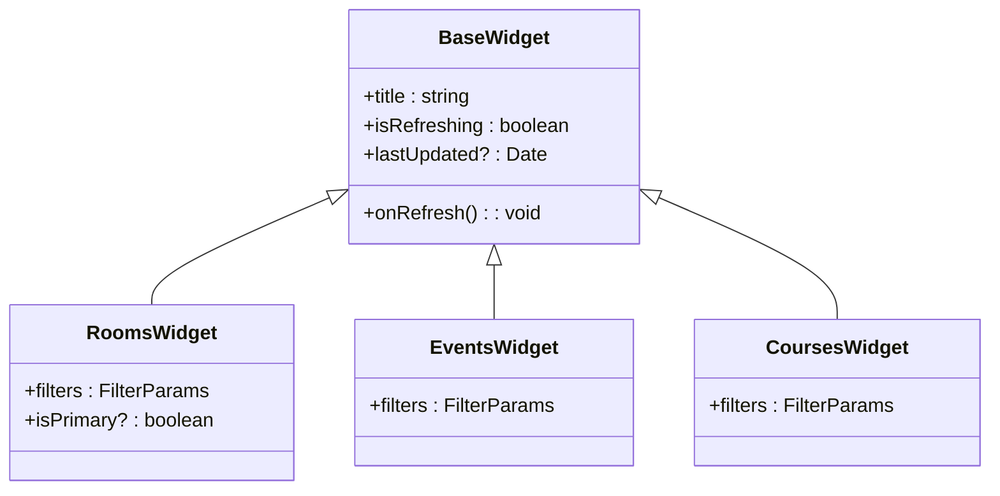
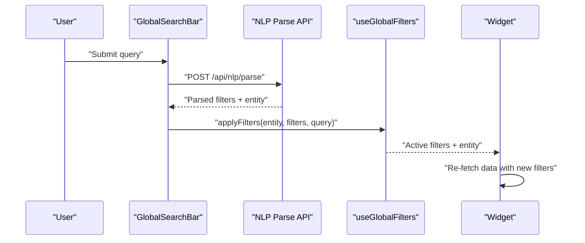
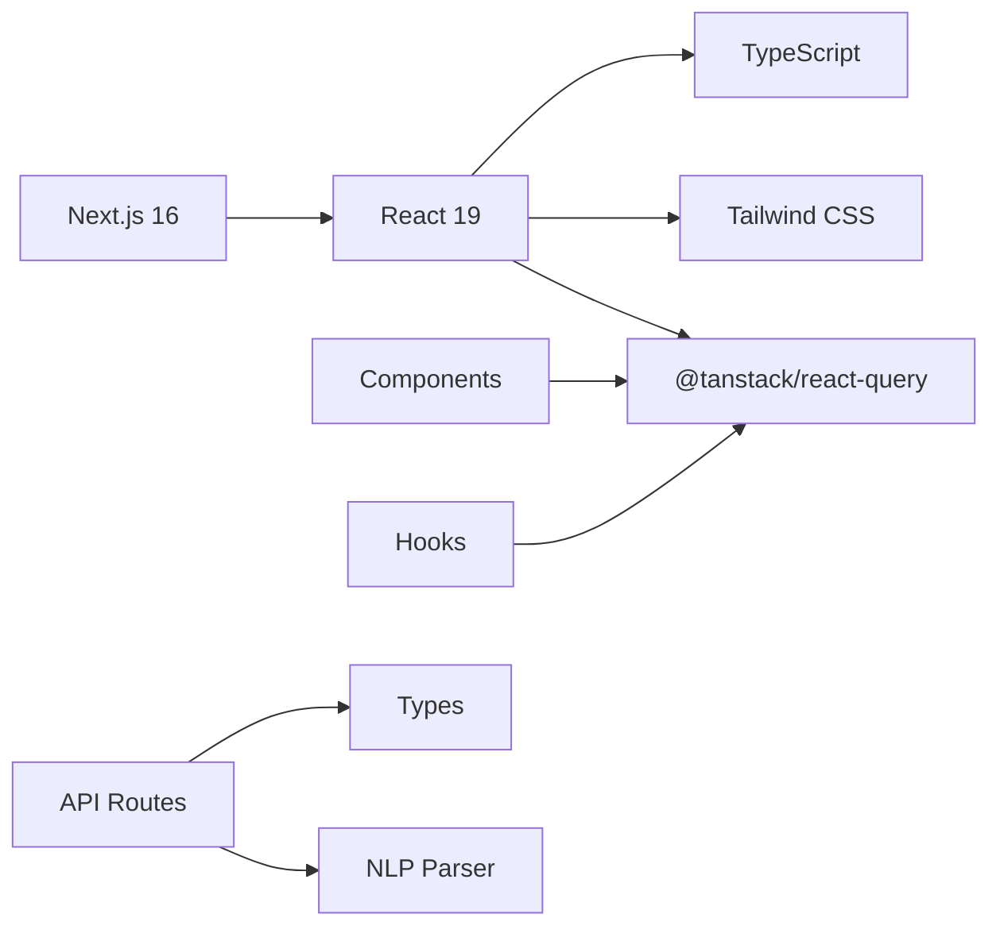

# Project Overview

<cite>
**Referenced Files in This Document**
- [README.md](file://README.md)
- [package.json](file://package.json)
- [src/app/page.tsx](file://src/app/page.tsx)
- [src/app/layout.tsx](file://src/app/layout.tsx)
- [src/components/layout/DashboardLayout.tsx](file://src/components/layout/DashboardLayout.tsx)
- [src/components/layout/Header.tsx](file://src/components/layout/Header.tsx)
- [src/components/search/GlobalSearchBar.tsx](file://src/components/search/GlobalSearchBar.tsx)
- [src/components/search/FilterChips.tsx](file://src/components/search/FilterChips.tsx)
- [src/components/widgets/BaseWidget.tsx](file://src/components/widgets/BaseWidget.tsx)
- [src/components/widgets/CoursesWidget.tsx](file://src/components/widgets/CoursesWidget.tsx)
- [src/components/widgets/EventsWidget.tsx](file://src/components/widgets/EventsWidget.tsx)
- [src/components/widgets/RoomsWidget.tsx](file://src/components/widgets/RoomsWidget.tsx)
- [src/hooks/useGlobalFilters.ts](file://src/hooks/useGlobalFilters.ts)
- [src/hooks/useCourses.ts](file://src/hooks/useCourses.ts)
- [src/hooks/useEvents.ts](file://src/hooks/useEvents.ts)
- [src/hooks/useRooms.ts](file://src/hooks/useRooms.ts)
- [src/app/api/courses/route.ts](file://src/app/api/courses/route.ts)
- [src/app/api/events/route.ts](file://src/app/api/events/route.ts)
- [src/app/api/rooms/route.ts](file://src/app/api/rooms/route.ts)
- [src/app/api/nlp/parse/route.ts](file://src/app/api/nlp/parse/route.ts)
- [src/lib/api/types.ts](file://src/lib/api/types.ts)
- [src/lib/nlp/parser.ts](file://src/lib/nlp/parser.ts)
- [src/providers/QueryProvider.tsx](file://src/providers/QueryProvider.tsx)
</cite>

## Table of Contents
1. [Introduction](#introduction)
2. [Project Structure](#project-structure)
3. [Core Components](#core-components)
4. [Architecture Overview](#architecture-overview)
5. [Detailed Component Analysis](#detailed-component-analysis)
6. [Dependency Analysis](#dependency-analysis)
7. [Performance Considerations](#performance-considerations)
8. [Troubleshooting Guide](#troubleshooting-guide)
9. [Conclusion](#conclusion)

## Introduction
Course Puppy is an academic scheduling and resource management dashboard designed for educational institutions. It provides a unified interface for discovering and managing courses, rooms, and events, with a focus on intuitive search and filtering. The platform supports natural language queries to simplify discovery and enables administrators and students to quickly locate available spaces, upcoming classes, and scheduled events.

Target audience:
- Educational administrators responsible for room bookings, event coordination, and course oversight
- Students seeking course registration information, room availability, and campus event schedules

Primary goals:
- Centralized visibility across courses, rooms, and events
- Natural language search for quick, conversational queries
- Real-time data refresh and responsive UI for efficient workflows

## Project Structure
The project follows a Next.js 16 App Router structure with a clear separation of concerns:
- Frontend pages and layouts under src/app
- Shared UI components under src/components
- Hooks for data fetching and state under src/hooks
- API routes under src/app/api
- NLP parsing logic under src/lib/nlp
- Type definitions under src/lib/api
- Global providers under src/providers

**Diagram sources**
- [src/app/page.tsx:1-100](file://src/app/page.tsx#L1-L100)
- [src/app/layout.tsx](file://src/app/layout.tsx)
- [src/components/layout/DashboardLayout.tsx:1-26](file://src/components/layout/DashboardLayout.tsx#L1-L26)
- [src/components/search/GlobalSearchBar.tsx:1-85](file://src/components/search/GlobalSearchBar.tsx#L1-L85)
- [src/hooks/useGlobalFilters.ts:1-79](file://src/hooks/useGlobalFilters.ts#L1-L79)
- [src/hooks/useRooms.ts:1-31](file://src/hooks/useRooms.ts#L1-L31)
- [src/hooks/useEvents.ts:1-31](file://src/hooks/useEvents.ts#L1-L31)
- [src/hooks/useCourses.ts:1-31](file://src/hooks/useCourses.ts#L1-L31)
- [src/app/api/rooms/route.ts:1-51](file://src/app/api/rooms/route.ts#L1-L51)
- [src/app/api/courses/route.ts:1-48](file://src/app/api/courses/route.ts#L1-L48)
- [src/app/api/events/route.ts:1-54](file://src/app/api/events/route.ts#L1-L54)
- [src/app/api/nlp/parse/route.ts:1-30](file://src/app/api/nlp/parse/route.ts#L1-L30)
- [src/lib/api/types.ts:1-99](file://src/lib/api/types.ts#L1-L99)
- [src/lib/nlp/parser.ts:1-202](file://src/lib/nlp/parser.ts#L1-L202)
- [src/providers/QueryProvider.tsx:1-35](file://src/providers/QueryProvider.tsx#L1-L35)

**Section sources**
- [README.md:1-37](file://README.md#L1-L37)
- [package.json:1-29](file://package.json#L1-L29)
- [src/app/page.tsx:1-100](file://src/app/page.tsx#L1-L100)

## Core Components
Course Puppy’s dashboard centers around a single-page layout with dynamic widgets and a global search bar. The page composes:
- A dashboard layout wrapper
- A global search bar that parses natural language queries
- Filter chips for active selections
- One primary widget selected by the active entity (rooms, events, or courses)

Key behaviors:
- The active entity determines which widget is displayed
- Search queries are parsed via the NLP endpoint to derive filters and target entity
- Filter chips reflect current active filters and support clearing individual or all filters

Common use cases:
- “Show me available rooms in the Student Union”
- “Find courses with Dr. Smith this week”
- “List pending events in Engineering building”

**Section sources**
- [src/app/page.tsx:12-99](file://src/app/page.tsx#L12-L99)
- [src/components/layout/DashboardLayout.tsx:12-25](file://src/components/layout/DashboardLayout.tsx#L12-L25)
- [src/components/search/GlobalSearchBar.tsx:13-84](file://src/components/search/GlobalSearchBar.tsx#L13-L84)
- [src/components/search/FilterChips.tsx](file://src/components/search/FilterChips.tsx)

## Architecture Overview
The system integrates frontend components with Next.js API routes and an internal NLP parser. The flow begins with user input in the global search bar, which posts to the NLP parse endpoint. The backend returns structured filters and an entity type, which the frontend applies to the appropriate data hook. The hooks call the corresponding API route, which forwards requests to the institutional data source and returns paginated results.

**Diagram sources**
- [src/components/search/GlobalSearchBar.tsx:21-54](file://src/components/search/GlobalSearchBar.tsx#L21-L54)
- [src/app/api/nlp/parse/route.ts:5-29](file://src/app/api/nlp/parse/route.ts#L5-L29)
- [src/lib/nlp/parser.ts:155-201](file://src/lib/nlp/parser.ts#L155-L201)
- [src/hooks/useRooms.ts:6-23](file://src/hooks/useRooms.ts#L6-L23)
- [src/hooks/useEvents.ts:6-23](file://src/hooks/useEvents.ts#L6-L23)
- [src/hooks/useCourses.ts:6-23](file://src/hooks/useCourses.ts#L6-L23)
- [src/app/api/rooms/route.ts:5-49](file://src/app/api/rooms/route.ts#L5-L49)
- [src/app/api/events/route.ts:5-52](file://src/app/api/events/route.ts#L5-L52)
- [src/app/api/courses/route.ts:5-46](file://src/app/api/courses/route.ts#L5-L46)

## Detailed Component Analysis

### Natural Language Processing Pipeline
The NLP pipeline tokenizes queries, detects entity types (rooms, events, courses), extracts statuses, buildings, rooms, and time ranges, and computes a confidence score. The parser uses keyword mappings and pattern matching to infer intent and populate FilterParams.

**Diagram sources**
- [src/lib/nlp/parser.ts:12-201](file://src/lib/nlp/parser.ts#L12-L201)
- [src/lib/api/types.ts:49-84](file://src/lib/api/types.ts#L49-L84)

**Section sources**
- [src/lib/nlp/parser.ts:1-202](file://src/lib/nlp/parser.ts#L1-L202)
- [src/lib/api/types.ts:1-99](file://src/lib/api/types.ts#L1-L99)

### API Layer and Data Fetching
Each domain (rooms, events, courses) exposes a GET API route that:
- Parses query parameters into FilterParams
- Calls a data source function
- Returns paginated ApiResponse structures

React Query hooks encapsulate fetching logic:
- Convert FilterParams to URLSearchParams
- Perform GET requests to the respective API route
- Manage caching, retries, and refetch intervals

**Diagram sources**
- [src/hooks/useRooms.ts:6-23](file://src/hooks/useRooms.ts#L6-L23)
- [src/hooks/useEvents.ts:6-23](file://src/hooks/useEvents.ts#L6-L23)
- [src/hooks/useCourses.ts:6-23](file://src/hooks/useCourses.ts#L6-L23)
- [src/app/api/rooms/route.ts:5-49](file://src/app/api/rooms/route.ts#L5-L49)
- [src/app/api/events/route.ts:5-52](file://src/app/api/events/route.ts#L5-L52)
- [src/app/api/courses/route.ts:5-46](file://src/app/api/courses/route.ts#L5-L46)
- [src/lib/api/types.ts:86-98](file://src/lib/api/types.ts#L86-L98)

**Section sources**
- [src/app/api/rooms/route.ts:1-51](file://src/app/api/rooms/route.ts#L1-L51)
- [src/app/api/events/route.ts:1-54](file://src/app/api/events/route.ts#L1-L54)
- [src/app/api/courses/route.ts:1-48](file://src/app/api/courses/route.ts#L1-L48)
- [src/hooks/useRooms.ts:1-31](file://src/hooks/useRooms.ts#L1-L31)
- [src/hooks/useEvents.ts:1-31](file://src/hooks/useEvents.ts#L1-L31)
- [src/hooks/useCourses.ts:1-31](file://src/hooks/useCourses.ts#L1-L31)
- [src/lib/api/types.ts:1-99](file://src/lib/api/types.ts#L1-L99)

### Widget Components and Data Presentation
The widget system renders domain-specific tables with standardized columns and status badges. Each widget:
- Uses its corresponding hook to fetch data
- Displays loading states and errors
- Shows last updated timestamps and refresh controls

**Diagram sources**
- [src/components/widgets/BaseWidget.tsx](file://src/components/widgets/BaseWidget.tsx)
- [src/components/widgets/RoomsWidget.tsx:1-97](file://src/components/widgets/RoomsWidget.tsx#L1-L97)
- [src/components/widgets/EventsWidget.tsx:1-116](file://src/components/widgets/EventsWidget.tsx#L1-L116)
- [src/components/widgets/CoursesWidget.tsx:1-121](file://src/components/widgets/CoursesWidget.tsx#L1-L121)

**Section sources**
- [src/components/widgets/RoomsWidget.tsx:1-97](file://src/components/widgets/RoomsWidget.tsx#L1-L97)
- [src/components/widgets/EventsWidget.tsx:1-116](file://src/components/widgets/EventsWidget.tsx#L1-L116)
- [src/components/widgets/CoursesWidget.tsx:1-121](file://src/components/widgets/CoursesWidget.tsx#L1-L121)

### Search and Filtering Workflow
The global search bar integrates with the NLP parse endpoint and the global filter state. It supports:
- Submitting natural language queries
- Parsing and applying filters
- Clearing specific or all filters
- Falling back to a general query when parsing fails

**Diagram sources**
- [src/components/search/GlobalSearchBar.tsx:21-54](file://src/components/search/GlobalSearchBar.tsx#L21-L54)
- [src/app/api/nlp/parse/route.ts:5-29](file://src/app/api/nlp/parse/route.ts#L5-L29)
- [src/hooks/useGlobalFilters.ts:24-37](file://src/hooks/useGlobalFilters.ts#L24-L37)
- [src/app/page.tsx:24-36](file://src/app/page.tsx#L24-L36)

**Section sources**
- [src/components/search/GlobalSearchBar.tsx:1-85](file://src/components/search/GlobalSearchBar.tsx#L1-L85)
- [src/hooks/useGlobalFilters.ts:1-79](file://src/hooks/useGlobalFilters.ts#L1-L79)
- [src/app/page.tsx:12-36](file://src/app/page.tsx#L12-L36)

## Dependency Analysis
Technology stack:
- Next.js 16 for the full-stack framework
- React 19 for UI components
- TypeScript for type safety
- Tailwind CSS for styling
- @tanstack/react-query for data fetching and caching
- lucide-react for icons

External integrations:
- API routes act as thin wrappers around institutional data sources
- NLP parser operates locally on the server-side API boundary

**Diagram sources**
- [package.json:11-27](file://package.json#L11-L27)
- [src/providers/QueryProvider.tsx:15-34](file://src/providers/QueryProvider.tsx#L15-L34)
- [src/lib/api/types.ts:1-99](file://src/lib/api/types.ts#L1-L99)
- [src/lib/nlp/parser.ts:1-202](file://src/lib/nlp/parser.ts#L1-L202)

**Section sources**
- [package.json:1-29](file://package.json#L1-L29)
- [src/providers/QueryProvider.tsx:1-35](file://src/providers/QueryProvider.tsx#L1-L35)

## Performance Considerations
- Automatic refresh interval is configurable via environment variable and defaults to five minutes
- Queries are cached with a short stale threshold and exponential backoff on retry
- Paginated responses reduce payload sizes and improve responsiveness
- Real-time updates are supported through periodic refetching

Recommendations:
- Tune NEXT_PUBLIC_REFRESH_INTERVAL for your environment
- Use targeted filters to minimize result sets
- Leverage the built-in retry and caching to balance freshness and performance

**Section sources**
- [src/providers/QueryProvider.tsx:6-26](file://src/providers/QueryProvider.tsx#L6-L26)
- [src/lib/api/types.ts:86-98](file://src/lib/api/types.ts#L86-L98)

## Troubleshooting Guide
Common issues and resolutions:
- NLP parsing failures: The search bar falls back to treating the query as a general search string and defaults to rooms when the entity is unknown
- API errors: API routes return structured error responses with messages; verify query parameters and network connectivity
- Data fetch errors: Hooks propagate errors from API responses; check console logs and ensure filters are valid

Operational tips:
- Confirm environment variables for refresh intervals
- Validate that API routes receive expected query parameters
- Inspect the global filter state to ensure filters are applied correctly

**Section sources**
- [src/components/search/GlobalSearchBar.tsx:47-53](file://src/components/search/GlobalSearchBar.tsx#L47-L53)
- [src/app/api/rooms/route.ts:40-49](file://src/app/api/rooms/route.ts#L40-L49)
- [src/app/api/events/route.ts:43-52](file://src/app/api/events/route.ts#L43-L52)
- [src/app/api/courses/route.ts:37-46](file://src/app/api/courses/route.ts#L37-L46)
- [src/hooks/useRooms.ts:17-22](file://src/hooks/useRooms.ts#L17-L22)
- [src/hooks/useEvents.ts:17-22](file://src/hooks/useEvents.ts#L17-L22)
- [src/hooks/useCourses.ts:17-22](file://src/hooks/useCourses.ts#L17-L22)

## Conclusion
Course Puppy delivers a modern, conversational interface for academic scheduling and resource management. Its architecture cleanly separates concerns between the frontend, API routes, and NLP processing, enabling maintainable growth and robust performance. Administrators and students can efficiently discover courses, book rooms, coordinate events, and navigate campus resources through a unified dashboard powered by natural language search.