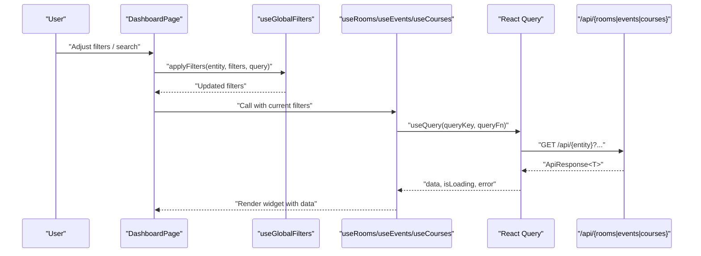
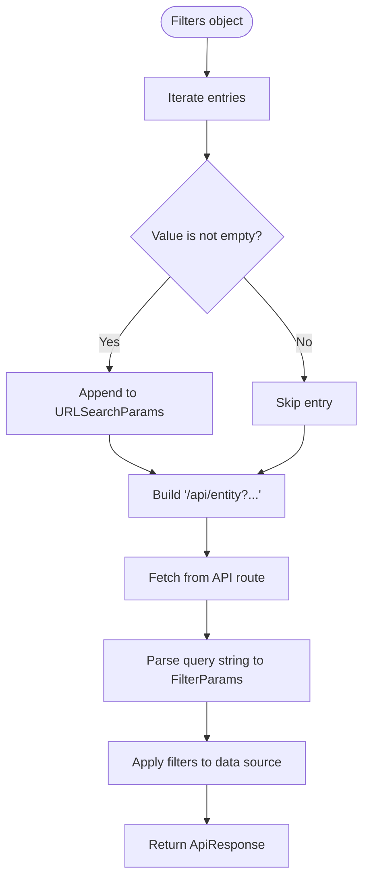
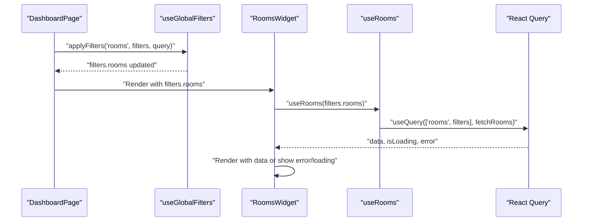
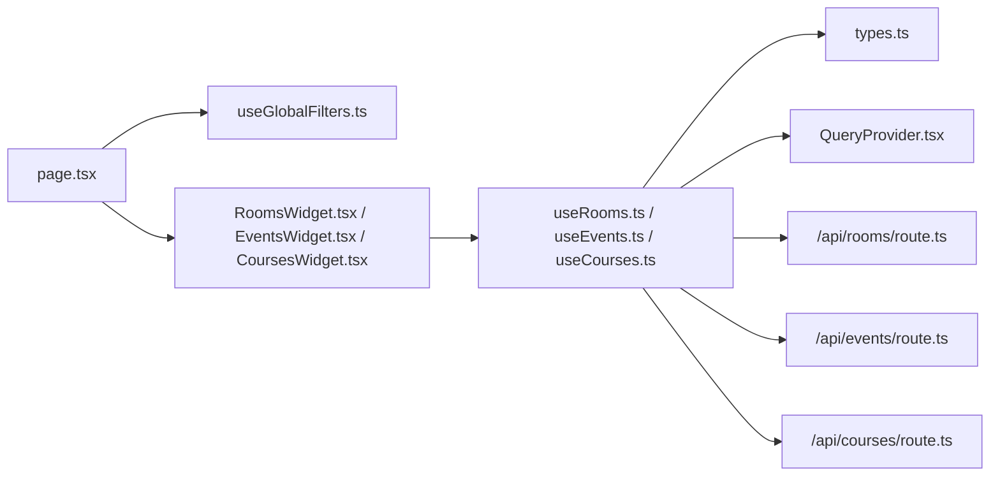

# Entity Data Fetching Hooks

<cite>
**Referenced Files in This Document**
- [useRooms.ts](file://src/hooks/useRooms.ts)
- [useEvents.ts](file://src/hooks/useEvents.ts)
- [useCourses.ts](file://src/hooks/useCourses.ts)
- [useGlobalFilters.ts](file://src/hooks/useGlobalFilters.ts)
- [QueryProvider.tsx](file://src/providers/QueryProvider.tsx)
- [route.ts (rooms)](file://src/app/api/rooms/route.ts)
- [route.ts (events)](file://src/app/api/events/route.ts)
- [route.ts (courses)](file://src/app/api/courses/route.ts)
- [types.ts](file://src/lib/api/types.ts)
- [RoomsWidget.tsx](file://src/components/widgets/RoomsWidget.tsx)
- [EventsWidget.tsx](file://src/components/widgets/EventsWidget.tsx)
- [CoursesWidget.tsx](file://src/components/widgets/CoursesWidget.tsx)
- [FilterChips.tsx](file://src/components/search/FilterChips.tsx)
- [layout.tsx](file://src/app/layout.tsx)
- [page.tsx](file://src/app/page.tsx)
</cite>

## Table of Contents
1. [Introduction](#introduction)
2. [Project Structure](#project-structure)
3. [Core Components](#core-components)
4. [Architecture Overview](#architecture-overview)
5. [Detailed Component Analysis](#detailed-component-analysis)
6. [Dependency Analysis](#dependency-analysis)
7. [Performance Considerations](#performance-considerations)
8. [Troubleshooting Guide](#troubleshooting-guide)
9. [Conclusion](#conclusion)

## Introduction
This document explains the entity-specific data fetching hooks pattern implemented for rooms, events, and courses. It covers the consistent approach to data fetching, caching, and state management using React Query, the hook signatures and return values, the transformation of filter parameters into API queries, and how global filters integrate with the hooks. It also documents usage in components, error handling, loading indicators, the relationship to the underlying API client, and performance optimizations such as query deduplication and cache invalidation strategies.

## Project Structure
The data fetching pattern is implemented across several layers:
- Hooks: entity-specific hooks for fetching data and a global filters hook for centralized filter state.
- Providers: React Query provider with default caching and refetching policies.
- API routes: server endpoints that parse query parameters and return paginated, typed responses.
- Components: widgets that consume the hooks and render data, errors, and loading states.
- Types: shared TypeScript interfaces for entities, filters, and API responses.

```mermaid
graph TB
subgraph "UI Layer"
Page["DashboardPage<br/>page.tsx"]
Widgets["RoomsWidget / EventsWidget / CoursesWidget"]
Filters["FilterChips"]
end
subgraph "Hooks Layer"
HookRooms["useRooms"]
HookEvents["useEvents"]
HookCourses["useCourses"]
HookGlobal["useGlobalFilters"]
end
subgraph "Providers"
Provider["QueryProvider"]
end
subgraph "API Layer"
APIRooms["/api/rooms"]
APIEvents["/api/events"]
APICourses["/api/courses"]
end
subgraph "Types"
Types["types.ts"]
end
Page --> HookGlobal
Page --> Widgets
HookGlobal --> HookRooms
HookGlobal --> HookEvents
HookGlobal --> HookCourses
Widgets --> HookRooms
Widgets --> HookEvents
Widgets --> HookCourses
HookRooms --> Provider
HookEvents --> Provider
HookCourses --> Provider
HookRooms --> APIRooms
HookEvents --> APIEvents
HookCourses --> APICourses
HookGlobal --> Types
HookRooms --> Types
HookEvents --> Types
HookCourses --> Types
```

**Diagram sources**
- [page.tsx:12-99](file://src/app/page.tsx#L12-L99)
- [useGlobalFilters.ts:14-78](file://src/hooks/useGlobalFilters.ts#L14-L78)
- [useRooms.ts:25-30](file://src/hooks/useRooms.ts#L25-L30)
- [useEvents.ts:25-30](file://src/hooks/useEvents.ts#L25-L30)
- [useCourses.ts:25-30](file://src/hooks/useCourses.ts#L25-L30)
- [QueryProvider.tsx:15-34](file://src/providers/QueryProvider.tsx#L15-L34)
- [route.ts (rooms):13-78](file://src/app/api/rooms/route.ts#L13-L78)
- [route.ts (events):13-80](file://src/app/api/events/route.ts#L13-L80)
- [route.ts (courses):13-75](file://src/app/api/courses/route.ts#L13-L75)
- [types.ts:1-99](file://src/lib/api/types.ts#L1-L99)

**Section sources**
- [layout.tsx:21-38](file://src/app/layout.tsx#L21-L38)
- [page.tsx:12-99](file://src/app/page.tsx#L12-L99)
- [useGlobalFilters.ts:14-78](file://src/hooks/useGlobalFilters.ts#L14-L78)
- [useRooms.ts:25-30](file://src/hooks/useRooms.ts#L25-L30)
- [useEvents.ts:25-30](file://src/hooks/useEvents.ts#L25-L30)
- [useCourses.ts:25-30](file://src/hooks/useCourses.ts#L25-L30)
- [QueryProvider.tsx:15-34](file://src/providers/QueryProvider.tsx#L15-L34)
- [route.ts (rooms):13-78](file://src/app/api/rooms/route.ts#L13-L78)
- [route.ts (events):13-80](file://src/app/api/events/route.ts#L13-L80)
- [route.ts (courses):13-75](file://src/app/api/courses/route.ts#L13-L75)
- [types.ts:1-99](file://src/lib/api/types.ts#L1-L99)

## Core Components
- useRooms, useEvents, useCourses: Entity-specific hooks that encapsulate data fetching via React Query. They accept a filters object, transform it into URL search parameters, and return a standardized result object containing data, loading, error, and refresh capabilities.
- useGlobalFilters: Centralized state for managing active entity, per-entity filters, and a global search query. It exposes actions to apply, clear, and update filters and returns the currently active filters for the selected entity.
- QueryProvider: React Query provider with default caching and refetching policies, enabling automatic caching, background refetching, and retry behavior.
- API routes: Server endpoints that parse query parameters into typed filter objects and return paginated responses compatible with the shared ApiResponse<T> structure.
- Widgets: Components that consume the hooks, render loading and error states, and present data in tabular form.

Key characteristics:
- Hook signature pattern: filters argument defaults to an empty object; queryKey includes the entity and filters to enable React Query’s deduplication and cache coherency.
- Return value structure: standardized shape with data, isLoading, error, dataUpdatedAt, and refetch.
- Filter-to-query transformation: filters are serialized into URL search parameters; only non-empty values are included.
- Global filters integration: widgets receive filters from useGlobalFilters and pass them to the entity hooks.

**Section sources**
- [useRooms.ts:25-30](file://src/hooks/useRooms.ts#L25-L30)
- [useEvents.ts:25-30](file://src/hooks/useEvents.ts#L25-L30)
- [useCourses.ts:25-30](file://src/hooks/useCourses.ts#L25-L30)
- [useGlobalFilters.ts:14-78](file://src/hooks/useGlobalFilters.ts#L14-L78)
- [QueryProvider.tsx:15-34](file://src/providers/QueryProvider.tsx#L15-L34)
- [route.ts (rooms):13-78](file://src/app/api/rooms/route.ts#L13-L78)
- [route.ts (events):13-80](file://src/app/api/events/route.ts#L13-L80)
- [route.ts (courses):13-75](file://src/app/api/courses/route.ts#L13-L75)
- [types.ts:49-92](file://src/lib/api/types.ts#L49-L92)

## Architecture Overview
The pattern follows a unidirectional data flow:
- Global filters are managed by useGlobalFilters and applied to the active entity.
- Entity hooks (useRooms, useEvents, useCourses) depend on React Query to manage caching, background refetching, and error states.
- API routes translate URL query parameters into typed filter objects and return structured responses.
- Components consume the hooks and render UI based on the returned state.



**Diagram sources**
- [page.tsx:12-99](file://src/app/page.tsx#L12-L99)
- [useGlobalFilters.ts:24-37](file://src/hooks/useGlobalFilters.ts#L24-L37)
- [useRooms.ts:25-30](file://src/hooks/useRooms.ts#L25-L30)
- [useEvents.ts:25-30](file://src/hooks/useEvents.ts#L25-L30)
- [useCourses.ts:25-30](file://src/hooks/useCourses.ts#L25-L30)
- [route.ts (rooms):13-78](file://src/app/api/rooms/route.ts#L13-L78)
- [route.ts (events):13-80](file://src/app/api/events/route.ts#L13-L80)
- [route.ts (courses):13-75](file://src/app/api/courses/route.ts#L13-L75)

## Detailed Component Analysis

### Hook Signatures and Return Values
- Signature pattern:
  - useRooms(filters = {}): returns React Query result for rooms.
  - useEvents(filters = {}): returns React Query result for events.
  - useCourses(filters = {}): returns React Query result for courses.
- Return value structure:
  - data: ApiResponse<T> with data[], total, page, pageSize.
  - isLoading: boolean indicating network activity.
  - error: Error object if the request fails.
  - dataUpdatedAt: timestamp of last successful update.
  - refetch: function to manually trigger a refetch.

Implementation notes:
- queryKey: ['entity', filters] ensures React Query deduplicates identical queries and coherently invalidates caches when filters change.
- queryFn: fetchRooms/fetchEvents/fetchCourses serialize filters into URL search parameters and call the appropriate API endpoint.

**Section sources**
- [useRooms.ts:25-30](file://src/hooks/useRooms.ts#L25-L30)
- [useEvents.ts:25-30](file://src/hooks/useEvents.ts#L25-L30)
- [useCourses.ts:25-30](file://src/hooks/useCourses.ts#L25-L30)
- [types.ts:86-92](file://src/lib/api/types.ts#L86-L92)

### Filter-to-Query Transformation
- Each hook converts the filters object into URL search parameters by iterating over entries and appending only non-empty values.
- The API routes parse the query string into a strongly-typed FilterParams object and apply them to the data source (either real API or mock data).



**Diagram sources**
- [useRooms.ts:6-23](file://src/hooks/useRooms.ts#L6-L23)
- [useEvents.ts:6-23](file://src/hooks/useEvents.ts#L6-L23)
- [useCourses.ts:6-23](file://src/hooks/useCourses.ts#L6-L23)
- [route.ts (rooms):13-44](file://src/app/api/rooms/route.ts#L13-L44)
- [route.ts (events):13-47](file://src/app/api/events/route.ts#L13-L47)
- [route.ts (courses):13-41](file://src/app/api/courses/route.ts#L13-L41)

**Section sources**
- [useRooms.ts:6-23](file://src/hooks/useRooms.ts#L6-L23)
- [useEvents.ts:6-23](file://src/hooks/useEvents.ts#L6-L23)
- [useCourses.ts:6-23](file://src/hooks/useCourses.ts#L6-L23)
- [route.ts (rooms):13-44](file://src/app/api/rooms/route.ts#L13-L44)
- [route.ts (events):13-47](file://src/app/api/events/route.ts#L13-L47)
- [route.ts (courses):13-41](file://src/app/api/courses/route.ts#L13-L41)

### Integration with React Query and Global Filters
- React Query provider sets default options including staleTime, refetchInterval, retry, and retryDelay.
- useGlobalFilters manages activeEntity and per-entity FilterParams, exposing methods to apply, clear, and update filters.
- Components derive filters from useGlobalFilters and pass them to the entity hooks; widgets also expose a manual refresh action via refetch.



**Diagram sources**
- [page.tsx:12-99](file://src/app/page.tsx#L12-L99)
- [useGlobalFilters.ts:14-78](file://src/hooks/useGlobalFilters.ts#L14-L78)
- [RoomsWidget.tsx:16-100](file://src/components/widgets/RoomsWidget.tsx#L16-L100)
- [useRooms.ts:25-30](file://src/hooks/useRooms.ts#L25-L30)
- [QueryProvider.tsx:15-34](file://src/providers/QueryProvider.tsx#L15-L34)

**Section sources**
- [QueryProvider.tsx:15-34](file://src/providers/QueryProvider.tsx#L15-L34)
- [useGlobalFilters.ts:14-78](file://src/hooks/useGlobalFilters.ts#L14-L78)
- [page.tsx:12-99](file://src/app/page.tsx#L12-L99)
- [RoomsWidget.tsx:16-100](file://src/components/widgets/RoomsWidget.tsx#L16-L100)

### Hook Usage in Components
- RoomsWidget, EventsWidget, and CoursesWidget call their respective hooks with the current filters and render:
  - Loading state via isLoading.
  - Error state via error and refetch.
  - Data via data.data with a DataTable component.
  - Last updated timestamp via dataUpdatedAt.
- FilterChips displays active filters and supports clearing individual or all filters.

Example usage references:
- RoomsWidget receives filters and destructures data, isLoading, error, dataUpdatedAt, refetch from useRooms.
- EventsWidget and CoursesWidget mirror the same pattern with their respective hooks.
- FilterChips renders active filters derived from the active entity’s filters.

**Section sources**
- [RoomsWidget.tsx:16-100](file://src/components/widgets/RoomsWidget.tsx#L16-L100)
- [EventsWidget.tsx:14-115](file://src/components/widgets/EventsWidget.tsx#L14-L115)
- [CoursesWidget.tsx:14-120](file://src/components/widgets/CoursesWidget.tsx#L14-L120)
- [FilterChips.tsx:23-59](file://src/components/search/FilterChips.tsx#L23-L59)

### Relationship Between Hooks and the API Client
- Each hook defines a local fetch function that builds URL search parameters from filters and calls the corresponding API endpoint.
- The API routes parse the query string into FilterParams and return an ApiResponse<T>.
- When API credentials are missing or unavailable, the routes fall back to mock data while still returning a consistent ApiResponse<T> structure.

**Section sources**
- [useRooms.ts:6-23](file://src/hooks/useRooms.ts#L6-L23)
- [useEvents.ts:6-23](file://src/hooks/useEvents.ts#L6-L23)
- [useCourses.ts:6-23](file://src/hooks/useCourses.ts#L6-L23)
- [route.ts (rooms):13-78](file://src/app/api/rooms/route.ts#L13-L78)
- [route.ts (events):13-80](file://src/app/api/events/route.ts#L13-L80)
- [route.ts (courses):13-75](file://src/app/api/courses/route.ts#L13-L75)

## Dependency Analysis
The following diagram shows the primary dependencies among the components involved in the data fetching pattern:



**Diagram sources**
- [page.tsx:12-99](file://src/app/page.tsx#L12-L99)
- [useGlobalFilters.ts:14-78](file://src/hooks/useGlobalFilters.ts#L14-L78)
- [RoomsWidget.tsx:16-100](file://src/components/widgets/RoomsWidget.tsx#L16-L100)
- [EventsWidget.tsx:14-115](file://src/components/widgets/EventsWidget.tsx#L14-L115)
- [CoursesWidget.tsx:14-120](file://src/components/widgets/CoursesWidget.tsx#L14-L120)
- [useRooms.ts:25-30](file://src/hooks/useRooms.ts#L25-L30)
- [useEvents.ts:25-30](file://src/hooks/useEvents.ts#L25-L30)
- [useCourses.ts:25-30](file://src/hooks/useCourses.ts#L25-L30)
- [types.ts:1-99](file://src/lib/api/types.ts#L1-L99)
- [QueryProvider.tsx:15-34](file://src/providers/QueryProvider.tsx#L15-L34)
- [route.ts (rooms):13-78](file://src/app/api/rooms/route.ts#L13-L78)
- [route.ts (events):13-80](file://src/app/api/events/route.ts#L13-L80)
- [route.ts (courses):13-75](file://src/app/api/courses/route.ts#L13-L75)

**Section sources**
- [page.tsx:12-99](file://src/app/page.tsx#L12-L99)
- [useGlobalFilters.ts:14-78](file://src/hooks/useGlobalFilters.ts#L14-L78)
- [RoomsWidget.tsx:16-100](file://src/components/widgets/RoomsWidget.tsx#L16-L100)
- [EventsWidget.tsx:14-115](file://src/components/widgets/EventsWidget.tsx#L14-L115)
- [CoursesWidget.tsx:14-120](file://src/components/widgets/CoursesWidget.tsx#L14-L120)
- [useRooms.ts:25-30](file://src/hooks/useRooms.ts#L25-L30)
- [useEvents.ts:25-30](file://src/hooks/useEvents.ts#L25-L30)
- [useCourses.ts:25-30](file://src/hooks/useCourses.ts#L25-L30)
- [types.ts:1-99](file://src/lib/api/types.ts#L1-L99)
- [QueryProvider.tsx:15-34](file://src/providers/QueryProvider.tsx#L15-L34)
- [route.ts (rooms):13-78](file://src/app/api/rooms/route.ts#L13-L78)
- [route.ts (events):13-80](file://src/app/api/events/route.ts#L13-L80)
- [route.ts (courses):13-75](file://src/app/api/courses/route.ts#L13-L75)

## Performance Considerations
- Query deduplication: The queryKey includes the entity and filters, ensuring identical queries are deduplicated and cached under the same key.
- Automatic caching and background refetching: React Query’s defaultOptions provide a staleTime and refetchInterval, keeping data fresh without manual intervention.
- Retry strategy: Configured retry attempts and exponential backoff reduce transient failure impact.
- Efficient updates: Using refetch allows targeted refreshes when filters change, minimizing unnecessary re-fetches.
- Pagination and limits: API routes support limit and offset parameters, enabling efficient pagination and reducing payload sizes.

Recommendations:
- Prefer passing minimal, meaningful filters to leverage cache effectively.
- Use refetch strategically after significant state changes.
- Monitor dataUpdatedAt to inform users about freshness.

**Section sources**
- [QueryProvider.tsx:15-34](file://src/providers/QueryProvider.tsx#L15-L34)
- [useRooms.ts:25-30](file://src/hooks/useRooms.ts#L25-L30)
- [useEvents.ts:25-30](file://src/hooks/useEvents.ts#L25-L30)
- [useCourses.ts:25-30](file://src/hooks/useCourses.ts#L25-L30)
- [route.ts (rooms):35-40](file://src/app/api/rooms/route.ts#L35-L40)
- [route.ts (events):38-43](file://src/app/api/events/route.ts#L38-L43)
- [route.ts (courses):32-37](file://src/app/api/courses/route.ts#L32-L37)

## Troubleshooting Guide
Common issues and resolutions:
- Empty or unexpected results:
  - Verify that filters are being passed correctly from useGlobalFilters to the entity hooks.
  - Confirm that the activeEntity matches the intended entity.
- Error states:
  - Components render error messages and expose refetch; use refetch to retry after correcting filters.
  - API routes fall back to mock data on errors; confirm API credentials are configured to avoid fallback behavior.
- Loading indicators:
  - Use isLoading to conditionally render loading spinners or skeletons.
- Cache staleness:
  - Adjust staleTime or rely on refetchInterval to keep data fresh.
  - Trigger refetch when filters change to invalidate and reload the cache.

**Section sources**
- [RoomsWidget.tsx:67-81](file://src/components/widgets/RoomsWidget.tsx#L67-L81)
- [EventsWidget.tsx:84-97](file://src/components/widgets/EventsWidget.tsx#L84-L97)
- [CoursesWidget.tsx:89-102](file://src/components/widgets/CoursesWidget.tsx#L89-L102)
- [route.ts (rooms):56-77](file://src/app/api/rooms/route.ts#L56-L77)
- [route.ts (events):58-79](file://src/app/api/events/route.ts#L58-L79)
- [route.ts (courses):52-74](file://src/app/api/courses/route.ts#L52-L74)
- [QueryProvider.tsx:18-26](file://src/providers/QueryProvider.tsx#L18-L26)

## Conclusion
The entity-specific data fetching hooks pattern provides a consistent, scalable approach to retrieving and displaying rooms, events, and courses data. By leveraging React Query for caching and background refetching, transforming filters into URL search parameters, and centralizing filter state with useGlobalFilters, the system achieves predictable performance, robust error handling, and a clean separation of concerns. Components remain declarative and reusable, while the API routes maintain a stable contract through typed filter parameters and structured responses.