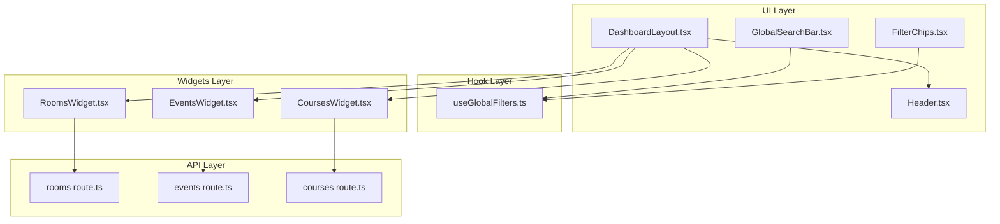
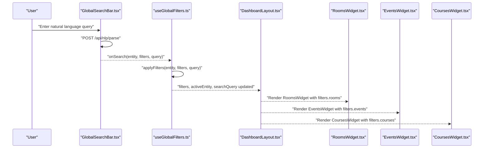
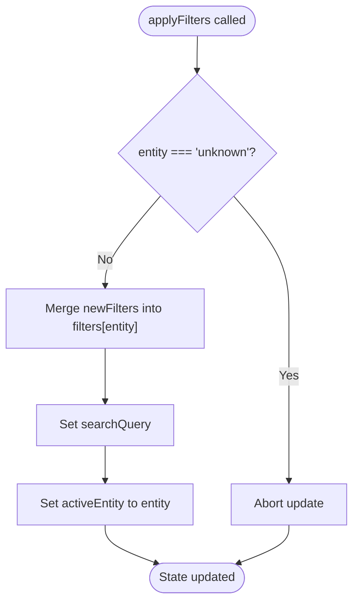
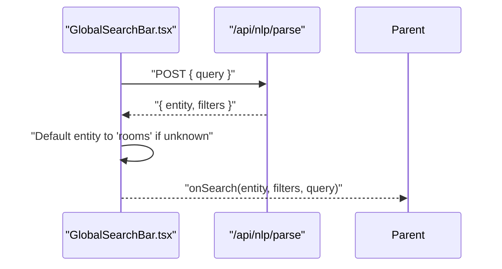
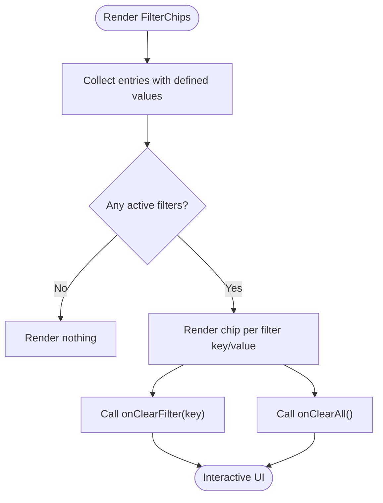
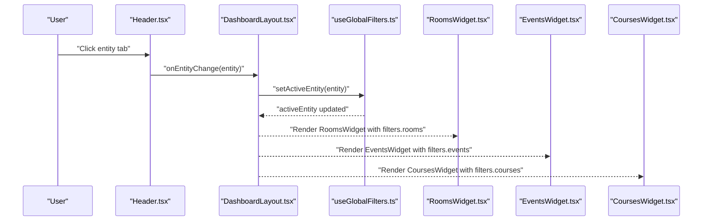
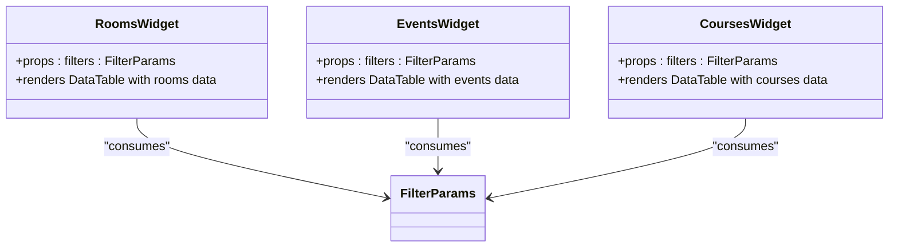
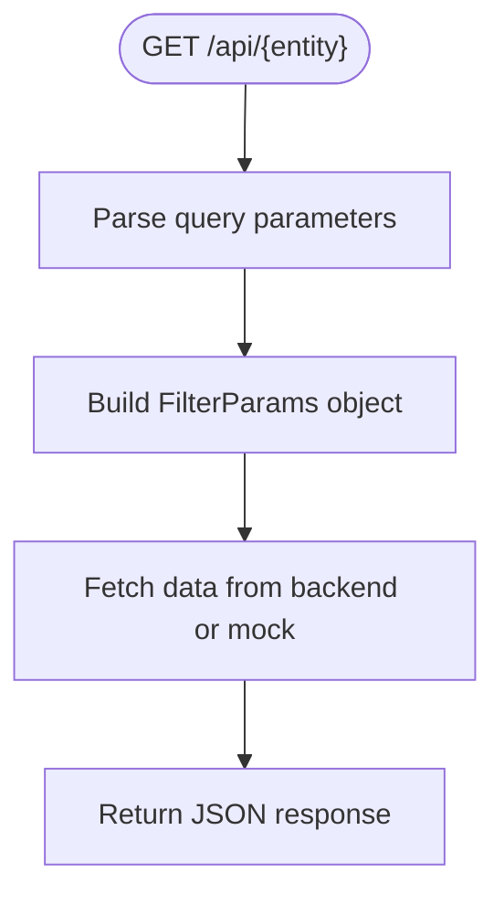
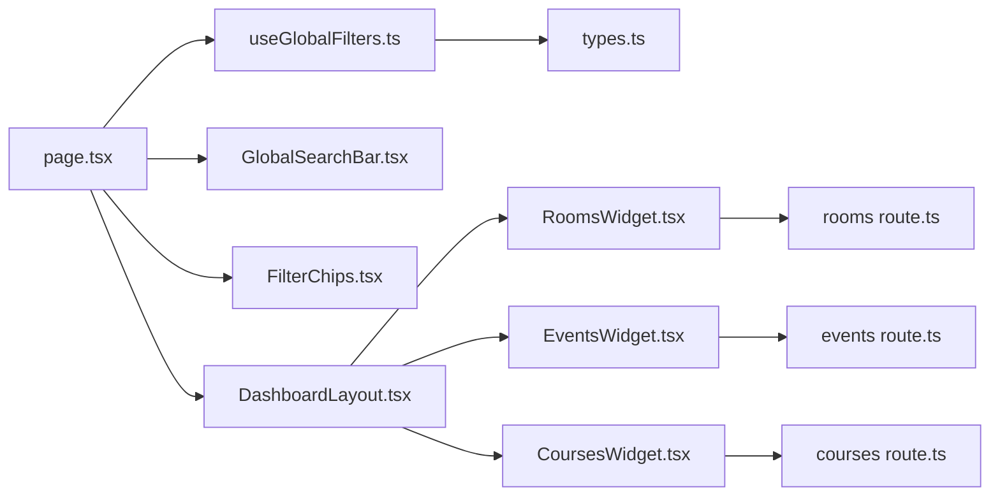

# Global Filters Management

<cite>
**Referenced Files in This Document**
- [useGlobalFilters.ts](file://src/hooks/useGlobalFilters.ts)
- [types.ts](file://src/lib/api/types.ts)
- [page.tsx](file://src/app/page.tsx)
- [GlobalSearchBar.tsx](file://src/components/search/GlobalSearchBar.tsx)
- [FilterChips.tsx](file://src/components/search/FilterChips.tsx)
- [DashboardLayout.tsx](file://src/components/layout/DashboardLayout.tsx)
- [Header.tsx](file://src/components/layout/Header.tsx)
- [RoomsWidget.tsx](file://src/components/widgets/RoomsWidget.tsx)
- [EventsWidget.tsx](file://src/components/widgets/EventsWidget.tsx)
- [CoursesWidget.tsx](file://src/components/widgets/CoursesWidget.tsx)
- [route.ts (rooms)](file://src/app/api/rooms/route.ts)
- [route.ts (events)](file://src/app/api/events/route.ts)
- [route.ts (courses)](file://src/app/api/courses/route.ts)
</cite>

## Table of Contents
1. [Introduction](#introduction)
2. [Project Structure](#project-structure)
3. [Core Components](#core-components)
4. [Architecture Overview](#architecture-overview)
5. [Detailed Component Analysis](#detailed-component-analysis)
6. [Dependency Analysis](#dependency-analysis)
7. [Performance Considerations](#performance-considerations)
8. [Troubleshooting Guide](#troubleshooting-guide)
9. [Conclusion](#conclusion)

## Introduction
This document explains the global filters management system used across the dashboard. It focuses on the useGlobalFilters hook, the GlobalFilters interface, and how filters are applied, persisted, and shared across entities (rooms, events, courses). It also covers the activeEntity concept, filter validation, default handling, and state mutation patterns, along with examples of persistence during re-renders and navigation.

## Project Structure
The global filters system spans several layers:
- Hook layer: useGlobalFilters manages state and exposes actions.
- UI layer: GlobalSearchBar parses natural language queries and emits structured filters; FilterChips renders active filters and supports clearing.
- Layout layer: DashboardLayout and Header coordinate entity switching.
- Widgets layer: RoomsWidget, EventsWidget, and CoursesWidget consume per-entity filters.
- API layer: Next.js routes translate filters into backend requests.

**Diagram sources**
- [GlobalSearchBar.tsx:1-85](file://src/components/search/GlobalSearchBar.tsx#L1-L85)
- [FilterChips.tsx:1-60](file://src/components/search/FilterChips.tsx#L1-L60)
- [DashboardLayout.tsx:1-26](file://src/components/layout/DashboardLayout.tsx#L1-L26)
- [Header.tsx:1-61](file://src/components/layout/Header.tsx#L1-L61)
- [RoomsWidget.tsx:1-97](file://src/components/widgets/RoomsWidget.tsx#L1-L97)
- [EventsWidget.tsx:1-116](file://src/components/widgets/EventsWidget.tsx#L1-L116)
- [CoursesWidget.tsx:1-121](file://src/components/widgets/CoursesWidget.tsx#L1-L121)
- [route.ts (rooms):1-79](file://src/app/api/rooms/route.ts#L1-L79)
- [route.ts (events):1-54](file://src/app/api/events/route.ts#L1-L54)
- [route.ts (courses):1-48](file://src/app/api/courses/route.ts#L1-L48)

**Section sources**
- [useGlobalFilters.ts:1-79](file://src/hooks/useGlobalFilters.ts#L1-L79)
- [types.ts:49-70](file://src/lib/api/types.ts#L49-L70)
- [page.tsx:12-99](file://src/app/page.tsx#L12-L99)

## Core Components
- useGlobalFilters hook
  - Initializes state with separate FilterParams for rooms, events, and courses, plus a global searchQuery and activeEntity.
  - Exposes setters and helpers:
    - applyFilters(entity, newFilters, searchQuery?): sets filters for the given entity, updates searchQuery, and sets activeEntity.
    - clearFilters(entity?): resets a specific entity’s filters and clears searchQuery; if no entity provided, resets to initial state.
    - clearSpecificFilter(entity, filterKey): removes a single filter key from the specified entity.
    - setActiveEntity(entity): switches activeEntity without changing filters.
    - getActiveFilters(): returns the current active entity’s filters.
  - Uses functional state updates to avoid stale closures and ensures immutability via spread operators.

- GlobalFilters interface
  - Contains:
    - events: FilterParams
    - courses: FilterParams
    - rooms: FilterParams
    - searchQuery: string
    - activeEntity: 'rooms' | 'events' | 'courses'

- FilterParams interface
  - Supports common keys: status, room, building, startDate, endDate, organizer, instructor, limit, offset, query.
  - Values are optional, enabling sparse filtering and default handling.

- Active entity concept
  - activeEntity determines which filter set is considered “current” and which widget is rendered.
  - Changing activeEntity does not erase filters; each entity maintains its own filter set.

**Section sources**
- [useGlobalFilters.ts:6-12](file://src/hooks/useGlobalFilters.ts#L6-L12)
- [useGlobalFilters.ts:14-78](file://src/hooks/useGlobalFilters.ts#L14-L78)
- [types.ts:49-70](file://src/lib/api/types.ts#L49-L70)
- [types.ts:49-61](file://src/lib/api/types.ts#L49-L61)

## Architecture Overview
The global filters system orchestrates search input, NLP parsing, filter application, and widget rendering. The flow below maps to actual source files.

**Diagram sources**
- [GlobalSearchBar.tsx:21-54](file://src/components/search/GlobalSearchBar.tsx#L21-L54)
- [useGlobalFilters.ts:24-37](file://src/hooks/useGlobalFilters.ts#L24-L37)
- [DashboardLayout.tsx:38-76](file://src/components/layout/DashboardLayout.tsx#L38-L76)
- [RoomsWidget.tsx:14-15](file://src/components/widgets/RoomsWidget.tsx#L14-L15)
- [EventsWidget.tsx:14-15](file://src/components/widgets/EventsWidget.tsx#L14-L15)
- [CoursesWidget.tsx:14-15](file://src/components/widgets/CoursesWidget.tsx#L14-L15)

## Detailed Component Analysis

### useGlobalFilters Hook
- Initialization
  - Initial state includes separate filter objects per entity, an empty searchQuery, and activeEntity set to rooms.
- State mutations
  - applyFilters: Guards against unknown entity, merges new filters into the target entity, updates searchQuery, and sets activeEntity.
  - clearFilters: Clears a specific entity’s filters and searchQuery; if called without arguments, resets to initial state.
  - clearSpecificFilter: Removes a single filter key from the specified entity while preserving others.
  - setActiveEntity: Switches activeEntity without altering filter values.
  - getActiveFilters: Returns the filters associated with activeEntity.
- Validation and defaults
  - Unknown entity is rejected by applyFilters to prevent invalid writes.
  - Filter values are optional; undefined values are treated as “no filter” by consumers.

**Diagram sources**
- [useGlobalFilters.ts:24-37](file://src/hooks/useGlobalFilters.ts#L24-L37)

**Section sources**
- [useGlobalFilters.ts:6-12](file://src/hooks/useGlobalFilters.ts#L6-L12)
- [useGlobalFilters.ts:17-22](file://src/hooks/useGlobalFilters.ts#L17-L22)
- [useGlobalFilters.ts:24-37](file://src/hooks/useGlobalFilters.ts#L24-L37)
- [useGlobalFilters.ts:39-49](file://src/hooks/useGlobalFilters.ts#L39-L49)
- [useGlobalFilters.ts:51-62](file://src/hooks/useGlobalFilters.ts#L51-L62)
- [useGlobalFilters.ts:64-66](file://src/hooks/useGlobalFilters.ts#L64-L66)

### GlobalSearchBar and NLP Parsing
- Parses user queries via /api/nlp/parse and falls back to treating the query as a general search when parsing fails.
- Determines the target entity, defaulting to rooms if the parsed entity is unknown.
- Emits onSearch with structured filters and the original query.

**Diagram sources**
- [GlobalSearchBar.tsx:21-54](file://src/components/search/GlobalSearchBar.tsx#L21-L54)

**Section sources**
- [GlobalSearchBar.tsx:13-54](file://src/components/search/GlobalSearchBar.tsx#L13-L54)

### FilterChips Rendering and Clearing
- Renders chips for all non-empty, non-null, non-empty-string filter values.
- Provides per-filter removal and “clear all” actions.

**Diagram sources**
- [FilterChips.tsx:23-58](file://src/components/search/FilterChips.tsx#L23-L58)

**Section sources**
- [FilterChips.tsx:12-21](file://src/components/search/FilterChips.tsx#L12-L21)
- [FilterChips.tsx:23-58](file://src/components/search/FilterChips.tsx#L23-L58)

### Dashboard Integration and Entity Switching
- The dashboard composes the search bar, filter chips, and entity-specific widgets.
- Header buttons switch activeEntity, which controls which filter set is active and which widget is shown.
- The active filters are derived from getActiveFilters and passed to the visible widget.

**Diagram sources**
- [Header.tsx:18-55](file://src/components/layout/Header.tsx#L18-L55)
- [DashboardLayout.tsx:38-76](file://src/components/layout/DashboardLayout.tsx#L38-L76)
- [useGlobalFilters.ts:17-22](file://src/hooks/useGlobalFilters.ts#L17-L22)
- [RoomsWidget.tsx:14-15](file://src/components/widgets/RoomsWidget.tsx#L14-L15)
- [EventsWidget.tsx:14-15](file://src/components/widgets/EventsWidget.tsx#L14-L15)
- [CoursesWidget.tsx:14-15](file://src/components/widgets/CoursesWidget.tsx#L14-L15)

**Section sources**
- [page.tsx:12-36](file://src/app/page.tsx#L12-L36)
- [Header.tsx:18-55](file://src/components/layout/Header.tsx#L18-L55)
- [DashboardLayout.tsx:38-76](file://src/components/layout/DashboardLayout.tsx#L38-L76)

### Widget Consumption of Filters
- Each widget receives its entity’s filters and passes them to the underlying data hooks.
- Widgets render data tables based on the current filters and expose refresh capabilities.

**Diagram sources**
- [RoomsWidget.tsx:10-15](file://src/components/widgets/RoomsWidget.tsx#L10-L15)
- [EventsWidget.tsx:10-15](file://src/components/widgets/EventsWidget.tsx#L10-L15)
- [CoursesWidget.tsx:10-15](file://src/components/widgets/CoursesWidget.tsx#L10-L15)

**Section sources**
- [RoomsWidget.tsx:14-15](file://src/components/widgets/RoomsWidget.tsx#L14-L15)
- [EventsWidget.tsx:14-15](file://src/components/widgets/EventsWidget.tsx#L14-L15)
- [CoursesWidget.tsx:14-15](file://src/components/widgets/CoursesWidget.tsx#L14-L15)

### API Route Integration
- Each entity route reads query parameters and constructs FilterParams for the backend.
- Routes support common keys (status, room, building, startDate, endDate, organizer, instructor, limit, offset, query) and gracefully handle missing or invalid values.

**Diagram sources**
- [route.ts (rooms):13-58](file://src/app/api/rooms/route.ts#L13-L58)
- [route.ts (events):5-42](file://src/app/api/events/route.ts#L5-L42)
- [route.ts (courses):5-36](file://src/app/api/courses/route.ts#L5-L36)

**Section sources**
- [route.ts (rooms):13-79](file://src/app/api/rooms/route.ts#L13-L79)
- [route.ts (events):5-54](file://src/app/api/events/route.ts#L5-L54)
- [route.ts (courses):5-48](file://src/app/api/courses/route.ts#L5-L48)

## Dependency Analysis
- useGlobalFilters depends on FilterParams and GlobalFilters types.
- Dashboard page composes useGlobalFilters with GlobalSearchBar and FilterChips, and conditionally renders widgets based on activeEntity.
- Widgets depend on useGlobalFilters’ getActiveFilters and per-entity filters.
- API routes depend on FilterParams to construct backend requests.

**Diagram sources**
- [useGlobalFilters.ts:4](file://src/hooks/useGlobalFilters.ts#L4)
- [types.ts:49-70](file://src/lib/api/types.ts#L49-L70)
- [page.tsx:9-22](file://src/app/page.tsx#L9-L22)
- [GlobalSearchBar.tsx:1-11](file://src/components/search/GlobalSearchBar.tsx#L1-L11)
- [FilterChips.tsx:1-10](file://src/components/search/FilterChips.tsx#L1-L10)
- [DashboardLayout.tsx:3-10](file://src/components/layout/DashboardLayout.tsx#L3-L10)
- [RoomsWidget.tsx:3-7](file://src/components/widgets/RoomsWidget.tsx#L3-L7)
- [EventsWidget.tsx:3-7](file://src/components/widgets/EventsWidget.tsx#L3-L7)
- [CoursesWidget.tsx:3-7](file://src/components/widgets/CoursesWidget.tsx#L3-L7)
- [route.ts (rooms):1-4](file://src/app/api/rooms/route.ts#L1-L4)
- [route.ts (events):1-3](file://src/app/api/events/route.ts#L1-L3)
- [route.ts (courses):1-3](file://src/app/api/courses/route.ts#L1-L3)

**Section sources**
- [useGlobalFilters.ts:4](file://src/hooks/useGlobalFilters.ts#L4)
- [types.ts:49-70](file://src/lib/api/types.ts#L49-L70)
- [page.tsx:9-22](file://src/app/page.tsx#L9-L22)

## Performance Considerations
- Functional state updates in useGlobalFilters minimize unnecessary re-renders by avoiding stale closures and ensuring immutable updates.
- Widgets rely on data hooks that integrate with a query client; the provider configures refetch intervals and caching to balance freshness and performance.
- Natural language parsing occurs asynchronously; the UI disables input during parsing to prevent concurrent submissions.

[No sources needed since this section provides general guidance]

## Troubleshooting Guide
- Unknown entity filtering
  - applyFilters ignores unknown entities to prevent invalid writes. Verify the entity argument matches supported values.
  - Section sources
    - [useGlobalFilters.ts:29](file://src/hooks/useGlobalFilters.ts#L29)

- Empty or undefined filter values
  - FilterChips only renders chips for defined, non-empty values. Ensure filter values are truthy when expecting visible chips.
  - Section sources
    - [FilterChips.tsx:24-26](file://src/components/search/FilterChips.tsx#L24-L26)

- Persistence across navigation and re-renders
  - Filters persist because useGlobalFilters maintains state in memory; switching activeEntity does not erase filters. The dashboard re-renders widgets based on activeEntity and current filters.
  - Section sources
    - [useGlobalFilters.ts:17-22](file://src/hooks/useGlobalFilters.ts#L17-L22)
    - [DashboardLayout.tsx:58-76](file://src/components/layout/DashboardLayout.tsx#L58-L76)

- Search query synchronization
  - GlobalSearchBar updates searchQuery alongside entity filters. Ensure onSearch is wired to applyFilters to keep searchQuery in sync.
  - Section sources
    - [GlobalSearchBar.tsx:46](file://src/components/search/GlobalSearchBar.tsx#L46)
    - [useGlobalFilters.ts:31-36](file://src/hooks/useGlobalFilters.ts#L31-L36)

- API route parameter mapping
  - Confirm that query parameters match FilterParams keys. Routes parse status, room, building, startDate, endDate, organizer, instructor, limit, offset, and query.
  - Section sources
    - [route.ts (rooms):18-43](file://src/app/api/rooms/route.ts#L18-L43)
    - [route.ts (events):10-38](file://src/app/api/events/route.ts#L10-L38)
    - [route.ts (courses):10-32](file://src/app/api/courses/route.ts#L10-L32)

## Conclusion
The global filters system centers on a single, cohesive hook that manages entity-specific filter sets, a global search query, and the active entity. It integrates natural language parsing, interactive filter chips, and entity-aware widgets, with robust defaults and validation. Filters persist across re-renders and navigation, and the API routes cleanly map query parameters to FilterParams for backend consumption.