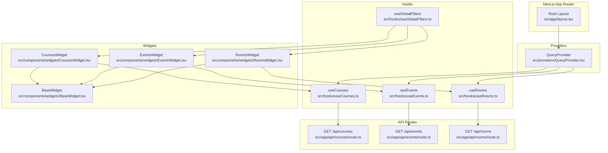
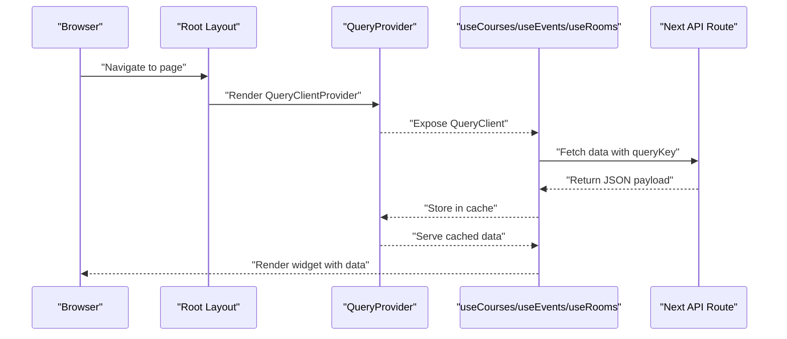
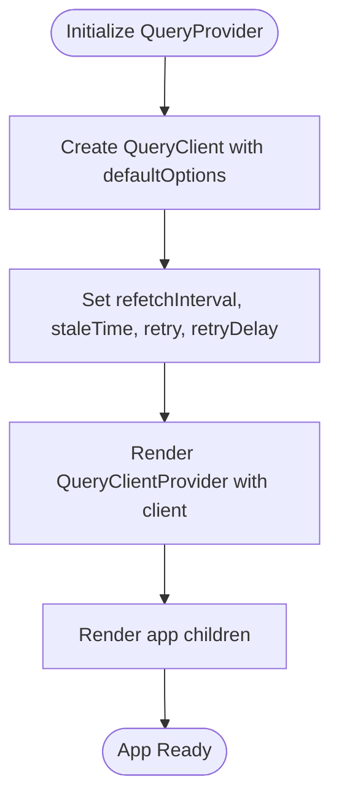
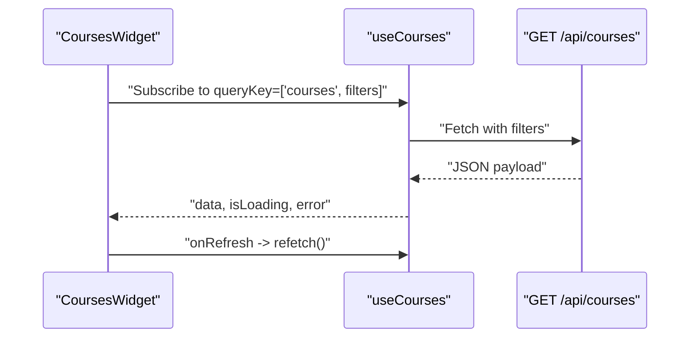
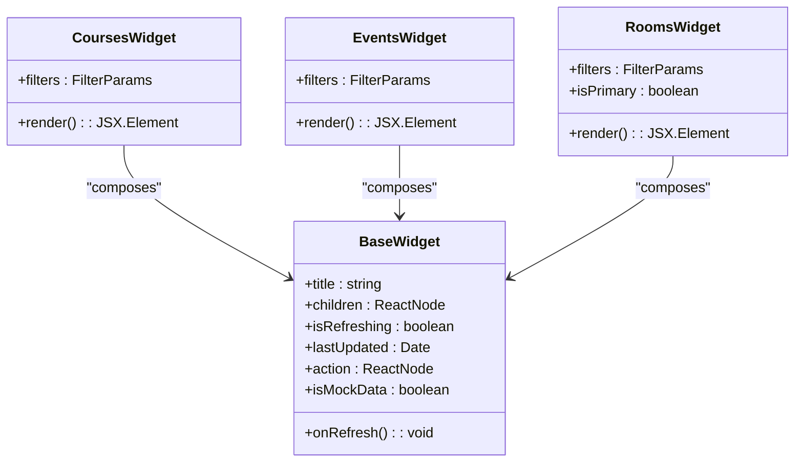
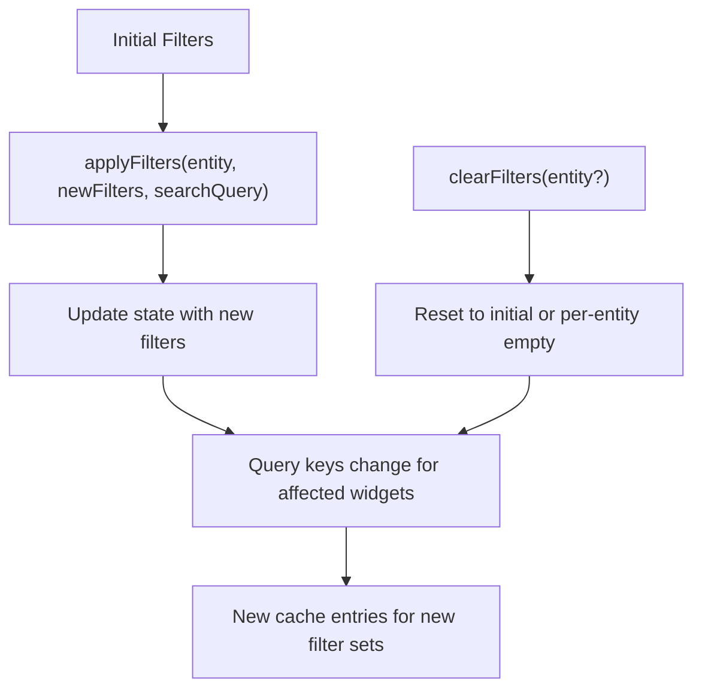
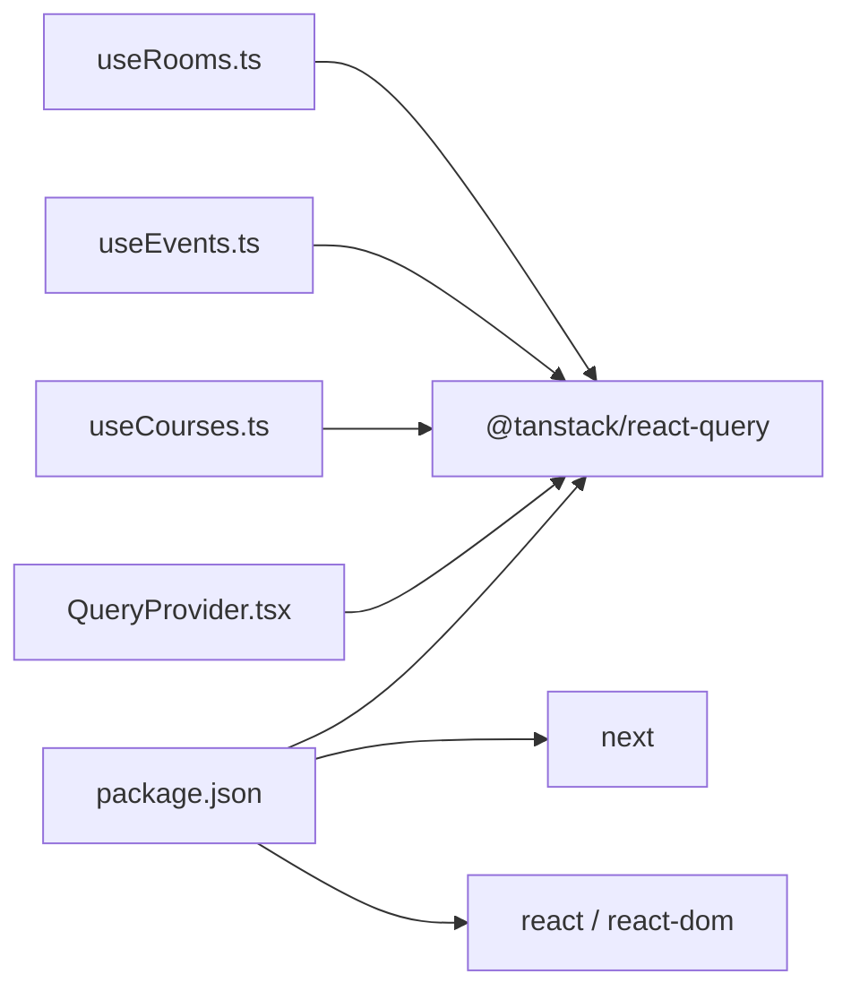

# React Query Provider

<cite>
**Referenced Files in This Document**
- [QueryProvider.tsx](file://src/providers/QueryProvider.tsx)
- [layout.tsx](file://src/app/layout.tsx)
- [package.json](file://package.json)
- [useCourses.ts](file://src/hooks/useCourses.ts)
- [useEvents.ts](file://src/hooks/useEvents.ts)
- [useRooms.ts](file://src/hooks/useRooms.ts)
- [useGlobalFilters.ts](file://src/hooks/useGlobalFilters.ts)
- [CoursesWidget.tsx](file://src/components/widgets/CoursesWidget.tsx)
- [EventsWidget.tsx](file://src/components/widgets/EventsWidget.tsx)
- [RoomsWidget.tsx](file://src/components/widgets/RoomsWidget.tsx)
- [BaseWidget.tsx](file://src/components/widgets/BaseWidget.tsx)
- [route.ts (courses)](file://src/app/api/courses/route.ts)
- [route.ts (events)](file://src/app/api/events/route.ts)
- [route.ts (rooms)](file://src/app/api/rooms/route.ts)
</cite>

## Table of Contents
1. [Introduction](#introduction)
2. [Project Structure](#project-structure)
3. [Core Components](#core-components)
4. [Architecture Overview](#architecture-overview)
5. [Detailed Component Analysis](#detailed-component-analysis)
6. [Dependency Analysis](#dependency-analysis)
7. [Performance Considerations](#performance-considerations)
8. [Troubleshooting Guide](#troubleshooting-guide)
9. [Conclusion](#conclusion)
10. [Appendices](#appendices)

## Introduction
This document explains the React Query provider implementation and configuration in the application. It covers the QueryClient setup, caching policies, background refetching, and how the provider enables server state management across the UI. It also documents cache invalidation strategies, query refetching triggers, error boundary integration, and performance considerations such as cache size and garbage collection. Finally, it describes integration with Next.js App Router and SSR considerations, along with examples of provider usage in the application layout and component tree.

## Project Structure
The React Query provider is initialized at the root of the Next.js application and consumed by UI components and hooks that fetch data from API routes.

**Diagram sources**
- [layout.tsx:21-38](file://src/app/layout.tsx#L21-L38)
- [QueryProvider.tsx:15-34](file://src/providers/QueryProvider.tsx#L15-L34)
- [useCourses.ts:25-30](file://src/hooks/useCourses.ts#L25-L30)
- [useEvents.ts:25-30](file://src/hooks/useEvents.ts#L25-L30)
- [useRooms.ts:25-30](file://src/hooks/useRooms.ts#L25-L30)
- [CoursesWidget.tsx:15-16](file://src/components/widgets/CoursesWidget.tsx#L15-L16)
- [EventsWidget.tsx:15-16](file://src/components/widgets/EventsWidget.tsx#L15-L16)
- [RoomsWidget.tsx:16-17](file://src/components/widgets/RoomsWidget.tsx#L16-L17)
- [route.ts (courses):13-76](file://src/app/api/courses/route.ts#L13-L76)
- [route.ts (events):13-81](file://src/app/api/events/route.ts#L13-L81)
- [route.ts (rooms):13-79](file://src/app/api/rooms/route.ts#L13-L79)

**Section sources**
- [layout.tsx:1-39](file://src/app/layout.tsx#L1-L39)
- [QueryProvider.tsx:1-35](file://src/providers/QueryProvider.tsx#L1-L35)

## Core Components
- QueryProvider: Creates a singleton QueryClient with default caching and refetching policies and wraps the entire app with QueryClientProvider.
- Hooks: useCourses, useEvents, useRooms encapsulate data fetching via useQuery with stable query keys derived from filters.
- Widgets: CoursesWidget, EventsWidget, RoomsWidget consume hooks and expose refresh actions and last-updated timestamps.
- Root Layout: Wraps the entire application with QueryProvider to enable server state management across pages.

Key provider configuration highlights:
- Default refetch interval sourced from environment variable NEXT_PUBLIC_REFRESH_INTERVAL.
- Stale time set to 1 minute.
- Retry policy with exponential backoff up to a maximum delay.
- Provider is mounted at the root layout to ensure global availability.

**Section sources**
- [QueryProvider.tsx:6-9](file://src/providers/QueryProvider.tsx#L6-L9)
- [QueryProvider.tsx:16-27](file://src/providers/QueryProvider.tsx#L16-L27)
- [layout.tsx:32-34](file://src/app/layout.tsx#L32-L34)

## Architecture Overview
The provider establishes a shared cache and refetching strategy for all queries in the app. Hooks define query keys and functions, while widgets render data and surface user-driven refetch actions.

**Diagram sources**
- [layout.tsx:21-38](file://src/app/layout.tsx#L21-L38)
- [QueryProvider.tsx:15-34](file://src/providers/QueryProvider.tsx#L15-L34)
- [useCourses.ts:25-30](file://src/hooks/useCourses.ts#L25-L30)
- [useEvents.ts:25-30](file://src/hooks/useEvents.ts#L25-L30)
- [useRooms.ts:25-30](file://src/hooks/useRooms.ts#L25-L30)
- [route.ts (courses):13-76](file://src/app/api/courses/route.ts#L13-L76)
- [route.ts (events):13-81](file://src/app/api/events/route.ts#L13-L81)
- [route.ts (rooms):13-79](file://src/app/api/rooms/route.ts#L13-L79)

## Detailed Component Analysis

### QueryProvider
Responsibilities:
- Creates a singleton QueryClient with defaultOptions for queries.
- Exposes the client globally via QueryClientProvider.
- Applies environment-driven refetch interval and fixed stale time.

Configuration details:
- Refetch interval: Derived from NEXT_PUBLIC_REFRESH_INTERVAL; defaults to 300000 ms if unset.
- Stale time: 60000 ms (1 minute).
- Retry: Up to 2 attempts with exponential backoff capped at 30000 ms.
- Provider mounting: Wrapped around children in the root layout.

**Diagram sources**
- [QueryProvider.tsx:15-34](file://src/providers/QueryProvider.tsx#L15-L34)

**Section sources**
- [QueryProvider.tsx:6-9](file://src/providers/QueryProvider.tsx#L6-L9)
- [QueryProvider.tsx:16-27](file://src/providers/QueryProvider.tsx#L16-L27)
- [layout.tsx:32-34](file://src/app/layout.tsx#L32-L34)

### Hooks: useCourses, useEvents, useRooms
Responsibilities:
- Define stable query keys combining a string tag and current filters.
- Fetch data from corresponding API routes.
- Surface loading, error, and refetch state to widgets.

Behavior:
- Query keys change when filters change, ensuring cache separation per filter set.
- Errors are thrown when HTTP responses are not ok; widgets handle rendering and refetch.

**Diagram sources**
- [CoursesWidget.tsx:15-16](file://src/components/widgets/CoursesWidget.tsx#L15-L16)
- [useCourses.ts:25-30](file://src/hooks/useCourses.ts#L25-L30)
- [route.ts (courses):13-76](file://src/app/api/courses/route.ts#L13-L76)

**Section sources**
- [useCourses.ts:6-23](file://src/hooks/useCourses.ts#L6-L23)
- [useEvents.ts:6-23](file://src/hooks/useEvents.ts#L6-L23)
- [useRooms.ts:6-23](file://src/hooks/useRooms.ts#L6-L23)
- [useCourses.ts:25-30](file://src/hooks/useCourses.ts#L25-L30)
- [useEvents.ts:25-30](file://src/hooks/useEvents.ts#L25-L30)
- [useRooms.ts:25-30](file://src/hooks/useRooms.ts#L25-L30)

### Widgets: CoursesWidget, EventsWidget, RoomsWidget
Responsibilities:
- Consume hooks and render tabular data.
- Expose a refresh button wired to refetch().
- Display last-updated timestamp and error messages.
- Integrate with BaseWidget for consistent UI and actions.

**Diagram sources**
- [BaseWidget.tsx:16-67](file://src/components/widgets/BaseWidget.tsx#L16-L67)
- [CoursesWidget.tsx:15-124](file://src/components/widgets/CoursesWidget.tsx#L15-L124)
- [EventsWidget.tsx:15-119](file://src/components/widgets/EventsWidget.tsx#L15-L119)
- [RoomsWidget.tsx:16-100](file://src/components/widgets/RoomsWidget.tsx#L16-L100)

**Section sources**
- [CoursesWidget.tsx:15-16](file://src/components/widgets/CoursesWidget.tsx#L15-L16)
- [EventsWidget.tsx:15-16](file://src/components/widgets/EventsWidget.tsx#L15-L16)
- [RoomsWidget.tsx:16-17](file://src/components/widgets/RoomsWidget.tsx#L16-L17)
- [BaseWidget.tsx:16-67](file://src/components/widgets/BaseWidget.tsx#L16-L67)

### Global Filters and Query Keys
The global filters hook manages active filters per entity and exposes helpers to update and clear filters. Because query keys include the current filters, changing filters automatically switches the cached dataset.

**Diagram sources**
- [useGlobalFilters.ts:14-78](file://src/hooks/useGlobalFilters.ts#L14-L78)
- [useCourses.ts:27](file://src/hooks/useCourses.ts#L27)
- [useEvents.ts:27](file://src/hooks/useEvents.ts#L27)
- [useRooms.ts:27](file://src/hooks/useRooms.ts#L27)

**Section sources**
- [useGlobalFilters.ts:14-78](file://src/hooks/useGlobalFilters.ts#L14-L78)
- [useCourses.ts:25-30](file://src/hooks/useCourses.ts#L25-L30)
- [useEvents.ts:25-30](file://src/hooks/useEvents.ts#L25-L30)
- [useRooms.ts:25-30](file://src/hooks/useRooms.ts#L25-L30)

## Dependency Analysis
External dependencies relevant to React Query:
- @tanstack/react-query: ^5.99.0
- next: 16.2.4
- react: 19.2.4
- react-dom: 19.2.4

**Diagram sources**
- [package.json:11-16](file://package.json#L11-L16)
- [QueryProvider.tsx:3](file://src/providers/QueryProvider.tsx#L3)
- [useCourses.ts:3](file://src/hooks/useCourses.ts#L3)
- [useEvents.ts:3](file://src/hooks/useEvents.ts#L3)
- [useRooms.ts:3](file://src/hooks/useRooms.ts#L3)

**Section sources**
- [package.json:11-16](file://package.json#L11-L16)

## Performance Considerations
- Cache lifetime and freshness:
  - Stale time is set to 1 minute, balancing responsiveness with network efficiency.
  - Background refetches occur at the configured interval, keeping data fresh without blocking UI.
- Retry strategy:
  - Up to two retries with exponential backoff cap reduce transient failure impact.
- Memory and cache size:
  - No explicit cache size limit or garbage collection configuration is present in the provider.
  - For large datasets or long-running sessions, consider adding cache cleanup strategies or pagination to avoid unbounded growth.
- Parallel queries:
  - Multiple widgets can trigger concurrent requests; React Query handles deduplication automatically.
- Network overhead:
  - Environment-driven refetch interval allows tuning refresh cadence per deployment needs.

[No sources needed since this section provides general guidance]

## Troubleshooting Guide
Common scenarios and remedies:
- Queries not updating:
  - Verify NEXT_PUBLIC_REFRESH_INTERVAL is set appropriately and non-zero if periodic updates are desired.
  - Confirm widgets call refetch() when the user clicks refresh.
- Stale data:
  - Adjust staleTime to a lower value for highly dynamic data or increase for static-like content.
- Frequent retries:
  - Tune retry attempts and retryDelay to match backend reliability.
- Error handling:
  - Widgets render error messages and expose a refresh action; ensure error boundaries are considered at higher levels if needed.

**Section sources**
- [QueryProvider.tsx:6-9](file://src/providers/QueryProvider.tsx#L6-L9)
- [QueryProvider.tsx:20-24](file://src/providers/QueryProvider.tsx#L20-L24)
- [CoursesWidget.tsx:91-104](file://src/components/widgets/CoursesWidget.tsx#L91-L104)
- [EventsWidget.tsx:86-99](file://src/components/widgets/EventsWidget.tsx#L86-L99)
- [RoomsWidget.tsx:67-80](file://src/components/widgets/RoomsWidget.tsx#L67-L80)

## Conclusion
The React Query provider is configured centrally with sensible defaults for caching and background refetching. The hooks and widgets leverage stable query keys and refetch capabilities to deliver responsive, consistent server state management across the application. The root layout ensures the provider is available globally, and the environment variable enables operational flexibility for refresh intervals.

[No sources needed since this section summarizes without analyzing specific files]

## Appendices

### Provider Usage in Application Layout
- The provider is rendered as a direct child of the root HTML element, ensuring all pages and components inherit the same QueryClient instance.

**Section sources**
- [layout.tsx:32-34](file://src/app/layout.tsx#L32-L34)

### API Route Integration
- API routes parse query parameters into filter objects and return structured payloads. On errors, they fall back to mock data to keep the UI responsive.

**Section sources**
- [route.ts (courses):13-76](file://src/app/api/courses/route.ts#L13-L76)
- [route.ts (events):13-81](file://src/app/api/events/route.ts#L13-L81)
- [route.ts (rooms):13-79](file://src/app/api/rooms/route.ts#L13-L79)