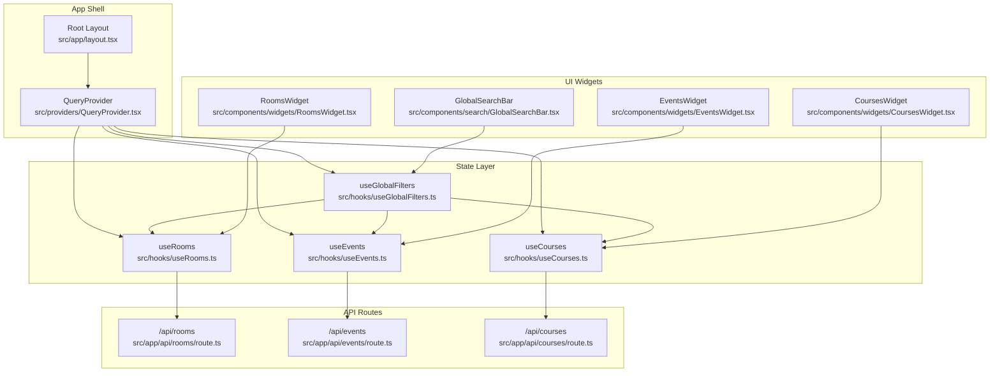
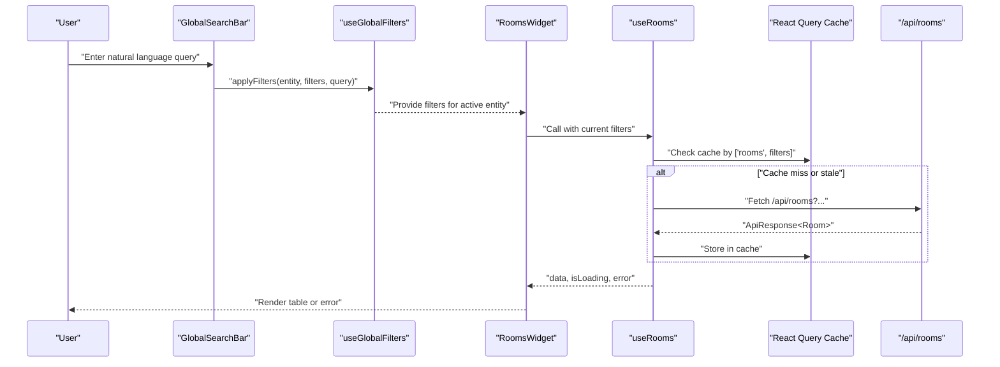
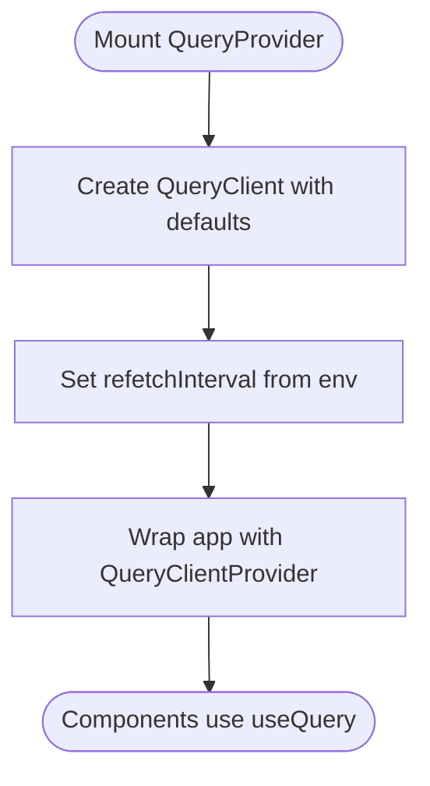
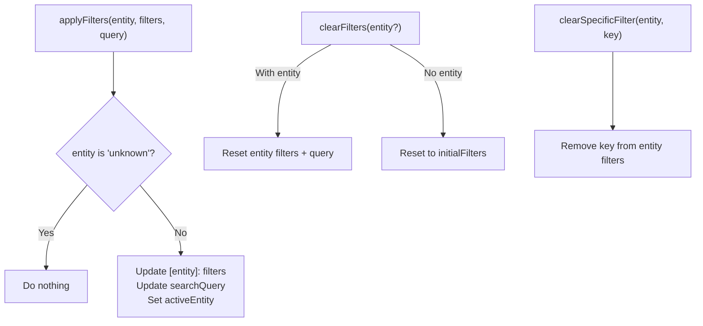
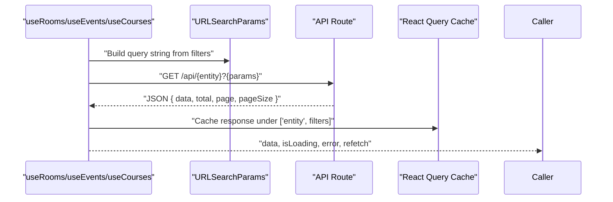
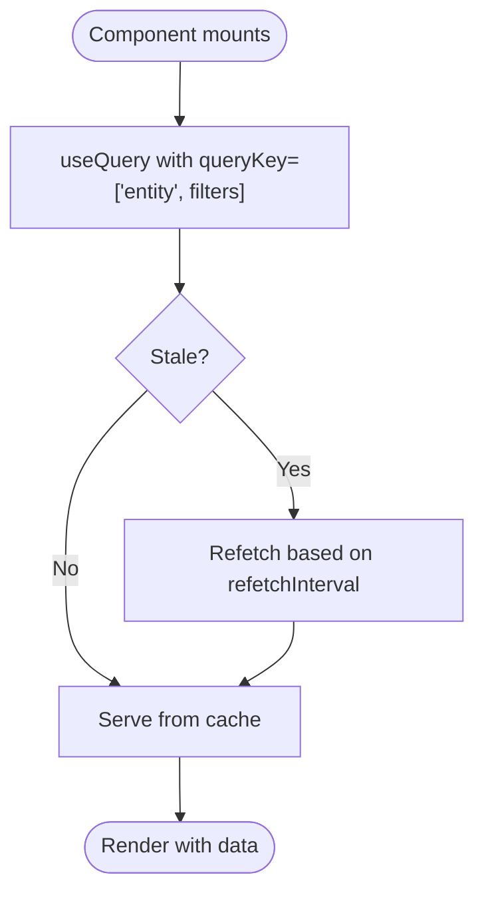
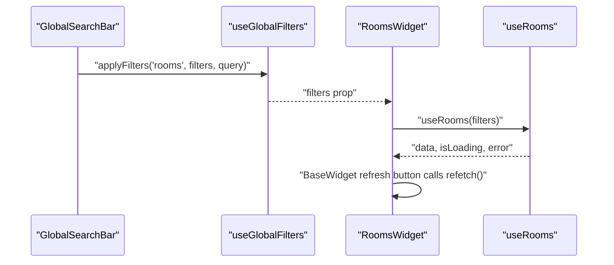
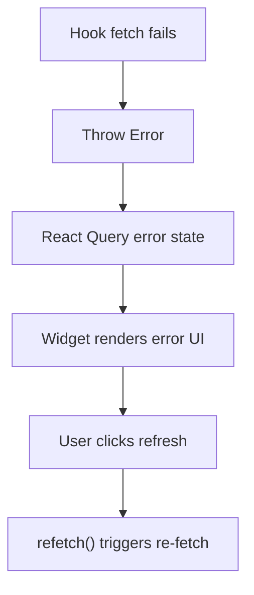
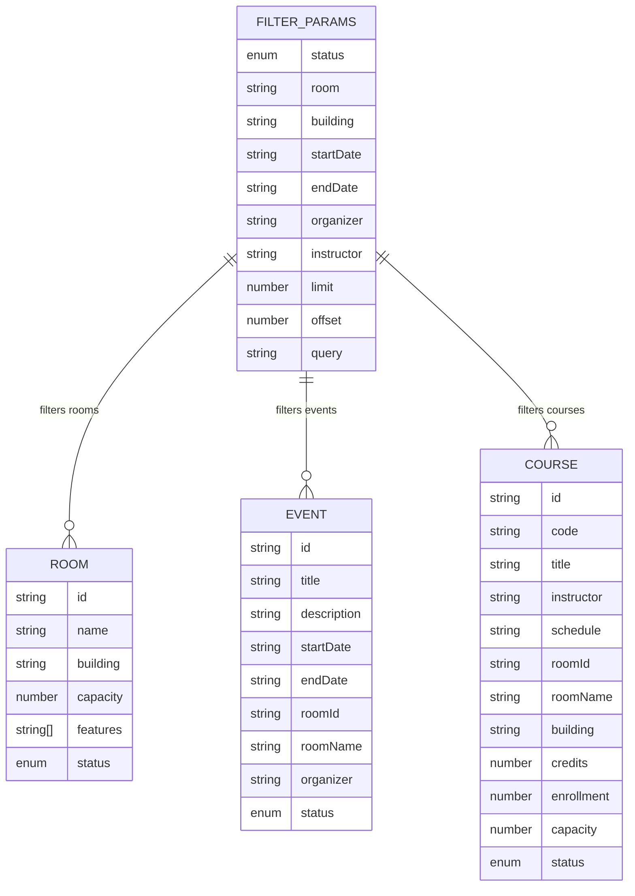
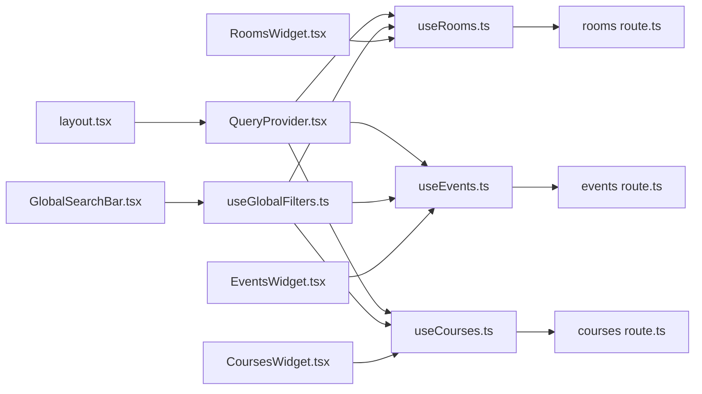

# State Management

<cite>
**Referenced Files in This Document**
- [QueryProvider.tsx](file://src/providers/QueryProvider.tsx)
- [layout.tsx](file://src/app/layout.tsx)
- [useGlobalFilters.ts](file://src/hooks/useGlobalFilters.ts)
- [useRooms.ts](file://src/hooks/useRooms.ts)
- [useEvents.ts](file://src/hooks/useEvents.ts)
- [useCourses.ts](file://src/hooks/useCourses.ts)
- [types.ts](file://src/lib/api/types.ts)
- [rooms route.ts](file://src/app/api/rooms/route.ts)
- [events route.ts](file://src/app/api/events/route.ts)
- [courses route.ts](file://src/app/api/courses/route.ts)
- [GlobalSearchBar.tsx](file://src/components/search/GlobalSearchBar.tsx)
- [CoursesWidget.tsx](file://src/components/widgets/CoursesWidget.tsx)
- [EventsWidget.tsx](file://src/components/widgets/EventsWidget.tsx)
- [RoomsWidget.tsx](file://src/components/widgets/RoomsWidget.tsx)
- [BaseWidget.tsx](file://src/components/widgets/BaseWidget.tsx)
</cite>

## Table of Contents
1. [Introduction](#introduction)
2. [Project Structure](#project-structure)
3. [Core Components](#core-components)
4. [Architecture Overview](#architecture-overview)
5. [Detailed Component Analysis](#detailed-component-analysis)
6. [Dependency Analysis](#dependency-analysis)
7. [Performance Considerations](#performance-considerations)
8. [Troubleshooting Guide](#troubleshooting-guide)
9. [Conclusion](#conclusion)

## Introduction
This document explains Course Puppy’s state management system with a focus on:
- React Query integration via QueryProvider for server state caching and refresh
- Cross-entity global filters managed by useGlobalFilters
- Custom data-fetching hooks (useRooms, useEvents, useCourses) and their patterns
- Automatic refresh and polling behavior
- State synchronization across components and filter propagation
- Error handling, loading states, and cache invalidation
- Examples of state mutations and side effects
- Performance and memory considerations for large datasets

## Project Structure
The state management spans provider setup, custom hooks, API routes, and UI widgets:
- Provider layer initializes React Query defaults and wraps the app
- Custom hooks encapsulate data fetching per entity
- API routes translate URL query parameters into backend filters
- Widgets consume hooks and present data with robust error/loading handling
- Global filters coordinate filtering across entities and drive hook inputs

**Diagram sources**
- [layout.tsx:21-38](file://src/app/layout.tsx#L21-L38)
- [QueryProvider.tsx:15-34](file://src/providers/QueryProvider.tsx#L15-L34)
- [useGlobalFilters.ts:14-78](file://src/hooks/useGlobalFilters.ts#L14-L78)
- [useRooms.ts:25-30](file://src/hooks/useRooms.ts#L25-L30)
- [useEvents.ts:25-30](file://src/hooks/useEvents.ts#L25-L30)
- [useCourses.ts:25-30](file://src/hooks/useCourses.ts#L25-L30)
- [rooms route.ts:5-50](file://src/app/api/rooms/route.ts#L5-L50)
- [events route.ts:5-53](file://src/app/api/events/route.ts#L5-L53)
- [courses route.ts:5-47](file://src/app/api/courses/route.ts#L5-L47)
- [RoomsWidget.tsx:14-16](file://src/components/widgets/RoomsWidget.tsx#L14-L16)
- [EventsWidget.tsx:14-15](file://src/components/widgets/EventsWidget.tsx#L14-L15)
- [CoursesWidget.tsx:14-15](file://src/components/widgets/CoursesWidget.tsx#L14-L15)
- [GlobalSearchBar.tsx:13-54](file://src/components/search/GlobalSearchBar.tsx#L13-L54)

**Section sources**
- [layout.tsx:21-38](file://src/app/layout.tsx#L21-L38)
- [QueryProvider.tsx:15-34](file://src/providers/QueryProvider.tsx#L15-L34)

## Core Components
- QueryProvider sets up React Query defaults including automatic refetch interval, staleTime, retry policy, and wraps the app tree. It reads the polling interval from an environment variable.
- useGlobalFilters manages a global filter object keyed by entity, a shared search query, and the currently active entity. It exposes setters and helpers to apply/clear filters and retrieve active filters.
- useRooms, useEvents, useCourses are thin wrappers around useQuery that:
  - Convert filter props into URL search parameters
  - Fetch from the respective API endpoints
  - Return data, loading, error, and refetch metadata
- API routes parse query parameters into typed FilterParams and delegate to backend data retrieval, returning structured ApiResponse<T> or error responses.
- UI widgets consume the hooks and render data with loading/error states and manual refresh triggers.

**Section sources**
- [QueryProvider.tsx:15-34](file://src/providers/QueryProvider.tsx#L15-L34)
- [useGlobalFilters.ts:14-78](file://src/hooks/useGlobalFilters.ts#L14-L78)
- [useRooms.ts:25-30](file://src/hooks/useRooms.ts#L25-L30)
- [useEvents.ts:25-30](file://src/hooks/useEvents.ts#L25-L30)
- [useCourses.ts:25-30](file://src/hooks/useCourses.ts#L25-L30)
- [rooms route.ts:5-50](file://src/app/api/rooms/route.ts#L5-L50)
- [events route.ts:5-53](file://src/app/api/events/route.ts#L5-L53)
- [courses route.ts:5-47](file://src/app/api/courses/route.ts#L5-L47)
- [CoursesWidget.tsx:14-15](file://src/components/widgets/CoursesWidget.tsx#L14-L15)
- [EventsWidget.tsx:14-15](file://src/components/widgets/EventsWidget.tsx#L14-L15)
- [RoomsWidget.tsx:15-16](file://src/components/widgets/RoomsWidget.tsx#L15-L16)

## Architecture Overview
The system follows a unidirectional data flow:
- Global filters change via useGlobalFilters
- Filters propagate to the appropriate entity hook via widget props
- Hooks trigger React Query cache keys with filters as inputs
- API routes transform query parameters into backend filters
- Widgets render data, loading, and errors; manual refresh triggers refetch

**Diagram sources**
- [GlobalSearchBar.tsx:13-54](file://src/components/search/GlobalSearchBar.tsx#L13-L54)
- [useGlobalFilters.ts:14-78](file://src/hooks/useGlobalFilters.ts#L14-L78)
- [RoomsWidget.tsx:14-16](file://src/components/widgets/RoomsWidget.tsx#L14-L16)
- [useRooms.ts:25-30](file://src/hooks/useRooms.ts#L25-L30)
- [rooms route.ts:5-50](file://src/app/api/rooms/route.ts#L5-L50)

## Detailed Component Analysis

### React Query Provider and Polling
- QueryProvider creates a QueryClient with:
  - Automatic refetch interval controlled by NEXT_PUBLIC_REFRESH_INTERVAL
  - Stale time of 1 minute
  - Retry with exponential backoff
- The provider is mounted at the root layout, ensuring all components benefit from centralized caching and refetch behavior.

**Diagram sources**
- [QueryProvider.tsx:15-34](file://src/providers/QueryProvider.tsx#L15-L34)
- [layout.tsx:32-33](file://src/app/layout.tsx#L32-L33)

**Section sources**
- [QueryProvider.tsx:6-27](file://src/providers/QueryProvider.tsx#L6-L27)
- [layout.tsx:32-33](file://src/app/layout.tsx#L32-L33)

### Global Filters Hook (Cross-Entity)
- Maintains a GlobalFilters object with separate FilterParams per entity, a shared searchQuery, and activeEntity
- Provides methods to:
  - setActiveEntity
  - applyFilters(entity, filters, searchQuery)
  - clearFilters(entity?)
  - clearSpecificFilter(entity, filterKey)
  - getActiveFilters()
- Ensures that changing the active entity updates downstream widgets to reflect the correct entity’s filters

**Diagram sources**
- [useGlobalFilters.ts:14-78](file://src/hooks/useGlobalFilters.ts#L14-L78)

**Section sources**
- [useGlobalFilters.ts:6-12](file://src/hooks/useGlobalFilters.ts#L6-L12)
- [useGlobalFilters.ts:17-49](file://src/hooks/useGlobalFilters.ts#L17-L49)
- [useGlobalFilters.ts:51-62](file://src/hooks/useGlobalFilters.ts#L51-L62)
- [useGlobalFilters.ts:64-66](file://src/hooks/useGlobalFilters.ts#L64-L66)

### Custom Hooks Pattern (useRooms, useEvents, useCourses)
- Each hook:
  - Converts FilterParams to URLSearchParams
  - Calls the corresponding API endpoint
  - Validates response and throws on HTTP errors
  - Returns useQuery result with data, isLoading, error, refetch, and dataUpdatedAt
- The hooks rely on React Query’s cache key ['entity', filters], ensuring cache coherence when filters change

**Diagram sources**
- [useRooms.ts:6-23](file://src/hooks/useRooms.ts#L6-L23)
- [useEvents.ts:6-23](file://src/hooks/useEvents.ts#L6-L23)
- [useCourses.ts:6-23](file://src/hooks/useCourses.ts#L6-L23)
- [rooms route.ts:5-39](file://src/app/api/rooms/route.ts#L5-L39)
- [events route.ts:5-42](file://src/app/api/events/route.ts#L5-L42)
- [courses route.ts:5-36](file://src/app/api/courses/route.ts#L5-L36)

**Section sources**
- [useRooms.ts:25-30](file://src/hooks/useRooms.ts#L25-L30)
- [useEvents.ts:25-30](file://src/hooks/useEvents.ts#L25-L30)
- [useCourses.ts:25-30](file://src/hooks/useCourses.ts#L25-L30)
- [types.ts:49-61](file://src/lib/api/types.ts#L49-L61)

### Automatic Data Refresh and Polling Intervals
- Automatic refresh is configured via refetchInterval from NEXT_PUBLIC_REFRESH_INTERVAL
- StaleTime is set to 1 minute, balancing freshness vs. network usage
- Manual refresh is exposed in widgets via refetch()

**Diagram sources**
- [QueryProvider.tsx:16-27](file://src/providers/QueryProvider.tsx#L16-L27)
- [CoursesWidget.tsx:15](file://src/components/widgets/CoursesWidget.tsx#L15)
- [EventsWidget.tsx:15](file://src/components/widgets/EventsWidget.tsx#L15)
- [RoomsWidget.tsx:16](file://src/components/widgets/RoomsWidget.tsx#L16)

**Section sources**
- [QueryProvider.tsx:6-9](file://src/providers/QueryProvider.tsx#L6-L9)
- [QueryProvider.tsx:18-24](file://src/providers/QueryProvider.tsx#L18-L24)

### State Synchronization and Filter Propagation
- GlobalSearchBar parses natural language queries and invokes applyFilters with the resolved entity and filters
- Widgets receive filters as props and pass them to their respective hooks
- BaseWidget exposes a refresh button that calls refetch(), aligning manual actions with automatic polling

**Diagram sources**
- [GlobalSearchBar.tsx:21-54](file://src/components/search/GlobalSearchBar.tsx#L21-L54)
- [useGlobalFilters.ts:24-37](file://src/hooks/useGlobalFilters.ts#L24-L37)
- [RoomsWidget.tsx:14-16](file://src/components/widgets/RoomsWidget.tsx#L14-L16)
- [BaseWidget.tsx:31-39](file://src/components/widgets/BaseWidget.tsx#L31-L39)

**Section sources**
- [GlobalSearchBar.tsx:13-54](file://src/components/search/GlobalSearchBar.tsx#L13-L54)
- [BaseWidget.tsx:15-57](file://src/components/widgets/BaseWidget.tsx#L15-L57)

### Error Handling Strategies and Loading States
- Hooks throw on HTTP errors, enabling React Query to surface error state
- Widgets render error messages and expose refetch; they also show loading states and last-updated timestamps
- API routes return structured error responses with message and status codes

**Diagram sources**
- [useRooms.ts:17-20](file://src/hooks/useRooms.ts#L17-L20)
- [useEvents.ts:17-20](file://src/hooks/useEvents.ts#L17-L20)
- [useCourses.ts:17-20](file://src/hooks/useCourses.ts#L17-L20)
- [CoursesWidget.tsx:89-102](file://src/components/widgets/CoursesWidget.tsx#L89-L102)
- [EventsWidget.tsx:84-97](file://src/components/widgets/EventsWidget.tsx#L84-L97)
- [RoomsWidget.tsx:65-78](file://src/components/widgets/RoomsWidget.tsx#L65-L78)
- [rooms route.ts:40-49](file://src/app/api/rooms/route.ts#L40-L49)
- [events route.ts:43-52](file://src/app/api/events/route.ts#L43-L52)
- [courses route.ts:37-46](file://src/app/api/courses/route.ts#L37-L46)

**Section sources**
- [useRooms.ts:17-23](file://src/hooks/useRooms.ts#L17-L23)
- [useEvents.ts:17-23](file://src/hooks/useEvents.ts#L17-L23)
- [useCourses.ts:17-23](file://src/hooks/useCourses.ts#L17-L23)
- [CoursesWidget.tsx:89-120](file://src/components/widgets/CoursesWidget.tsx#L89-L120)
- [EventsWidget.tsx:84-115](file://src/components/widgets/EventsWidget.tsx#L84-L115)
- [RoomsWidget.tsx:65-96](file://src/components/widgets/RoomsWidget.tsx#L65-L96)
- [rooms route.ts:40-49](file://src/app/api/rooms/route.ts#L40-L49)
- [events route.ts:43-52](file://src/app/api/events/route.ts#L43-L52)
- [courses route.ts:37-46](file://src/app/api/courses/route.ts#L37-L46)

### Cache Invalidation Patterns and Side Effects
- Changing filters updates the queryKey ['entity', filters], causing React Query to treat it as a new cache entry
- Manual refresh via refetch() forces a network reload regardless of staleness
- Automatic polling respects staleTime and refetchInterval, minimizing redundant requests
- Clearing filters resets the entity’s filter set and clears the shared search query

**Section sources**
- [useRooms.ts:27](file://src/hooks/useRooms.ts#L27)
- [useEvents.ts:27](file://src/hooks/useEvents.ts#L27)
- [useCourses.ts:27](file://src/hooks/useCourses.ts#L27)
- [useGlobalFilters.ts:39-49](file://src/hooks/useGlobalFilters.ts#L39-L49)

### Data Models and API Contracts
- Entities: Room, Event, Course
- FilterParams: status, room, building, startDate, endDate, organizer, instructor, limit, offset, query
- ApiResponse<T>: data[], total, page, pageSize
- API routes accept query parameters and return ApiResponse<T> or error payload

**Diagram sources**
- [types.ts:3-47](file://src/lib/api/types.ts#L3-L47)
- [types.ts:49-61](file://src/lib/api/types.ts#L49-L61)
- [types.ts:86-92](file://src/lib/api/types.ts#L86-L92)

**Section sources**
- [types.ts:3-47](file://src/lib/api/types.ts#L3-L47)
- [types.ts:49-61](file://src/lib/api/types.ts#L49-L61)
- [types.ts:86-92](file://src/lib/api/types.ts#L86-L92)

## Dependency Analysis
- Provider dependency: layout.tsx depends on QueryProvider to enable React Query across the app
- Hook dependency: useRooms/useEvents/useCourses depend on React Query and the API routes
- UI dependency: widgets depend on hooks and BaseWidget for consistent UX
- Global filter dependency: GlobalSearchBar and useGlobalFilters coordinate to propagate filters to widgets

**Diagram sources**
- [layout.tsx:32-33](file://src/app/layout.tsx#L32-L33)
- [QueryProvider.tsx:15-34](file://src/providers/QueryProvider.tsx#L15-L34)
- [useGlobalFilters.ts:14-78](file://src/hooks/useGlobalFilters.ts#L14-L78)
- [useRooms.ts:25-30](file://src/hooks/useRooms.ts#L25-L30)
- [useEvents.ts:25-30](file://src/hooks/useEvents.ts#L25-L30)
- [useCourses.ts:25-30](file://src/hooks/useCourses.ts#L25-L30)
- [rooms route.ts:5-50](file://src/app/api/rooms/route.ts#L5-L50)
- [events route.ts:5-53](file://src/app/api/events/route.ts#L5-L53)
- [courses route.ts:5-47](file://src/app/api/courses/route.ts#L5-L47)
- [GlobalSearchBar.tsx:13-54](file://src/components/search/GlobalSearchBar.tsx#L13-L54)
- [RoomsWidget.tsx:14-16](file://src/components/widgets/RoomsWidget.tsx#L14-L16)
- [EventsWidget.tsx:14-15](file://src/components/widgets/EventsWidget.tsx#L14-L15)
- [CoursesWidget.tsx:14-15](file://src/components/widgets/CoursesWidget.tsx#L14-L15)

**Section sources**
- [layout.tsx:32-33](file://src/app/layout.tsx#L32-L33)
- [QueryProvider.tsx:15-34](file://src/providers/QueryProvider.tsx#L15-L34)
- [useGlobalFilters.ts:14-78](file://src/hooks/useGlobalFilters.ts#L14-L78)
- [useRooms.ts:25-30](file://src/hooks/useRooms.ts#L25-L30)
- [useEvents.ts:25-30](file://src/hooks/useEvents.ts#L25-L30)
- [useCourses.ts:25-30](file://src/hooks/useCourses.ts#L25-L30)

## Performance Considerations
- StaleTime of 1 minute reduces unnecessary network requests while keeping data reasonably fresh
- Automatic refetchInterval balances real-time updates with bandwidth and server load
- URLSearchParams construction avoids sending empty/null values, reducing payload size
- Widgets render empty states and loading indicators to prevent unnecessary re-renders
- Pagination parameters (limit, offset) should be used to cap dataset sizes and improve responsiveness
- Consider virtualizing large tables to reduce DOM and memory footprint

[No sources needed since this section provides general guidance]

## Troubleshooting Guide
Common issues and resolutions:
- Polling not triggering:
  - Verify NEXT_PUBLIC_REFRESH_INTERVAL environment variable is set and numeric
  - Confirm QueryProvider is mounted at the root
- Frequent refetches:
  - Increase staleTime or adjust refetchInterval
  - Ensure filters are stable to avoid cache misses
- Errors rendering:
  - Inspect API route error responses for message and status
  - Use widget’s refetch button to retry after fixing upstream issues
- Large datasets:
  - Apply pagination (limit, offset) and filter early
  - Consider debouncing search inputs to reduce rapid refetches

**Section sources**
- [QueryProvider.tsx:6-9](file://src/providers/QueryProvider.tsx#L6-L9)
- [QueryProvider.tsx:18-24](file://src/providers/QueryProvider.tsx#L18-L24)
- [rooms route.ts:40-49](file://src/app/api/rooms/route.ts#L40-L49)
- [events route.ts:43-52](file://src/app/api/events/route.ts#L43-L52)
- [courses route.ts:37-46](file://src/app/api/courses/route.ts#L37-L46)

## Conclusion
Course Puppy’s state management leverages React Query for efficient caching and automatic refresh, complemented by a global filter system that coordinates filtering across entities. The custom hooks encapsulate entity-specific fetching logic, while API routes translate query parameters into backend filters. Widgets consistently handle loading and error states, expose manual refresh, and integrate with the global filter system to synchronize state across components. With thoughtful configuration of staleTime and refetchInterval, plus pagination and virtualization strategies, the system remains responsive and scalable for large datasets.