# Base Widget Architecture

<cite>
**Referenced Files in This Document**
- [BaseWidget.tsx](file://src/components/widgets/BaseWidget.tsx)
- [CoursesWidget.tsx](file://src/components/widgets/CoursesWidget.tsx)
- [EventsWidget.tsx](file://src/components/widgets/EventsWidget.tsx)
- [RoomsWidget.tsx](file://src/components/widgets/RoomsWidget.tsx)
- [useCourses.ts](file://src/hooks/useCourses.ts)
- [useEvents.ts](file://src/hooks/useEvents.ts)
- [useRooms.ts](file://src/hooks/useRooms.ts)
- [DataTable.tsx](file://src/components/ui/DataTable.tsx)
- [StatusBadge.tsx](file://src/components/ui/StatusBadge.tsx)
- [globals.css](file://src/app/globals.css)
- [types.ts](file://src/lib/api/types.ts)
</cite>

## Table of Contents
1. [Introduction](#introduction)
2. [Project Structure](#project-structure)
3. [Core Components](#core-components)
4. [Architecture Overview](#architecture-overview)
5. [Detailed Component Analysis](#detailed-component-analysis)
6. [Dependency Analysis](#dependency-analysis)
7. [Performance Considerations](#performance-considerations)
8. [Troubleshooting Guide](#troubleshooting-guide)
9. [Conclusion](#conclusion)

## Introduction

The BaseWidget component architecture provides a consistent foundation for all widget types in the Course Puppy application. This pattern ensures uniform styling, behavior, and user experience across different data presentation components while allowing for specialized implementations. The architecture follows React best practices with TypeScript interfaces, enabling type-safe component composition and predictable data flow.

The BaseWidget serves as a reusable container that standardizes the visual presentation and interaction patterns for various data widgets, including courses, events, and rooms displays. It encapsulates common UI patterns such as headers with refresh functionality, standardized content areas, and footer timestamps, while providing extension points for custom actions and specialized content rendering.

## Project Structure

The widget architecture is organized within the components/widgets directory, following a clear separation of concerns:

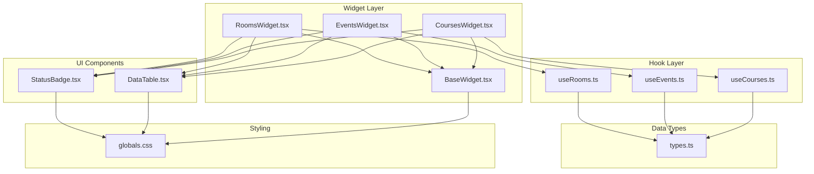

**Diagram sources**
- [BaseWidget.tsx:1-58](file://src/components/widgets/BaseWidget.tsx#L1-L58)
- [CoursesWidget.tsx:1-121](file://src/components/widgets/CoursesWidget.tsx#L1-L121)
- [EventsWidget.tsx:1-116](file://src/components/widgets/EventsWidget.tsx#L1-L116)
- [RoomsWidget.tsx:1-97](file://src/components/widgets/RoomsWidget.tsx#L1-L97)

**Section sources**
- [BaseWidget.tsx:1-58](file://src/components/widgets/BaseWidget.tsx#L1-L58)
- [CoursesWidget.tsx:1-121](file://src/components/widgets/CoursesWidget.tsx#L1-L121)
- [EventsWidget.tsx:1-116](file://src/components/widgets/EventsWidget.tsx#L1-L116)
- [RoomsWidget.tsx:1-97](file://src/components/widgets/RoomsWidget.tsx#L1-L97)

## Core Components

### BaseWidget Props Interface

The BaseWidget component defines a comprehensive props interface that establishes the contract for all widget implementations:

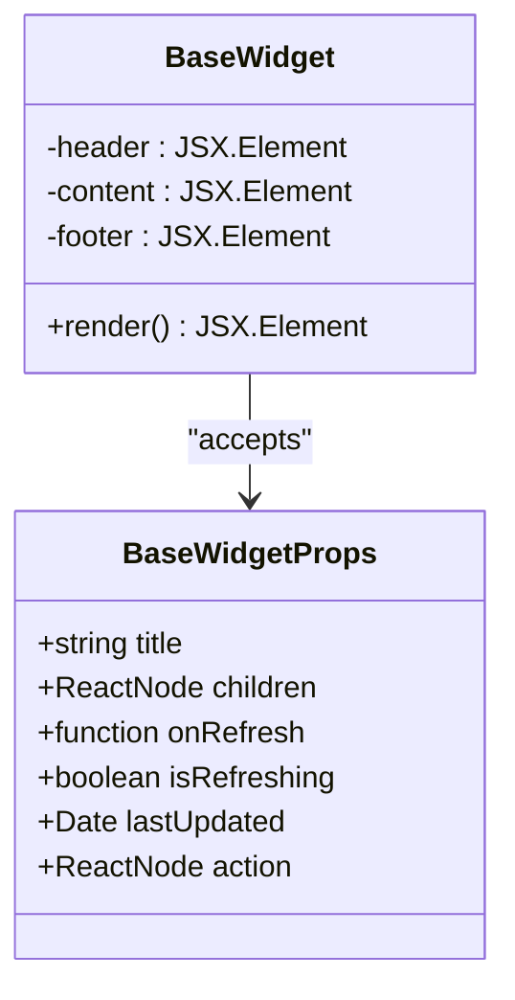

**Diagram sources**
- [BaseWidget.tsx:6-13](file://src/components/widgets/BaseWidget.tsx#L6-L13)

The props interface provides:

- **title**: Displayed prominently in the widget header
- **children**: The main content area for specialized widget implementations
- **onRefresh**: Optional callback function for manual data refresh
- **isRefreshing**: Boolean flag controlling refresh animation and button state
- **lastUpdated**: Optional timestamp for displaying update information
- **action**: Optional custom action slot for additional controls

**Section sources**
- [BaseWidget.tsx:6-13](file://src/components/widgets/BaseWidget.tsx#L6-L13)

### Widget Header Structure

The BaseWidget header implements a standardized layout with three distinct sections:

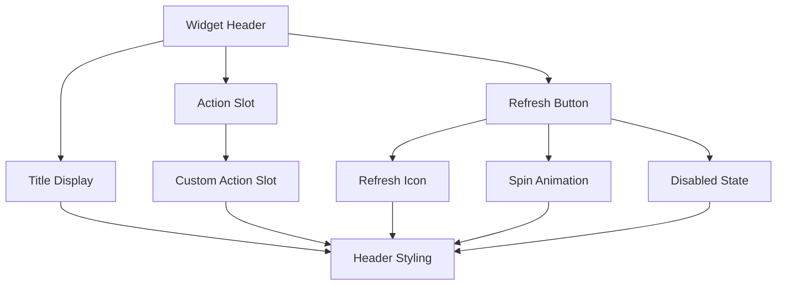

**Diagram sources**
- [BaseWidget.tsx:26-42](file://src/components/widgets/BaseWidget.tsx#L26-L42)

The header structure ensures consistent user experience across all widget types while maintaining flexibility for customization.

**Section sources**
- [BaseWidget.tsx:26-42](file://src/components/widgets/BaseWidget.tsx#L26-L42)

### Footer Implementation

The footer provides essential status information with automatic conditional rendering:

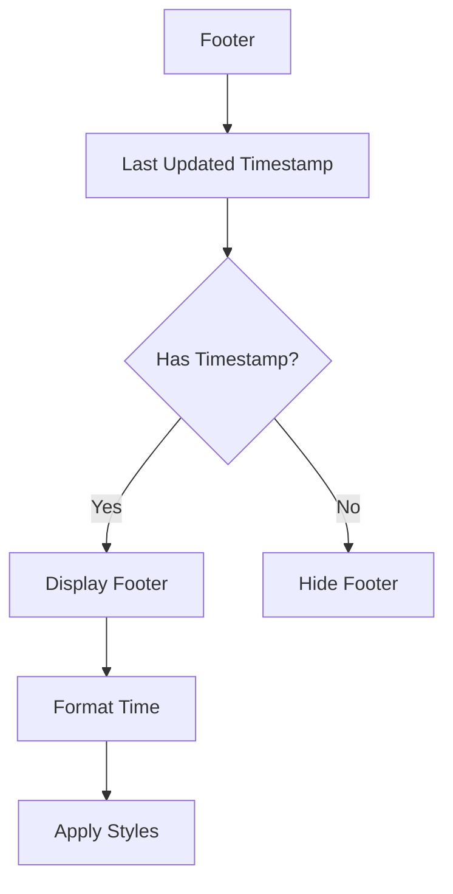

**Diagram sources**
- [BaseWidget.tsx:50-54](file://src/components/widgets/BaseWidget.tsx#L50-L54)

**Section sources**
- [BaseWidget.tsx:50-54](file://src/components/widgets/BaseWidget.tsx#L50-L54)

## Architecture Overview

The BaseWidget architecture follows a hierarchical pattern that promotes consistency and extensibility:

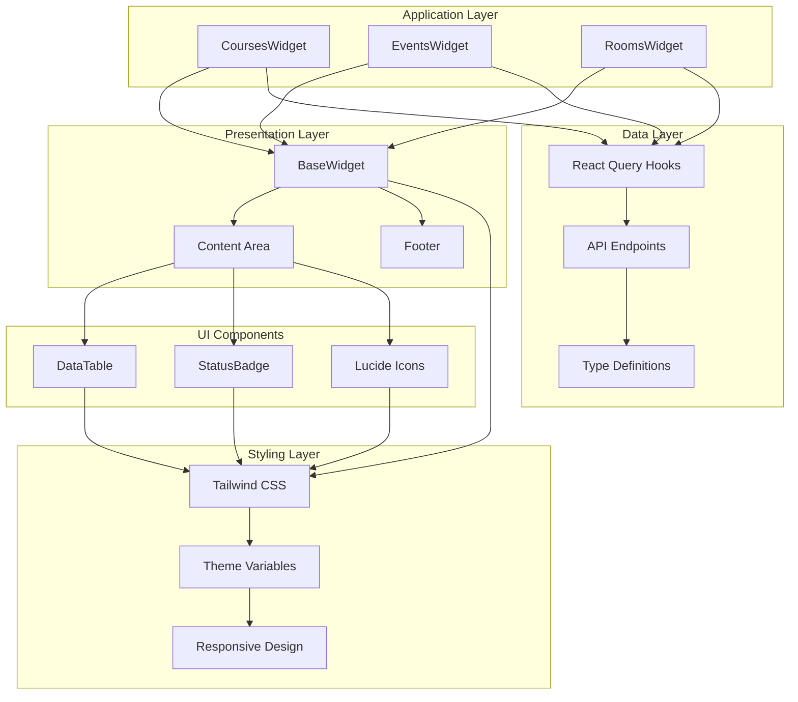

**Diagram sources**
- [BaseWidget.tsx:15-57](file://src/components/widgets/BaseWidget.tsx#L15-L57)
- [CoursesWidget.tsx:14-120](file://src/components/widgets/CoursesWidget.tsx#L14-L120)
- [EventsWidget.tsx:14-115](file://src/components/widgets/EventsWidget.tsx#L14-L115)
- [RoomsWidget.tsx:15-96](file://src/components/widgets/RoomsWidget.tsx#L15-L96)

The architecture demonstrates clear separation of concerns with the BaseWidget handling presentation logic while specialized widgets focus on data fetching and content rendering.

**Section sources**
- [BaseWidget.tsx:15-57](file://src/components/widgets/BaseWidget.tsx#L15-L57)
- [CoursesWidget.tsx:14-120](file://src/components/widgets/CoursesWidget.tsx#L14-L120)
- [EventsWidget.tsx:14-115](file://src/components/widgets/EventsWidget.tsx#L14-L115)
- [RoomsWidget.tsx:15-96](file://src/components/widgets/RoomsWidget.tsx#L15-L96)

## Detailed Component Analysis

### BaseWidget Implementation

The BaseWidget component serves as the foundational container with comprehensive styling and interaction capabilities:

#### Styling Approach

The component utilizes Tailwind CSS classes for consistent visual presentation:

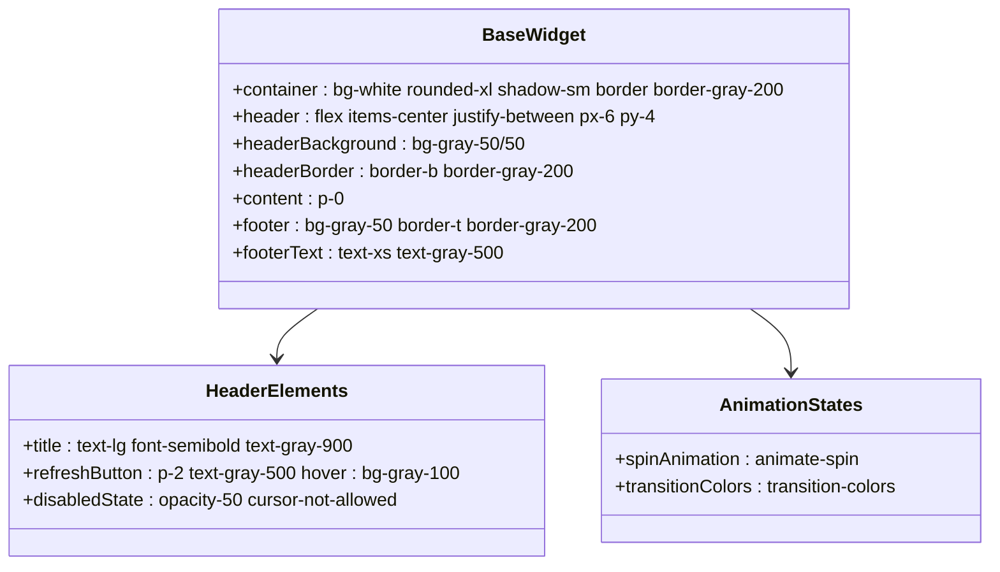

**Diagram sources**
- [BaseWidget.tsx:24-54](file://src/components/widgets/BaseWidget.tsx#L24-L54)

The styling approach emphasizes:
- Consistent spacing with padding utilities
- Standardized color palette using gray scale
- Responsive design through flexible layouts
- Hover states for interactive elements
- Disabled state styling for accessibility

#### Refresh Animation System

The refresh system implements a sophisticated animation and state management pattern:

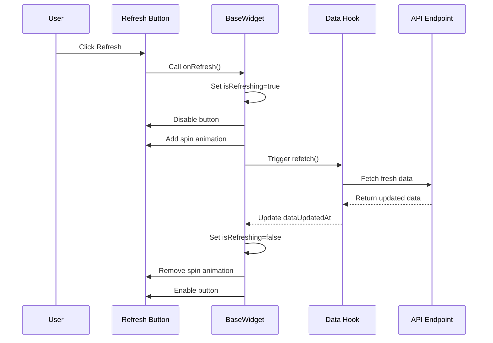

**Diagram sources**
- [BaseWidget.tsx:30-40](file://src/components/widgets/BaseWidget.tsx#L30-L40)
- [CoursesWidget.tsx:93-109](file://src/components/widgets/CoursesWidget.tsx#L93-L109)

The animation system provides immediate visual feedback and prevents concurrent refresh operations.

**Section sources**
- [BaseWidget.tsx:15-57](file://src/components/widgets/BaseWidget.tsx#L15-L57)

### Widget-Specific Implementations

Each specialized widget extends the BaseWidget pattern while adding domain-specific functionality:

#### CoursesWidget Analysis

The CoursesWidget demonstrates advanced data presentation with comprehensive column definitions and status handling:

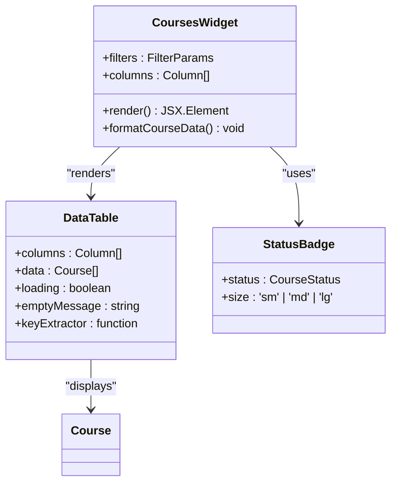

**Diagram sources**
- [CoursesWidget.tsx:14-120](file://src/components/widgets/CoursesWidget.tsx#L14-L120)
- [DataTable.tsx:21-80](file://src/components/ui/DataTable.tsx#L21-L80)
- [StatusBadge.tsx:61-77](file://src/components/ui/StatusBadge.tsx#L61-L77)

The implementation showcases:
- Complex column rendering with icons and formatted data
- Status badge integration for visual indicators
- Comprehensive error handling and loading states
- Dynamic column configuration based on data structure

#### EventsWidget Implementation

The EventsWidget focuses on temporal data presentation with specialized date formatting:

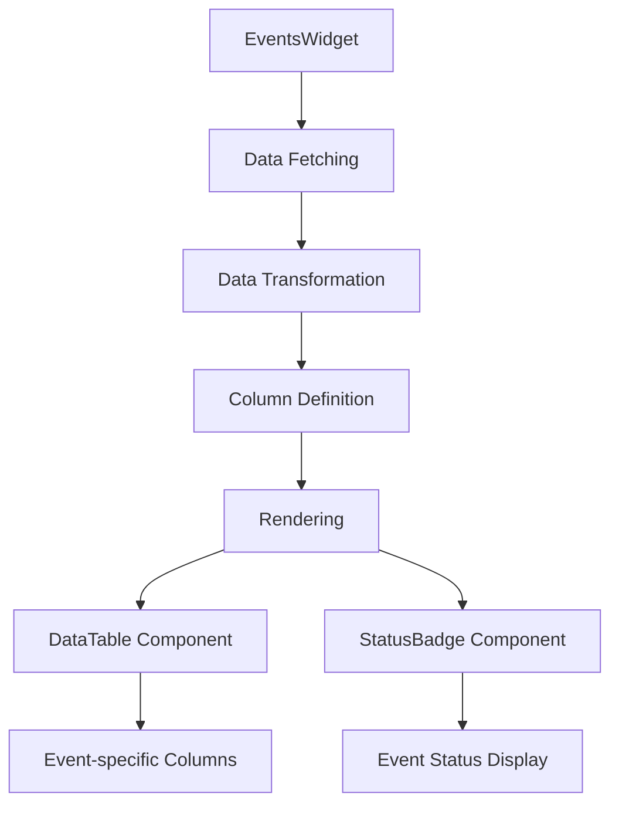

**Diagram sources**
- [EventsWidget.tsx:14-115](file://src/components/widgets/EventsWidget.tsx#L14-L115)

#### RoomsWidget Pattern

The RoomsWidget demonstrates minimal implementation while maintaining the BaseWidget contract:

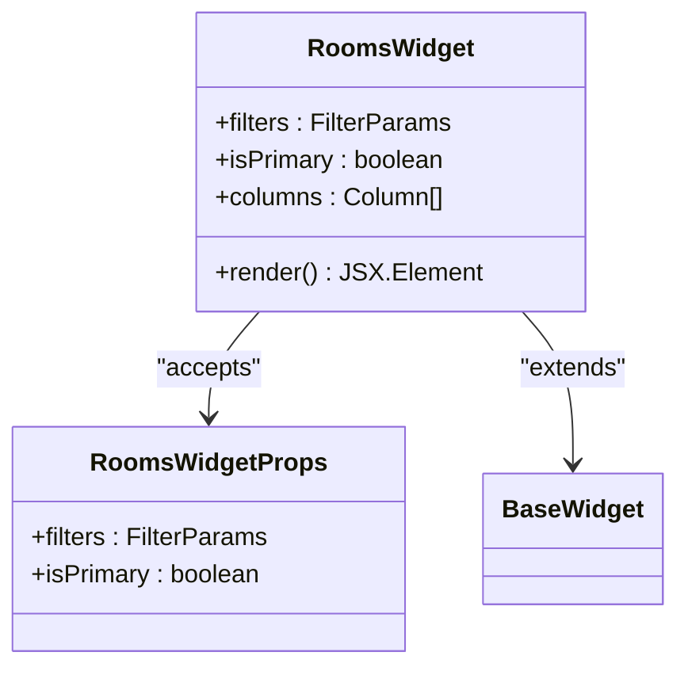

**Diagram sources**
- [RoomsWidget.tsx:10-13](file://src/components/widgets/RoomsWidget.tsx#L10-L13)
- [RoomsWidget.tsx:15-96](file://src/components/widgets/RoomsWidget.tsx#L15-L96)

**Section sources**
- [CoursesWidget.tsx:14-120](file://src/components/widgets/CoursesWidget.tsx#L14-L120)
- [EventsWidget.tsx:14-115](file://src/components/widgets/EventsWidget.tsx#L14-L115)
- [RoomsWidget.tsx:10-13](file://src/components/widgets/RoomsWidget.tsx#L10-L13)

### Data Flow and State Management

The widget architecture integrates with React Query for robust data management:

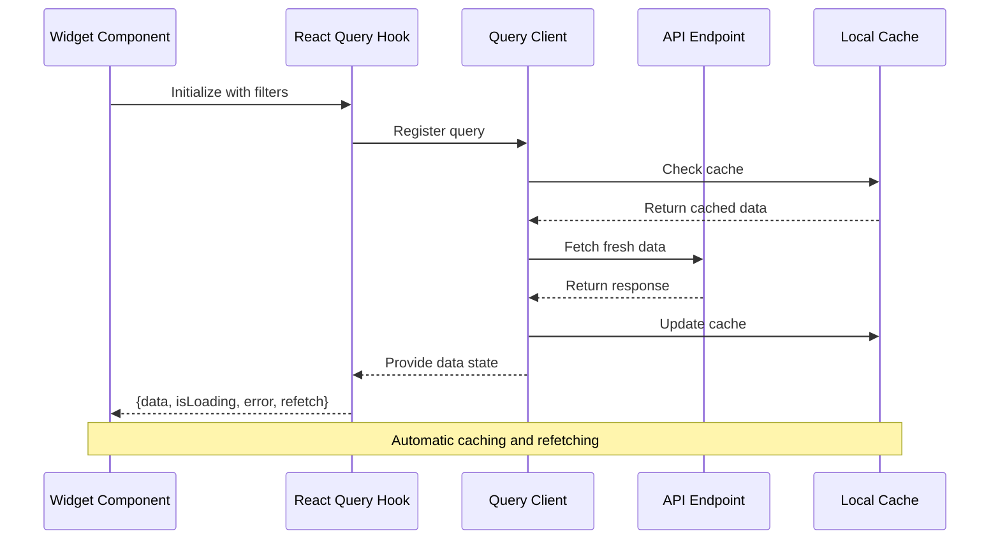

**Diagram sources**
- [useCourses.ts:25-30](file://src/hooks/useCourses.ts#L25-L30)
- [useEvents.ts:25-30](file://src/hooks/useEvents.ts#L25-L30)
- [useRooms.ts:25-30](file://src/hooks/useRooms.ts#L25-L30)

**Section sources**
- [useCourses.ts:25-30](file://src/hooks/useCourses.ts#L25-L30)
- [useEvents.ts:25-30](file://src/hooks/useEvents.ts#L25-L30)
- [useRooms.ts:25-30](file://src/hooks/useRooms.ts#L25-L30)

## Dependency Analysis

The BaseWidget architecture maintains clean dependency relationships through strategic abstraction:

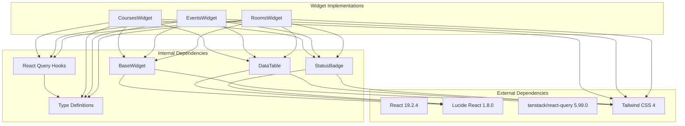

**Diagram sources**
- [BaseWidget.tsx:3-4](file://src/components/widgets/BaseWidget.tsx#L3-L4)
- [CoursesWidget.tsx:3-7](file://src/components/widgets/CoursesWidget.tsx#L3-L7)
- [EventsWidget.tsx:3-7](file://src/components/widgets/EventsWidget.tsx#L3-L7)
- [RoomsWidget.tsx:3-7](file://src/components/widgets/RoomsWidget.tsx#L3-L7)

The dependency analysis reveals a well-structured architecture with clear boundaries between presentation, data, and utility layers.

**Section sources**
- [BaseWidget.tsx:3-4](file://src/components/widgets/BaseWidget.tsx#L3-L4)
- [CoursesWidget.tsx:3-7](file://src/components/widgets/CoursesWidget.tsx#L3-L7)
- [EventsWidget.tsx:3-7](file://src/components/widgets/EventsWidget.tsx#L3-L7)
- [RoomsWidget.tsx:3-7](file://src/components/widgets/RoomsWidget.tsx#L3-L7)

## Performance Considerations

The BaseWidget architecture incorporates several performance optimization strategies:

### Caching Strategy

The React Query integration provides automatic caching with configurable expiration policies, reducing network requests and improving user experience through instant data availability.

### Lazy Loading

Content rendering is deferred until data is available, preventing unnecessary computations and DOM manipulation during loading states.

### Animation Optimization

The refresh animation system uses CSS transforms for smooth performance, avoiding layout thrashing and maintaining frame rates during user interactions.

### Memory Management

Components are designed to clean up event listeners and subscriptions automatically, preventing memory leaks in long-running applications.

## Troubleshooting Guide

### Common Issues and Solutions

**Refresh Button Not Responding**
- Verify that the onRefresh prop is properly passed from widget implementations
- Check that isRefreshing state is correctly managed during data fetching operations
- Ensure the refetch function from React Query is properly bound to the refresh handler

**Timestamp Display Issues**
- Confirm that lastUpdated prop receives a valid Date object
- Verify that the date formatting logic handles edge cases appropriately
- Check browser locale settings affecting time formatting

**Styling Problems**
- Ensure Tailwind CSS is properly configured in the project
- Verify that all required Tailwind utilities are included in the build
- Check for conflicting CSS classes that might override base widget styles

**Data Loading States**
- Implement proper error handling in widget components
- Use the loading state from React Query hooks for consistent loading indicators
- Provide fallback UI components for empty states

**Section sources**
- [BaseWidget.tsx:30-40](file://src/components/widgets/BaseWidget.tsx#L30-L40)
- [CoursesWidget.tsx:89-102](file://src/components/widgets/CoursesWidget.tsx#L89-L102)
- [EventsWidget.tsx:84-97](file://src/components/widgets/EventsWidget.tsx#L84-L97)
- [RoomsWidget.tsx:65-78](file://src/components/widgets/RoomsWidget.tsx#L65-L78)

## Conclusion

The BaseWidget component architecture successfully establishes a robust foundation for consistent widget development. Through careful abstraction of common UI patterns, the architecture enables rapid development of specialized widgets while maintaining visual coherence and user experience standards.

Key strengths of the implementation include:

- **Consistency**: Uniform styling and interaction patterns across all widget types
- **Extensibility**: Clear extension points for custom functionality without breaking changes
- **Type Safety**: Comprehensive TypeScript interfaces ensuring reliable component contracts
- **Performance**: Optimized data fetching and rendering strategies
- **Accessibility**: Proper ARIA labels and keyboard navigation support
- **Maintainability**: Clean separation of concerns and modular design

The architecture provides an excellent foundation for future widget development, with clear guidelines for extending functionality while preserving the established patterns. The integration with React Query, Tailwind CSS, and TypeScript creates a developer-friendly environment that balances flexibility with consistency.