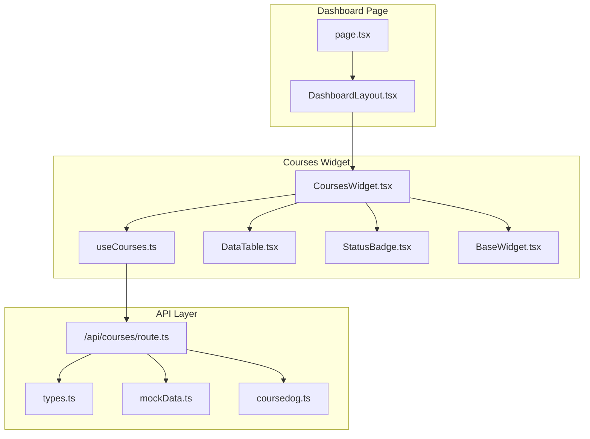
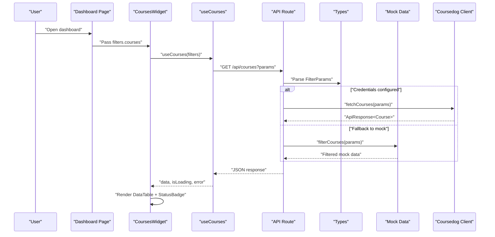
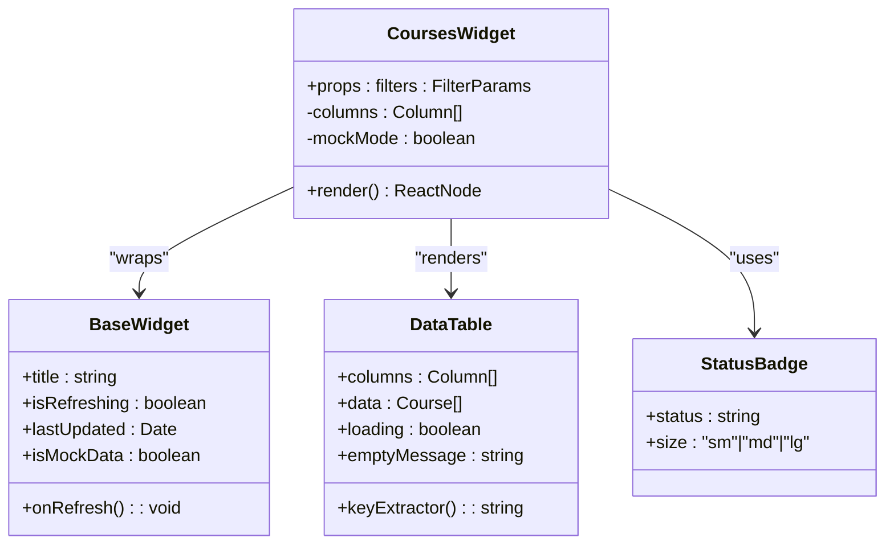
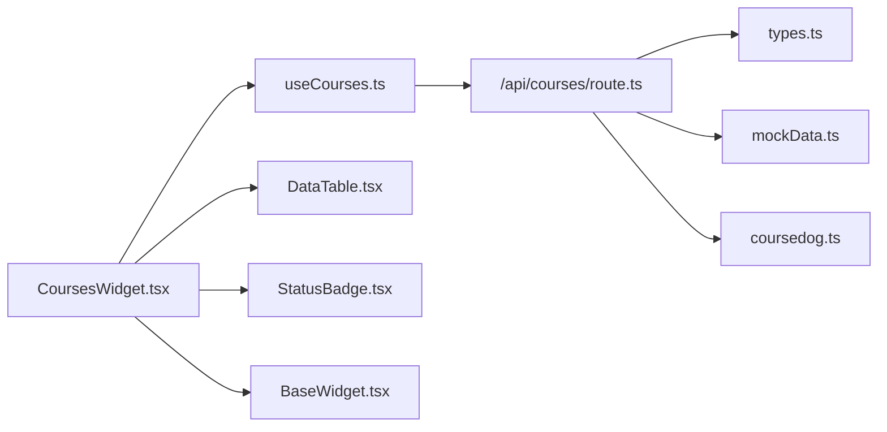

# Courses Widget

<cite>
**Referenced Files in This Document**
- [CoursesWidget.tsx](file://src/components/widgets/CoursesWidget.tsx)
- [useCourses.ts](file://src/hooks/useCourses.ts)
- [route.ts](file://src/app/api/courses/route.ts)
- [types.ts](file://src/lib/api/types.ts)
- [mockData.ts](file://src/lib/api/mockData.ts)
- [coursedog.ts](file://src/lib/api/coursedog.ts)
- [StatusBadge.tsx](file://src/components/ui/StatusBadge.tsx)
- [DataTable.tsx](file://src/components/ui/DataTable.tsx)
- [BaseWidget.tsx](file://src/components/widgets/BaseWidget.tsx)
- [page.tsx](file://src/app/page.tsx)
- [DashboardLayout.tsx](file://src/components/layout/DashboardLayout.tsx)
</cite>

## Table of Contents
1. [Introduction](#introduction)
2. [Project Structure](#project-structure)
3. [Core Components](#core-components)
4. [Architecture Overview](#architecture-overview)
5. [Detailed Component Analysis](#detailed-component-analysis)
6. [Dependency Analysis](#dependency-analysis)
7. [Performance Considerations](#performance-considerations)
8. [Troubleshooting Guide](#troubleshooting-guide)
9. [Conclusion](#conclusion)

## Introduction
The Courses Widget provides a comprehensive interface for discovering, filtering, and managing course offerings. It integrates with the useCourses hook to fetch course data, displays course details in a tabular format, and supports real-time status indicators and enrollment metrics. The widget also demonstrates mock data fallback and robust error handling, ensuring reliable operation in development and production environments.

## Project Structure
The Courses Widget is part of a modular dashboard architecture. It relies on shared UI components, global filters, and a centralized API layer for data retrieval. The widget composes reusable elements such as BaseWidget, DataTable, and StatusBadge to present course information effectively.

**Diagram sources**
- [page.tsx:12-99](file://src/app/page.tsx#L12-L99)
- [DashboardLayout.tsx:12-25](file://src/components/layout/DashboardLayout.tsx#L12-L25)
- [CoursesWidget.tsx:15-124](file://src/components/widgets/CoursesWidget.tsx#L15-L124)
- [useCourses.ts:25-30](file://src/hooks/useCourses.ts#L25-L30)
- [DataTable.tsx:21-80](file://src/components/ui/DataTable.tsx#L21-L80)
- [StatusBadge.tsx:61-77](file://src/components/ui/StatusBadge.tsx#L61-L77)
- [BaseWidget.tsx:16-67](file://src/components/widgets/BaseWidget.tsx#L16-L67)
- [route.ts:13-75](file://src/app/api/courses/route.ts#L13-L75)
- [types.ts:34-61](file://src/lib/api/types.ts#L34-L61)
- [mockData.ts:302-317](file://src/lib/api/mockData.ts#L302-L317)
- [coursedog.ts:70-72](file://src/lib/api/coursedog.ts#L70-L72)

**Section sources**
- [page.tsx:12-99](file://src/app/page.tsx#L12-L99)
- [DashboardLayout.tsx:12-25](file://src/components/layout/DashboardLayout.tsx#L12-L25)
- [CoursesWidget.tsx:15-124](file://src/components/widgets/CoursesWidget.tsx#L15-L124)
- [useCourses.ts:25-30](file://src/hooks/useCourses.ts#L25-L30)
- [route.ts:13-75](file://src/app/api/courses/route.ts#L13-L75)

## Core Components
- CoursesWidget: Renders the course table, handles loading and error states, and integrates with BaseWidget for refresh and metadata display.
- useCourses: Provides data fetching via React Query, transforming FilterParams into URL search parameters and returning ApiResponse<Course>.
- DataTable: Generic table renderer supporting dynamic columns, loading states, and empty messages.
- StatusBadge: Visual indicator for course and room statuses with configurable sizes.
- API Route: Implements server-side filtering, credential checks, and fallback to mock data.
- Types: Defines Course, FilterParams, and ApiResponse structures used across the widget and API.

**Section sources**
- [CoursesWidget.tsx:15-124](file://src/components/widgets/CoursesWidget.tsx#L15-L124)
- [useCourses.ts:25-30](file://src/hooks/useCourses.ts#L25-L30)
- [DataTable.tsx:21-80](file://src/components/ui/DataTable.tsx#L21-L80)
- [StatusBadge.tsx:61-77](file://src/components/ui/StatusBadge.tsx#L61-L77)
- [route.ts:13-75](file://src/app/api/courses/route.ts#L13-L75)
- [types.ts:34-61](file://src/lib/api/types.ts#L34-L61)

## Architecture Overview
The Courses Widget follows a unidirectional data flow:
- The dashboard page manages global filters and passes them to the widget.
- The widget invokes useCourses with current filters to fetch data.
- The API route validates credentials, applies filters, and returns either live data or mock data.
- The widget renders the data using DataTable and StatusBadge, with BaseWidget providing refresh controls and metadata.

**Diagram sources**
- [page.tsx:24-36](file://src/app/page.tsx#L24-L36)
- [CoursesWidget.tsx:15-124](file://src/components/widgets/CoursesWidget.tsx#L15-L124)
- [useCourses.ts:6-23](file://src/hooks/useCourses.ts#L6-L23)
- [route.ts:13-75](file://src/app/api/courses/route.ts#L13-L75)
- [types.ts:50-61](file://src/lib/api/types.ts#L50-L61)
- [mockData.ts:302-317](file://src/lib/api/mockData.ts#L302-L317)
- [coursedog.ts:70-72](file://src/lib/api/coursedog.ts#L70-L72)

## Detailed Component Analysis

### CoursesWidget Component
Responsibilities:
- Accepts FilterParams from the dashboard and passes them to useCourses.
- Defines column layout for course code, title, instructor, schedule, location, enrollment, and status.
- Renders error state with retry via refetch and displays loading state through BaseWidget.
- Uses StatusBadge for status visualization and DataTable for tabular presentation.

Key behaviors:
- Column rendering includes icons and structured text for readability.
- Enrollment column shows current enrollment versus capacity.
- Status column maps to StatusBadge for consistent visual semantics.

**Diagram sources**
- [CoursesWidget.tsx:15-124](file://src/components/widgets/CoursesWidget.tsx#L15-L124)
- [BaseWidget.tsx:16-67](file://src/components/widgets/BaseWidget.tsx#L16-L67)
- [DataTable.tsx:21-80](file://src/components/ui/DataTable.tsx#L21-L80)
- [StatusBadge.tsx:61-77](file://src/components/ui/StatusBadge.tsx#L61-L77)

**Section sources**
- [CoursesWidget.tsx:15-124](file://src/components/widgets/CoursesWidget.tsx#L15-L124)

### useCourses Hook
Responsibilities:
- Transforms FilterParams into URL search parameters.
- Fetches course data from the backend API.
- Handles HTTP errors by throwing descriptive errors.
- Returns React Query result with data, loading, error, and refetch capabilities.

Processing logic:
- Iterates over filter key-value pairs and appends non-empty values to URLSearchParams.
- Calls the backend endpoint and parses JSON response.
- Throws an error if the response is not OK, ensuring downstream error handling.

**Section sources**
- [useCourses.ts:6-23](file://src/hooks/useCourses.ts#L6-L23)
- [useCourses.ts:25-30](file://src/hooks/useCourses.ts#L25-L30)

### API Route (/api/courses)
Responsibilities:
- Parses query parameters into FilterParams.
- Checks for API credentials; if missing or invalid, falls back to mock data.
- Delegates to Coursedog client when credentials are present.
- On error, re-applies filters against mock data to maintain UX continuity.

Credential handling:
- Validates COURSEDOG_API_KEY and COURSEDOG_INSTITUTION_ID presence and non-placeholder values.

**Section sources**
- [route.ts:13-75](file://src/app/api/courses/route.ts#L13-L75)

### Data Models and Filtering
Course model:
- Fields include identifiers, descriptive attributes, scheduling info, enrollment metrics, and status.

Filtering logic:
- Supports status, room, building, and query-based text matching.
- Applies case-insensitive substring matching for textual fields.
- Returns filtered datasets suitable for both live and mock scenarios.

**Section sources**
- [types.ts:34-47](file://src/lib/api/types.ts#L34-L47)
- [types.ts:50-61](file://src/lib/api/types.ts#L50-L61)
- [mockData.ts:302-317](file://src/lib/api/mockData.ts#L302-L317)

### Status Visualization
StatusBadge:
- Maps status strings to color-coded badges with labels.
- Supports size variants for compact displays.
- Gracefully handles unknown status values with neutral defaults.

**Section sources**
- [StatusBadge.tsx:12-53](file://src/components/ui/StatusBadge.tsx#L12-L53)
- [StatusBadge.tsx:61-77](file://src/components/ui/StatusBadge.tsx#L61-L77)

### Course Discovery and Filtering
Discovery features:
- Global search bar and filter chips enable natural language and explicit filtering.
- Active filters are displayed as removable chips for transparency and quick adjustments.
- The dashboard switches views based on the active entity, with courses as one option.

Integration points:
- The dashboard page coordinates filters and passes them to the widget.
- Filter chips support clearing individual filters or all filters.

**Section sources**
- [page.tsx:24-36](file://src/app/page.tsx#L24-L36)
- [page.tsx:49-53](file://src/app/page.tsx#L49-L53)

### Instructor Coordination and Scheduling Integration
Instructor and scheduling fields:
- Course records include instructor names and schedule strings for easy identification.
- Location details (room name/building) help coordinate physical availability.

Note: The current implementation focuses on displaying these attributes. For enrollment workflows and schedule conflict detection, additional backend endpoints and UI actions would be required.

**Section sources**
- [types.ts:34-47](file://src/lib/api/types.ts#L34-L47)

## Dependency Analysis
The Courses Widget exhibits low coupling and high cohesion:
- CoursesWidget depends on useCourses for data and on UI primitives for rendering.
- useCourses encapsulates network concerns and transforms filters into requests.
- The API route centralizes credential checks and fallback logic.
- Shared types unify data contracts across components.

**Diagram sources**
- [CoursesWidget.tsx:3-8](file://src/components/widgets/CoursesWidget.tsx#L3-L8)
- [useCourses.ts:3-4](file://src/hooks/useCourses.ts#L3-L4)
- [route.ts:1-4](file://src/app/api/courses/route.ts#L1-L4)
- [types.ts:1-1](file://src/lib/api/types.ts#L1-L1)
- [mockData.ts:1-3](file://src/lib/api/mockData.ts#L1-L3)
- [coursedog.ts:1-3](file://src/lib/api/coursedog.ts#L1-L3)

**Section sources**
- [CoursesWidget.tsx:3-8](file://src/components/widgets/CoursesWidget.tsx#L3-L8)
- [useCourses.ts:3-4](file://src/hooks/useCourses.ts#L3-L4)
- [route.ts:1-4](file://src/app/api/courses/route.ts#L1-L4)

## Performance Considerations
- Network efficiency: useCourses builds minimal query strings by excluding empty filter values.
- Rendering efficiency: DataTable renders only visible rows and supports loading states to avoid blocking the UI.
- Caching: React Query caches responses by queryKey, reducing redundant network calls during navigation.
- Fallback strategy: Mock data ensures responsive UI when credentials are unavailable or the API is unreachable.

[No sources needed since this section provides general guidance]

## Troubleshooting Guide
Common issues and resolutions:
- Missing API credentials: The API route checks for valid keys and falls back to mock data. Verify environment variables are set and non-placeholder values.
- Empty or unexpected results: Confirm filters are applied correctly and query text matches expected fields.
- Error display: CoursesWidget shows an error message with a refresh action; use the refresh button to retry.

Operational tips:
- Use FilterChips to inspect active filters and clear them incrementally.
- Monitor the last updated timestamp in BaseWidget to confirm data freshness.

**Section sources**
- [route.ts:6-11](file://src/app/api/courses/route.ts#L6-L11)
- [route.ts:56-74](file://src/app/api/courses/route.ts#L56-L74)
- [CoursesWidget.tsx:91-105](file://src/components/widgets/CoursesWidget.tsx#L91-L105)
- [BaseWidget.tsx:60-64](file://src/components/widgets/BaseWidget.tsx#L60-L64)

## Conclusion
The Courses Widget delivers a robust, extensible foundation for course discovery and management. Its integration with useCourses, shared UI components, and unified types ensures maintainability and scalability. By leveraging mock data fallback and clear error handling, it provides a resilient user experience. Future enhancements can focus on adding enrollment actions, schedule conflict detection, and deeper integration with academic scheduling systems through additional API endpoints and UI controls.