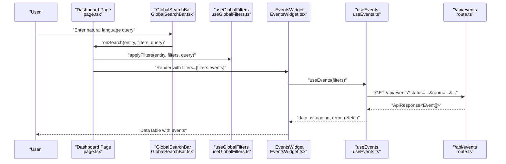
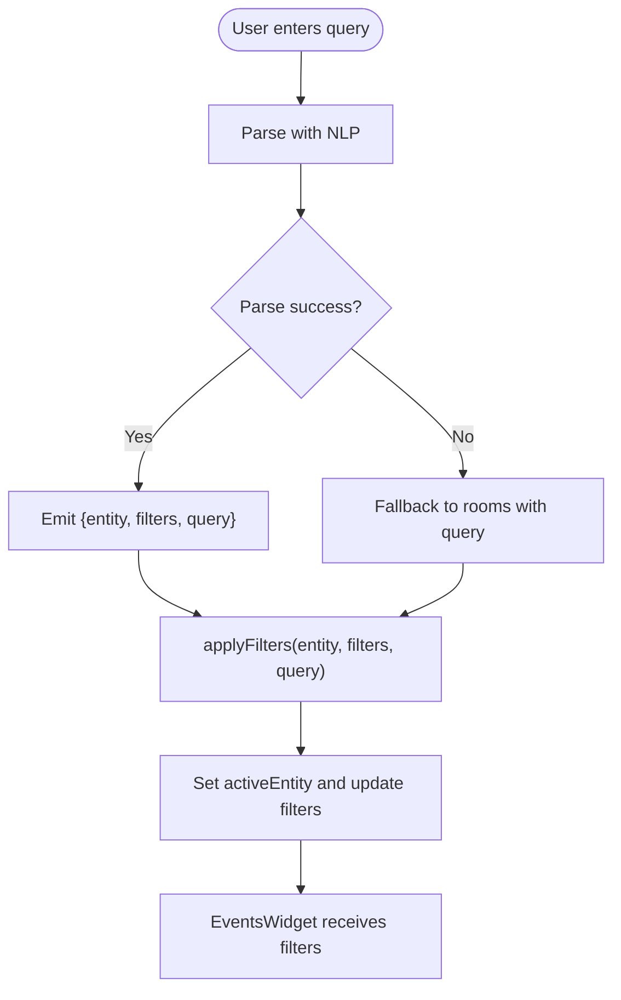
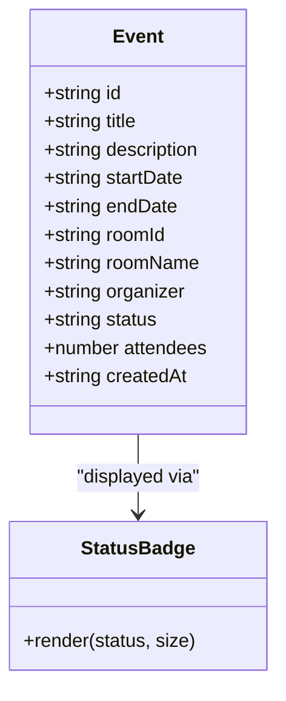
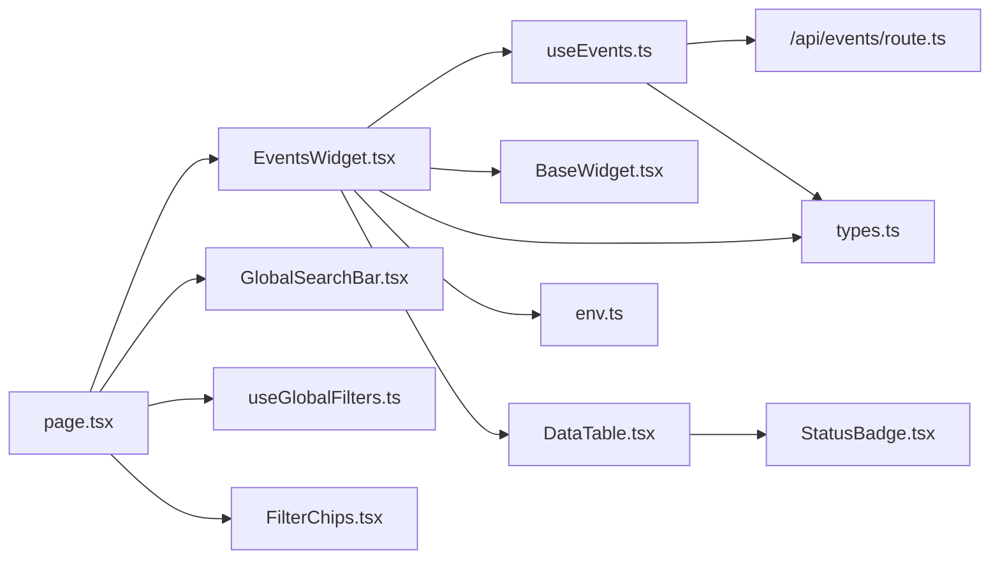

# Events Widget

<cite>
**Referenced Files in This Document**
- [EventsWidget.tsx](file://src/components/widgets/EventsWidget.tsx)
- [useEvents.ts](file://src/hooks/useEvents.ts)
- [page.tsx](file://src/app/page.tsx)
- [GlobalSearchBar.tsx](file://src/components/search/GlobalSearchBar.tsx)
- [FilterChips.tsx](file://src/components/search/FilterChips.tsx)
- [useGlobalFilters.ts](file://src/hooks/useGlobalFilters.ts)
- [route.ts](file://src/app/api/events/route.ts)
- [types.ts](file://src/lib/api/types.ts)
- [env.ts](file://src/lib/utils/env.ts)
- [BaseWidget.tsx](file://src/components/widgets/BaseWidget.tsx)
- [DataTable.tsx](file://src/components/ui/DataTable.tsx)
- [StatusBadge.tsx](file://src/components/ui/StatusBadge.tsx)
- [LoadingSpinner.tsx](file://src/components/ui/LoadingSpinner.tsx)
</cite>

## Table of Contents
1. [Introduction](#introduction)
2. [Project Structure](#project-structure)
3. [Core Components](#core-components)
4. [Architecture Overview](#architecture-overview)
5. [Detailed Component Analysis](#detailed-component-analysis)
6. [Dependency Analysis](#dependency-analysis)
7. [Performance Considerations](#performance-considerations)
8. [Troubleshooting Guide](#troubleshooting-guide)
9. [Conclusion](#conclusion)
10. [Appendices](#appendices)

## Introduction
This document explains the EventsWidget component and its ecosystem for event data visualization and scheduling coordination. It covers how the widget integrates with the useEvents hook for real-time event data management, the event filtering system, and how users can browse and manage events. It also documents event status tracking, attendee information, and integration with the global search and filter system for event discovery. Finally, it provides examples of event calendar views, organizer information display, and scheduling workflows, along with guidelines for customization and extending functionality.

## Project Structure
The EventsWidget lives in the widgets layer and composes reusable UI components and hooks. It is orchestrated by the dashboard page, which manages global filters and entity selection. The API route handles server-side filtering and data retrieval, with fallback to mock data when credentials are missing.

```mermaid
graph TB
subgraph "UI Layer"
Page["Dashboard Page<br/>page.tsx"]
EventsWidget["EventsWidget<br/>EventsWidget.tsx"]
BaseWidget["BaseWidget<br/>BaseWidget.tsx"]
DataTable["DataTable<br/>DataTable.tsx"]
StatusBadge["StatusBadge<br/>StatusBadge.tsx"]
FilterChips["FilterChips<br/>FilterChips.tsx"]
GlobalSearch["GlobalSearchBar<br/>GlobalSearchBar.tsx"]
end
subgraph "Hooks"
useEventsHook["useEvents<br/>useEvents.ts"]
useGlobalFiltersHook["useGlobalFilters<br/>useGlobalFilters.ts"]
end
subgraph "API"
EventsRoute["/api/events<br/>route.ts"]
end
subgraph "Types"
Types["API Types<br/>types.ts"]
Env["Env Utils<br/>env.ts"]
end
Page --> GlobalSearch
Page --> FilterChips
Page --> EventsWidget
EventsWidget --> useEventsHook
EventsWidget --> BaseWidget
EventsWidget --> DataTable
DataTable --> StatusBadge
useEventsHook --> EventsRoute
Page --> useGlobalFiltersHook
EventsRoute --> Types
EventsWidget --> Types
Env --> EventsWidget
```

**Diagram sources**
- [page.tsx:12-99](file://src/app/page.tsx#L12-L99)
- [EventsWidget.tsx:15-119](file://src/components/widgets/EventsWidget.tsx#L15-L119)
- [useEvents.ts:25-30](file://src/hooks/useEvents.ts#L25-L30)
- [route.ts:13-80](file://src/app/api/events/route.ts#L13-L80)
- [types.ts:20-61](file://src/lib/api/types.ts#L20-L61)
- [env.ts:3-13](file://src/lib/utils/env.ts#L3-L13)

**Section sources**
- [page.tsx:12-99](file://src/app/page.tsx#L12-L99)
- [EventsWidget.tsx:15-119](file://src/components/widgets/EventsWidget.tsx#L15-L119)
- [useEvents.ts:25-30](file://src/hooks/useEvents.ts#L25-L30)
- [route.ts:13-80](file://src/app/api/events/route.ts#L13-L80)
- [types.ts:20-61](file://src/lib/api/types.ts#L20-L61)
- [env.ts:3-13](file://src/lib/utils/env.ts#L3-L13)

## Core Components
- EventsWidget: Renders a tabular view of events with columns for title/description, date/time, location, organizer, and status. Integrates with useEvents for data, refresh, and error handling.
- useEvents: TanStack React Query hook that fetches filtered events via /api/events and exposes loading, error, and refetch controls.
- Global search and filters: GlobalSearchBar parses natural language queries and emits typed filters; FilterChips displays active filters; useGlobalFilters maintains global state across entities.
- API route: Converts query parameters into FilterParams, delegates to real API or mock data, and returns paginated ApiResponse.
- Supporting UI: BaseWidget provides consistent widget shell with refresh and last-updated indicators; DataTable renders rows and columns; StatusBadge visualizes event status.

**Section sources**
- [EventsWidget.tsx:15-119](file://src/components/widgets/EventsWidget.tsx#L15-L119)
- [useEvents.ts:25-30](file://src/hooks/useEvents.ts#L25-L30)
- [GlobalSearchBar.tsx:13-54](file://src/components/search/GlobalSearchBar.tsx#L13-L54)
- [FilterChips.tsx:23-59](file://src/components/search/FilterChips.tsx#L23-L59)
- [useGlobalFilters.ts:14-78](file://src/hooks/useGlobalFilters.ts#L14-L78)
- [route.ts:13-80](file://src/app/api/events/route.ts#L13-L80)
- [BaseWidget.tsx:16-67](file://src/components/widgets/BaseWidget.tsx#L16-L67)
- [DataTable.tsx:21-80](file://src/components/ui/DataTable.tsx#L21-L80)
- [StatusBadge.tsx:61-77](file://src/components/ui/StatusBadge.tsx#L61-L77)

## Architecture Overview
The EventsWidget participates in a reactive data flow:
- The dashboard page manages global filters and entity selection.
- Users enter natural language queries or apply explicit filters.
- The selected filters are passed to EventsWidget.
- useEvents triggers a fetch to /api/events with current filters.
- The API route applies filters and returns data (real or mock).
- EventsWidget renders the data in a responsive table with status badges.



**Diagram sources**
- [page.tsx:24-36](file://src/app/page.tsx#L24-L36)
- [GlobalSearchBar.tsx:21-54](file://src/components/search/GlobalSearchBar.tsx#L21-L54)
- [useGlobalFilters.ts:24-37](file://src/hooks/useGlobalFilters.ts#L24-L37)
- [EventsWidget.tsx:16](file://src/components/widgets/EventsWidget.tsx#L16)
- [useEvents.ts:6-23](file://src/hooks/useEvents.ts#L6-L23)
- [route.ts:13-80](file://src/app/api/events/route.ts#L13-L80)

## Detailed Component Analysis

### EventsWidget
Responsibilities:
- Integrate with useEvents to obtain event data and metadata.
- Render a structured table with columns for title, date/time, location, organizer, and status.
- Display error state with retry via refetch.
- Show mock mode indicator and last-updated timestamp via BaseWidget.
- Provide a clean, accessible table using DataTable and StatusBadge.

Key behaviors:
- Columns define widths and renderers for each field, including icons for date/time, location, and organizer.
- Status is rendered via StatusBadge, which maps status strings to color-coded badges.
- Empty/loading states handled by DataTable; errors surfaced by BaseWidget content area.

Customization tips:
- Add new columns by extending the columns array with a new key/header/render tuple.
- Modify date formatting in the formatDate helper to change display style.
- Adjust widths to fit content density or screen sizes.

**Section sources**
- [EventsWidget.tsx:15-119](file://src/components/widgets/EventsWidget.tsx#L15-L119)
- [DataTable.tsx:21-80](file://src/components/ui/DataTable.tsx#L21-L80)
- [StatusBadge.tsx:61-77](file://src/components/ui/StatusBadge.tsx#L61-L77)
- [BaseWidget.tsx:16-67](file://src/components/widgets/BaseWidget.tsx#L16-L67)

### useEvents Hook
Responsibilities:
- Convert FilterParams into URL search parameters.
- Fetch from /api/events with robust error handling.
- Return TanStack Query result with data, isLoading, error, refetch, and dataUpdatedAt.

Processing logic:
- Skips falsy/empty values when building query string.
- Throws a descriptive error if the HTTP response is not ok.
- Uses a stable queryKey to enable caching and automatic refetching.

Integration points:
- Consumed by EventsWidget to drive rendering and refresh actions.
- Drives pagination via limit/offset filters.

**Section sources**
- [useEvents.ts:6-23](file://src/hooks/useEvents.ts#L6-L23)
- [useEvents.ts:25-30](file://src/hooks/useEvents.ts#L25-L30)

### Global Search and Filter System
- GlobalSearchBar: Parses natural language queries via /api/nlp/parse and falls back to a generic room search if parsing fails. Emits entity, filters, and original query to the dashboard.
- useGlobalFilters: Centralized state managing filters per entity (events, courses, rooms), active entity, and search query. Provides helpers to apply/clear filters and retrieve active filters.
- FilterChips: Visual representation of active filters with remove/clear-all actions.



**Diagram sources**
- [GlobalSearchBar.tsx:21-54](file://src/components/search/GlobalSearchBar.tsx#L21-L54)
- [useGlobalFilters.ts:24-37](file://src/hooks/useGlobalFilters.ts#L24-L37)
- [page.tsx:24-36](file://src/app/page.tsx#L24-L36)

**Section sources**
- [GlobalSearchBar.tsx:13-54](file://src/components/search/GlobalSearchBar.tsx#L13-L54)
- [useGlobalFilters.ts:14-78](file://src/hooks/useGlobalFilters.ts#L14-L78)
- [FilterChips.tsx:23-59](file://src/components/search/FilterChips.tsx#L23-L59)
- [page.tsx:24-36](file://src/app/page.tsx#L24-L36)

### API Route for Events
Responsibilities:
- Extract query parameters into FilterParams.
- If API credentials are present, delegate to real API; otherwise, use mock data.
- On error, fall back to mock data with current filters.
- Return ApiResponse with data, total, page, and pageSize.

Filter coverage:
- Supports status, room, building, startDate, endDate, organizer, limit, offset, query.

**Section sources**
- [route.ts:13-80](file://src/app/api/events/route.ts#L13-L80)
- [types.ts:50-61](file://src/lib/api/types.ts#L50-L61)

### Event Data Model and Status Tracking
- Event model includes identifiers, title/description, start/end dates, room reference, organizer, status, optional attendees, and creation timestamp.
- StatusBadge maps status values to visual badges with consistent colors and labels.
- EventsWidget displays status via StatusBadge, enabling quick scanning of approval/availability states.



**Diagram sources**
- [types.ts:20-32](file://src/lib/api/types.ts#L20-L32)
- [StatusBadge.tsx:61-77](file://src/components/ui/StatusBadge.tsx#L61-L77)

**Section sources**
- [types.ts:20-32](file://src/lib/api/types.ts#L20-L32)
- [StatusBadge.tsx:61-77](file://src/components/ui/StatusBadge.tsx#L61-L77)

### Attendee Management
- The Event model includes an optional attendees count. While the current EventsWidget does not render this field, it is available for future extension.
- To add attendee display, extend the columns array in EventsWidget with a new column keyed by "attendees" and a render function.

**Section sources**
- [types.ts:20-32](file://src/lib/api/types.ts#L20-L32)
- [EventsWidget.tsx:29-84](file://src/components/widgets/EventsWidget.tsx#L29-L84)

### Calendar Views and Scheduling Workflows
- The EventsWidget currently presents a tabular view. To support calendar views:
  - Add a CalendarView component that consumes the same Event[] data.
  - Implement a toggle in the widget header to switch between table and calendar modes.
  - For scheduling workflows, integrate with room availability and booking APIs, ensuring status transitions (pending/approved/rejected) align with business rules.

[No sources needed since this section proposes conceptual extensions]

### Organizer Information Display
- EventsWidget renders an "Organizer" column with an icon and text. The organizer field is part of the Event model and is populated by the backend.
- To enhance organizer info, consider adding tooltips with contact details or linking to an organizer profile page.

**Section sources**
- [EventsWidget.tsx:67-77](file://src/components/widgets/EventsWidget.tsx#L67-L77)
- [types.ts:20-32](file://src/lib/api/types.ts#L20-L32)

### Integration with Global Search and Filters
- The dashboard orchestrates search and filters: GlobalSearchBar feeds parsed filters; useGlobalFilters stores them globally; EventsWidget receives filters from the global state.
- FilterChips visually reflects active filters and supports incremental removal.

**Section sources**
- [page.tsx:24-36](file://src/app/page.tsx#L24-L36)
- [GlobalSearchBar.tsx:21-54](file://src/components/search/GlobalSearchBar.tsx#L21-L54)
- [useGlobalFilters.ts:24-37](file://src/hooks/useGlobalFilters.ts#L24-L37)
- [FilterChips.tsx:23-59](file://src/components/search/FilterChips.tsx#L23-L59)

## Dependency Analysis
- EventsWidget depends on:
  - useEvents for data and refresh.
  - BaseWidget for shell and UX affordances.
  - DataTable for rendering.
  - StatusBadge for status visualization.
  - types.ts for typing and FilterParams.
  - env.ts for mock mode detection.
- useEvents depends on:
  - route.ts for data retrieval.
  - types.ts for FilterParams and ApiResponse.
- Global search and filters depend on:
  - GlobalSearchBar, useGlobalFilters, FilterChips.
  - page.tsx for orchestration.



**Diagram sources**
- [EventsWidget.tsx:3-8](file://src/components/widgets/EventsWidget.tsx#L3-L8)
- [useEvents.ts:3-4](file://src/hooks/useEvents.ts#L3-L4)
- [route.ts:1-4](file://src/app/api/events/route.ts#L1-L4)
- [types.ts:1-10](file://src/lib/api/types.ts#L1-L10)
- [env.ts:1-14](file://src/lib/utils/env.ts#L1-L14)
- [page.tsx:3-10](file://src/app/page.tsx#L3-L10)
- [GlobalSearchBar.tsx:1-6](file://src/components/search/GlobalSearchBar.tsx#L1-L6)
- [useGlobalFilters.ts:1-5](file://src/hooks/useGlobalFilters.ts#L1-L5)
- [FilterChips.tsx:1-5](file://src/components/search/FilterChips.tsx#L1-L5)

**Section sources**
- [EventsWidget.tsx:3-8](file://src/components/widgets/EventsWidget.tsx#L3-L8)
- [useEvents.ts:3-4](file://src/hooks/useEvents.ts#L3-L4)
- [route.ts:1-4](file://src/app/api/events/route.ts#L1-L4)
- [types.ts:1-10](file://src/lib/api/types.ts#L1-L10)
- [env.ts:1-14](file://src/lib/utils/env.ts#L1-L14)
- [page.tsx:3-10](file://src/app/page.tsx#L3-L10)

## Performance Considerations
- Pagination: Use limit and offset filters to cap payload sizes and improve responsiveness.
- Caching: React Query caches results by queryKey; avoid unnecessary re-renders by keeping filters stable.
- Debouncing: Consider debouncing search input to reduce network requests during typing.
- Virtualization: For large datasets, consider virtualized tables to minimize DOM nodes.
- Mock mode: When API credentials are missing, the system falls back to mock data; this avoids network overhead but may differ from production data.

[No sources needed since this section provides general guidance]

## Troubleshooting Guide
Common issues and resolutions:
- No events displayed:
  - Verify filters are not overly restrictive; clear filters via FilterChips.
  - Check that GlobalSearchBar is emitting filters; inspect applyFilters calls.
- Error loading events:
  - EventsWidget shows an error state with a refresh button; click to retry.
  - Inspect the API route error handling and fallback to mock data.
- Mock mode:
  - If COURSEDOG_API_KEY or COURSEDOG_INSTITUTION_ID are missing or default, mock data is used; configure environment variables to connect to the real API.
- Status badge not appearing:
  - Ensure the event status matches supported values; StatusBadge maps known statuses to colors.

**Section sources**
- [EventsWidget.tsx:86-100](file://src/components/widgets/EventsWidget.tsx#L86-L100)
- [route.ts:62-79](file://src/app/api/events/route.ts#L62-L79)
- [env.ts:3-13](file://src/lib/utils/env.ts#L3-L13)
- [StatusBadge.tsx:61-77](file://src/components/ui/StatusBadge.tsx#L61-L77)

## Conclusion
The EventsWidget provides a robust, extensible foundation for event visualization and management. It integrates seamlessly with the global search and filter system, supports real-time data via useEvents, and offers clear status tracking through StatusBadge. With straightforward extensions—such as adding attendee counts, calendar views, or scheduling workflows—the widget can evolve to meet advanced event coordination needs.

[No sources needed since this section summarizes without analyzing specific files]

## Appendices

### Example Workflows

- Event browsing and filtering:
  - Enter a natural language query in GlobalSearchBar; parsed filters appear in FilterChips; EventsWidget updates automatically.
- Event scheduling:
  - Select an event and use the room association to coordinate scheduling; ensure status transitions align with organizational policies.
- Calendar view:
  - Extend the widget to render a calendar component consuming the same Event[] data.

[No sources needed since this section provides conceptual examples]

### Customization Guidelines
- Adding new columns:
  - Extend the columns array in EventsWidget with a new key, header, width, and render function.
- Enhancing status display:
  - Customize StatusBadge styles or add tooltips for richer context.
- Extending search:
  - Add new filter keys to FilterParams and ensure the API route and useEvents handle them consistently.
- Improving performance:
  - Use limit/offset for pagination; debounce search; consider virtualization for large lists.

[No sources needed since this section provides general guidance]