# Rooms Widget

<cite>
**Referenced Files in This Document**
- [RoomsWidget.tsx](file://src/components/widgets/RoomsWidget.tsx)
- [useRooms.ts](file://src/hooks/useRooms.ts)
- [route.ts](file://src/app/api/rooms/route.ts)
- [types.ts](file://src/lib/api/types.ts)
- [DataTable.tsx](file://src/components/ui/DataTable.tsx)
- [StatusBadge.tsx](file://src/components/ui/StatusBadge.tsx)
- [BaseWidget.tsx](file://src/components/widgets/BaseWidget.tsx)
- [useGlobalFilters.ts](file://src/hooks/useGlobalFilters.ts)
- [page.tsx](file://src/app/page.tsx)
- [coursedog.ts](file://src/lib/api/coursedog.ts)
- [mockData.ts](file://src/lib/api/mockData.ts)
- [FilterChips.tsx](file://src/components/search/FilterChips.tsx)
</cite>

## Table of Contents
1. [Introduction](#introduction)
2. [Project Structure](#project-structure)
3. [Core Components](#core-components)
4. [Architecture Overview](#architecture-overview)
5. [Detailed Component Analysis](#detailed-component-analysis)
6. [Dependency Analysis](#dependency-analysis)
7. [Performance Considerations](#performance-considerations)
8. [Troubleshooting Guide](#troubleshooting-guide)
9. [Conclusion](#conclusion)
10. [Appendices](#appendices)

## Introduction
This document provides comprehensive technical documentation for the RoomsWidget component. It explains how the widget integrates with the useRooms hook for data fetching and state management, documents room data visualization patterns and availability tracking, details filtering capabilities, and describes the integration with the global filter system. It also covers the refresh mechanism, automatic data updates, examples of room status indicators and facility features display, and booking coordination features. Finally, it offers guidelines for customizing widget behavior and extending functionality.

## Project Structure
The RoomsWidget resides in the widgets folder and composes reusable UI components and hooks. It interacts with the global filter system and the backend API to present filtered room listings with status indicators and facility features.

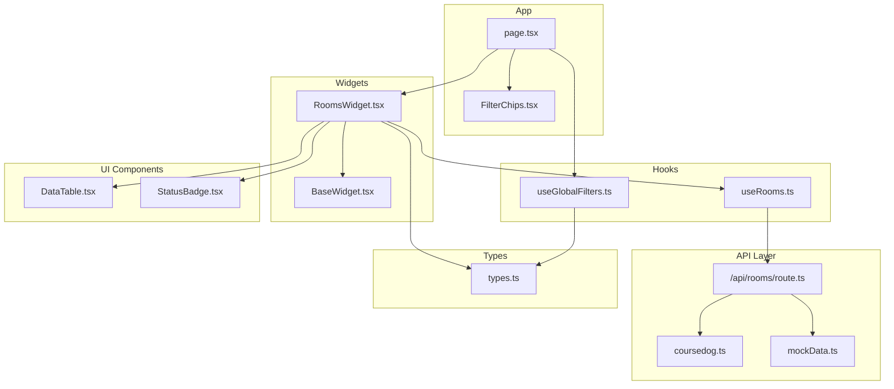

**Diagram sources**
- [RoomsWidget.tsx:1-97](file://src/components/widgets/RoomsWidget.tsx#L1-L97)
- [useRooms.ts:1-31](file://src/hooks/useRooms.ts#L1-L31)
- [route.ts:1-79](file://src/app/api/rooms/route.ts#L1-L79)
- [types.ts:1-99](file://src/lib/api/types.ts#L1-L99)
- [DataTable.tsx:1-81](file://src/components/ui/DataTable.tsx#L1-L81)
- [StatusBadge.tsx:1-78](file://src/components/ui/StatusBadge.tsx#L1-L78)
- [BaseWidget.tsx:1-58](file://src/components/widgets/BaseWidget.tsx#L1-L58)
- [useGlobalFilters.ts:1-79](file://src/hooks/useGlobalFilters.ts#L1-L79)
- [page.tsx:1-100](file://src/app/page.tsx#L1-L100)
- [coursedog.ts:1-73](file://src/lib/api/coursedog.ts#L1-L73)
- [mockData.ts:1-318](file://src/lib/api/mockData.ts#L1-L318)
- [FilterChips.tsx:1-60](file://src/components/search/FilterChips.tsx#L1-L60)

**Section sources**
- [RoomsWidget.tsx:1-97](file://src/components/widgets/RoomsWidget.tsx#L1-L97)
- [useRooms.ts:1-31](file://src/hooks/useRooms.ts#L1-L31)
- [route.ts:1-79](file://src/app/api/rooms/route.ts#L1-L79)
- [types.ts:1-99](file://src/lib/api/types.ts#L1-L99)
- [DataTable.tsx:1-81](file://src/components/ui/DataTable.tsx#L1-L81)
- [StatusBadge.tsx:1-78](file://src/components/ui/StatusBadge.tsx#L1-L78)
- [BaseWidget.tsx:1-58](file://src/components/widgets/BaseWidget.tsx#L1-L58)
- [useGlobalFilters.ts:1-79](file://src/hooks/useGlobalFilters.ts#L1-L79)
- [page.tsx:1-100](file://src/app/page.tsx#L1-L100)
- [coursedog.ts:1-73](file://src/lib/api/coursedog.ts#L1-L73)
- [mockData.ts:1-318](file://src/lib/api/mockData.ts#L1-L318)
- [FilterChips.tsx:1-60](file://src/components/search/FilterChips.tsx#L1-L60)

## Core Components
- RoomsWidget: Renders a paginated, filterable table of rooms with status badges and facility features. Integrates with useRooms for data fetching and state management.
- useRooms: TanStack React Query hook that fetches rooms from the backend API with dynamic query parameters derived from FilterParams.
- BaseWidget: Provides a standardized widget shell with refresh controls and last-updated timestamp.
- DataTable: Generic table renderer with loading and empty-state handling.
- StatusBadge: Renders status indicators with color-coded labels for room availability and lifecycle states.
- Global Filter System: Centralized filter state management via useGlobalFilters, enabling cross-entity filtering and synchronization with the RoomsWidget.

**Section sources**
- [RoomsWidget.tsx:15-96](file://src/components/widgets/RoomsWidget.tsx#L15-L96)
- [useRooms.ts:25-30](file://src/hooks/useRooms.ts#L25-L30)
- [BaseWidget.tsx:15-57](file://src/components/widgets/BaseWidget.tsx#L15-L57)
- [DataTable.tsx:21-80](file://src/components/ui/DataTable.tsx#L21-L80)
- [StatusBadge.tsx:61-77](file://src/components/ui/StatusBadge.tsx#L61-L77)
- [useGlobalFilters.ts:14-78](file://src/hooks/useGlobalFilters.ts#L14-L78)

## Architecture Overview
The RoomsWidget participates in a layered architecture:
- Presentation Layer: RoomsWidget renders UI and delegates data fetching to useRooms.
- State Management: useRooms encapsulates TanStack React Query state and caching.
- API Layer: The Next.js route builds FilterParams from query strings and either calls the external Coursedog API or falls back to mock data.
- Shared State: useGlobalFilters maintains active filters per entity and exposes helpers to apply, clear, and extract filters.

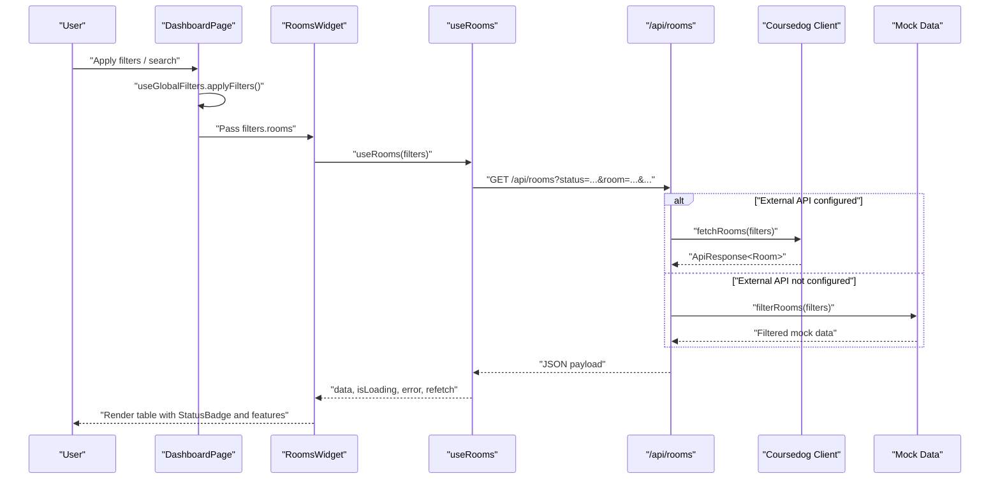

**Diagram sources**
- [page.tsx:24-36](file://src/app/page.tsx#L24-L36)
- [RoomsWidget.tsx:15-16](file://src/components/widgets/RoomsWidget.tsx#L15-L16)
- [useRooms.ts:25-30](file://src/hooks/useRooms.ts#L25-L30)
- [route.ts:13-78](file://src/app/api/rooms/route.ts#L13-L78)
- [coursedog.ts:62-64](file://src/lib/api/coursedog.ts#L62-L64)
- [mockData.ts:269-284](file://src/lib/api/mockData.ts#L269-L284)

## Detailed Component Analysis

### RoomsWidget Implementation
- Props: Accepts filters and an optional isPrimary flag.
- Data Fetching: Uses useRooms(filters) to obtain data, isLoading, error, dataUpdatedAt, and refetch.
- Columns:
  - Name: Room name with up to three visible features.
  - Building: Building name with a location icon.
  - Capacity: Numeric capacity with a users icon.
  - Status: Rendered via StatusBadge with size control.
- Error Handling: Displays an error message with a refresh button when an error occurs.
- Empty State: Uses DataTable’s emptyMessage when no rooms match filters.
- Refresh Mechanism: Exposes a refresh button wired to refetch and shows a spinner while loading.

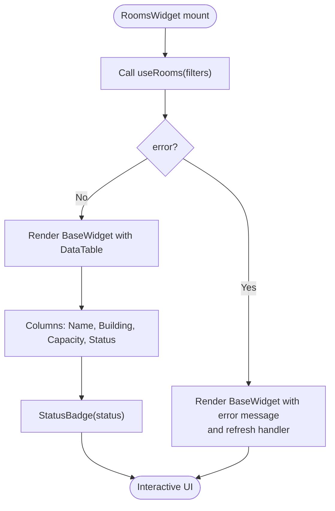

**Diagram sources**
- [RoomsWidget.tsx:15-96](file://src/components/widgets/RoomsWidget.tsx#L15-L96)
- [StatusBadge.tsx:61-77](file://src/components/ui/StatusBadge.tsx#L61-L77)

**Section sources**
- [RoomsWidget.tsx:15-96](file://src/components/widgets/RoomsWidget.tsx#L15-L96)
- [DataTable.tsx:21-80](file://src/components/ui/DataTable.tsx#L21-L80)
- [StatusBadge.tsx:61-77](file://src/components/ui/StatusBadge.tsx#L61-L77)

### useRooms Hook
- Purpose: Encapsulates TanStack React Query for room data.
- Behavior:
  - Converts FilterParams to URLSearchParams.
  - Calls GET /api/rooms with query parameters.
  - Throws a descriptive error if the response is not ok.
  - Returns query results for consumption by RoomsWidget.

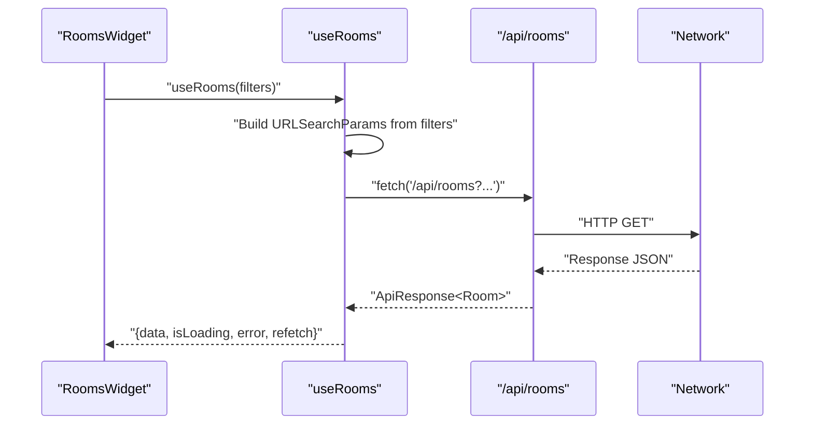

**Diagram sources**
- [useRooms.ts:6-23](file://src/hooks/useRooms.ts#L6-L23)
- [route.ts:13-23](file://src/app/api/rooms/route.ts#L13-L23)

**Section sources**
- [useRooms.ts:25-30](file://src/hooks/useRooms.ts#L25-L30)
- [useRooms.ts:6-23](file://src/hooks/useRooms.ts#L6-L23)

### Backend API (/api/rooms)
- Query Parameter Mapping: Translates query string keys to FilterParams (status, room, building, startDate, endDate, limit, offset, query).
- External API Integration: Uses COURSEDOG credentials to call the external API when configured.
- Fallback Strategy: Falls back to mock data when credentials are missing or on errors.
- Response Format: Returns ApiResponse<Room> with data, total, page, and pageSize.

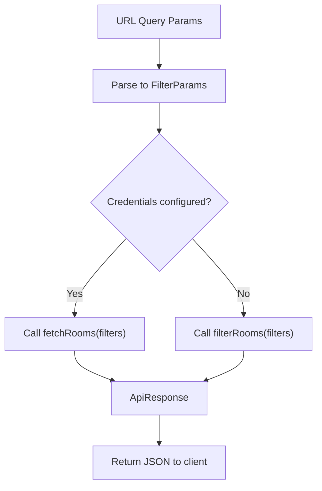

**Diagram sources**
- [route.ts:18-44](file://src/app/api/rooms/route.ts#L18-L44)
- [route.ts:46-58](file://src/app/api/rooms/route.ts#L46-L58)
- [route.ts:64-76](file://src/app/api/rooms/route.ts#L64-L76)
- [coursedog.ts:62-64](file://src/lib/api/coursedog.ts#L62-L64)
- [mockData.ts:269-284](file://src/lib/api/mockData.ts#L269-L284)

**Section sources**
- [route.ts:13-78](file://src/app/api/rooms/route.ts#L13-L78)
- [coursedog.ts:62-64](file://src/lib/api/coursedog.ts#L62-L64)
- [mockData.ts:269-284](file://src/lib/api/mockData.ts#L269-L284)

### Global Filter System Integration
- Central State: useGlobalFilters manages filters for rooms, events, courses, a shared searchQuery, and the activeEntity.
- Application: DashboardPage applies filters to the rooms entity and passes filters.rooms to RoomsWidget.
- Filter Chips: Visual representation of active filters with clear actions.

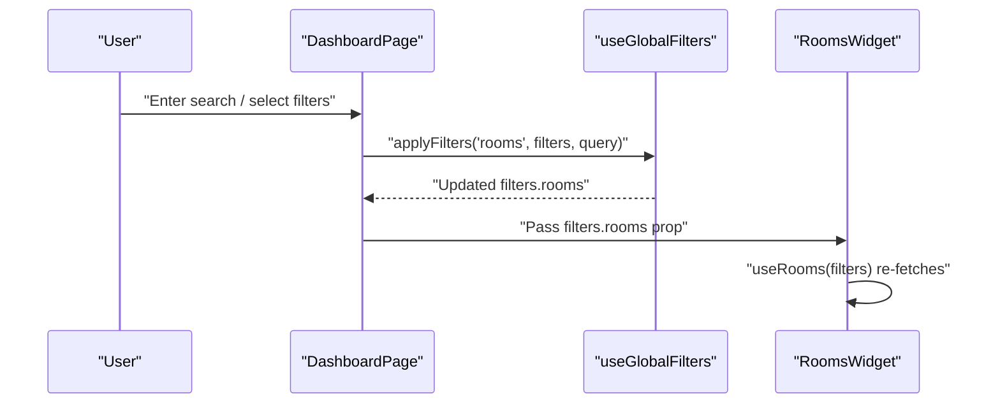

**Diagram sources**
- [page.tsx:24-36](file://src/app/page.tsx#L24-L36)
- [useGlobalFilters.ts:24-37](file://src/hooks/useGlobalFilters.ts#L24-L37)
- [FilterChips.tsx:24-26](file://src/components/search/FilterChips.tsx#L24-L26)

**Section sources**
- [page.tsx:12-36](file://src/app/page.tsx#L12-L36)
- [useGlobalFilters.ts:14-78](file://src/hooks/useGlobalFilters.ts#L14-L78)
- [FilterChips.tsx:23-59](file://src/components/search/FilterChips.tsx#L23-L59)

### Room Data Visualization Patterns
- Name and Features: Room name with a truncated list of features displayed beneath.
- Building: Location icon plus building name for quick spatial identification.
- Capacity: Users icon plus numeric capacity for occupancy planning.
- Status: Color-coded badge indicating availability or lifecycle state.

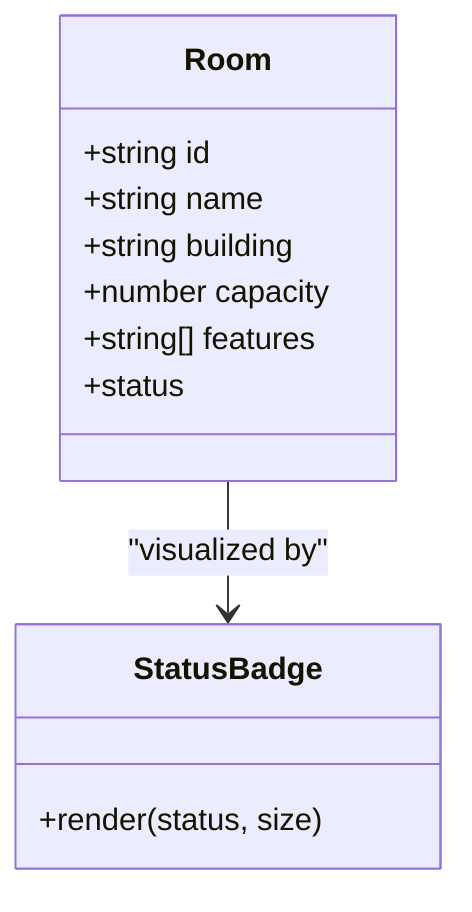

**Diagram sources**
- [types.ts:3-11](file://src/lib/api/types.ts#L3-L11)
- [StatusBadge.tsx:61-77](file://src/components/ui/StatusBadge.tsx#L61-L77)

**Section sources**
- [RoomsWidget.tsx:18-63](file://src/components/widgets/RoomsWidget.tsx#L18-L63)
- [types.ts:3-11](file://src/lib/api/types.ts#L3-L11)
- [StatusBadge.tsx:12-53](file://src/components/ui/StatusBadge.tsx#L12-L53)

### Availability Tracking and Booking Coordination
- Room Status: Enumerated values include availability and lifecycle states suitable for availability tracking.
- Schedule Field: Room includes an optional schedule array for booking coordination; while not rendered in RoomsWidget, it is available for downstream components or extensions.

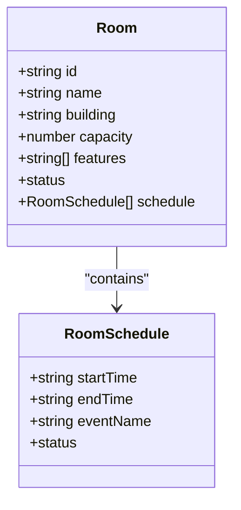

**Diagram sources**
- [types.ts:3-18](file://src/lib/api/types.ts#L3-L18)

**Section sources**
- [types.ts:3-18](file://src/lib/api/types.ts#L3-L18)

### Room Filtering Capabilities
- Supported Filters: status, room, building, startDate, endDate, limit, offset, query.
- Frontend Filtering: When external API is unavailable, filterRooms applies logical conditions across room attributes and free-text query.
- Global Filters: Filters propagate from useGlobalFilters to RoomsWidget via props.

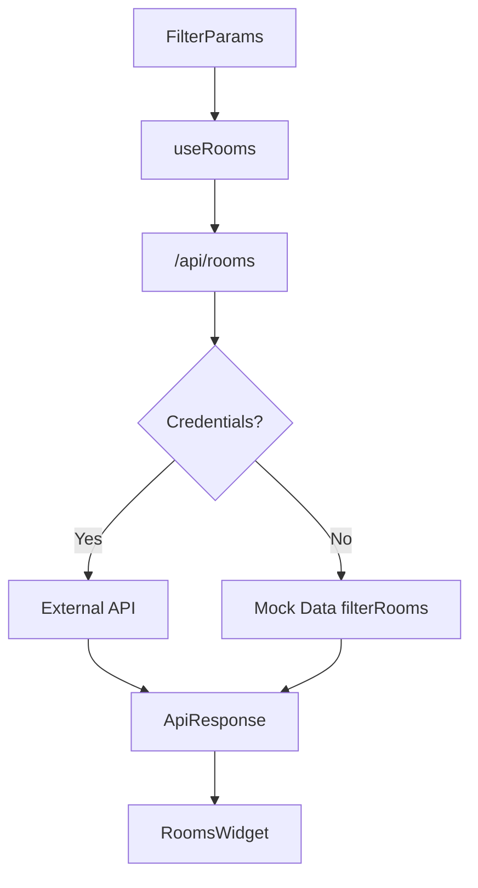

**Diagram sources**
- [useRooms.ts:6-23](file://src/hooks/useRooms.ts#L6-L23)
- [route.ts:18-44](file://src/app/api/rooms/route.ts#L18-L44)
- [mockData.ts:269-284](file://src/lib/api/mockData.ts#L269-L284)

**Section sources**
- [useRooms.ts:6-23](file://src/hooks/useRooms.ts#L6-L23)
- [route.ts:18-44](file://src/app/api/rooms/route.ts#L18-L44)
- [mockData.ts:269-284](file://src/lib/api/mockData.ts#L269-L284)

### Refresh Mechanism and Automatic Updates
- Manual Refresh: BaseWidget exposes an onRefresh callback wired to refetch from useRooms.
- Loading State: isRefreshing toggles during data fetching.
- Last Updated: BaseWidget displays the lastUpdated timestamp derived from dataUpdatedAt.

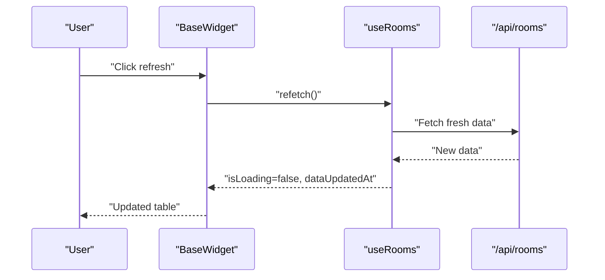

**Diagram sources**
- [BaseWidget.tsx:30-40](file://src/components/widgets/BaseWidget.tsx#L30-L40)
- [RoomsWidget.tsx:65-85](file://src/components/widgets/RoomsWidget.tsx#L65-L85)
- [useRooms.ts:25-30](file://src/hooks/useRooms.ts#L25-L30)

**Section sources**
- [BaseWidget.tsx:15-57](file://src/components/widgets/BaseWidget.tsx#L15-L57)
- [RoomsWidget.tsx:65-85](file://src/components/widgets/RoomsWidget.tsx#L65-L85)

### Examples and Best Practices
- Room Status Indicators: Use StatusBadge to reflect availability and lifecycle states consistently across the UI.
- Facility Features Display: Limit visible features to three with ellipsis for readability; expand on click in a modal or detail view if needed.
- Booking Coordination: Utilize the schedule field for integrating calendar views or booking modals in downstream components.

**Section sources**
- [StatusBadge.tsx:61-77](file://src/components/ui/StatusBadge.tsx#L61-L77)
- [RoomsWidget.tsx:26-31](file://src/components/widgets/RoomsWidget.tsx#L26-L31)
- [types.ts:13-18](file://src/lib/api/types.ts#L13-L18)

### Customization and Extension Guidelines
- Add New Columns: Extend the columns array in RoomsWidget to include new room attributes or computed metrics.
- Enhance Status Rendering: Customize StatusBadge or introduce a new component for richer status visuals.
- Integrate Booking Details: Use the schedule field to render upcoming bookings or open slots; coordinate with calendar components.
- Expand Filters: Add new filter keys to FilterParams and update the backend route and mock filter to support additional query dimensions.
- Improve UX: Add pagination controls, sorting, or row actions (e.g., view details, book now) by extending DataTable and BaseWidget.

**Section sources**
- [RoomsWidget.tsx:18-63](file://src/components/widgets/RoomsWidget.tsx#L18-L63)
- [types.ts:50-61](file://src/lib/api/types.ts#L50-L61)
- [route.ts:18-44](file://src/app/api/rooms/route.ts#L18-L44)
- [mockData.ts:269-284](file://src/lib/api/mockData.ts#L269-L284)

## Dependency Analysis
The RoomsWidget depends on:
- useRooms for data fetching and caching.
- BaseWidget for UI scaffolding and refresh controls.
- DataTable for tabular rendering and empty/loading states.
- StatusBadge for status visualization.
- useGlobalFilters for centralized filter state and integration with the global search bar.

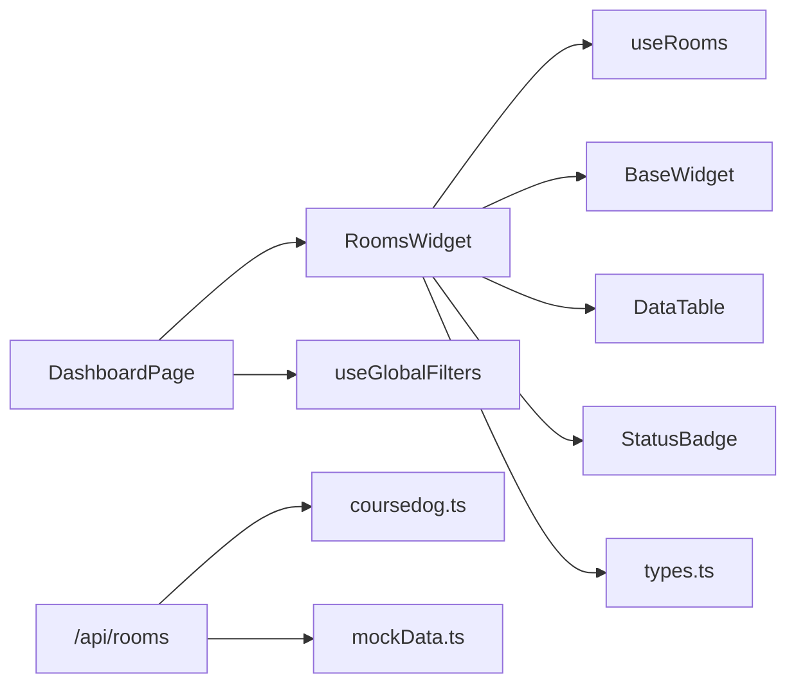

**Diagram sources**
- [RoomsWidget.tsx:3-8](file://src/components/widgets/RoomsWidget.tsx#L3-L8)
- [useRooms.ts:3](file://src/hooks/useRooms.ts#L3)
- [route.ts:2-4](file://src/app/api/rooms/route.ts#L2-L4)
- [types.ts:4](file://src/lib/api/types.ts#L4)

**Section sources**
- [RoomsWidget.tsx:3-8](file://src/components/widgets/RoomsWidget.tsx#L3-L8)
- [useRooms.ts:3](file://src/hooks/useRooms.ts#L3)
- [route.ts:2-4](file://src/app/api/rooms/route.ts#L2-L4)
- [types.ts:4](file://src/lib/api/types.ts#L4)

## Performance Considerations
- Query Key Stability: useRooms uses ['rooms', filters] as the queryKey; ensure filters are stable to leverage cache effectively.
- Pagination: Use limit and offset filters to control payload sizes and improve responsiveness.
- Debouncing: Apply debounced search queries at the global search level to reduce unnecessary requests.
- Virtualization: For large datasets, consider virtualized tables to minimize DOM nodes.

## Troubleshooting Guide
- No Data Returned:
  - Verify that external API credentials are configured; otherwise, the system falls back to mock data.
  - Confirm that query parameters are correctly passed from useRooms to the API route.
- Error Messages:
  - useRooms throws descriptive errors on non-ok responses; inspect the error.message and network tab for details.
  - The API route catches exceptions and returns mock data; check server logs for underlying causes.
- Filters Not Applying:
  - Ensure filters.rooms is being passed from DashboardPage to RoomsWidget and that useGlobalFilters is updating state correctly.

**Section sources**
- [useRooms.ts:17-20](file://src/hooks/useRooms.ts#L17-L20)
- [route.ts:59-77](file://src/app/api/rooms/route.ts#L59-L77)
- [page.tsx:58-63](file://src/app/page.tsx#L58-L63)
- [useGlobalFilters.ts:24-37](file://src/hooks/useGlobalFilters.ts#L24-L37)

## Conclusion
RoomsWidget provides a robust, filterable, and refreshable view of room data with clear status indicators and facility features. Its integration with useRooms and the global filter system ensures consistent behavior across the application. By leveraging the provided hooks, components, and types, developers can extend the widget with additional columns, richer status visuals, booking coordination features, and advanced filtering capabilities.

## Appendices
- Data Model Overview

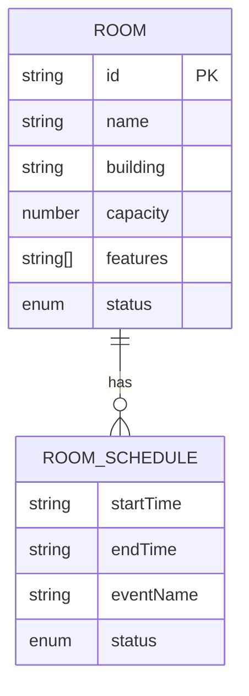

**Diagram sources**
- [types.ts:3-18](file://src/lib/api/types.ts#L3-L18)