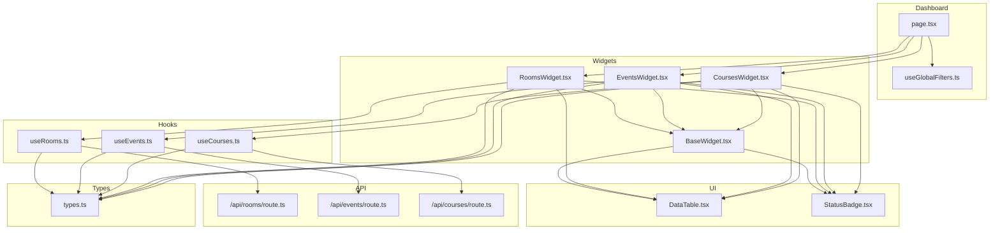
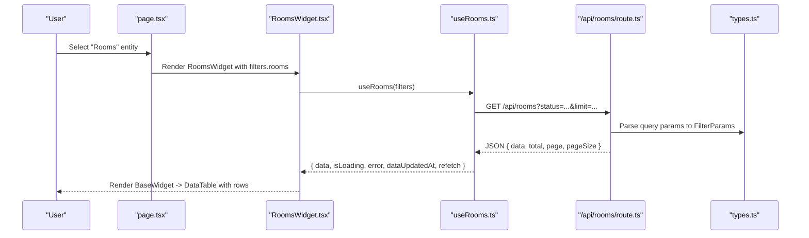
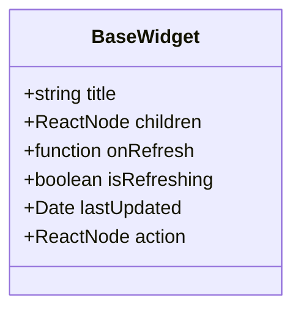
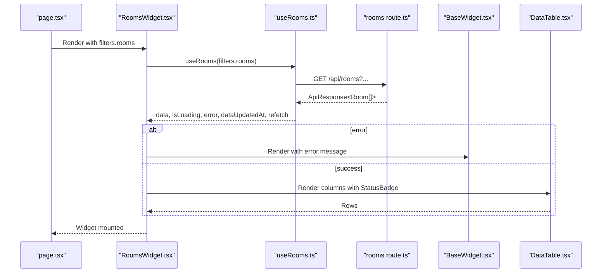
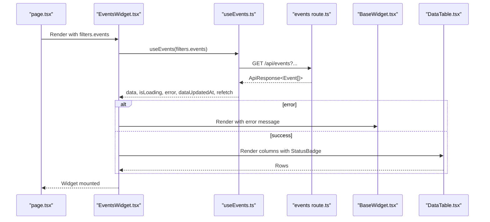
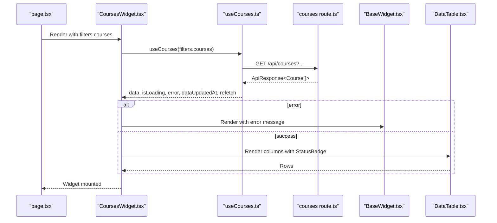
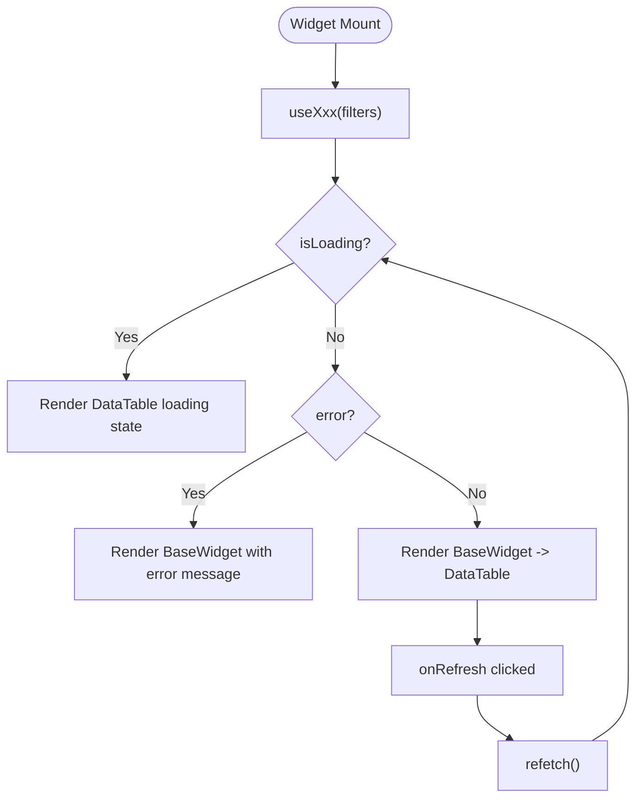
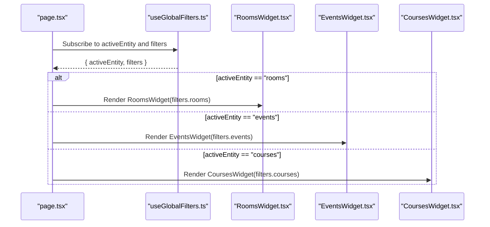
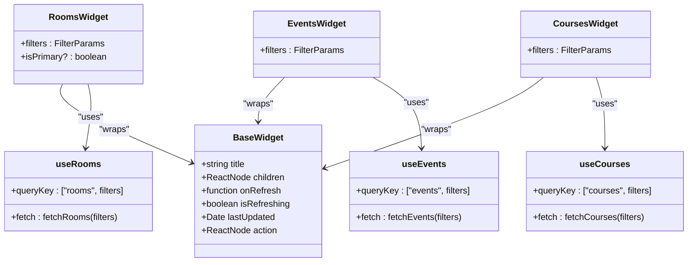
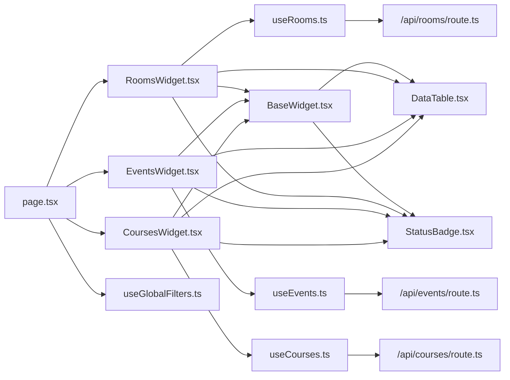

# Widget System

<cite>
**Referenced Files in This Document**
- [BaseWidget.tsx](file://src/components/widgets/BaseWidget.tsx)
- [RoomsWidget.tsx](file://src/components/widgets/RoomsWidget.tsx)
- [EventsWidget.tsx](file://src/components/widgets/EventsWidget.tsx)
- [CoursesWidget.tsx](file://src/components/widgets/CoursesWidget.tsx)
- [useRooms.ts](file://src/hooks/useRooms.ts)
- [useEvents.ts](file://src/hooks/useEvents.ts)
- [useCourses.ts](file://src/hooks/useCourses.ts)
- [useGlobalFilters.ts](file://src/hooks/useGlobalFilters.ts)
- [DataTable.tsx](file://src/components/ui/DataTable.tsx)
- [StatusBadge.tsx](file://src/components/ui/StatusBadge.tsx)
- [types.ts](file://src/lib/api/types.ts)
- [rooms route](file://src/app/api/rooms/route.ts)
- [events route](file://src/app/api/events/route.ts)
- [courses route](file://src/app/api/courses/route.ts)
- [page.tsx](file://src/app/page.tsx)
</cite>

## Table of Contents
1. [Introduction](#introduction)
2. [Project Structure](#project-structure)
3. [Core Components](#core-components)
4. [Architecture Overview](#architecture-overview)
5. [Detailed Component Analysis](#detailed-component-analysis)
6. [Dependency Analysis](#dependency-analysis)
7. [Performance Considerations](#performance-considerations)
8. [Troubleshooting Guide](#troubleshooting-guide)
9. [Conclusion](#conclusion)
10. [Appendices](#appendices)

## Introduction
This document explains Course Puppy’s widget system architecture with a focus on the BaseWidget component pattern and three concrete implementations: RoomsWidget, EventsWidget, and CoursesWidget. It documents how the system ensures consistent widget behavior across different entity types, the widget lifecycle, data fetching patterns, integration with custom hooks, and the factory-like rendering mechanism used in the dashboard. It also provides guidelines for extending the system with new entity types and custom widget implementations.

## Project Structure
The widget system is organized around reusable UI building blocks and entity-specific widgets:
- BaseWidget.tsx defines a common shell with title, refresh controls, and footer timestamps.
- Entity widgets (RoomsWidget, EventsWidget, CoursesWidget) encapsulate data fetching via custom hooks and present tabular data using DataTable.
- Custom hooks (useRooms, useEvents, useCourses) centralize TanStack Query data fetching and error handling.
- UI primitives (DataTable, StatusBadge) provide consistent rendering of lists and status indicators.
- API routes (/api/rooms, /api/events, /api/courses) expose REST endpoints that accept filter query parameters.
- Global filters (useGlobalFilters) coordinate cross-entity filtering and active entity selection.
- The dashboard page orchestrates rendering of the active widget based on the selected entity.

**Diagram sources**
- [page.tsx:12-99](file://src/app/page.tsx#L12-L99)
- [useGlobalFilters.ts:14-78](file://src/hooks/useGlobalFilters.ts#L14-L78)
- [BaseWidget.tsx:15-57](file://src/components/widgets/BaseWidget.tsx#L15-L57)
- [RoomsWidget.tsx:15-96](file://src/components/widgets/RoomsWidget.tsx#L15-L96)
- [EventsWidget.tsx:14-115](file://src/components/widgets/EventsWidget.tsx#L14-L115)
- [CoursesWidget.tsx:14-120](file://src/components/widgets/CoursesWidget.tsx#L14-L120)
- [useRooms.ts:25-30](file://src/hooks/useRooms.ts#L25-L30)
- [useEvents.ts:25-30](file://src/hooks/useEvents.ts#L25-L30)
- [useCourses.ts:25-30](file://src/hooks/useCourses.ts#L25-L30)
- [rooms route:5-49](file://src/app/api/rooms/route.ts#L5-L49)
- [events route:5-53](file://src/app/api/events/route.ts#L5-L53)
- [courses route:5-47](file://src/app/api/courses/route.ts#L5-L47)
- [DataTable.tsx:21-80](file://src/components/ui/DataTable.tsx#L21-L80)
- [StatusBadge.tsx:61-77](file://src/components/ui/StatusBadge.tsx#L61-L77)
- [types.ts:3-98](file://src/lib/api/types.ts#L3-L98)

**Section sources**
- [page.tsx:12-99](file://src/app/page.tsx#L12-L99)
- [useGlobalFilters.ts:14-78](file://src/hooks/useGlobalFilters.ts#L14-L78)
- [BaseWidget.tsx:15-57](file://src/components/widgets/BaseWidget.tsx#L15-L57)
- [RoomsWidget.tsx:15-96](file://src/components/widgets/RoomsWidget.tsx#L15-L96)
- [EventsWidget.tsx:14-115](file://src/components/widgets/EventsWidget.tsx#L14-L115)
- [CoursesWidget.tsx:14-120](file://src/components/widgets/CoursesWidget.tsx#L14-L120)
- [useRooms.ts:25-30](file://src/hooks/useRooms.ts#L25-L30)
- [useEvents.ts:25-30](file://src/hooks/useEvents.ts#L25-L30)
- [useCourses.ts:25-30](file://src/hooks/useCourses.ts#L25-L30)
- [rooms route:5-49](file://src/app/api/rooms/route.ts#L5-L49)
- [events route:5-53](file://src/app/api/events/route.ts#L5-L53)
- [courses route:5-47](file://src/app/api/courses/route.ts#L5-L47)
- [DataTable.tsx:21-80](file://src/components/ui/DataTable.tsx#L21-L80)
- [StatusBadge.tsx:61-77](file://src/components/ui/StatusBadge.tsx#L61-L77)
- [types.ts:3-98](file://src/lib/api/types.ts#L3-L98)

## Core Components
- BaseWidget: Provides a standardized header with title, optional action area, refresh button, and footer with last-updated timestamp. It accepts children and composes the content area, ensuring consistent styling and UX across all widgets.
- Entity Widgets: Each widget wraps a specific domain entity (rooms, events, courses) and renders a table of items. They rely on a shared data-fetching hook and a common table renderer.
- Custom Hooks: Encapsulate TanStack Query usage, constructing query keys and URLs from filter parameters, handling errors, and returning loading, data, and refetch signals.
- UI Primitives: DataTable renders paginated, sortable, and customizable rows; StatusBadge displays status with color-coded labels.

Key patterns:
- Consistent props contract: All entity widgets accept a filters prop and optionally an isPrimary flag for RoomsWidget.
- Shared lifecycle: Widgets receive isLoading, error, dataUpdatedAt, and refetch from their hooks.
- Common interface: All widgets render a BaseWidget with the same header/footer semantics.

**Section sources**
- [BaseWidget.tsx:6-57](file://src/components/widgets/BaseWidget.tsx#L6-L57)
- [RoomsWidget.tsx:10-16](file://src/components/widgets/RoomsWidget.tsx#L10-L16)
- [EventsWidget.tsx:10-15](file://src/components/widgets/EventsWidget.tsx#L10-L15)
- [CoursesWidget.tsx:10-15](file://src/components/widgets/CoursesWidget.tsx#L10-L15)
- [useRooms.ts:25-30](file://src/hooks/useRooms.ts#L25-L30)
- [useEvents.ts:25-30](file://src/hooks/useEvents.ts#L25-L30)
- [useCourses.ts:25-30](file://src/hooks/useCourses.ts#L25-L30)
- [DataTable.tsx:13-27](file://src/components/ui/DataTable.tsx#L13-L27)
- [StatusBadge.tsx:7-10](file://src/components/ui/StatusBadge.tsx#L7-L10)

## Architecture Overview
The widget system follows a layered architecture:
- Presentation Layer: Widgets and UI components.
- Data Access Layer: Custom hooks using TanStack Query to fetch from Next.js API routes.
- API Layer: Route handlers parse query parameters and delegate to data sources.
- Type System: Shared TypeScript interfaces define entity models and filter parameters.

**Diagram sources**
- [page.tsx:58-63](file://src/app/page.tsx#L58-L63)
- [RoomsWidget.tsx:15-96](file://src/components/widgets/RoomsWidget.tsx#L15-L96)
- [useRooms.ts:25-30](file://src/hooks/useRooms.ts#L25-L30)
- [rooms route:5-49](file://src/app/api/rooms/route.ts#L5-L49)
- [types.ts:49-61](file://src/lib/api/types.ts#L49-L61)

## Detailed Component Analysis

### BaseWidget Pattern
BaseWidget establishes a common shell for all widgets:
- Props: title, children, optional onRefresh, isRefreshing, lastUpdated, and action.
- Behavior: Renders header with title and action; conditionally shows refresh button with spinner during isRefreshing; footer shows lastUpdated time if provided.
- Composition: Accepts arbitrary children, enabling any content (e.g., DataTable) inside the widget body.

**Diagram sources**
- [BaseWidget.tsx:6-22](file://src/components/widgets/BaseWidget.tsx#L6-L22)

**Section sources**
- [BaseWidget.tsx:15-57](file://src/components/widgets/BaseWidget.tsx#L15-L57)

### RoomsWidget: Room Management and Availability Tracking
RoomsWidget focuses on room listings, building, capacity, features, and status:
- Data fetching: Uses useRooms with filters to populate data.
- Columns: Name, Building, Capacity, Status; Status rendered via StatusBadge.
- Error handling: Displays error message inside BaseWidget when error occurs.
- Refresh: Uses refetch from useRooms to trigger reload.
- Last updated: Uses dataUpdatedAt to show freshness.

**Diagram sources**
- [RoomsWidget.tsx:15-96](file://src/components/widgets/RoomsWidget.tsx#L15-L96)
- [useRooms.ts:25-30](file://src/hooks/useRooms.ts#L25-L30)
- [rooms route:5-49](file://src/app/api/rooms/route.ts#L5-L49)
- [BaseWidget.tsx:15-57](file://src/components/widgets/BaseWidget.tsx#L15-L57)
- [DataTable.tsx:21-80](file://src/components/ui/DataTable.tsx#L21-L80)
- [StatusBadge.tsx:61-77](file://src/components/ui/StatusBadge.tsx#L61-L77)

**Section sources**
- [RoomsWidget.tsx:15-96](file://src/components/widgets/RoomsWidget.tsx#L15-L96)
- [useRooms.ts:6-23](file://src/hooks/useRooms.ts#L6-L23)
- [rooms route:5-49](file://src/app/api/rooms/route.ts#L5-L49)
- [types.ts:3-18](file://src/lib/api/types.ts#L3-L18)

### EventsWidget: Event Scheduling and Coordination
EventsWidget presents event details including title, date/time, location, organizer, and status:
- Data fetching: Uses useEvents with filters to populate data.
- Columns: Title, Date & Time (formatted), Location, Organizer, Status; Status rendered via StatusBadge.
- Error handling: Displays error message inside BaseWidget when error occurs.
- Refresh: Uses refetch from useEvents to trigger reload.
- Last updated: Uses dataUpdatedAt to show freshness.

**Diagram sources**
- [EventsWidget.tsx:14-115](file://src/components/widgets/EventsWidget.tsx#L14-L115)
- [useEvents.ts:25-30](file://src/hooks/useEvents.ts#L25-L30)
- [events route:5-53](file://src/app/api/events/route.ts#L5-L53)
- [BaseWidget.tsx:15-57](file://src/components/widgets/BaseWidget.tsx#L15-L57)
- [DataTable.tsx:21-80](file://src/components/ui/DataTable.tsx#L21-L80)
- [StatusBadge.tsx:61-77](file://src/components/ui/StatusBadge.tsx#L61-L77)

**Section sources**
- [EventsWidget.tsx:14-115](file://src/components/widgets/EventsWidget.tsx#L14-L115)
- [useEvents.ts:6-23](file://src/hooks/useEvents.ts#L6-L23)
- [events route:5-53](file://src/app/api/events/route.ts#L5-L53)
- [types.ts:20-32](file://src/lib/api/types.ts#L20-L32)

### CoursesWidget: Course Registration and Schedule Management
CoursesWidget displays course metadata including code, title, instructor, schedule, location, enrollment, and status:
- Data fetching: Uses useCourses with filters to populate data.
- Columns: Code, Title, Instructor, Schedule, Location, Enrollment, Status; Status rendered via StatusBadge.
- Error handling: Displays error message inside BaseWidget when error occurs.
- Refresh: Uses refetch from useCourses to trigger reload.
- Last updated: Uses dataUpdatedAt to show freshness.

**Diagram sources**
- [CoursesWidget.tsx:14-120](file://src/components/widgets/CoursesWidget.tsx#L14-L120)
- [useCourses.ts:25-30](file://src/hooks/useCourses.ts#L25-L30)
- [courses route:5-47](file://src/app/api/courses/route.ts#L5-L47)
- [BaseWidget.tsx:15-57](file://src/components/widgets/BaseWidget.tsx#L15-L57)
- [DataTable.tsx:21-80](file://src/components/ui/DataTable.tsx#L21-L80)
- [StatusBadge.tsx:61-77](file://src/components/ui/StatusBadge.tsx#L61-L77)

**Section sources**
- [CoursesWidget.tsx:14-120](file://src/components/widgets/CoursesWidget.tsx#L14-L120)
- [useCourses.ts:6-23](file://src/hooks/useCourses.ts#L6-L23)
- [courses route:5-47](file://src/app/api/courses/route.ts#L5-L47)
- [types.ts:34-47](file://src/lib/api/types.ts#L34-L47)

### Widget Lifecycle and Data Fetching Patterns
Lifecycle stages:
- Mount: Widget receives filters and mounts BaseWidget with children.
- Data load: Custom hook triggers query; isLoading true while fetching.
- Success: Widget renders DataTable with columns and rows; lastUpdated shown.
- Error: Widget renders error message inside BaseWidget; refresh via onRefresh.
- Refresh: onRefresh invokes refetch; isRefreshing toggles during reload.

Data fetching patterns:
- Query key: ['entity', filters] ensures cache separation per entity and filters.
- URL construction: Filters are serialized into query parameters.
- Error propagation: Hooks throw on non-OK responses; widgets display error messages.

**Diagram sources**
- [useRooms.ts:25-30](file://src/hooks/useRooms.ts#L25-L30)
- [useEvents.ts:25-30](file://src/hooks/useEvents.ts#L25-L30)
- [useCourses.ts:25-30](file://src/hooks/useCourses.ts#L25-L30)
- [DataTable.tsx:28-42](file://src/components/ui/DataTable.tsx#L28-L42)
- [BaseWidget.tsx:30-40](file://src/components/widgets/BaseWidget.tsx#L30-L40)

**Section sources**
- [useRooms.ts:6-23](file://src/hooks/useRooms.ts#L6-L23)
- [useEvents.ts:6-23](file://src/hooks/useEvents.ts#L6-L23)
- [useCourses.ts:6-23](file://src/hooks/useCourses.ts#L6-L23)
- [DataTable.tsx:21-80](file://src/components/ui/DataTable.tsx#L21-L80)
- [BaseWidget.tsx:15-57](file://src/components/widgets/BaseWidget.tsx#L15-L57)

### Factory Pattern for Dynamic Widget Rendering
Dynamic rendering is achieved in the dashboard page:
- Active entity determines which widget to render.
- Filters for the active entity are passed down to the widget.
- This mimics a factory pattern: the page selects the appropriate widget implementation based on state.

**Diagram sources**
- [page.tsx:12-99](file://src/app/page.tsx#L12-L99)
- [useGlobalFilters.ts:14-78](file://src/hooks/useGlobalFilters.ts#L14-L78)
- [RoomsWidget.tsx:15-96](file://src/components/widgets/RoomsWidget.tsx#L15-L96)
- [EventsWidget.tsx:14-115](file://src/components/widgets/EventsWidget.tsx#L14-L115)
- [CoursesWidget.tsx:14-120](file://src/components/widgets/CoursesWidget.tsx#L14-L120)

**Section sources**
- [page.tsx:58-75](file://src/app/page.tsx#L58-L75)
- [useGlobalFilters.ts:14-78](file://src/hooks/useGlobalFilters.ts#L14-L78)

### Common Interface and Extensibility
All widgets share a common interface:
- Props: filters (FilterParams), optional isPrimary for RoomsWidget.
- Behavior: Provide onRefresh, isRefreshing, lastUpdated derived from dataUpdatedAt.
- Rendering: Wrap content in BaseWidget; use DataTable for tabular data.

Extensibility guidelines:
- Define a new entity model in types.ts and an API route similar to existing ones.
- Create a custom hook following the useXxx pattern: construct queryKey, serialize filters, fetch from /api/entity, and return { data, isLoading, error, dataUpdatedAt, refetch }.
- Implement a new widget component that:
  - Accepts filters as props.
  - Uses the custom hook to fetch data.
  - Defines columns for DataTable tailored to the entity.
  - Handles error and loading states.
  - Wraps content in BaseWidget with refresh and lastUpdated.
- Integrate the new widget into the dashboard page using the factory pattern (activeEntity switch) and update useGlobalFilters to include the new entity’s filter namespace.

**Diagram sources**
- [BaseWidget.tsx:6-22](file://src/components/widgets/BaseWidget.tsx#L6-L22)
- [RoomsWidget.tsx:10-16](file://src/components/widgets/RoomsWidget.tsx#L10-L16)
- [EventsWidget.tsx:10-15](file://src/components/widgets/EventsWidget.tsx#L10-L15)
- [CoursesWidget.tsx:10-15](file://src/components/widgets/CoursesWidget.tsx#L10-L15)
- [useRooms.ts:25-30](file://src/hooks/useRooms.ts#L25-L30)
- [useEvents.ts:25-30](file://src/hooks/useEvents.ts#L25-L30)
- [useCourses.ts:25-30](file://src/hooks/useCourses.ts#L25-L30)

**Section sources**
- [types.ts:49-70](file://src/lib/api/types.ts#L49-L70)
- [rooms route:5-49](file://src/app/api/rooms/route.ts#L5-L49)
- [events route:5-53](file://src/app/api/events/route.ts#L5-L53)
- [courses route:5-47](file://src/app/api/courses/route.ts#L5-L47)
- [page.tsx:58-75](file://src/app/page.tsx#L58-L75)
- [useGlobalFilters.ts:64-66](file://src/hooks/useGlobalFilters.ts#L64-L66)

## Dependency Analysis
- Widget-to-hook coupling: Each widget depends on a single custom hook for data fetching, promoting cohesion and testability.
- Hook-to-route coupling: Hooks depend on API routes that parse query parameters and return typed responses.
- UI primitive dependencies: Widgets depend on DataTable and StatusBadge for consistent rendering.
- Global state: useGlobalFilters coordinates active entity and filter namespaces, enabling dynamic widget selection.

**Diagram sources**
- [RoomsWidget.tsx:15-96](file://src/components/widgets/RoomsWidget.tsx#L15-L96)
- [EventsWidget.tsx:14-115](file://src/components/widgets/EventsWidget.tsx#L14-L115)
- [CoursesWidget.tsx:14-120](file://src/components/widgets/CoursesWidget.tsx#L14-L120)
- [useRooms.ts:25-30](file://src/hooks/useRooms.ts#L25-L30)
- [useEvents.ts:25-30](file://src/hooks/useEvents.ts#L25-L30)
- [useCourses.ts:25-30](file://src/hooks/useCourses.ts#L25-L30)
- [rooms route:5-49](file://src/app/api/rooms/route.ts#L5-L49)
- [events route:5-53](file://src/app/api/events/route.ts#L5-L53)
- [courses route:5-47](file://src/app/api/courses/route.ts#L5-L47)
- [BaseWidget.tsx:15-57](file://src/components/widgets/BaseWidget.tsx#L15-L57)
- [DataTable.tsx:21-80](file://src/components/ui/DataTable.tsx#L21-L80)
- [StatusBadge.tsx:61-77](file://src/components/ui/StatusBadge.tsx#L61-L77)
- [page.tsx:12-99](file://src/app/page.tsx#L12-L99)
- [useGlobalFilters.ts:14-78](file://src/hooks/useGlobalFilters.ts#L14-L78)

**Section sources**
- [page.tsx:12-99](file://src/app/page.tsx#L12-L99)
- [useGlobalFilters.ts:14-78](file://src/hooks/useGlobalFilters.ts#L14-L78)
- [RoomsWidget.tsx:15-96](file://src/components/widgets/RoomsWidget.tsx#L15-L96)
- [EventsWidget.tsx:14-115](file://src/components/widgets/EventsWidget.tsx#L14-L115)
- [CoursesWidget.tsx:14-120](file://src/components/widgets/CoursesWidget.tsx#L14-L120)
- [useRooms.ts:25-30](file://src/hooks/useRooms.ts#L25-L30)
- [useEvents.ts:25-30](file://src/hooks/useEvents.ts#L25-L30)
- [useCourses.ts:25-30](file://src/hooks/useCourses.ts#L25-L30)
- [rooms route:5-49](file://src/app/api/rooms/route.ts#L5-L49)
- [events route:5-53](file://src/app/api/events/route.ts#L5-L53)
- [courses route:5-47](file://src/app/api/courses/route.ts#L5-L47)
- [BaseWidget.tsx:15-57](file://src/components/widgets/BaseWidget.tsx#L15-L57)
- [DataTable.tsx:21-80](file://src/components/ui/DataTable.tsx#L21-L80)
- [StatusBadge.tsx:61-77](file://src/components/ui/StatusBadge.tsx#L61-L77)

## Performance Considerations
- Query caching: TanStack Query caches responses keyed by ['entity', filters], minimizing redundant network requests.
- Efficient updates: dataUpdatedAt provides precise freshness; widgets can leverage stale-while-revalidate patterns.
- Minimal re-renders: BaseWidget isolates header/footer logic; only data-dependent parts re-render on updates.
- Large datasets: Use limit and offset filters to paginate; avoid rendering very large tables.
- Icons and badges: Keep iconography lightweight; StatusBadge uses minimal DOM and computed styles.

## Troubleshooting Guide
Common issues and resolutions:
- Empty or missing data:
  - Verify filters are being passed correctly from useGlobalFilters to the widget.
  - Confirm API routes parse query parameters and return data.
- Error states:
  - Widgets render error messages inside BaseWidget; check server-side API error responses.
  - Ensure hooks throw meaningful errors on non-OK responses.
- Refresh not working:
  - Ensure onRefresh calls refetch and isRefreshing reflects loading state.
- Stale data:
  - Confirm dataUpdatedAt is populated and displayed in the widget footer.
  - Adjust query cache time or use manual refetch triggers as needed.

**Section sources**
- [RoomsWidget.tsx:65-78](file://src/components/widgets/RoomsWidget.tsx#L65-L78)
- [EventsWidget.tsx:84-97](file://src/components/widgets/EventsWidget.tsx#L84-L97)
- [CoursesWidget.tsx:89-102](file://src/components/widgets/CoursesWidget.tsx#L89-L102)
- [rooms route:37-46](file://src/app/api/rooms/route.ts#L37-L46)
- [events route:43-50](file://src/app/api/events/route.ts#L43-L50)
- [courses route:38-45](file://src/app/api/courses/route.ts#L38-L45)
- [BaseWidget.tsx:30-40](file://src/components/widgets/BaseWidget.tsx#L30-L40)

## Conclusion
Course Puppy’s widget system leverages a robust BaseWidget pattern to ensure consistent UX across entities. Custom hooks encapsulate data fetching and error handling, while API routes provide a uniform filter interface. The dashboard employs a factory-like rendering strategy to dynamically select and configure widgets based on global filters. This architecture supports easy extension to new entity types and custom widget implementations with minimal boilerplate.

## Appendices

### API Definitions and Data Models
- Entities: Room, Event, Course with associated statuses and identifiers.
- Filters: Generic FilterParams supporting status, room/building, date range, limits, offsets, and free-text queries.
- Responses: ApiResponse<T> with data[], total, page, pageSize.

**Section sources**
- [types.ts:3-47](file://src/lib/api/types.ts#L3-L47)
- [types.ts:49-61](file://src/lib/api/types.ts#L49-L61)
- [types.ts:87-92](file://src/lib/api/types.ts#L87-L92)